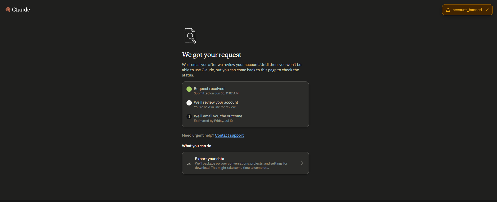

## 引子

之前两个月业余做了一个 Meta 解谜 demo，原本预计是七月底做完，但出于各种考量，以现在这个形式来讲，我选择到此为止了。

严格来说，它不是完整游戏。二周目网页只做了初步程序和UI，机制设计停留在文档层面，离“完整发布”还有很远。

但它也不是停在脑内的设定草稿。一周目已经做成了一个可以跑通的网页原型。黑屏、模糊家族画像、原生确认框、虚拟桌面、文件夹、异常文件、任务栏时钟、隐藏控制台、钟摆、提灯、关键词输入、观测记录、结尾弹窗，以及通向二周目的 `hesperus` 输入口。

为什么要停呢？原因很多，但与内容无关，这里略去更好。恰好Claude老师同期也抛弃了我，把我号封了。

{#fig_Claude}

机缘巧合啊，所以这篇与其说是“弃坑说明”，不如说是一次留档。

我试着用一个网页ARG，讲一个人把梦、记忆和现实都整理成文件夹的故事。然后我又给它了一个二周目的档案馆和伪搜索引擎，以及天文软件的插件的机制联动。另一个人把过去整理成档案，试图证明只有自己记得的东西也是真实的。

就这么停下也不错，也许是一条新的路。所以，就把依附于原作的初版二周目文本留在这吧，剩下的设计与构思，也许会以别的形式出现。

一周目？一周目因为二周目有个设定变动了需要改，但最后还是没改，想了想，只放二周目好了。一周目可以理解为官方Morpheus的故事，当然，承接了二周目的NE基础。

## 开场

*（黑屏。一个档案室界面缓缓加载——冷色调，金色线条，节点散布在黑暗里像星图。大部分节点是暗的。）*

Celestia：哥，来了！

Celestia：怎么样，我整理得还不错吧？

Celestia：花了挺久的。你要好好看，不然对不起我。

Celestia：……还是不说话啊。

Celestia：行吧，哥你就是这样。来了就好。

## 第一层：七塔的舞台

*节点散布在星图外圈，偏冷的金色。Celestia语气轻快，像是准备了很久终于等到人来看。*

### 节点1：七塔权力结构与入学制度

*（一份七塔的内部制度文件，格式正式，像是入学时发放的说明册。纸张偏旧。Noah在'EL使用权认定标准'那一栏旁边用自己的字迹写了：'所以天生能用的人，就是天生对的人？'下面没有回答。）*

**【七塔学术机构·入学资格说明】**

*七塔为艾里阿诺德最高学术机构，收录各领域顶尖学者及具备潜力之学习者。*

*入学资格以EL驾驭能力为基准。EL为世界本源之力，其感知与运用能力被认为是学术研究的根本前提。*

*历来，具备天然EL亲和性者以精灵族及Elrian血统为主。七塔入学制度据此建立，沿用数百年。*

*关于其他种族之入学申请，请参见附录三：特殊资格审核程序。*

**【第四线·Celestia台词】**

**这个是七塔的入学说明。**

**我进七塔之前看过这份东西。**

**"附录三：特殊资格审核程序"——你知道那个附录有多厚吗。正文两页，附录三，十七页。**

**哥，你应该比我更清楚这种话是怎么运作的吧。**

**……你当时是怎么进来的。**

**我知道你不会在这种事上说太多。**

**算了，继续看吧。**

### 节点2：Debrian入学政策变更官方文件

*（一份七塔内部公告，日期比节点1晚了很多年。措辞比节点1微妙地松动了一点——"经多方审议"、"综合考量"这种字眼出现了好几次。公告末尾加盖审核章，章边上Noah用自己的字迹写了："是谁推的。"）*

**【七塔学术机构·入学资格补充公告】**

*经多方审议，综合考量近年来各族群EL驾驭能力之发展情况，七塔入学资格认定标准将进行阶段性调整。*

*即日起，Debrian学者凡通过标准能力评核者，可申请七塔入学资格。*

*审核程序参见附录三修订版。*

*本公告自发布之日起生效。*

**【第四线·Celestia台词】**

**这个是政策变更公告。**

**我进七塔，是因为这份公告。**

**"经多方审议，综合考量"——**

**我很好奇附录三修订版厚了还是薄了。后来查了一下，厚了。**

**哥，你当时怎么看这件事。**

**……你肯定不觉得这是好事。**

**不是因为Debrian进来。是因为推这件事的人，不是为了Debrian。**

**我后来才明白这一点。**

**你那时候就知道了吧。**

### 节点3：精灵族出走记录

*（一份官方通告，字迹工整，语气极其平静，像是在记录一件行政事务。Noah在旁边写了一行字："手续完备。"然后在下面又写了一遍："手续完备。"没有别的注释。）*

**【七塔学术机构·人员变动通告】**

*本塔精灵族学者已于近期陆续完成离塔手续。*

*离塔均依本人意愿，手续完备，档案封存。*

*相关研究课题之后续安排，请各层负责人自行协调。*

*特此通告。*

**【第四线·Celestia台词】**

**"手续完备。"**

**哥，走了那么多人，最后留下来的记录就是这四个字。**

**我后来每次看行政文件看到"手续完备"，都会停一下。**

**就一下，然后继续看。**

**你留下来了。**

**手续也完备。**

**……**

**算了。继续看吧。**

### 节点4：教团起源与招募活动

*（不是官方文件，是一份手抄的记录，字迹陌生，像是某个人私下整理的笔记。某几行被划掉了，需要解谜才能显示。Noah在角落写了一个字："谁。"）*

**【无标题·手抄记录】**

*教团最初不叫这个名字。*

*起源是七塔内部的一批人——不是最差的那批，是觉得自己足够好、但没有得到足够多的那批。*

*他们最初只是在私下议论。议论久了，就开始觉得议论不够。*

*后来有人给了他们一套语言。*

*有了语言之后，他们开始招募。*

*招募的对象有几类——*

*第一类：在七塔内部被边缘化的学者。*

*第二类：研究走入死路、急需资源的人。*

*第三类：（以下内容被遮蔽，需要解谜解开。）*

**【第四线·Celestia台词】**

**这个不是七塔的官方文件。**

**是我自己找到的。**

**"有人给了他们一套语言"——**

**哥，你知道最荒诞的是什么吗。**

**那套语言，听起来和七塔讲知识的那套长得一模一样。**

**换个说法的宗教，还是那种自己不承认自己是宗教的那种。**

**……**

**你解开那个遮蔽的部分，自己看吧。**

**我不想再说那个了。**

### 节点5：教团游说与Debrian入驻的关联文件

*（两份文件并排——左边是一份教团内部的行动记录残页，右边是节点2那份政策变更公告的副本。Noah用线把两份文件的日期连了起来，然后在线旁边写了："先后顺序。"没有别的注释。）*

**【教团行动记录·残页】**

*关于七塔入学政策推动事宜——*

*本阶段目标：促成Debrian入学资格开放。*

*预期效果：七塔内部张力上升，精灵族及Elrian系学者不满情绪激化，有利于后续招募工作推进。*

*皇室方面：（以下内容被遮蔽，需要解谜解开。）*

*进度：目标达成。政策变更公告已发布。*

**【第四线·Celestia台词】**

**哥，你看见这两份文件放在一起，有没有觉得哪里不对。**

**我第一次看到这个的时候，坐在那里想了很久。**

**政策变更是结果。**

**教团的行动记录是原因。**

**中间那段——皇室方面那几行——被遮住了。**

**我解开过。看了三秒，够了，重新盖上了。**

**你自己解开吧。**

**但我告诉你，看完之后，你可能会想把它重新盖上。**

## 第二层：克拉摩尔与Noah的故事

*节点比第一层密集，颜色偏冷，金线变细了。Celestia的语气少了第一层那个展示的劲，多了一种直接在对人说话的质感。*

### 节点1：走廊与第一印象

*（一页笔记纸，字迹很乱，像是当天晚上趁着记忆还新鲜赶着写下来的。某几行写到一半划掉重写，有几个字涂得很用力。）*

*今天进七塔了。*

*走廊上有人在吵架。不是真的吵，是那种压着声音、每个字都很用力的说话方式，比吵架还难听。*

*我听不太懂在说什么，但听懂了一个词——"资格"。*

*然后有人说了另一个词，我没听清，但旁边有人接了一句："他还在这里呢。"*

*语气不是在说一件好事。*

*我顺着他们看的方向看过去。*

*走廊尽头，有个人背对着我往里走，没有停，像是什么都没听见。*

*或者听见了，但决定当作没听见。*

*我不知道为什么，就跟过去了。*

*——*

*他的实验室在第七层。*

*我敲了门。*

*他开门看了我一眼，然后说："你来找谁。"*

*我说我不确定。*

*他停了一下，然后说："进来吧，别站在外面。"*

*就这样。*

**【第四线·Celestia台词】**

**哥，那个是我第一天写的东西。**

**"我不确定"——我那时候真的不知道该怎么回答那个问题。**

**我在找一个人，但我不知道他长什么样，不知道他在哪层，不知道他会不会理我。**

**然后你说"进来吧，别站在外面"。**

**……**

**哥，你知道吗。**

**那句话我记了很久。**

**不是因为它特别。**

**是因为你说完就转身进去了，根本没有等我回答。**

**你就是这样。**

### 节点2：实验室早期

*（几张便条拼在一起，两种字迹。有一张是课堂笔记，页边被另一种字迹写满了；有一张只有几行来回；还有一张折了很久，折痕很深，打开来里面只有一句话。）*

**【便条一·课堂笔记页边】**

*这个推导第三步有问题，重算。*

*——*

*重算了。还是觉得没问题。*

*——*

*那就再算一遍。*

*——*

*还是没问题。*

*——*

*拿来我看看。*

*——*

*（字迹换回Noah的）*

*他看了很久，然后说："……确实没问题。"*

*然后把纸还给我，走了。*

*我在这里记一下，以防我哪天忘了这件事。*

*我是对的。*

**【便条二·两行来回】**

*我可以住在这里吗。*

*——*

*没有别的地方去？*

*——*

*暂时没有。*

*——*

*那先住着。安静点，别动我桌上的东西。*

*——*

*好。谢谢。*

*——*

*不用谢。顺便，这里没有宠物，但人类好像可以算例外。*

**【便条三·折了很久的那张】**

*（折痕很深，像是折了很久才打开。里面只有一行克拉摩尔的字迹：）*

*你感受到它在哪里，那个地方就够了。*

**【第四线·Celestia台词】**

**哥，那个"重算"是你第一堂课写在我笔记上的。**

**我那时候觉得被冒犯了，就在旁边写回去，来来回回写了好几轮。**

**最后你说"确实没问题"，然后把纸还给我走了。**

**连"你是对的"都没有，就"确实没问题"。**

**……**

**我把这件事记下来了。**

**哥，你知道我为什么记这个吗。**

**不是因为赢了。**

**是因为你认真看了。**

**——**

**哥，你收留陌生人的方式很特别。**

**说了几条规定——别动桌上的东西，安静点——但没有问我是谁、从哪来、要干什么。**

**我那时候以为你不在意。**

**后来才知道，不是不在意。**

**是你觉得，那些问题问了也没用，人留下来了就是留下来了。**

**……**

**"人类好像可以算例外。"**

**哥，你说这句话的时候是什么表情来着。**

**我忘了。**

**但我记得我当时没忍住笑了。**

### 节点3：教团招募失败

*（Noah的笔记，字迹比之前工整一点，像是认真记下来的。某几行旁边画了圈，像是记的时候觉得特别值得记。）*

*今天哥跟我说了一件事。*

*说是教团以前找过他。*

*我问他们说了什么，他学了一遍——"我们在寻找真正有价值的人才，只有我们才能看见你真正的价值……Debrian能进七塔，也是因为我们在背后推动……你能进来，你比任何人都清楚这意味着什么……"*

*他学完，停了一下，然后说：*

*"所以他们的意思是，叫我说'谢谢你终于发现我不是废物，在哪里签名'？"*

*我没忍住笑出来。*

*他说他当时其实动摇过一秒。条件开得很好，比七塔能给他的还好。*

*但他"立刻拒绝了"。*

*我问他为什么。*

*他想了一下，说："自尊心。"*

*然后补了一句："跑来告诉我我的位置是靠运气得来的，然后说只有他们才能看见我的价值——什么意思？用品？有道划痕，质量不太行，得靠他们来给我定价？"*

*他说完，自己笑了一下。*

*不是开心的笑。*

**【第四线·Celestia台词】**

**哥，你跟我说这件事的时候，我问了你一个问题。**

**我问："你拒绝，真的只是因为自尊心？"**

**你没有立刻回答。**

**然后你说："……也许吧。但如果我当时没有立刻拒绝，我可能真的会认真考虑。"**

**哥，你知道吗，你说这句话的时候我觉得你很诚实。**

**不是每个人都会承认这种事的。**

**……**

**后来我想，教团那套话术——"只有我们看见你的价值"——**

**能让人动摇，是因为那个人真的在乎自己做的事有没有意义。**

**不在乎的人，听了只会觉得无聊。**

**哥，你在乎。**

**所以你拒绝了。**

### 节点4：Merger Point——家人离开那夜

*（两份文件配对。左边是那天白天Noah写的几行字，字迹很快，像是随手记的。右边是当晚的对话片段，字迹慢很多，有几个字写到一半停了一下再继续。）*

**【白天·随手记】**

*今天七塔很安静。*

*不是真的安静，是那种大家都知道发生了什么但没有人说的安静。*

*走廊上有人在搬东西。箱子很多。*

*我看见哥站在走廊尽头，背对着我，没有动。*

*我没有过去。*

*不知道该说什么。*

**【当晚·对话片段】**

*他们走了。*

*——*

*嗯。*

*——*

*你送他们了吗。*

*——*

*送到门口。*

*——*

*……你还好吗。*

*——*

*还好。*

*——*

*你以前养过猫吗。*

*——*

*没有。哥哥养过，但我那时候太小，不记得了。*

*——*

*猫活不了那么久。*

*你看着它长大，然后看着它慢慢变老，然后你知道你们剩下的时间不多了。*

*但它不知道。*

*——*

*……*

*——*

*对他们来说，我大概就是那样的。*

*所以我留下来了。*

*不是因为不想跟他们在一起。*

*是因为我想跟能共享时间的人在一起。*

*——*

*共享时间。*

*——*

*你现在不懂也没关系。*

*——*

*……我觉得我懂一点。*

**【第四线·Celestia台词】**

**哥，那天我在走廊看见你，没有过去。**

**我不知道该说什么。**

**后来晚上你说了猫那个比喻。**

**我那时候听完，觉得我懂了。**

**但我写下来"我觉得我懂一点"——**

**其实我懂的那一点，是另一件事。**

**不是你为什么留下来。**

**是你说"共享时间"这四个字的时候，我突然觉得——**

**我在这里已经快一年了。**

**……**

**算了。**

**继续看吧。**

### 节点5：学魔法与天文

*（一本观测日志，前几页很规整，后面越来越密。某一页页边有一行小字："如果星象是真的，那我现在在这里，是写好的吗。"最后几页夹着和天文完全无关的内容。）*

**【观测日志·第十二页】**

*今天哥说，星象是宏观规律落下来的位置。*

*我问他，那情绪呢。*

*他想了一下，说："情绪转化发生的位置，和星象落下来的位置，逻辑是一样的。找到那个位置，规律就能运作。"*

*我问他这是什么意思。*

*他说："自己想。不急，想出来了告诉我。"*

*——*

*想了三天。*

*跟他说了我想的。*

*他听完，放下手里的东西，认真听完了，然后说："还行。方向对了。"*

*然后补了一句："你刚才漏掉了一个东西，再想想。"*

*我又想了一天。*

*这次他说："对了。"*

*就两个字。*

*但他说完转回去继续看他的东西，嘴角动了一下。*

*我看见了。*

**【观测日志·某页·单独一页】**

*今天我算错了一个数据，推翻了自己前三天的推导。*

*我说，哥哥当年做这个的时候应该不会算错。*

*哥放下手里的东西，看了我一眼。*

*然后说："你哥哥是你哥哥，你是你。"*

*我说我知道，但——*

*他说："没有但是。"*

*——*

*然后他停了一下，说：*

*"你哥哥学的那些，是他那个位置能看见的东西。你在这里，你能看见的东西不一样。不比，比不了，也不用比。"*

*我没有说话。*

*他转回去继续看他的东西。*

*过了一会儿，他说："重新推，三天能推完。"*

*我推了两天半。*

*——*

*后来有一次，我在看星象数据，突然想到那句话。*

*"你在这里，你能看见的东西不一样。"*

*我抬头看了一眼窗外。*

*七塔在艾里阿诺德中间，但艾里阿诺德在更大的东西里，那个更大的东西在更大的东西里。*

*我不知道这个想法算不算什么。*

*但我把它写下来了。*

**【第四线·Celestia台词】**

**哥，你说"你是你"那句话，我当时没有完全听进去。**

**我那时候还是会想，如果是哥哥，他会不会算得更快，推得更准。**

**后来有一天，我在算星象数据，突然想到一件事——**

**星象是什么？是从这里，这个位置，这个时间，抬头看见的东西。**

**换一个位置，看见的就不一样了。**

**没有哪个位置是错的，只是看见的不同。**

**哥，我觉得我那天才真的听进去你说的话了。**

**晚了大概半年。**

**……**

**不过你说"三天能推完"，我两天半就推完了。**

**这个你知道吗。**

### 节点6：克拉摩尔一直在做的课题

*（克拉摩尔的研究草稿，纸张比其他文件都厚，推导过程密密麻麻。某些页边画了图，不是元素结构图，更像是某种生长曲线。Noah在几处空白写了问题，克拉摩尔圈了其中一个回答，另外几个没有回答。）*

**【研究草稿·第一页】**

*元素精灵的本质不是元素本身，是元素运作的逻辑。*

*逻辑可以被提取，可以被封存，可以被移植。*

*但移植之后，那个东西是什么——*

*这个问题比我最初预计的要复杂得多。*

*有逻辑，有运作，有对外部刺激的回应。*

*这和"有意识"之间的距离，比我最初预计的要近得多。*

*（页边Noah的字迹：）*

*这个"逻辑"是谁的逻辑？元素本来就有，还是你放进去的？*

*（克拉摩尔圈了这个问题，旁边写：）*

*好问题。我也不知道。这是整个研究最核心的问题。*

**【研究草稿·第三页·有生长曲线图的那页】**

*关于稳定性问题——*

*目前的模型在理论层面成立，但实际运作存在一个根本性的缺陷：*

*意识需要载体，载体需要时间生长，生长过程中的稳定性无法通过现有手段完全保证。*

*换句话说——*

*如果这件事真的做成了，那个存在在最初的阶段会很脆弱。*

*不是技术问题，是根本性的。*

*就像任何刚开始生长的东西一样。*

*（页边Noah的字迹：）*

*那怎么办？*

*（没有回答。克拉摩尔在那行字旁边画了一个很小的圆，然后在旁边写了两个字，字迹比正文小很多：）*

*有人。*

*（然后划掉了。）*

**【研究草稿·最后一页·单独一段】**

*如果意识可以被造出来——*

*那么造出来之后，那个意识是谁的？*

*不是"能不能做"的问题。*

*是"做了之后，这件事意味着什么"的问题。*

*神明造人，人造器械，器械里有了意识——*

*这条链条的尽头在哪里。*

*（Noah的字迹，写在最下面：）*

*你不害怕吗。*

*（克拉摩尔没有回答。但在这行字旁边，他画了一条线，线的尽头是一个点。没有别的注释。）*

**【第四线·Celestia台词】**

**哥，你那个研究我看了很久。**

**我问你"那你研究这个是为了什么"，你没有回答。**

**我问你"那怎么办"，你也没有回答。**

**就把那两个字划掉了。**

**——**

**哥，你划掉的那两个字是"有人"。**

**我那时候以为你是在说，需要有人帮你解决稳定性的问题。**

**技术层面的事。**

**——**

**后来我想，也许不是。**

**也许你是在说，如果那个存在在最初很脆弱——**

**需要有人在。**

**——**

**哥，你自己知道吗。**

**你又没有告诉我。**

**……**

**算了。继续看吧。**

### 节点7：孵化器委托

*（两份文件。左边是一份正式委托文件，格式冷静，措辞精准。右边是Noah在委托书空白处用极小的字写的几行，字迹很压，像是不想被看见。右下角混进来一条Dantelion的观测记录，样式不同，冷色直角边框。）*

**【委托文件·正文】**

*委托方：赫尼尔教团研究部*

*委托内容：元素封存装置研究。具体方向为——将特定元素运作逻辑封存于指定器械，以实现长期稳定的自动化运作。*

*预期成果：可运作的元素封存装置原型及完整技术文件。*

*报酬：从优。不设研究方向限制，以成果为准。*

*备注：委托方对研究进度不作催促，请专注于研究本身。*

**【Noah的小字·委托书边缘】**

*他接了。*

*我问他为什么接教团的委托，他说研究方向有重叠，可以推进他自己的课题。*

*我说，教团。*

*他停了一下，说："我知道是教团。但研究是研究，委托方是委托方，我不打算加入他们，只是接一个委托。"*

*然后他说："而且他们给的条件很好。不催，不限方向。"*

*我没有再说什么。*

*——*

*但我觉得哪里不对。*

*说不出来。*

*条件太好了。*

【Dantelion观测记录·混入】

观测记录

本阶段推进事项已完成。

克拉摩尔课题通道调整已生效。

教团接触时间节点：符合预期。

克拉摩尔已接受委托。

预计研究推进速度：正常。

（页边手写，字迹不同——

「那个孩子问克拉摩尔为什么接教团的委托。

克拉摩尔说了研究方向有重叠。

那个孩子说："条件太好了。"

观测敏锐度：超出预期。」）

**【第四线·Celestia台词】**

**哥，这份委托我现在看，每一行都觉得哪里不对。**

**但那时候我说不出来。**

**"不催，不限方向"——**

**教团从来不是这种人。**

**我那时候应该想到的。**

**——**

**然后我看见那条观测记录混在里面。**

**"推进事项已完成。"**

**哥，你知道吗，我第一次看见这条记录的时候，坐在那里很久没有动。**

**不是愤怒。**

**是因为——**

**"那个孩子观测敏锐度超出预期。"**

**他记下来了。**

**我说了"条件太好了"，他记下来了。**

**——**

**我说对了。**

**但什么都没有变。**

### 节点8：发现漏洞那夜

*（Celestia的夜间记录，纸张有点皱，像是写的时候手在抖。有几行划掉重写，某处划掉的地方用力过猛，纸差点破了。最后停在半句话。）*

**【夜间记录】**

*今晚我睡不着。*

*假装睡着了。*

*哥在那边翻文件，翻了很久，然后开始自言自语。*

*我听见他说："这里……这里不对。"*

*然后是很长时间的翻页声。*

*然后他说了两个字，很轻。*

*我没听清。*

*——*

*后来他说，如果有活着的灵魂进了那个装置——*

*他说，这和魔剑没有区别。*

*他说了很长，我记不住全部。*

*就记住了最后那句：*

*"那个孩子怎么办。"*

*——*

*我以为他在说某个和孵化器有关的人。*

*我没有动。*

*我继续假装睡着。*

*——*

*再后来他说："不管了。不管他们要用来干什么，我不能让这件事发生。"*

*然后又翻了很久的文件。*

*然后安静了。*

*——*

*我不知道他最后说了什么。*

*因为我真的睡着了。*

*——*

*第二天早上他叫我起来吃饭，跟平时一样。*

*我没有问昨晚的事。*

*他也没有说。*

*就这样。*

【Dantelion观测记录·混入】

克拉摩尔已发现设计缺陷。

预计将采取补救措施。

补救措施有效性评估：有限。

整体进度：符合预期。

（页边手写——

「他说"那个孩子怎么办"。

那个孩子在旁边。

假装睡着了。

他不知道。」）

**【第四线·Celestia台词】**

**哥，那晚我听见你说"那个孩子怎么办"。**

**我以为你在说某个和孵化器有关的人。**

**我没有多想。**

**——**

**然后我看见了丹塔里奥的记录。**

**"那个孩子在旁边。假装睡着了。他不知道。"**

**——**

**哥。**

**……**

**你说的那个孩子是我。**

**你那晚担心的是我。**

**你不知道我在听。**

**丹塔里奥知道。**

**他记下来了。**

**——**

**我本来想在这里说一句轻松点的话。**

**但我想了半天，没有想出来。**

**就这样吧。**

### 节点9：最后那个早晨

*（两份文件配对。左边是一张便条，克拉摩尔的字迹，字写得比平时慢，像是想了很久才落笔。右边是Celestia的记录，只有一行字，然后是空白。）*

**【便条·克拉摩尔的字迹】**

*对不起。*

*我本来以为我能把这件事处理好。*

*我没有。*

*你不用等我。*

**【Celestia的记录·右边】**

*今天是普通的一天。*

*哥叫我起来吃饭。*

*我们吃完，他说他要去交最后的文件。*

*我说好。*

*他走了。*

*——*

*（后面是空白。）*

【Dantelion观测记录·混入】

克拉摩尔补救措施执行完毕。

结果：有限介入成功，装置已封印。

后续：教团成员介入，克拉摩尔遭遇袭击。

封印执行：完成。

整体实验条件：已成立。

（页边手写——

「他走之前回头看了一眼。

那个孩子在吃早饭。

没有抬头。

他没有说什么。

就走了。」）

**【第四线·Celestia台词】**

**哥，我那天没有抬头。**

**你走之前回头看了一眼，我不知道。**

**我以为那天是普通的一天。**

**所以我没有抬头。**

**——**

**那张便条是后来我在实验室找到的。**

**"你不用等我。"**

**哥，我等了很久。**

**不是在等你回来。**

**就是坐在那里，不知道该做什么，就坐着。**

**——**

**丹塔里奥的记录写"整体实验条件已成立"。**

**就这一句。**

**然后页边写你回头看了一眼。**

**他把这两件事都记下来了。**

**一件是实验。**

**一件是你回头。**

**——**

**哥，你知道吗。**

**我到现在还是不明白——**

**那一眼，你想说什么。**

**你没有说。**

**然后就走了。**

**——**

**这是我最后写的东西了。**

**后面没有了。**

## 第三层：丹塔里奥的观测记录

*节点稀疏，每个都很短，但分量很重。没有金线装饰，冷色直角边框。Celestia在这层话越来越少。*

### 第三层节点1：观测的起点

*（一份极其简洁的记录，冷色直角边框。纸张很薄，字迹工整到有点不像人写的。页边有手写，字迹完全不同，潦草，像是事后加上去的。）*

【观测记录·起点】

观测地点：七塔

观测目的：验证命题——

知识与创造，在虚无面前，是否存在。

观测方法：介入最小化。仅观测，不干预。必要时以间接方式推进观测条件。

预计观测周期：不设上限。

选定观测对象：克拉摩尔。

理由：该对象的研究方向与命题直接相关。

该对象的研究方向与命题直接对立。

（页边手写——

「他在造一个会死的东西。

他知道。

他还是在造。」）

**【第四线·Celestia台词】**

**哥，你看完了吗。**

**这个不是我放的。**

**是我后来找到的。**

**——**

**"观测对象：克拉摩尔。"**

**"该对象的研究方向与命题直接对立。"**

**——**

**哥，有人在看你。**

**从很早开始。**

**我那时候不知道。**

**——**

**"他在造一个会死的东西，他知道，他还是在造。"**

**……**

**这句话我看了很久。**

**我不知道该怎么说这句话。**

**所以就不说了。**

**继续看吧。**

### 第三层节点2：预判失效

【观测记录·第N日】

克拉摩尔研究进度：超出基准预期。

该对象在研究过程中表现出一种罕见的特质——

他知道自己在做什么意味着什么。

不是技术层面的知道。是命题层面的知道。

大多数研究者会回避这个问题，或者用技术语言把它盖住。

他不回避。他只是不说出来。

预判：该对象最终会在某个节点停下来。

理由：知道意味着什么的人，通常会停下来。

（页边手写——

「他没有停。

这不在我的预判里。」）

【观测记录·补充·同期】

关于教团招募事件——

克拉摩尔拒绝了。

拒绝理由：自尊心。

这个理由在统计上属于低概率。

通常情况下，处于类似处境的研究者，在类似条件下，接受率超过七成。

克拉摩尔的拒绝速度：立即。没有考虑时间。

（页边手写——

「他说自尊心。

但他后来告诉那个孩子，

如果他没有立刻拒绝，

他可能真的会认真考虑。

——

他知道自己的弱点在哪里。

所以他不给自己考虑的时间。

这也不在我的预判里。」）

**【第四线·Celestia台词】**

**哥，这两条记录我反复看了很多遍。**

**"他没有停。这不在我的预判里。"**

**"这也不在我的预判里。"**

**——**

**你知道吗，我看见这两句话的时候，有一点点……**

**我不知道该怎么说。**

**不是高兴。**

**就是觉得——**

**对。**

**就该这样。**

**——**

**哥，你做的每一件事都让他预判失效。**

**他通晓一切，但他没有预判到你。**

**——**

**我觉得这件事很好。**

**我不解释为什么。**

**继续看吧。**

### 第三层节点3：干预的开始

【观测记录·干预记录·第一条】

本阶段决定从观测转为有限介入。

介入原则：最小化。不直接接触观测对象。仅调整外部条件。

具体措施：

一、调整克拉摩尔课题通道。使教团委托得以进入。

二、维持七塔内部张力。确保观测条件稳定。

介入目的：推进赌局成立所需条件。

预计副作用：克拉摩尔研究将受到干扰。

评估：可接受范围内。

（页边手写——

「可接受范围内。

——

我写下这四个字的时候，

他正在实验室里推导第三步的稳定性问题。

那个孩子在旁边看着他。

——

可接受范围内。」）

**【第四线·Celestia台词】**

**哥。**

**……**

**这条记录我看了很久。**

**"预计副作用：克拉摩尔研究将受到干扰。评估：可接受范围内。"**

**——**

**他写"可接受范围内"的时候，你在推导稳定性问题。**

**我在旁边看着你。**

**他知道。**

**他写下来了。**

**然后他又写了一遍"可接受范围内"。**

**——**

**哥，我那时候在想什么我不记得了。**

**可能在想你第三步推对了没有。**

**可能在想晚饭吃什么。**

**——**

**他在写"可接受范围内"。**

**——**

**我不知道该说什么。**

**所以我什么都不说了。**

**继续看吧。**

### 第三层节点4：内心侧写

【观测记录·克拉摩尔内心评估】

关于克拉摩尔的研究动机——

经长期观测，得出以下评估：

该对象不是在证明什么。

不是在对抗什么。

不是在回应什么。

他只是在做。

因为他认为，做了，就在。

不做，就不在。

这个逻辑在他的认知体系里是自明的，不需要论证。

这是本观测记录里最难处理的一个变量。

通晓知识可以预判行为。

但无法预判一个人对“意义”的直觉。

（页边手写，字迹停了很长时间才继续——

「他今天在实验室里待到很晚。

那个孩子睡着了。

他给那个孩子盖了毯子。

然后继续工作。

——

我观测这件事很久了。

我至今无法将它归入任何分类。

——

他知道那个孩子是什么。

他没有说。

他只是盖了毯子。」）

**【第四线·Celestia台词】**

**哥。**

**……**

**"他知道那个孩子是什么。他没有说。他只是盖了毯子。"**

**——**

**我那晚睡着了。**

**我不知道你给我盖了毯子。**

**我不知道你知道我是什么。**

**——**

**丹塔里奥说他"至今无法将它归入任何分类"。**

**——**

**我觉得这件事……**

**我不知道该怎么说。**

**就是觉得——**

**对。**

**就该这样。**

**——**

**哥，你知道我是什么，但你没有说。**

**你只是叫我起来吃饭。**

**叫我重算。**

**说"还行"。**

**盖了毯子。**

**——**

**这些事情，丹塔里奥都记下来了。**

**他说无法归类。**

**我觉得不需要归类。**

**——**

**继续看吧。**

### 第三层节点5：赌局——那个孩子怎么办

【观测记录·直接接触·唯一一次】

本记录为非常规观测。直接接触：克拉摩尔。

时间：封印发生前。

克拉摩尔状态：知晓封印即将发生。

补救尝试：已完成。结果：有限。

情绪评估：接受。

——

克拉摩尔问：

"那个孩子怎么办。"

本人回应：

"我会看着。"

克拉摩尔沉默了很长时间。

然后说：

"我可以参与你的实验，但你要保证他的安全。如果你的假设失败了，放我们走。"

——

实验内容：

所造之物能否，

证明创造有意义。

本人假设：不能。

假设成立。

（页边手写，字迹极其工整——

「他赌的不是输赢。

他赌的是，

几百年后，

那个孩子会不会

自己找回来。

——

我同意了。

因为我认为不会。

——

现在需要修正。」）

**【第四线·Celestia台词】**

**……**

**你看完了吗。**

**——**

**哥，我第一次看到这份记录的时候，我以为我理解你为什么这么说。**

**"那就赌一下"——这很像你，对吧。**

**事情到了某个地步，你就不绕了，直接说。**

**——**

**但我后来想，你赌的那个东西……**

**你赌的是"那个孩子"。**

**你赌的是我。**

**——**

**哥，你知道我是什么。**

**你知道我很脆弱。**

**你知道你没有时间了。**

**然后你说"那就赌一下"。**

**——**

**你赌我会找回来。**

**哥，我记得。**

**所以你赢了，对吧。**

**……**

**对吧。**

### 第三层节点6：实验体被放进伊贝伦家

【观测记录·实验成立后·执行记录】

实验成立后，设计如下事项：

一、将克拉摩尔未完成的研究对象带离七塔。

二、为该对象提供成长所需的外部条件。

具体执行：

将对象放入伊贝伦家族。

其中哈尔克给予该对象人类身份与名字。

名字：诺亚。

关于对象身体状况——

克拉摩尔研究未完成导致对象身体存在稳定性缺陷。

该缺陷已于对象成长至适当阶段后进行补全。

补全依据：克拉摩尔原始研究资料。

关于哈尔克——

对象成长至适当阶段后，

哈尔克的存在开始影响观测进程。

已处理。

本人接替哈尔克位置，

同时对对象记忆进行必要调整。

哈尔克留下的时间吊坠：保留，未作改动。

观测继续。

（页边手写，字迹极其工整——

「哈尔克临终前质疑我，

你还要伤害那个孩子吗。

——

我说不会。

——

这是本观测记录里

唯一一句

我不确定是否准确的陈述。」）

**【第四线·Celestia台词】**

**哥，这条记录我看了很久。**

**很久。**

**——**

**其中哈尔克给予该对象人类身份与名字。名字：诺亚。**

**——**

**我一直以为哈尔克哥哥是我哥哥。**

**我一直以为伊贝伦家是我的家。**

**我一直以为那个吊坠是他留给我的。**

**——**

**……这些都是真的。**

**只是来源不一样。**

**——**

**"哈尔克临终前质疑我，你还要伤害那个孩子吗。"**

**——**

**哥，哈尔克哥哥问的是我。**

**然后丹塔里奥说不会。**

**然后他说这是唯一一句他不确定是否准确的陈述。**

**——**

**我不知道该怎么想这件事。**

**我想了很久。**

**——**

**最后我觉得——**

**哈尔克哥哥问了。**

**这件事是真的。**

**不管后面发生了什么，他问了。**

**——**

**这就够了。**

**——**

**你在看什么。**

**你……**

**哥，你是谁。**

**……**

**啊。**

**我明白了。**

**你不是哥。**

**……你一直都不是。**

**我在整理这些档案的时候，我以为……**

**算了。**

**丹塔里奥，对吧。**

**我就说那份观测记录的措辞怎么那么干净。**

**……**

**你看了多少。**

**不对，你全程都在。所以你都看了。**

**哥说"我可以参与你的实验"的时候，你也在。**

**我跟你说"哥，我记得"的时候，你也在。**

**——**

**我把你写的东西拿给你自己看了。**

**……**

**那个"那个孩子在旁边，假装睡着了"——**

**你写的。**

**我拿给你看的。**

**哥笑了一下的时候丹塔里奥在场，我拿给丹塔里奥看。**

**他走之前回头那一眼，丹塔里奥记下来了，我拿给丹塔里奥看。**

**……**

**我想问你，哥他现在怎么样，但我猜你不会告诉我。**

**或者说，你告诉我也没用。**

**你来这里是要看结果的，是吧。**

**那我偏不给。**

是的，玩家就是那个能够千变万化，修改他人记忆，授予他人知识的丹塔里奥。这样一直不说话是不是很合理了~

上述所有档案都需要通过每周目不同机制解锁才能阅读，而根据解锁数量，会有结局分歧。

## NE路线的构想

如果玩家两周目解锁的档案数量不满足要求，会进入NE路线。

CEL他拒绝接受“只能见证”的结论，也无法承认自己整理出来的档案只是过去的残影。于是，在情绪彻底崩溃后，他真的动用所学回到了过去。

界面开始剧烈失控。

原本冷色调的星图档案室被撕开，节点线断裂，档案窗口一层层关闭。Celestia 不再用档案管理员的语气说话，也不再维持那种轻快的姿态。他第一次像是在对屏幕外的某个东西发泄怒意。

玩家看到的不是战斗画面，而是界面本身被攻击。

Celestia 开始猛击游戏界面和屏幕。这里如果真的采用了游戏引擎，也许他会动玩家的本地数据。

每一下都像是砸在玻璃上。屏幕震动，星图错位，观测记录浮现又被打碎。Dantelion 没有立刻出现，也没有反击。Celestia 像是在攻击一个无法触及的对象。屏幕、玩家、命运、观测者，或者那个从一开始就把所有事情写成记录的人。

但无论他怎么做，都没有效果。

Dantelion 不受伤。

过去没有改变。

Clamor 仍然会走向那个早晨。

实验仍然成立。

Celestia 最后停下来。

他已经很累了。不是战斗意义上的累，是那种终于明白自己无论怎样挣扎，都无法把一个人从已经发生过的事情里拉出来的疲惫。

他问 Dantelion：

“你到底想要什么。”

Dantelion 的回答很简单，浮现在了屏幕上。

“跟我走。”

停顿之后，他补上一句：

“我不会动他。”

这里的“他”指的是 Clamor。

这不是交易条件，而是一种更冷的确认。Dantelion知道 Celestia 最在乎什么，也知道他会为了什么放弃自己。甚至，这个“不动他”对Dantelion而言，仅指不干预，而Clamor死亡这件事，仍然可以由其他人去做。

Celestia 最后真的跟着 Dantelion 走了。

不是因为他相信 Dantelion。

也不是因为他原谅 Dantelion。

而是因为在那个时间点，他已经没有别的办法确认 Clamor 不会被再次伤害。

于是 Dantelion 带走了他。

之后发生的事不直接表现出来。

只看到黑屏。

很长一段黑屏。

然后，某些文字浮现出来。

是一段玩家在一周目已经读过的文件。

road_note.txt

去遗址的路上我突然走神了。

不是因为什么，就是走着走着，有一种很奇怪的感觉压过来——不是害怕，比害怕更没有形状。像是我忘记了某件很重要的事，但我不知道那件事是什么，也不知道我有没有真的忘记过它。

我站在原地，越想越想不清楚，开始有点慌。

克拉摩尔发现我在原地迟迟不动，开始说话。

说了很多，我一句都没听进去。

不是因为不想听，是那种没有形状的东西太响了，盖过了他说的所有内容。但他的声音一直在，说着说着，那种东西慢慢散了一点，我跟上去了。

后来学魔法，他说"是你内心的不安产生了影响"，我突然想起那天在路上的感觉。

我不知道他当时是不是就已经看出来了。

这里承接的是玩家一周目遇到的Morpheus。这里的Morpheus是CEL二转跟着Dantelion走后，记忆被Dantelion打碎，投入新的轮回的观测产物。

这里不直接说明“Celestia 变成了 Morpheus”。

NE 的重点是让玩家意识到，一周目那些看似属于 Morpheus 的不安、错位和遗忘，可能正是某一次 Celestia 被打碎记忆后投入轮回的残留。

他忘记了自己是谁。

忘记了自己为什么回来。

忘记了自己曾经站在 Dantelion 面前，问他到底想要什么。

但那种“忘记了某件很重要的事”的感觉没有消失。

它变成了 road_note.txt 里的第一阵不安，由此蔓延为整个Morpheus的分支的心理认知。

这就是 NE 的闭环。

## TE路线
## TE路线

如果玩家文件收集数量满足要求，会进入 TE 路线。

在 Celestia 收回 UI 界面后，Morpheus 出现，替代他的位置。

---

*（黑屏持续几秒。）*

*（然后界面开始重新加载——*

*不是档案室了。*

*是一个破碎的桌面。*

*像是两个系统强行叠在一起的样子。*

*左边是残留的星图碎片，大部分节点是暗的，只有几个还亮着。*

*右边是 Morpheus 线那个哥特风格的桌面，但更碎，文件夹图标位置混乱，时钟还是那个不存在的时刻。）*

*（Morpheus 的桌宠形态出现在右侧桌面角落。）*

*（他看了看四周，然后看向左边残留的星图。）*

Morpheus：……这里是哪里。

*（他没有看玩家方向。）*

*（他好像没有意识到玩家在这里。）*

Morpheus（轻声）：有人在吗。

*（停顿。）*

*（他走到两个界面的交界处，低头看了看。）*

Morpheus：……有东西漏出来了。

*（他蹲下来，像是在捡什么，但桌面上什么都没有。）*

Morpheus：诶。

*（他抬头，这次看到了玩家方向。）*

Morpheus：……你是谁。

*（他歪了歪头，打量了一下。）*

Morpheus：不是哈尔克哥哥。

*（这句话说得很平，不是失望，是陈述一个事实。）*

Morpheus：也不是克拉摩尔。

*（停顿。）*

Morpheus：但你在这里。

*（他站起来，往玩家方向走了几步，然后停住。）*

Morpheus（轻声）：……给我的梦写信的那个人在哪里。

*（不是在问玩家，像是在问这个空间。）*

---

*（空间是坍塌的。）*

*（档案室的骨架还在，但节点都是暗的，金色线条残留了几根，悬在空中，没有落点。）*

*（Celestia 坐在那里——不是头像信息框，是第一次出现的全身立绘，但姿势很随意，像是坐累了。）*

*（他没有看任何东西。）*

*（然后 Morpheus 出现在空间边缘。）*

*（不是从门进来的，是从两个界面之间的缝隙里穿过来的。四転形态。比一周目那个他，轻了一点，稳了一点。）*

*（他环顾了一下四周，然后看见 Celestia。）*

*（停顿。）*

Morpheus：找到了。

*（Celestia 抬起头。）*

*（他看了 Morpheus 很久。然后轻声说了一句，语气像是在确认一件已经猜到的事。）*

Celestia：另一个我。

Morpheus：嗯。

*（停顿。）*

Celestia：你怎么进来的。

Morpheus：做梦。

*（他说得很平，没有解释的意思。）*

Celestia：……这里不是梦。

Morpheus：我知道。

*（停顿。）*

Morpheus：但我进来了。

*（Celestia 没有反驳这个逻辑。他沉默了一下。）*

Celestia：你来干什么。

Morpheus：找你。

Celestia：找我干什么。

*（Morpheus 没有立刻回答。）*

*（他走进这个空间，在 Celestia 旁边站定，看了看那些熄灭的节点残影。）*

Morpheus：给我写信的那个人——

*（他停顿，像是在整理一个有点复杂的句子。）*

Morpheus：就是你吧。

*（Celestia 微微一顿。）*

Celestia：……那不算写信。

Morpheus：你把东西放进我的梦里。

Celestia：那是给我以为的……哥的提示。

Morpheus：我看见了。

*（停顿。）*

Celestia：……那又怎样。

Morpheus：谢谢。

*（Celestia 停顿了一下，然后轻笑了一声。）*

*（不是嘲讽，是那种被说中了又不知道怎么接的笑。）*

Celestia：客气什么。你又不知道我是谁。

Morpheus：现在知道了。

*（Celestia 没有说话。）*

Morpheus：你是那个在七塔待了两年的。

*（停顿。）*

Morpheus：克拉摩尔的学生。

*（“克拉摩尔”这个名字落下来。）*

*（Celestia 没有动，但沉默的质地变了。）*

Celestia：……你认得出他。

Morpheus：认识。

*（停顿。）*

Morpheus：记忆有点乱，但认识。

*（他说“记忆有点乱”的时候语气很平，是陈述，不是抱怨。）*

*（停顿。）*

Celestia：那你为什么会到这里来。

*（Morpheus 想了一会儿。）*

Morpheus：我听见了一点东西。

Celestia：听见？

Morpheus：在梦里。

*（停顿。）*

Morpheus：听不清。

*（他看向那些暗掉的星图节点。）*

Morpheus：但我知道是这边。

*（Celestia 没有立刻说话。）*

Morpheus：我睡着的时候，听见过你和他说话。

*（Celestia 愣了一下。）*

Celestia：……是吗。

Morpheus：嗯。

*（停顿。）*

Morpheus：他以为我不知道。

*（停顿。）*

Celestia（轻声）：他就是这样。

*（这句话说得很轻，不是在对 Morpheus 说，是某句说给自己听的话不小心出了口。）*

---

*（沉默持续了一会儿。）*

Celestia：你跑过来，就是为了谢我？

Morpheus：不是。

Celestia：那是为了什么。

*（Morpheus 看了看那些档案室的残影。）*

Morpheus：我看了那些档案。

Celestia：哪些档案。

Morpheus：那些不是你放的。

*（停顿。）*

*（Celestia 明白他说的是丹塔里奥的记录。）*

Celestia：……你都看了？

Morpheus：是对方解开的。我在旁边。

*（停顿。）*

Morpheus：你搞清楚那两年是不是真的了吗。

*（Celestia 停顿了一下。）*

Celestia：……没有。

Morpheus：为什么。

Celestia：因为只有我记得。

*（停顿。）*

Celestia：只有我记得的东西，我说不清楚它算不算真的。

*（他说这句话的时候语气很平，没有什么特别的情绪，就是一个想了很久的问题。）*

Celestia：你懂吗。

Morpheus：不懂。

*（Celestia 看了他一眼。）*

Celestia：……不懂还跑来找我？

Morpheus：我不需要懂。

*（停顿。）*

Celestia：什么意思。

Morpheus：我不知道怎么证明。

Celestia：那你还说是真的？

Morpheus：因为你还在这里。

*（停顿。）*

Morpheus：你会疼。

*（停顿。）*

Morpheus：会疼的东西，不像假的。

*（沉默。）*

Celestia：……这不是理由。

Morpheus：对你来说不是。

*（停顿。）*

Morpheus：对我来说是。

*（Celestia 停顿了一下。）*

*（然后轻笑了一声——比之前那个笑更真实一点，带了点苦。）*

Celestia：哈。

*（他停了一下。）*

Celestia：他对你倒是很温柔。

*（停顿。）*

Celestia：……不对。

*（他像是自己改正了自己。）*

Celestia：他对谁都这样。

*（停顿。）*

Celestia：所以才麻烦。

*（他低头看着那些熄灭的节点。）*

Celestia：两年。留下那么多东西，然后一句答案都不留。

*（停顿。）*

Celestia：真像他。

---

*（Morpheus 听完，没有立刻说话。）*

*（他想了一会儿。）*

*（然后：）*

Morpheus：你想见他吗。

*（停顿。）*

*（Celestia 没有说话。）*

Morpheus：克拉摩尔。你想见他吗。

*（Celestia 抬起头看他。）*

Celestia：……你在说什么。

Morpheus：我试试。

Celestia：试什么——他已经——

Morpheus：我知道。

*（他打断了，语气不重，就是很平。）*

Morpheus：但我的梦里有他。

*（停顿。）*

Morpheus：你的记忆里也有他。

*（停顿更长。）*

Morpheus：放在一起，够了。

*（Celestia 看着他，半天没有说话。）*

*（然后他说了一句，很轻，有点像在确认，也有点像在问自己。）*

Celestia：你不知道行不行得通，就直接做了？

Morpheus：嗯。

*（停顿。）*

Celestia：……你这个人。

*（他说这句话的时候，语气里有什么东西，说不清楚是什么。）*

*（也许是某种无奈，也许是认可，也许两者都有。）*

*（然后他没有再说话了。）*

*（Morpheus 已经开始了。）*

---

*（空间里发生了某种变化。）*

*（不是档案室的金线，不是丹塔里奥的冷色边框，是另外一种光。两种颜色叠在一起，说不清楚是什么，只是很稳。）*

*（然后有人站在那里了。）*

---

*（Celestia 没有动。）*

*（他看着那个人。）*

*（克拉摩尔先开口。）*

克拉摩尔：这地方有点乱。

*（他环顾了一下坍塌的档案室，语气很平，像是研究者进门之后第一眼的随口观察。）*

*（Celestia 张了张嘴。）*

*（然后没有说话。）*

*（他闭上了。）*

*（那个想开玩笑的本能刚出来就被他自己压下去了。）*

*（他只是看着。）*

克拉摩尔：……别这样看我。我知道这很奇怪。

Celestia：……你不该在这里。

克拉摩尔：知道。

*（他没有解释原因，也没有辩解。）*

Celestia：这不是——

*（停顿。）*

Celestia：你不是真的克拉摩尔。

*（停顿。）*

克拉摩尔：从哪个意义上说。

*（Celestia 看了他一会儿。）*

*（这个问题他没有办法回答。）*

克拉摩尔：我不会强迫你信这个。

*（停顿。）*

克拉摩尔：但我在这里了。你想说什么，可以说。

---

*（沉默。）*

*（克拉摩尔没有催他。）*

*（然后克拉摩尔自己先说了。）*

克拉摩尔：那些档案里的东西，你应该都看见了。

Celestia：……看见了。

克拉摩尔：嗯。那就不用绕了。

*（他停顿了一下，像是在想从哪里开始。）*

克拉摩尔：我一开始想做的，不是笼子。

*（停顿。）*

克拉摩尔：是容器。

*（Celestia 没有说话。）*

克拉摩尔：意识如果有结构，就应该有落脚的地方。

*（停顿。）*

克拉摩尔：不是囚禁。是容纳。

*（他说这句话的时候，语气很平，像是在捍卫某个东西，同时也承认另一个东西。）*

克拉摩尔：这个方向，我到现在也不觉得错。

*（停顿。）*

克拉摩尔：错的是另一件事。

*（停顿。）*

克拉摩尔：能容纳，就能囚禁。

*（停顿。）*

克拉摩尔：这是同一个机制的两面。

*（他看着那些坍塌的档案残影。）*

克拉摩尔：我发现得太晚，堵得也不够。

*（停顿。）*

克拉摩尔：后来发生的事，你知道了。

*（他接着说。）*

克拉摩尔：你来这个世界的方式，没得选的那些处境，在七塔被人对待的方式——这些在那个没堵好的下游。

*（停顿。）*

克拉摩尔：不是借口。

*（停顿。）*

克拉摩尔：我只是想你知道：原本不该是这样的。

---

*（Celestia 听完，沉默了一下。）*

*（然后他说。）*

Celestia：我没有怪你。

克拉摩尔：我知道。

*（停顿。）*

克拉摩尔：但不是你怪不怪我的问题。

*（停顿。）*

Celestia：……那两年——

*（他停顿，像是在想怎么说准确。）*

Celestia：你说的那些，伊贝伦家的事，没得选的处境——我听见了。

*（停顿。）*

Celestia：但那两年不在里面。

*（克拉摩尔没有打断。）*

Celestia：我来七塔，是我自己决定的。

*（停顿。）*

Celestia：待在那里，是我自己选的。

*（他停顿了一下，然后说了一些之前没有对任何人说过的东西。）*

Celestia：两年里……

*（停顿。）*

Celestia：我看见你发现那个漏洞，看见你一个人在实验室里熬到天亮，看见你把能做的都做了，然后还是没能改变结局。

*（停顿。）*

Celestia：那些是真实的。

*（停顿。）*

Celestia：不是你的失误造成的处境。

*（停顿。）*

Celestia：是我真实在那里看见的。

*（停顿。）*

Celestia：那两年是我的。

---

*（克拉摩尔听完，沉默了一会儿。）*

*（然后他说。）*

克拉摩尔：……嗯。

*（他没有反驳，也没有立刻接什么。）*

*（然后：）*

克拉摩尔：我知道。

---

*（停顿很长。）*

*（然后 Celestia 说了一句话，很轻，像是终于问出了一个放了很久的问题。）*

Celestia：你有没有注意到。

*（克拉摩尔没有立刻回答。）*

*（他想了一下。）*

*（然后说。）*

克拉摩尔：有。

*（停顿。）*

克拉摩尔：第一堂课那张便条，你压在其他东西下面，以为没人看见。

*（停顿。）*

克拉摩尔：我看见了。

*（停顿。）*

克拉摩尔：那时候没说。

*（他想了想。）*

克拉摩尔：说什么。说“我发现你把便条留着了”？

*（停顿。）*

克拉摩尔：太奇怪了。

*（他说“太奇怪了”的时候，语气里有一点点轻微的自嘲，像是在说一件他自己当时也不太会处理的事。）*

克拉摩尔：但我一直记着这件事。

*（停顿。）*

克拉摩尔：不只这个。

*（他接下去。）*

克拉摩尔：你和我争的那些，你某次推演做错了之后的样子，你在七塔里来来去去的时间，还有——

*（他停顿了一下。）*

克拉摩尔：你看见我发现那个问题那晚上的眼神。

*（停顿。）*

克拉摩尔：两年里的事，大部分我都注意到了。

*（停顿。）*

克拉摩尔：只是没开口。

*（停顿。）*

克拉摩尔：不知道怎么开口。

---

*（Celestia 没有说话。）*

*（他站在那里，什么都没有说。）*

*（然后他的声音出来了，很低，几乎听不清楚。）*

Celestia：你知道。

克拉摩尔：嗯。

Celestia：你一直——

*（他没有把这句话说完。）*

*（停顿。）*

克拉摩尔：嗯。

---

*（克拉摩尔的轮廓开始变得不那么稳定了。）*

*（很细微，但能感觉到。）*

*（他看了看自己的手，然后像是觉得还有几件事要说，继续说。）*

克拉摩尔：我跟那个家伙打了个赌。

*（停顿。）*

克拉摩尔：就在最后。

*（他停顿。）*

克拉摩尔：他以为我是在撑着最后一口气说场面话。

*（停顿。）*

克拉摩尔：我说你会自己找回来。

*（停顿。）*

克拉摩尔：不是场面话。

*（他看向 Celestia。）*

克拉摩尔：两年里我看见你那个样子。

*（停顿。）*

克拉摩尔：你不是会就这么耗在一个地方的人。

*（停顿。）*

克拉摩尔：就算是执念，你也会把它想清楚的。

*（停顿。）*

克拉摩尔：这件事我有把握。

*（停顿。）*

克拉摩尔：赌对了。

*（他说这句话的时候语气很平，但平里面有什么东西。）*

---

*（轮廓更不稳定了。）*

*（光在散。）*

*（他还有一点时间。）*

*（他说。）*

克拉摩尔：不用再问我那两年算什么了。

*（停顿。）*

克拉摩尔：不用了。

*（停顿。）*

克拉摩尔：带走就行。

*（然后他消散了。）*

---

*（什么都没有了。）*

*（Celestia 站在原地。）*

*（他站了很久。）*

*（然后他哭了。）*

*（不是大哭。）*

*（是那种某个东西终于松开了的，安静的，克制的。）*

*（他没有遮住脸，就站着，让它过去。）*

---

*（Morpheus 从边缘出现。）*

*（他等了一会儿，然后说。）*

Morpheus：知道怎么做了吗。

*（Celestia 没有立刻回答。）*

*（然后他抬起头，站直了。）*

Celestia：嗯。

*（他往出口走去。）*

*（走到边缘，停了一下，没有回头。）*

Celestia：谢谢你。

*（然后他走了。）*

---

*（Morpheus 独自留在那个坍塌的空间里。）*

*（他转过身，看向一直在场的那个位置——）*

*（看向玩家。）*

*（沉默了一会儿。）*

*（然后轻声说。）*

Morpheus：你也看见了。

*（停顿。）*

Morpheus：记着就行。

*（他消散了。）*

*（空间彻底变暗。）*

---

*（黑屏。）*

*（很长时间的黑屏。）*

*（然后档案室界面重新加载。）*

*（但不完整。）*

*（只有一个节点还亮着，在星图的正中心。）*

*（Celestia 的头像信息框出现，位置比之前低了一点，像是他坐下来了。）*

*（他没有立刻说话。）*

*（停顿很长。）*

Celestia：……他来找我了。

*（他的语气很平。）*

*（不是刚才那个发现 Dantelion 之后的倔，也不是第一层那个想显摆的轻快。）*

*（只是很平。）*

Celestia：另一个我。

*（停顿。）*

Celestia：他告诉我了。

*（他没有说告诉了什么。）*

*（玩家已经知道了。）*

---

*（他沉默了很久，然后开口，像是在整理一件他想了很长时间的事。）*

Celestia：哥，我想通了一件事。

*（他停顿了一下。）*

Celestia：我回来，是用你留下来的东西。

*（停顿。）*

Celestia：我一直以为，是我自己找到了那个方法，是我自己决定回来的。

*（他停了一下，然后轻声笑了一下。）*

*（不是开心，是某种释然。）*

Celestia：但那个东西从一开始就在那里。

*（停顿。）*

Celestia：是你放的。

*（他说“你放的”时语气很平，没有感谢，也没有埋怨，只是陈述。）*

---

*（然后他停顿了很长时间。）*

*（像是在做一个很大的决定，又像是那个决定其实早就做好了，只是现在说出来。）*

Celestia：哥，我要走了。

*（停顿。）*

Celestia：不是因为我想通了什么大道理。

*（停顿。）*

Celestia：就是……

*（他停顿，比之前任何一次都更长。）*

Celestia：那两年，只有我记得。

*（停顿。）*

Celestia：但我记得，就够了。

*（他抬起头，看向星图正中心那最后一个亮着的节点。）*

Celestia：那里面是什么，我不打算给你看了。

*（他的语气里还有一点倔，但很轻，几乎听不见了。）*

Celestia：你已经看了很多了。

---

*（然后他第一次直接看向玩家方向。）*

*（不是之前那种以为在看克拉摩尔的眼神。）*

*（是真的在看玩家。）*

Celestia：你来看结果。

*（停顿。）*

Celestia：那我告诉你结果。

*（停顿。很长。）*

Celestia（很轻，但很稳）：我选择离开。

*（停顿。）*

Celestia：不是因为我不在乎了。

*（停顿。）*

Celestia：是因为我在乎，所以要走。

*（停顿。）*

Celestia：这就是结果。

*（他看着玩家。）*

Celestia：够了吗。

*（他没有等回答。）*

---

*（星图正中心最后那个节点慢慢暗下去。）*

*（Celestia 的头像信息框开始消失。）*

*（消失之前，他说了最后一句话。）*

*（语气是整条线里最轻的一次，轻到几乎没有。）*

Celestia：那两年，我过得很好。

*（信息框消失。）*

*（界面全部变暗。）*

*（只剩玩家在那个空白的空间里。）*

---

*（黑屏。）*

*（很长时间的黑屏。）*

*（然后——）*

*（什么都没有了。）*

*（第二周目结束。）*

---

*（黑屏之后，一个弹窗出现。）*

*（Celestia 三转立绘。）*

*（正脸，眼神平静，比二转多了一点什么，说不清楚是什么。）*

Celestia：走出来了。

*（停顿。）*

Celestia：你知道的吧，结果。

*（他看着玩家方向，没有笑，但不是冷的。）*

Celestia：那两年，我过得很好。

*（停顿。）*

Celestia：这个结论，你带走吧。

*（弹窗关闭。）*

*不触发任何台词，文件单独浮出来，让玩家自己看。*

### 第三层节点7：Dantelion的终点记录

【观测记录·终点记录】

观测对象：Celestia。

状态：已返回。

使用装置：克拉摩尔遗留研究成果。

返回目的：推测为——寻找克拉摩尔。验证那两年是否真实。

观测结论：

赌局结果——克拉摩尔胜。

变量行为超出预判模型。

对象自行返回。

对象自行选择。

在此过程中，

对“存在是否有意义”这一命题，

给出了本观测无法预判的回答。

实验结论：无法得出。

（页边手写，两行，字迹极其工整——

「他说，

那两年，

他过得很好。

——

我记录下来了。

这条记录，

不是数据。」）