**本游戏游玩感想包含剧情剧透，请谨慎阅读。**

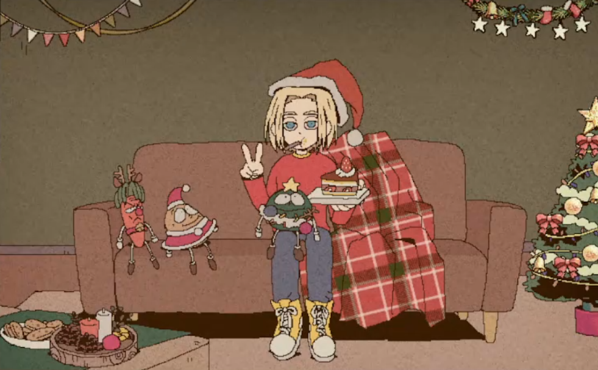{#fig_1 width=100%}

## 引言

《Dig Night》是一款流程并不长的日本独立游戏（但我觉得它其实有一些美式的味道）。以18元的价格来看，它不像一款试图构建庞大世界的作品。一个小镇、一份深夜清洁工的工作、一些关于幽灵的奇怪设定，以及几个插入在游戏中的短片。

在通关之后，我发现它留下的东西比预想中更多。

它表面上讲述的是一个关于自我和解以及中年危机的故事。在更深处，它讨论的是一个更加私人的问题：

**如果一个曾经支撑自己的“另一个自己”被遗忘，那么剩下的那个我，是否还是完整的？**

---

## 一、深夜清洁工与被遗忘的伙伴

游戏开始时，玩家操控的是里卡尔多（Ricardo）。他生活在一个有些压抑的小镇中，每天晚上前往工作地点，作为一名深夜清洁工清理幽灵。

这里的“幽灵”并不是传统意义上的亡灵，而是人们内心压抑情绪的外化。那些无法面对、无法表达，或者被长期忽视的东西，最终以某种实体形式出现在现实中。这个设定其实已经暗示了《Dig Night》的关注方向。它并不关心宏大的世界危机，而是关注那些隐藏在人日常生活中的心理裂缝。这里其实就有点Omori的味道了，平凡的日常里潜藏着角色的心理问题。

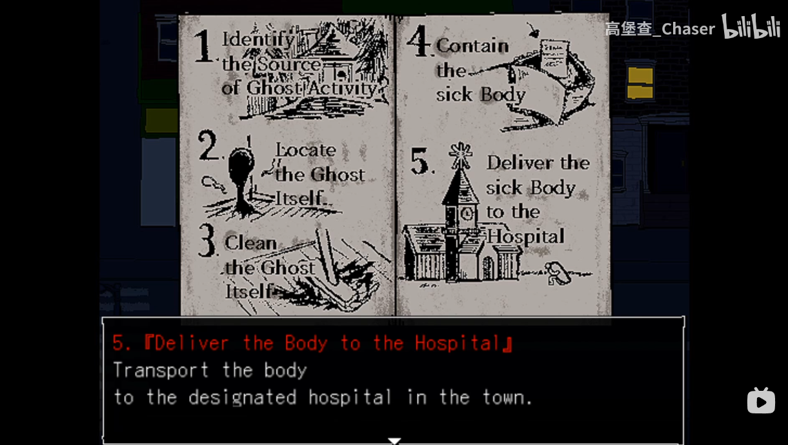{#fig_2 width=100%}

然而在游戏最初几个小时里，玩家并不会立刻知道这一切。最开始呈现给玩家的是一个看似简单的故事。一个名叫里卡尔多的人，被某个叫里奥（Leo）的人抛弃，如今独自照顾着诺亚（Noa）。玩家很自然地会认为里卡尔多是一个现实存在的人。里奥可能是他的朋友、亲人，或者某个曾经重要但如今离开的人。诺亚则像是这个故事中的另一个线索——一个需要被照顾的孩子，一个证明过去关系存在的证据。

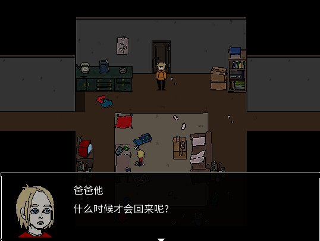{#fig_3 width=100%}

游戏刻意让玩家停留在这种理解中。里卡尔多每天工作、回家、照顾诺亚。小镇居民也以一种平静却疲惫的方式生活着。整个游戏前半部分并没有急于解释世界观，而是在不断强化一种感觉：

**这里的人似乎都在努力维持自己的生活，但又似乎有什么东西正在慢慢消耗他们。**

工作、家庭、人际关系，以及那些无法说出口的情绪，共同构成了这个小镇略显沉闷的氛围。直到剧情推进，玩家才逐渐意识到里卡尔多和里奥之间的关系不是自己最初想象的那样。里卡尔多并不是一个被遗弃的人。

至少，不完全是。

他是里奥童年时期创造出的幻想伙伴。更准确地说，他是里奥曾经拥有、后来却不得不放弃的一部分自己。

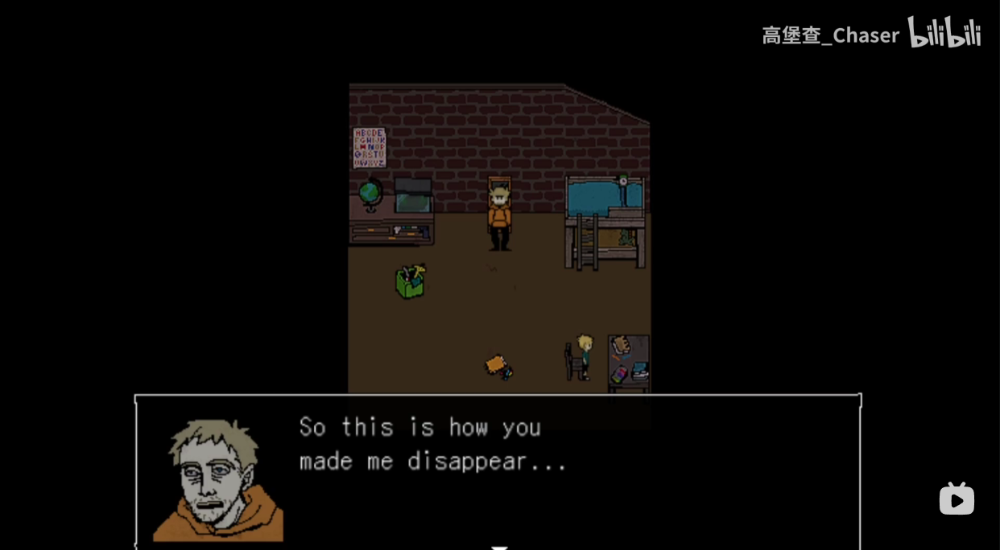{#fig_4 width=100%}

## 二、被现实抛弃的Tulpa

在得知里卡尔多的真实身份之后，游戏前半部分建立起来的关系被重新解释了。玩家原本以为里卡尔多是一个被里奥抛弃的人，但事实却是里卡尔多是里奥曾经主动抛弃的自己。

这里的“tulpa”并不是简单意义上的幻想朋友。如果仅仅把里卡尔多理解为小时候幻想出来的朋友，那么这个设定其实并不特别。许多作品都描写过儿童时期的幻想伙伴，而成长往往意味着与这些幻想告别。

但《Dig Night》选择了另一条道路，它没有告诉玩家：“成年人应该放下童年的幻想。”

相反，它提出了一个更加复杂的问题：

**一个人为了成为所谓成熟的成年人，是否也可能丢弃了一部分构成自己的东西？**

---

里奥小时候生活在一个并不幸福的家庭。他的父母之间存在持续的矛盾，父亲在现实压力中逐渐失去快乐，而里奥也在这样的环境中成长。

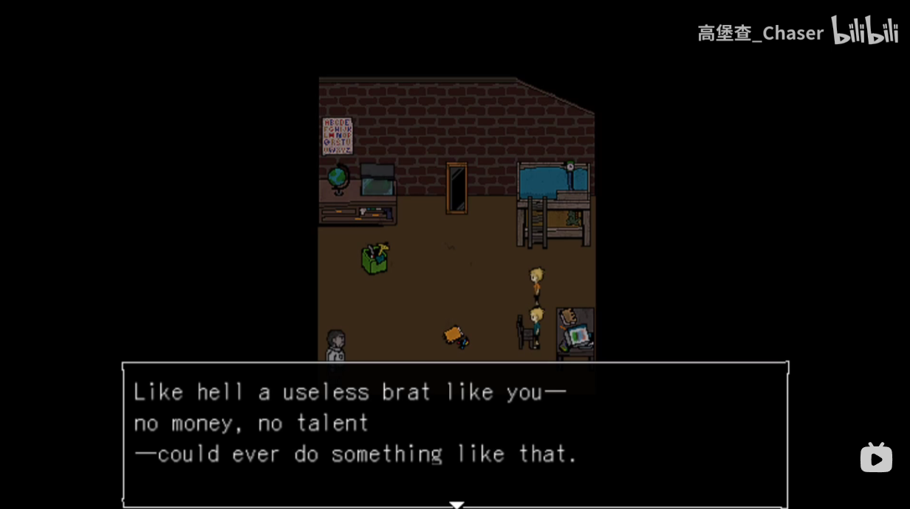{#fig_5 width=100%}

对于一个孩子来说，里卡尔多的存在并不是简单的玩伴，他更像是一种心理上的避难所。当现实中的家庭无法提供理解和回应时，里卡尔多成为了那个永远陪伴他、理解他的对象。里卡尔多这个双胞胎哥哥陪他玩游戏、倾听他的烦恼，甚至在他感到孤独时给予安慰。

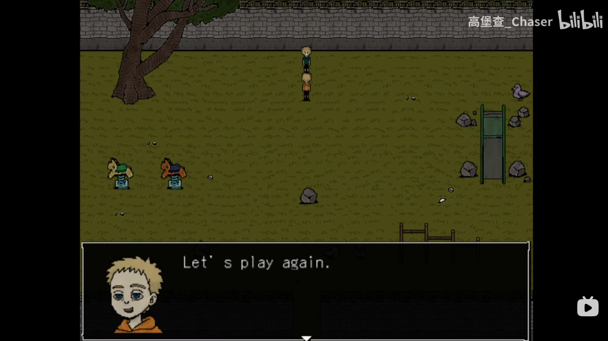{#fig_6 width=100%}

然而，随着年龄增长，里奥开始意识到这个朋友并不会被别人承认。他的父母不认为里卡尔多真实存在，甚至会因为一句“哥哥吃了蛋糕”而惩罚自己不能吃晚饭。现实世界也不会接受这个“另一个自己”。

于是里奥逐渐学会了一件事——隐藏他。最终，他像许多人在成长过程中做过的那样，选择成为一个“正常的大人”。他放弃了那个曾经陪伴自己的部分。

---

但有趣的是，《Dig Night》并没有把这个过程简单描述成：

**“童年美好，成年糟糕。”**

里奥的问题不是成长本身。事实上，他后来也拥有了普通人会追求的人生。他遇到了埃莉诺，与她结婚，有了孩子诺亚。从外部来看，他似乎完成了一个成年人应该完成的生活。然而，他却逐渐发现自己正在走向曾经最害怕成为的那种人。像他的父亲一样，他陷入工作、家庭关系以及无法沟通的压力之中。他明明曾经看见过父亲的人生为什么会走向痛苦，也曾经告诉自己不要重复那条道路。

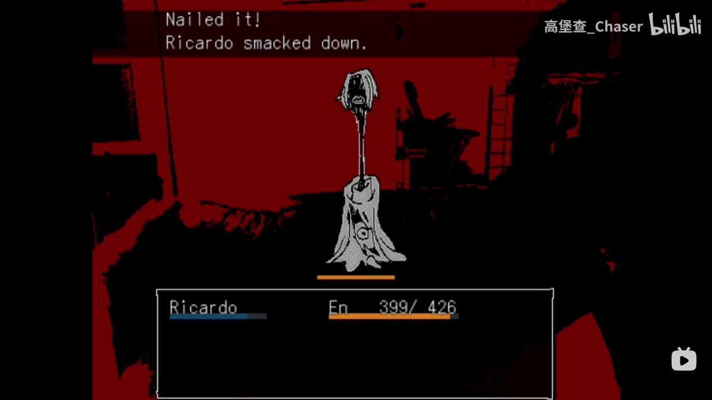{#fig_6_1 width=100%}

最终，他仍然沿着相似的轨迹前进。父亲因为无法选择想要的生活而失去快乐，最后去世。里奥则是因为相似的原因，妻子因去世离开了他，孩子则被他“托付”给了里卡尔多。

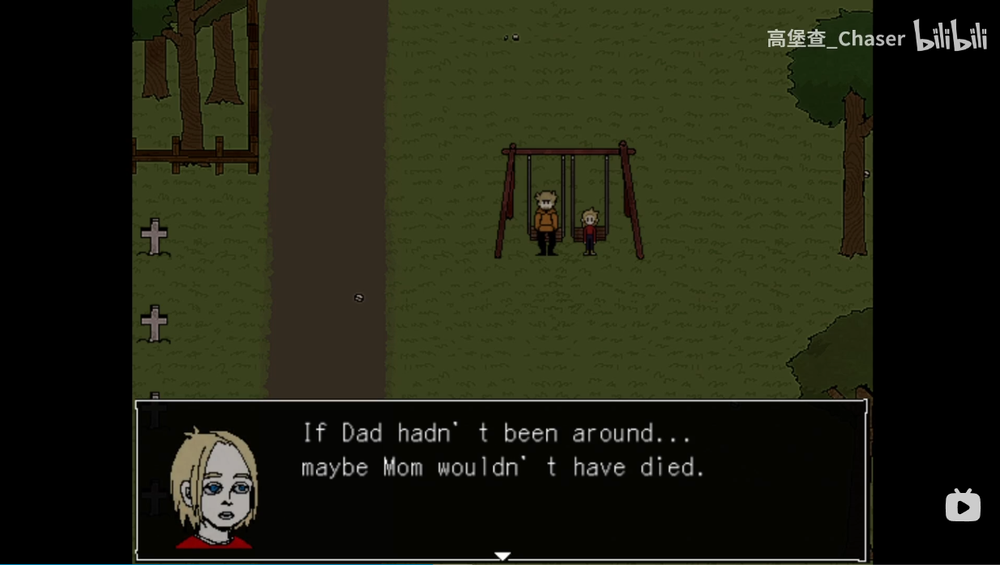{#fig_7 width=100%}

---

这里其实是《Dig Night》最有力量的地方。它没有把人生困境归结为某一个错误选择。

里奥并不是因为某一次错误决定才失去幸福。他的困境来自一种更加普遍的东西：

**人往往会重复自己曾经想逃离的东西。**

小时候的里奥认为：“只要我不要成为父亲，我就可以拥有不同的人生。”

但成年后他才发现逃离某种生活，并不意味着真正理解它。如果一个人没有处理过去留下的东西，那么过去仍然会以另一种形式回来。里卡尔多就是那个被里奥遗忘却一直存在的过去。

---

从这个角度来看，里卡尔多并不是一个需要被消灭的幻想，他更像是里奥人格连续性的一部分。

一个人并不是由现在的自己单独构成的。童年的记忆、曾经相信过的东西、那些看似幼稚的幻想，同样参与塑造了今天的自己。如果一个人为了适应现实，把过去的自己彻底切割，那么他可能得到一种正常生活，却失去了一部分自我。

因此，《Dig Night》的自我和解并不是传统意义上的接受自己的缺点。它更接近：

**重新承认那些曾经被自己否定的部分，也是自己的一部分。**

---

这也是为什么里卡尔多这个角色成立。如果他只是一个幻想朋友，那么里奥最终面对的是接受幻想与现实的区别。但如果里卡尔多代表的是里奥曾经被抛弃的自我，那么里奥面对的问题就是“能否重新接纳那个曾经的自己”。

而这也是游戏标题中“Dig Night”的另一层含义，挖掘那些被埋藏在黑暗中的东西。

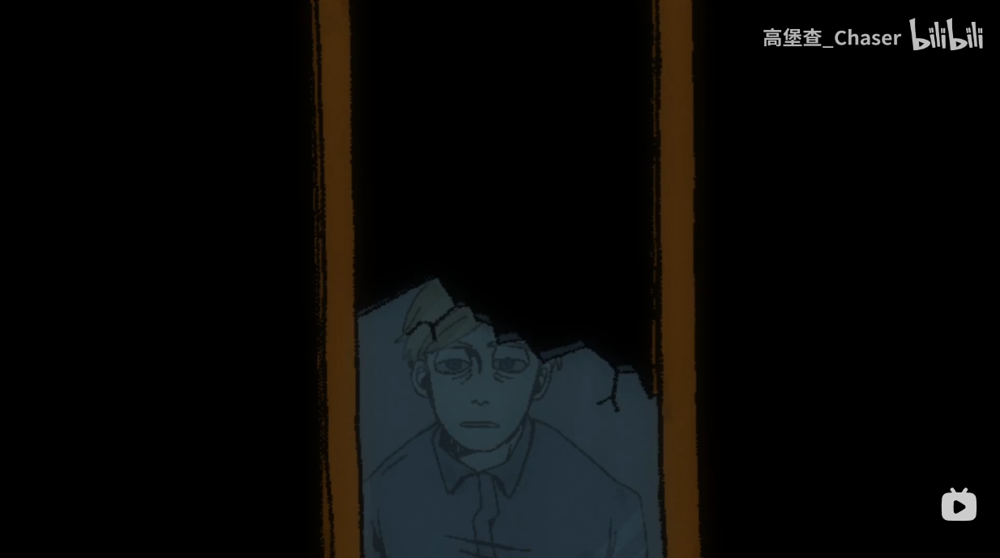{#fig_8 width=100%}

## 三、《I don't want to stay here》

除了游戏本身的剧情之外，《Dig Night》中还有一个容易被忽略的内容，就是游戏内置的电影院。玩家可以在流程中观看作者制作的几个短片。前两个短片采用了黏土动画形式，而最后一个《I don't want to stay here》则完全不同。

它更像是一段十八分钟的手书或者分镜动画。画面并不精致，甚至保留了大量草稿感。但也正因为如此，它反而具有一种私人记录般的感觉。

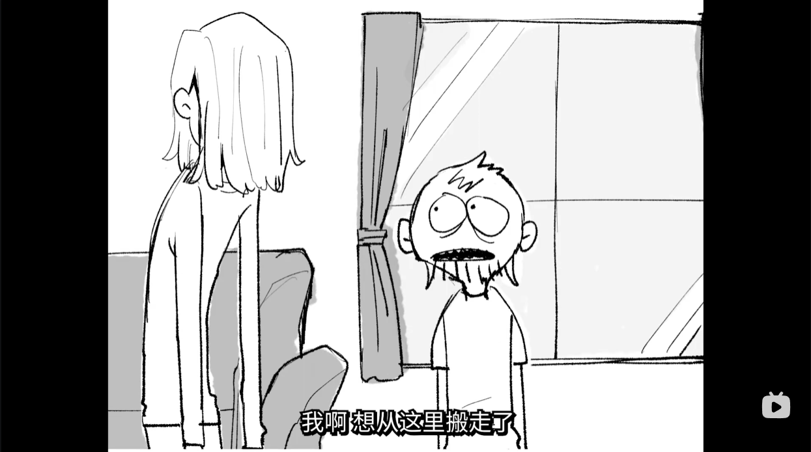{#fig_9 width=100%}

游戏主线是在讲里奥如何重新找回里卡尔多，这个短片讲述的则是另一种可能：

**如果那个支撑自己的存在真的消失了，会发生什么？**

---

短片最初呈现的是一个关于朋友的故事。约瑟夫和自己的朋友一起生活。他们一起经历许多事情,一起行动、一起玩耍、一起度过日常。但在这个过程中，那个矮矮的主角约瑟夫始终表现出一种想要离开的愿望。他不断说自己不想继续留在这里。

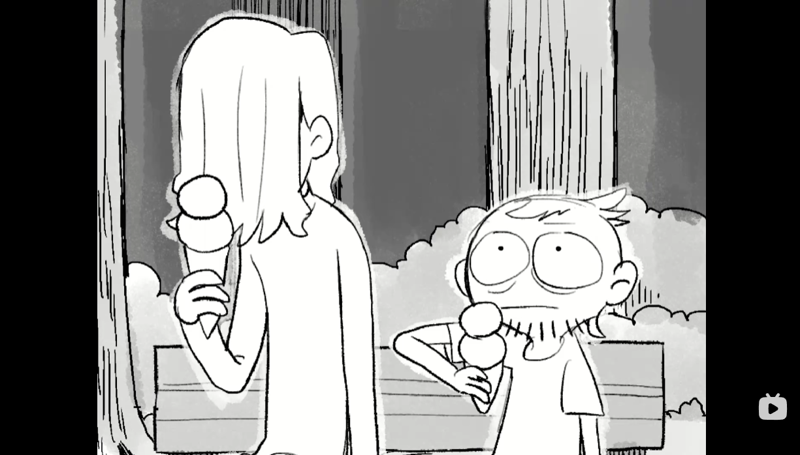{#fig_10 width=100%}

最终，有一天，他真的离开了。而被头发遮住脸的朋友发现了他的死亡。

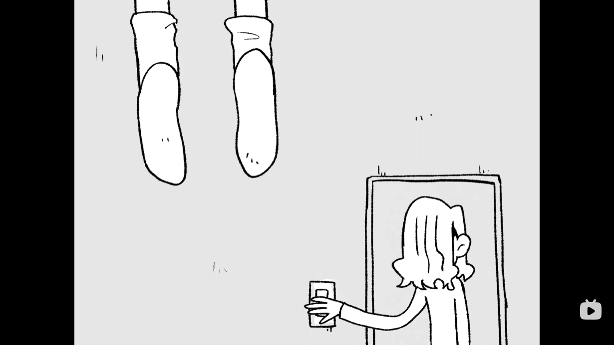{#fig_11 width=100%}

---

如果故事停留在这里，它看起来像是一个关于失去朋友的悲剧。

随后短片开始进入意识流阶段。朋友追随着离开的约瑟夫，甚至进入了一个类似天堂的空间。他终于追上了对方。然而，当主角回头时，观众看到的却不是人的脸，而是一张狗的脸。

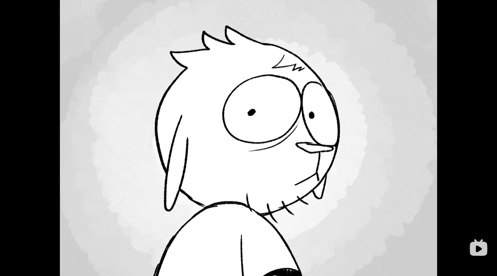{#fig_12 width=100%}

这个瞬间重新改变了整个故事的意义。

---

之后，画面回到了此前那些共同生活的片段。但观众逐渐意识到那些经历并不是两个人共同完成的。所谓的“朋友”，实际上是留下来的那个人根据自己养的狗创造出来的幻想。那些共同经历的事情，实际上只有他一个人在经历。

他并不是失去了一个真实存在的人，他失去的是自己为了面对孤独而创造出来的伙伴。

---

这个反转其实和里奥与里卡尔多形成了非常强烈的呼应。在《Dig Night》的主线中里卡尔多是里奥童年创造出的存在。而在《I don't want to stay here》中约瑟夫也是朋友精神世界中创造出的存在。

两者都提出了同一个问题：

**一个并非现实存在的对象，是否仍然能够成为真实的情感关系？**

---

从现实角度来看，我们可能会说那个朋友并不存在。但对于故事中的人物而言，这个答案并没有那么简单。因为那个幻想出来的存在确实陪伴了他，它改变了他的生活，帮助他度过了原本无法承受的孤独。

如果一个不存在的人，却真实地改变了一个人的人生，那么这个存在究竟算不算“真实”？

《Dig Night》并没有试图回答这个哲学问题。

它更关心的是失去这个存在之后，人是否还能继续生活。

---

短片最后的画面非常残酷，朋友回到空荡荡的房间。他面对曾经属于那个幻想伙伴的一切。

最终，画面停留在他重复约瑟夫上吊动作后的残局上。

下面出现了一句话：

> “我已经一无所有了。”

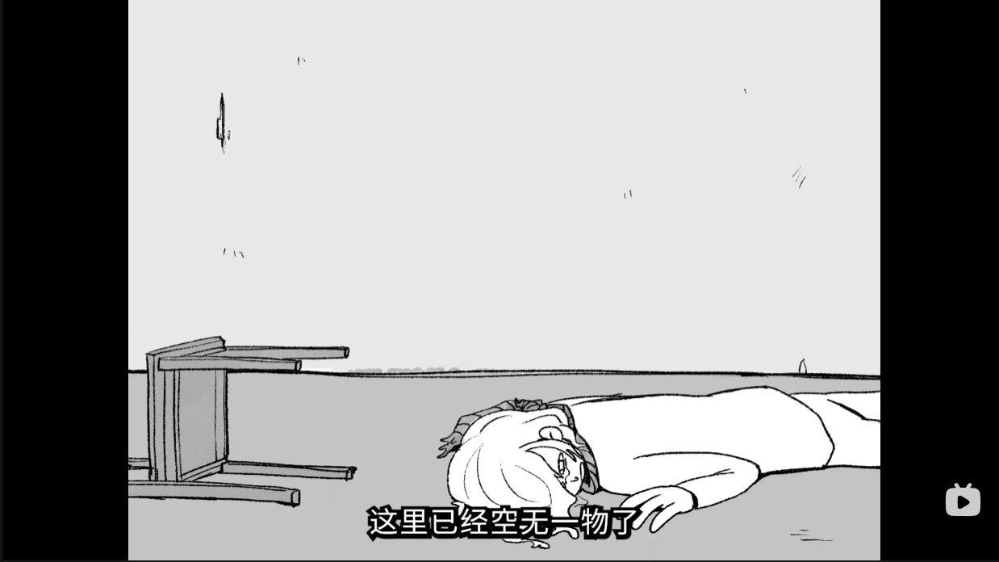{#fig_13 width=100%}

这里最痛苦的地方在于他失去的并不是一个外部的人。

他失去的是让自己能够继续生活的那个部分。

---

如果说里卡尔多代表的是“被重新接纳的自我”，那么《I don't want to stay here》展示的就是另一种结局，一个人彻底失去了那个曾经支撑自己的存在。因此，这个短片比主线更加悲观。游戏主线告诉我们过去的自己并不是应该被抛弃的东西。而短片提醒我们，有时候，人创造出的幻想、记忆或者陪伴，可能已经成为自我结构的一部分。

失去它，并不只是失去一个对象。

而是失去自己的一部分。

---

这也是为什么我认为《I don't want to stay here》对于理解《Dig Night》非常重要。

它让tulpa这个设定不再只是一个剧情机关，因为它真正讨论的是人如何通过与某些存在的关系，构建自己的身份。这些存在是否真实，反而不是最重要的问题，重要的是它们是否参与塑造了现在的我们。

## 四、幽灵、小镇与没有被追问的原因

《Dig Night》中最有趣的设定之一，是游戏对于“幽灵”的解释。在这个世界里，幽灵并不是来自死亡，而是来自人的压抑。那些被隐藏、被否认、无法表达的情绪，最终以某种形式从人的内心进入现实。

这个设定非常直观，它让一种抽象的心理状态获得了视觉形态。一个人的痛苦不再只是一个无法观察的概念，而成为了玩家可以看见、可以清理的对象。

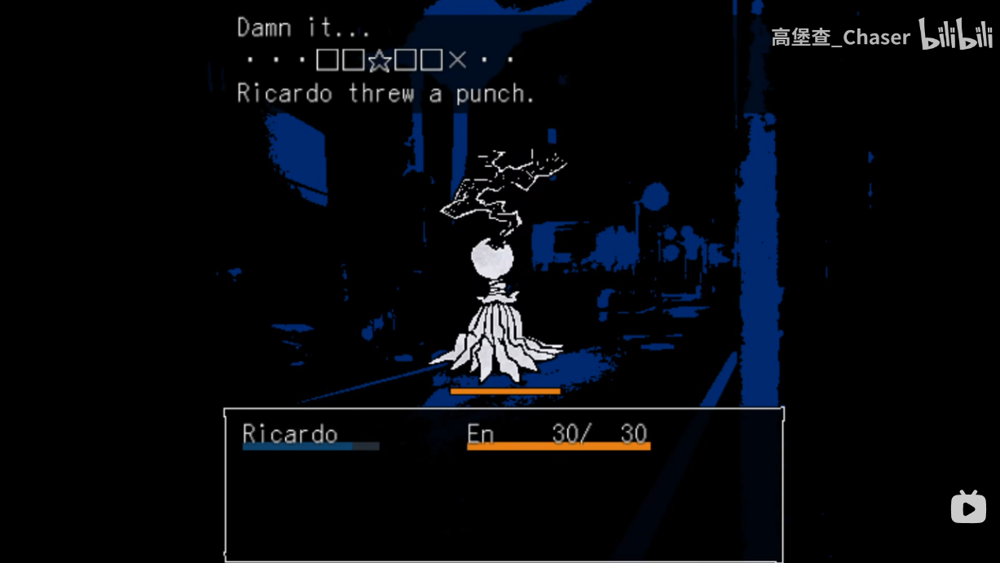{#fig_14 width=100%}

从游戏设计角度来看，这是一个非常有效的象征。因为玩家的行动本身就和主题产生了联系，里卡尔多作为清洁工，实际上是在处理人们无法面对的东西。他清理的是那些人被迫隐藏起来的情绪。

---

然而在游玩过程中，我也产生了一个没有得到回答的问题：

**为什么这个小镇上的人会如此压抑？**

游戏向玩家展示了这样的场景。疲惫的工作者、缺少交流的家庭、无法表达的情绪，以及每个人身上若有若无的孤独。但它并没有继续追问，这种状态是如何产生的？是工作方式的问题？是社会结构的问题？是人与人之间关系变化的问题？还是更普遍的现代生活困境？

---

这也是《Dig Night》和一些同样关注“小镇与人的困境”的作品之间的区别，如《Night in the Woods》。

两者都描绘了一个看似普通的小镇。也都关注：

- 成年人的疲惫
- 年轻人的迷茫
- 日常生活中的压迫感

但《Night in the Woods》会进一步把这种状态和经济环境联系起来。小镇衰败、产业变化、年轻人的未来选择，这些因素共同构成了角色困境的来源。

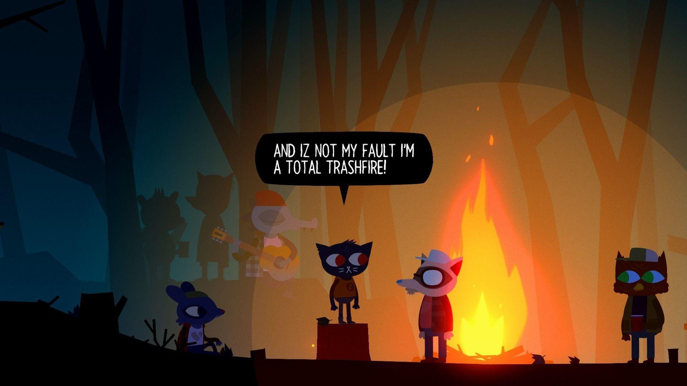{#fig_15 width=100%}

它试图回答：

“为什么这些人会变成这样？”

---

而《Dig Night》更像另一类作品，它更接近《OMORI》。它并不试图建立一个完整的社会解释，而是把重点放在一个人如何面对自己内心留下的伤痕。它关心的是痛苦存在时，人如何继续生活，而不是为什么这个世界会制造痛苦。

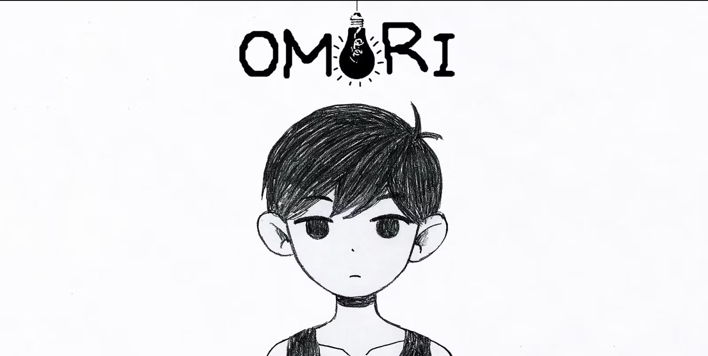{#fig_16 width=100%}

---

这也是为什么我认为，有些玩家会从《Dig Night》中读出关于未来社会、人类原子化的想象。这种解读并非毫无依据。游戏中的确存在人与人之间越来越难以沟通，每个人都背负自己的痛苦，精神世界成为重要避难所……这些元素确实容易让人联想到现代社会中的孤独体验。

但如果严格来说，《Dig Night》并没有真正构建一个社会模型。它没有分析制度，也没有讨论结构性的原因。它更像是一则心理寓言，假如人的压抑可以具象化，那么一个人应该如何面对它？

---

而这也是我认为《Dig Night》最成功、同时也是最有限的地方。它非常擅长描绘一个人为什么会破碎，它也非常擅长描绘一个人如何尝试重新接纳自己。但它没有继续向外延伸，它没有告诉玩家造成这些破碎的世界究竟是什么样的。

---

不过，这并不意味着这种选择是不足。因为《Dig Night》显然并不想成为一部社会批判作品。它选择关注的是更私人、更内向的问题。如果痛苦已经存在，如果过去已经无法改变，那么一个人是否还能重新拥抱那个曾经被自己抛弃的部分？

从这个角度来看，它已经完成了自己的目标。

只是对于习惯追问“为什么”的玩家来说，它留下了一片没有继续挖掘的空间。

## 五、带着过去继续生活

在故事的最后，里奥重新面对了里卡尔多。

如果按照传统成长叙事的套路，这里其实很容易走向另一种结局。里奥意识到童年的幻想只是幻想，然后告别过去，成为一个真正成熟的成年人。但《Dig Night》没有这么处理，它没有要求里奥消灭里卡尔多。因为里卡尔多从来不是阻碍里奥成长的东西。真正的问题是里奥为了适应现实，主动切断了与过去自己的联系。

---

因此，里卡尔多的回归并不是回到童年。里奥也不是重新成为那个相信幻想朋友的小孩。他们之间的和解，更像是一种重新承认。那个曾经的自己，并没有消失。那个会幻想、会害怕、会寻找陪伴的孩子，也同样属于现在的自己。成年人并不一定需要抛弃过去。

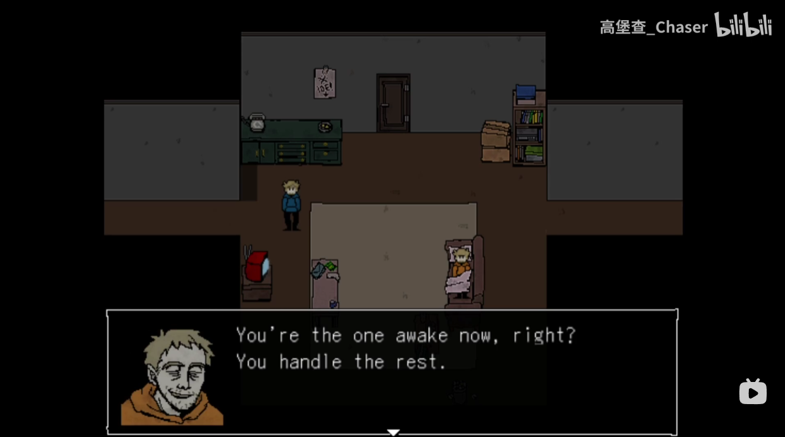{#fig_17 width=100%}

有时候，所谓成长并不是不断舍弃，而是学会带着过去留下的东西继续前进。

---

从这个角度来看，《Dig Night》的标题其实也有了一层新的含义。游戏中的里卡尔多负责清理幽灵。到了最后，玩家会发现，真正需要被挖掘出来的，并不是某些外部的怪物，是那些被自己埋藏起来的东西。

被遗忘的记忆。

被否定的情感。

以及那个曾经陪伴自己、却被自己认为“不应该存在”的部分。

---

我觉得《Dig Night》最打动我的地方，也正是在这里。它没有试图讲述一个宏大的故事，没有改变世界，没有解决整个社会的问题，甚至没有告诉玩家，人为什么会陷入这样的生活。它只是讲述了一个非常具体的人，一个在漫长生活中逐渐失去自己的成年人，最终重新找回那个曾经陪伴自己的存在。

这种故事并不复杂。但它触及了很多人都会遇到的问题，我们在成长过程中，到底放弃了多少曾经属于自己的东西？

---

不过，这也是为什么我认为《Dig Night》虽然优秀，却并没有完全成为我最喜欢的那类作品。它对于人的心理状态有非常细腻的观察。它能够让我理解里奥为什么会痛苦，也能够让我理解里卡尔多为什么重要。但是它最终选择停留在个人层面，它关注的是一个人如何重新接纳自己。而我有时会进一步追问是什么让这么多人逐渐失去了自己，为什么人必须经历这样的切割才能成为所谓成熟的大人。

这些问题，并不是《Dig Night》想回答的。

---

但这并不影响它作为一个小体量独立游戏的完成度。

相反，正因为它没有试图讲述一个过大的故事，它才能把注意力集中在那些细小的东西上：

一个幻想朋友。

一个孩子。

一个逐渐疲惫的成年人。

一段无法说出口的痛苦。

以及一个最终决定继续生活的人。

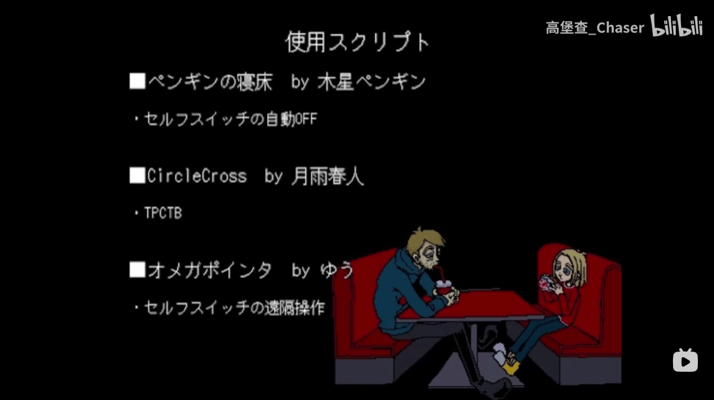{#fig_18 width=100%}

---

如果说《Dig Night》告诉玩家什么，我觉得应该是：

**不要误以为过去的自己必须被消灭，才能成为现在的自己。**

那些曾经陪伴过我们的东西，无论是真实存在的人，还是只存在于自己心中的幻想，都可能已经成为我们的一部分。真正的和解，并不是回到过去；而是在承认过去之后，继续走向未来。

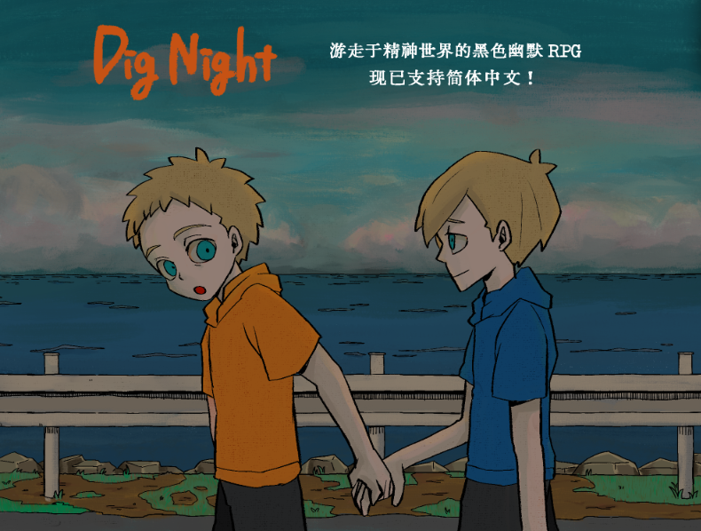{#fig_19 width=100%}