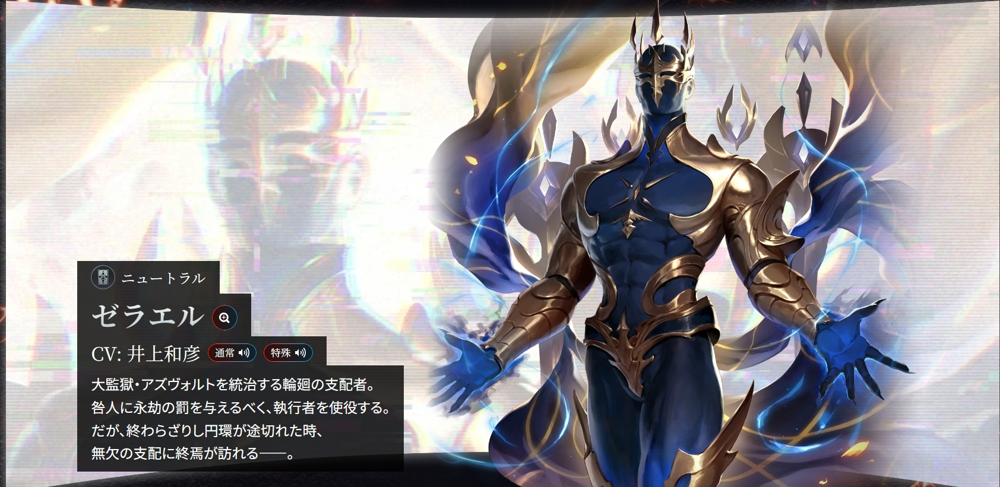
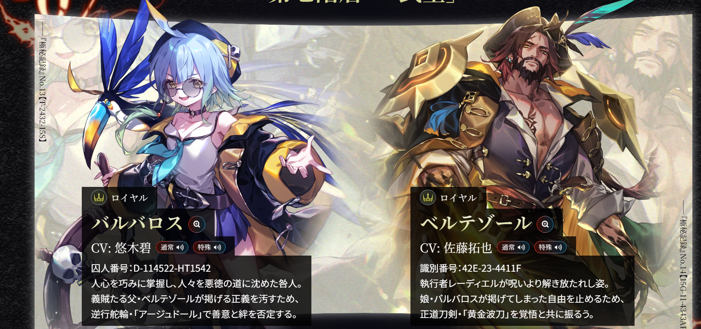
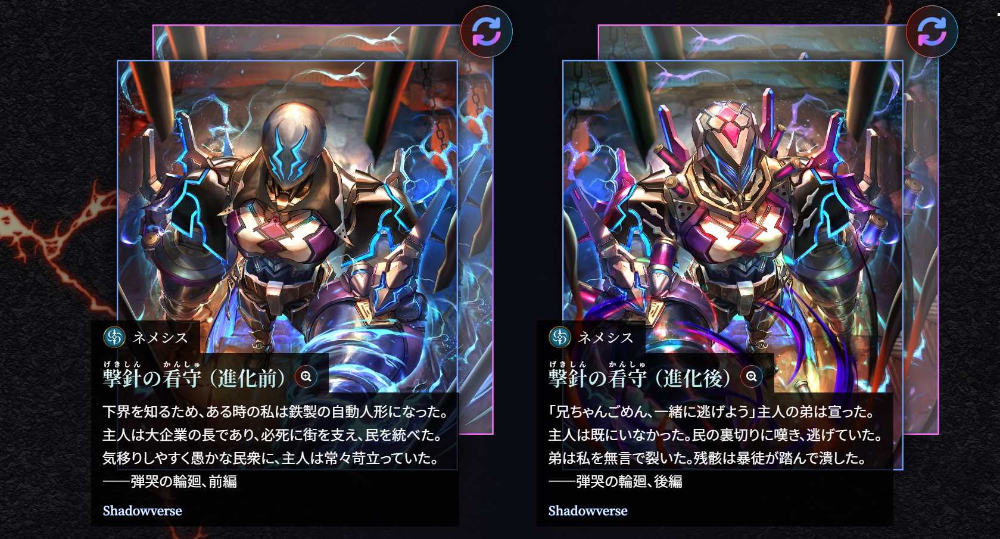
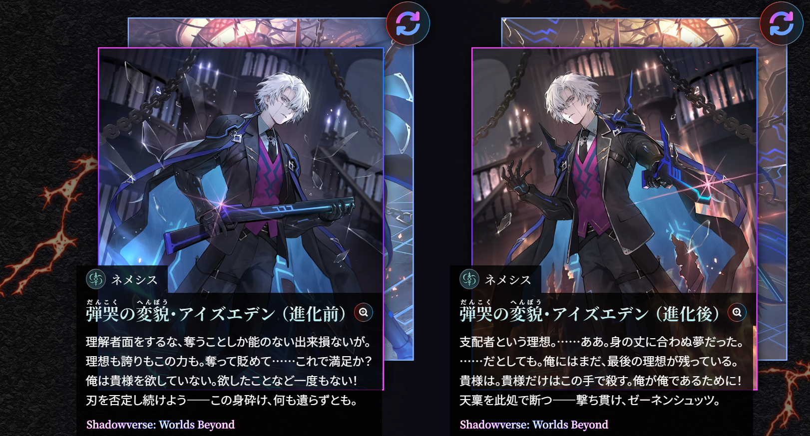
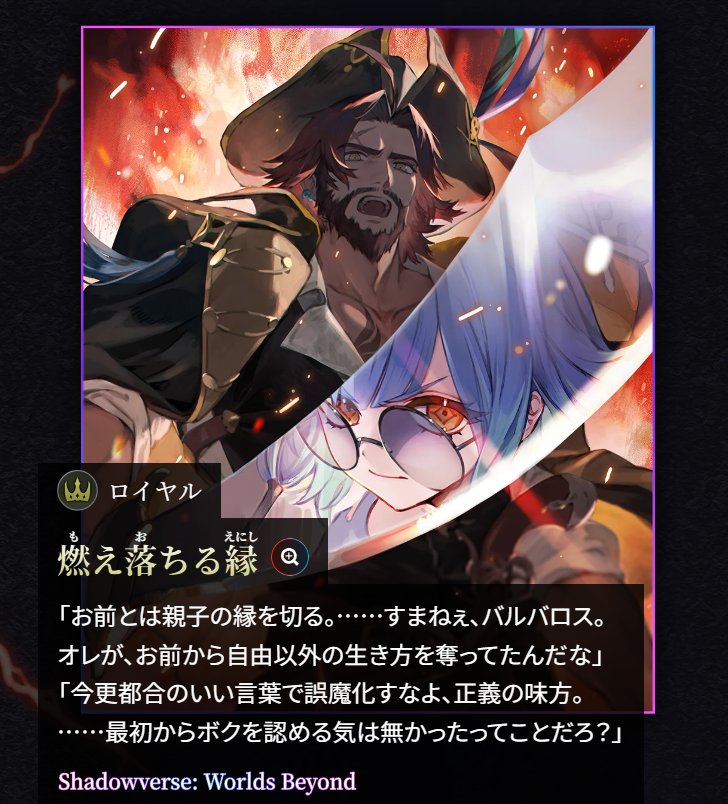

> 本文涉及《八狱魔境・阿兹弗特》与《Revenants of Azvaldt》的完整人物关系及剧情设定。

# 引言

乍看之下，阿兹弗特很像一套结构整齐的八宗罪故事。八个监狱阶层，八名因不同罪行被囚禁的特级囚人，以及八名代表相反理念、负责阻止他们越狱的执行者。旧卡包《八狱魔境・阿兹弗特》已经为每一层建立了清楚的对立。囚人有鲜明的欲望、能力和罪行，执行者则以生命、仁义、人性、信赖、自由等理念宣判他们。

Revenants of Azvaldt 却让这套结构从内部裂开了。监狱统治者泽勒尔被卡特斯罗特杀死后，必罚之咒随之解除。八名执行者显露原本身份。他们并非与囚人毫无关系的执法机关，而是囚人最想寻找、保护、否定或继承的人。于是罪人对执行者重新变回兄弟、朋友、姐弟、母子、姐妹、伙伴、父女与师徒之间没有结束的冲突。

{#fig:controller width="100%"}

官网藏在角色编号中的 Polybius 方阵密码，进一步确认了这套关系。

|阶层|关系词|
|---|---|
|第一层|BROTHER / BROTHER|
|第二层|FRIEND / FRIEND|
|第三层|SIBLING / SIBLING|
|第四层|MOTHER / SCION|
|第五层|SISTER / SISTER|
|第六层|PARTNER / PARTNER|
|第七层|DAUGHTER / FATHER|
|第八层|DISCIPLE / MASTER|

这些关系词没有补充新事件，却改变了旧事件的阅读方式。它们提醒玩家每名囚人的选择都曾指向另一个具体的人；每名执行者的判词背后，也压着一段属于自己的记忆。所以，Revenants of Azvaldt 并不是替旧角色追加一份隐藏身世。它进行的是一次叙事权的重新分配。一代先让囚人解释自己为什么行动，二代再让关系中的另一方说明。那项自称“为了你”的行动，在自己这里究竟意味着什么。

# 一代文本

《八狱魔境・阿兹弗特》首先要做的，是让八名囚人在很短的卡牌文本里成立。

旧文本通常沿着相似的顺序展开。原生环境、重要关系、一次关键选择、选择造成的灾难，以及执行者从某种“理想”立场作出的宣判。玩家随后看见囚人被关入阿兹弗特，并为了尚未实现的目标试图越狱。

因此，一代天然偏向行动者视角。它首先解释的是：

- 卡特斯罗特为什么退出继承竞争，又为何仍被反叛组织推为象征；
- 伊斯坦戴德为什么要用无数生命的残滓延长姐姐的寿命；
- 曲千代为什么宁愿背负污名，也要为儿子安排正统继承；
- 赛菲为什么会把“作为姐姐拯救妹妹”执行成一系列活体实验；
- 巴巴洛丝为什么用父亲教给自己的自由，反抗父亲规定的正义。

这些人物的行动逻辑都很清楚。以巴巴洛丝为例，她最早从父亲那里得到的教导可以浓缩为一句：

> “自由才是最大的宝藏。”

{#fig:freedom width="100%"}

这句话既是父亲交给她的价值，也是她后来反抗父亲的理由。巴巴洛丝并非突然选择另一套理念，而是把“自由”推到了父亲无法接受的位置。[第七层官方文本](https://revenants-of-azvaldt.shadowverse-wb.com/chs/details/7)

关系对象在一代并非完全沉默。贝尔铁佐的教导、菲绫的求助、奥梅里欧与反对派的接触，都已经进入囚人的记忆。但玩家首先看到的仍是这些信息如何推动囚人行动。另一方如何理解同一件事，通常没有获得同等篇幅。

诅咒之下的执行者又强化了这种单向结构。他们不以私人身份说话，而以抽象理念宣判罪责。复杂的关系史因此被压缩成一项可以分类和惩罚的错误——这恰好也是泽勒尔理解世界的方式。八个阶层既对应八种罪责，也对应八种理想。

一代先让玩家接受一个看似完整的因果链。这个人经历了什么、作出什么选择、为什么成为罪人。只有这条链先成立，二代的重新解释才会产生力量。

# 二代文本

“必罚之咒”解除的意义，不只是八张执行者立绘换回原本身份。消失的还有他们作为抽象理念载体的位置。

原本负责说“你违背了什么理想”的执行者，重新变成拥有名字、经历和私人立场的人。二代文本因此从另一端进入同一段历史。他如何认识囚人，为什么与对方建立关系，当年没有说出口的动机是什么，以及一代那些已经发生的事件，在他这里意味着什么。

二代很少否定一代的事实。卡特斯罗特确实退出了竞争，诺玛格达拉确实主动离开，赛菲确实治好了妹妹，奥梅里欧也确实秘密接触了反对派。改变的是这些事实之间的连接方式。

巴巴洛丝与贝尔铁佐的两句台词最容易看出这种变化。一代由父亲告诉女儿“自由才是最大的宝藏”；二代的贝尔铁佐却说：

> “现在我要把它夺回来。”

自由没有被换成另一种价值。变化在于贝尔铁佐开始重新解释自己当年的赠予。如果女儿只能按照父亲定义的自由生活，那么这份礼物是否也变成了限定？二代不是宣布一代的教导错误，而是让教导者回头审视它产生了什么结果。

二代的基本问题不再是这个人为什么成为罪人，而是：

> 一个人是否能替关系中的另一方，决定一次帮助、一份理想或一种未来的意义？

这也解释了为什么诅咒解除后，八组人物仍然要战斗。制度性的惩罚者消失了，私人关系中真正没有解决的问题才第一次完整出现。

# 八组关系

八组故事都采用“囚人行动—关系对象解释”的双视角，但二代并不是八次重复的“其实另有隐情”。它们改动旧叙事的层级并不相同。

|补完方式|代表关系|二代改变了什么|
|---|---|---|
|关系定义反转|安缇马丽亚／诺玛格达拉|“我们彼此互补”被另一方理解为依赖和负担|
|因果起点前移|伊斯坦戴德／玛尔奇盖特|悲剧从弟弟夺取生命，前移到姐姐第一次拒绝弟弟死亡|
|受体经验具体化|赛菲／菲绫|抽象的“妹妹”获得名字、医生身份和身体经验|
|信息空白补足|艾尔拉德／奥梅里欧|补出秘密接触反对派的动机，以及双方不同的信任标准|
|理念自我修正|巴巴洛丝／贝尔铁佐|父亲重新理解自己传授的“自由”|
|传承方式失败|伽罗塔德／泽特|弟子继承了目标，却没有继承方法和力量边界|
|价值内化补完|曲千代／飞燕|儿子如何把母亲教导的仁义转化为自己的判断|
|叙事中心转移|卡特斯罗特／艾兹伊甸|从弟弟如何行动，转向哥哥如何经历这些行动|

有的二代文本补动机，有的补信息，有的把因果向前推进。

它们共享的只有一个原则。囚人的解释仍然有效，却不再是事件唯一有效的版本。

# 卡特斯罗特与艾兹伊甸

*从系统观察者到关系主体*

八组故事中，卡特斯罗特与艾兹伊甸最容易让人产生二代更换了角色重心的感觉。因为艾兹伊甸获得的不是一项补充动机，而是一套足以重新排列全部事件的认知方式。

## 无法退出系统的天才

卡特斯罗特身怀异才，本应与兄长争夺大型企业集团的继承权，却知道成为统治者是兄长的理想。于是他主动退出竞争、离开企业，试图把位置留给艾兹伊甸。退出没有让他从系统中消失。才能、声望与人望使他被反叛组织推为象征，最终导致兄长被放逐、原有统治被推翻。卡特斯罗特没有追求权力，却比真正坐在统治位置上的人更能改变权力结构。

这使他首先成为一个系统观察者角色。他习惯判断谁拥有什么能力、谁想得到什么、采取什么行动可以达成目标；如果结果失控，就再用新的行动修正。退出竞争、邀请哥哥离开，以及后来试图找回哥哥，都属于这种思路。

{fig-alt width="100%"}

一代的核心问题因此是：一个有能力改变系统的人，能否靠主动退出而停止影响系统？卡特斯罗特的故事给出的结果是否定的。行动者可以放弃目标，却无法一并撤回才能、声望及其产生的结构后果。

艾兹伊甸在这套叙事中很重要，但主要作为卡特斯罗特的特殊对象存在。他是弟弟退出竞争的理由，也是弟弟唯一无法舍弃、必须重新找回的人。玩家知道卡特斯罗特如何看待哥哥，却还没有同等程度地知道哥哥如何看待自己。

## 被让出来的人生

艾兹伊甸的审查记忆保留了卡特斯罗特的说法：

> “我对什么支配者根本没兴趣。”

这句话在卡特斯罗特的逻辑里很容易理解。他退出竞争并非欲擒故纵，也不想夺走哥哥的理想。但艾兹伊甸紧接着给出了另一种解释：

> “所以我才会选择放弃。”

成为统治者是艾兹伊甸的理想，也是他确认自身价值的方式。他看见弟弟拥有更适合统治的知识、战略与人望，因此曾经退出竞争；可那个真正有能力实现理想的人，却宣称自己对它毫无兴趣。[第一层官方文本](https://revenants-of-azvaldt.shadowverse-wb.com/chs/details/1)

此后，艾兹伊甸得到的是弟弟让出的继承权；失去的，又是被弟弟声望推动的反叛所推翻的统治；最后，弟弟还试图邀请他离开，提出两人可以重新开始。

卡特斯罗特把这条事件链理解为让步、意外与修正。我知道你想要什么，所以退出；结果失控，我再设法补救。艾兹伊甸却把相同事件连成了另一条线。自己的成功、失败和下一步，似乎始终由弟弟决定何时开始、何时结束。他所处理的不是局势如何修复，而是“谁有权定义我的人生”。统治权的重要性也不只在于实际权力，它还是艾兹伊甸摆脱比较、证明自身独立价值的方式。

{fig:alt width="100%"}

## 为什么这里会发生重心变化

兄弟二人并非对同一个问题给出不同答案，而是在处理两个层面的问题。

|卡特斯罗特|艾兹伊甸|
|---|---|
|局势怎样才能被修复|谁有权解释我的人生|
|行动是否能达成目标|行动赋予我什么身份|
|如何退出或重组系统|如何摆脱被比较、被让予的位置|
|如何找回兄长|是否允许自己再次被弟弟“找回”|

艾兹伊甸的二代文本并不是简单回答他为何憎恨弟弟。它把一代以卡特斯罗特为中心的行动史，重新组织成艾兹伊甸如何理解自己位置的故事。一代像是在讲卡特斯罗特如何失去哥哥；二代则让原先作为行动对象的哥哥，成为能够重新解释全部事件的关系主体。这不是补上一块缺失拼图，而是移动了整幅图的中心。

# 两组对照

## 巴巴洛丝与贝尔铁佐

*同一个命题的内部反思*

巴巴洛丝组从一代开始就属于父女双方。贝尔铁佐如何从奴役中获得自由、如何建立义贼团、如何教女儿理解自由，以及他为何要求不能杀害和掠夺平民，都已经被写进巴巴洛丝的记忆。父亲不是等待二代补充的缺席对象，而是从一开始就拥有明确理念的对话者。

二代让贝尔铁佐说“现在我要把它夺回来”时，叙事轴并没有更换。父女始终讨论同一个问题。自由是否包含边界，以及被父亲传授的自由能否被女儿用来反抗父亲。

二代做的是让命题的提出者反思自身，而不是把原本属于女儿的故事改写成父亲的故事。

{#fig:freedom2 width="100%"}

## 赛菲与菲绫

*从“妹妹”到一个有名字的人*

赛菲的一代定位同样清楚。面对菲绫的求助，她给出的回答是：

> “是姐姐就该拯救心爱的妹妹。”

赛菲理解“姐姐”这一关系角色应该做什么，并把它执行为治疗目标；问题在于，她对亲情的理解停留在关系分类和行为规则上。为了完成治疗，她可以把无数具体生命变成实验材料，最后甚至无法记住妹妹的名字。

二代的菲绫没有另起一个主题，而是抓住了这个缺口。姐妹的名字是两人送给彼此的礼物；菲绫成为医生、患病、接受治疗，又发现自己的生命建立在他人的痛苦之上。于是她最终以一句话反向回应赛菲：

> “我才能在你的墓碑上刻下名字。”

一边掌握“姐姐应该怎样”的规则，却逐渐遗失妹妹是谁；另一边则用名字保存具体人格。[第五层官方文本](https://revenants-of-azvaldt.shadowverse-wb.com/chs/details/5)

这组二代补完之所以自然，是因为菲绫进入的是一代早已留下的位置。被这样拯救的人，如何经历这场拯救？二代让抽象的“妹妹”拥有姓名、职业与身体经验，却没有更换原来的冲突轴。

作为对照，艾尔拉德与奥梅里欧也属于类似结构。一代已经把奥梅里欧为何接触反对派空了出来，二代补出其保护动机与共同誓约，更像解开悬案。

卡特斯罗特组则不只填补空白，它改变了读者应该把什么视为主要问题。这一对或许后面会专开一篇聊一聊这么做的利弊，以及……出于个人兴趣，填一填有关故事。

# 结语

*替别人决定未来，也是在替别人解释人生*

泽勒尔建立阿兹弗特，是因为他相信自己已经理解世界。他把漫长轮回中观察到的悲剧整理为八种罪责，再用八种理想加以审判。复杂性在这里被压缩成可以管理的类别。

八组人物在更小的尺度上重复了相似结构。有人让出继承权，有人替朋友选择独立，有人拒绝亲人死亡，有人安排继承，有人以亲情为名治疗，有人秘密替伙伴排除敌人，有人把自由交给女儿，也有人把梦想托付给弟子。

这些行动并不一定源于敌意。许多冲突恰恰从理解、保护和期待开始。但“为你好”很容易同时替对方完成三项判断：

1. 你真正需要什么；
2. 你的未来应该是什么；
3. 我的行动对你意味着什么。

当三项判断都由行动者完成，帮助便可能具有支配的结构。问题不只在于行动是否产生了预期结果，也在于关系中的另一方是否仍能解释自己的需要、损失与未来。Revenants of Azvaldt 没有用二代文本宣布哪一方拥有最终真相。它只是让被诅咒压缩成“执行者”的人重新开口，使一代看似完整的因果链显露出第二种连接方式。

所以阿兹弗特真正讨论的，或许是当我们确信自己比对方更了解他的未来时，理解与支配之间，还剩下多远的距离。

---

## 资料范围

- 《Shadowverse》卡包《八狱魔境・阿兹弗特》相关风味文本；
- 《Shadowverse: Worlds Beyond》卡包《Revenants of Azvaldt》官方特设页面及日文风味文本；
- 官网角色编号与《绝密记录》编号的 5×5 Polybius 方阵解密结果。

官方特设页面：<https://revenants-of-azvaldt.shadowverse-wb.com/>
