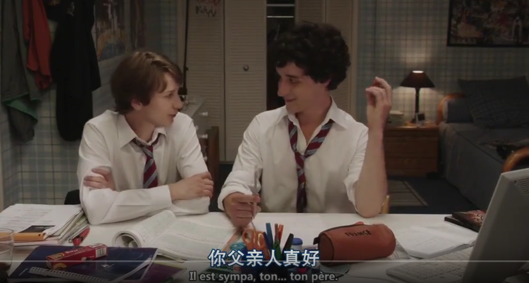
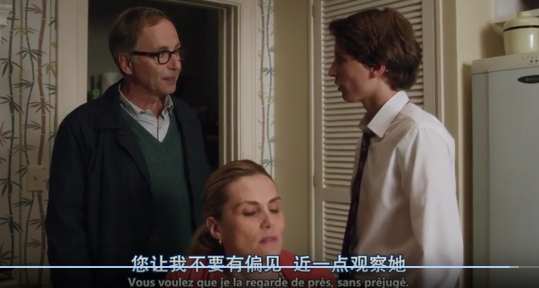
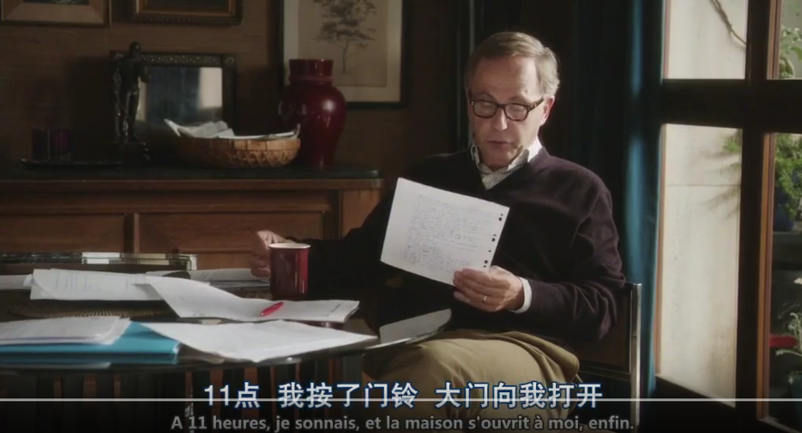
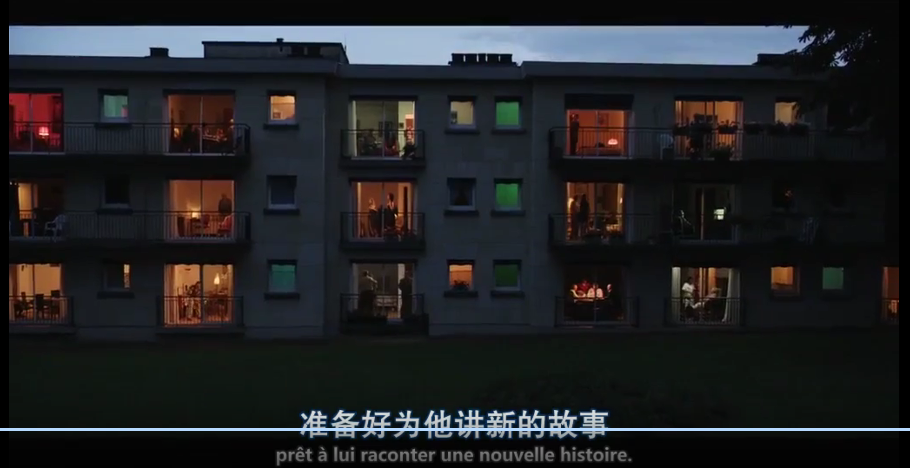
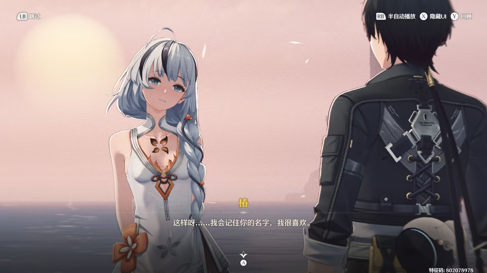
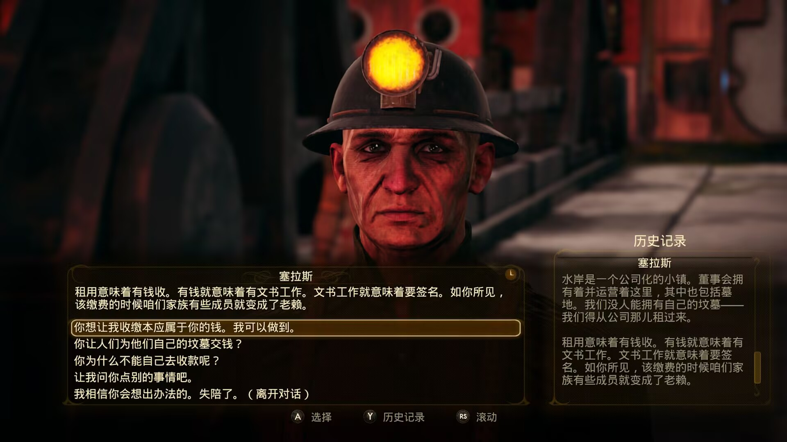
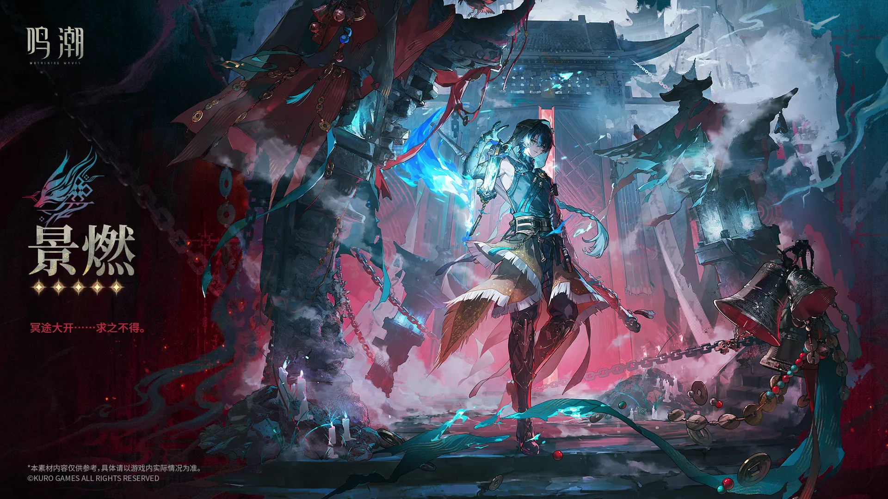

# 一、为什么我会突然想起《登堂入室》？

一个多月以前鸣潮上了 Xbox，我也断断续续玩了大概四十个小时（不过我猜其中有十多个小时是因为诡异的下载速度在那挂机在那下数据包）。我耐性还是不错的。尽管这游戏在Xbox上优化屡遭玩家差评，制作组前瞻愿意优化PS5版本和PC版本也不愿提一嘴Xbox，我还是本着大部分人说“玩到2.0就好了”推到了黎那汐塔。

{#fig_1 width=100%}

好吧，卡提希娅相关的剧情部分结束之后，我把游戏卸载了。这倒不是因为游戏某个地方突然变得特别差。相反，它的角色设计、演出、场景和整体制作规格都很成熟，有些部分甚至确实漂亮。真正让我停下来的，是一种一直说不太清楚的别扭感。

这种别扭尤其是在角色和漂泊者的关系上。游戏似乎非常努力地让我意识到这些角色正在和“我”建立某种特殊联系。他们信任漂泊者、依赖漂泊者、主动向漂泊者讲述自己的故事；镜头、台词和剧情安排也不断提醒玩家，漂泊者不是这个世界里随便经过的一个人，而是某种非常特殊的存在。很多时候，一个新角色登场不久，剧情便已经开始迅速建立他与漂泊者之间的私人联系。

{#fig_2 width=100%}

从游戏设计的角度来说，这当然很好理解。二次元抽卡游戏需要让玩家喜欢角色。一个角色如果只是世界中的一个路人，和玩家没有什么直接关系，那么玩家为什么要抽他？于是最直接的方法之一，就是让角色和玩家产生联系。

“这个人认识你。”

“这个人相信你。”

“这个人需要你。”

甚至进一步：

“对于这个人来说，你和其他人是不一样的。”

这些东西本来都是用来增强玩家代入感的。但奇怪的是，我玩《鸣潮》的时候，却越来越发现它们对我产生了相反的效果。角色越是主动向我靠近，我越觉得自己像是站在摄影棚中央。他们的故事似乎并不是恰好发生在这个世界里、然后被我撞见，而更像是已经提前调整好了角度，等待我走过去。角色也不再只是生活在世界中的人。他们同时还要走到镜头前，向玩家证明自己值得你喜欢。

{#fig_3 width=100%}

这不是一个单纯的媚宅问题。至少对我来说，性别、服装暴露程度或者有没有所谓恋爱桥段，都不是这种别扭感真正的来源。真正让我在意的是另一件事情。如果一个游戏越来越努力地让我相信“这个世界与你有关”，那么这个世界本身会不会反而变得越来越难以相信？

我开始怀念一种看起来有点矛盾的体验。我希望游戏允许我进入一个世界，却又不希望那个世界是为了我的进入才存在的。角色可以认识我，也可以不认识我；可以喜欢我，也可以讨厌我。他们最好还有一些我不知道的朋友、一些与我无关的过去、一些即便玩家没有出现也会继续发生的事情。

换句话说，我希望自己进入的首先是一个已经存在的世界；而不是一个在我踏进去以后，所有人同时转过头来看我的舞台。

到这里我突然想起了 François Ozon 的电影《登堂入室（Dans la maison）》。电影里的 Claude 一开始恰恰站在一个世界之外。他观察同学 Rapha 的家庭，观察他们吃饭、聊天、争吵，然后把自己看到的东西写进作文。那个家庭最开始吸引他的地方，恰恰在于它不属于他。门里面有一套他不了解的生活，他只能站在外面猜，于是他想知道更多。

{#fig_4 width=100%}

然后，他进了门。

最开始只是为了继续观察，后来却越来越深地参与其中。观看逐渐变成了介入，介入又逐渐变成了操纵。到了最后，Claude已经很难区分自己究竟是在记录一个故事，还是为了让故事继续发生，而主动改变现实。

当然，把 Claude 直接等同于二游玩家显然是不合适的。但我越来越觉得，《登堂入室》提供了一个很有意思的角度，用来重新观察所谓的“玩家代入感”。一个观看者究竟要走进故事多深，才算真正拥有了代入感？如果他不再满足于观看，而希望角色认识自己、回应自己、承认自己的特殊性，这种要求会怎样改变一个虚构世界？而反过来，如果作品也在不断打开房门，邀请玩家继续向里面走——从客厅走进卧室，从认识角色走到成为角色最重要的人——最后又会发生什么？

也许我在《鸣潮》里感到的那点别扭，真正指向的并不是“代入感太强”，而是一个更具体的问题。当玩家终于登堂入室以后，这个世界还有没有不属于玩家的房间？

# 二、从观看一个世界到要求进入这个世界

《登堂入室》一开始最吸引我的地方，其实不是 Claude “闯进了别人家”，而是他最初根本不属于那里。Rapha 一家的生活原本和 Claude 没有什么关系。那只是同学的家庭，是另一套他无法直接拥有、也无法完全理解的生活。正因为如此，他只能从外面观察。他观察 Rapha 的父母怎样说话，观察他们的日常习惯，观察这个家庭里那些看起来微不足道的细节，然后把这些东西写进作文里。

在这个阶段，Claude 和 Rapha 一家之间还保持着一种很清楚的距离。他知道的东西是不完整的。他看到一个动作，只能猜这个动作意味着什么；听到一句话，也只能推测说话的人究竟在想什么。家庭成员之间过去发生过什么、他们彼此究竟怎么看待对方，很多东西都藏在他看不见的地方。

{#fig_5 width=100%}

恰恰是这种“不知道”，让那个家庭变得有吸引力。如果 Claude 从一开始就拥有所有人的背景资料，知道每个人的过去、秘密、真实想法，甚至知道接下来会发生什么，那么 Rapha 一家可能反而不会那么有趣。他之所以不断想写下去，是因为门后面还有东西。换句话说，Claude 最初的欲望并不是“拥有这个家庭”，而是想知道这个家庭究竟是什么。

这是一种很典型的观看状态。世界先存在，然后观看者试图理解它。我觉得这也是很多虚构作品真正让人产生探索欲的起点。并不是作品不断告诉你“这里有东西是专门留给你的”，而是你逐渐意识到，这个世界里存在一些并不因为你而存在的东西，你只是偶然获得了看见它们的机会。

《登堂入室》真正有意思的地方，也恰恰在于这种距离并没有一直维持下去。Claude 很快就不再满足于站在门外，为了继续写，他需要知道更多。为了知道更多，他需要再次进入 Rapha 的家。于是最初作为写作材料的现实，开始反过来受到写作需求的影响。

这里有一个很微妙的变化。一开始是：

**发生了一件事，所以 Claude 把它写下来。**

后来逐渐变成：

**Claude 希望故事继续，所以他需要让自己继续留在那里。**

再后来，甚至会变成：

**为了得到一个更好的故事，他开始主动影响事情怎样发生。**

观察和介入之间的界线就是这样一点点消失的。这也是为什么我觉得 Claude 并不能简单理解成一个“偷窥别人生活的人”。如果只是偷窥，问题反而很简单。他站在外面，偷看里面发生了什么。但 Claude 的欲望会不断向前推进。看见以后，他想知道。知道以后，他想接近。接近以后，他又开始希望自己能够影响这个故事。

{#fig_6 width=100%}

到了这个阶段，他已经不再只是观察 Rapha 一家。他自己也成为了这个故事的一部分。而且这件事情并不是一个突然发生的转折。Claude 没有在某一刻忽然宣布：“我要成为这个家庭的一员。”恰恰相反，每一步看上去似乎都有理由。想把作文写好，所以需要更多素材。想了解人物，所以需要多观察一点。已经进入这个家庭了，那么再继续了解一些事情，好像也没有什么问题。

正是这种连续性，让整个过程变得有意思。因为从观看到介入之间，并不存在一道特别清楚的门槛。它更像是一连串非常合理的小动作，最后把观看者推到了一个完全不同的位置。于是我觉得，《登堂入室》真正值得拿来讨论“代入感”的地方，并不是 Claude 最后做了什么，而是：

> 一个原本满足于观看故事的人，是怎样逐渐变得无法满足于只观看故事的？

当“我想知道这个人发生了什么”，慢慢变成“我希望这个人对我有所回应”；当“我想看看这个世界怎样运转”，慢慢变成“我希望自己的存在能够改变这个世界”。两者之间究竟有没有一条清楚的界线？

当然，虚构作品本来就需要观众参与，电子游戏更是如此。玩家不可能永远站在门外，因为“进入”本来就是游戏最重要的特征之一。玩家要操作角色，要作出选择，要获得反馈。所以问题并不是“进入故事”本身。真正让我在意的是另一种变化：

**当一个观看者逐渐无法接受故事中存在大量与自己无关的部分时，会发生什么？**

Claude 后来真正失去的，也许并不只是现实和虚构之间的边界。他同时失去了一种站在外面观看的能力。Rapha 一家的生活不再只是“那里发生着什么”。它逐渐变成了：

“我还能从里面得到什么？”

“接下来会发生什么？”

“我怎样才能继续参与？”

这时候，那个原本独立存在的家庭，也开始变成一个围绕 Claude 的欲望不断展开的故事空间。而这恰恰是我重新想到二游玩家代入感时，觉得最值得类比的一部分。倒不是说玩家就是 Claude，而是说，两者背后可能存在一种相似的欲望结构：

**从“我想看见一个世界”，慢慢滑向“我希望这个世界能够回应我”。**

再进一步，则是：

**如果这个世界不回应我，它对我来说还有没有意义？**

当问题走到这里，Claude 已经不再只是一个独自行动的观看者，因为在他的身后，还有另一个不断告诉他“继续写下去”的人。

Germain。

# 三、是谁教会 Claude 如何进入故事？

如果《登堂入室》里只有 Claude 一个人，那么这个故事其实会简单很多。他观察别人，产生好奇，然后因为自己的欲望一步步越过边界。这样当然也可以成立。但电影偏偏安排了 Germain，这也是我后来越来越觉得有意思的地方。因为 Claude 并不是一个人在完成从“观察”到“介入”的变化。他身后始终站着一个人，在读他的文字，在评价他的文字，也在不断告诉他：

**继续。**

Germain 一开始只是 Claude 的文学老师。他发现 Claude 的作文和其他学生不一样，别人写周末、写家庭、写一些完成任务式的东西，Claude 却真的在观察。他能捕捉细节，也知道怎样把现实重新组织成一个故事。对于一个长期面对平庸作文的文学教师来说，这当然很有诱惑力。于是 Germain 开始认真对待 Claude 的写作，他指出问题，评价人物，讨论节奏，也不断追问后续。

{#fig_7 width=100%}

这个地方最有意思的是，Germain 并没有直接命令 Claude 去做什么危险的事情。他更多是在提出一种创作上的要求：

这里还不够。

这个人物还可以继续展开。

你已经写到了这里，那么后面呢？

故事不能停在这里。

从文学教学的角度看，这些要求甚至完全合理。一个老师看见一个有天赋的学生，当然会希望他继续写。但问题是，Claude 写的并不是一个完全虚构出来的故事。他的“素材”来自 Rapha 一家真实的生活。于是每一次“继续写下去”，实际上都意味着另一个要求：

**你还需要继续进去。**

Claude 想得到新的材料，就必须继续接近这个家庭。想把人物写得更完整，就必须知道更多私密的事情。想知道接下来会发生什么，就不能只站在原地等待。写作上的欲望和现实中的介入，就这样被绑在了一起。

所以我后来觉得，Germain 在电影里扮演的角色很特别。他既是读者，也是编辑，是老师，同时还是一个不断制造需求的人。Claude 写出一点，他就想看下一点。Claude 进入一层，他就开始期待更里面的一层。这种关系甚至有一点像连续剧。每一篇作文最后留下一个“未完待续”，Claude 在诱惑 Germain，而 Germain 的期待又反过来推动 Claude 继续行动。于是很难说，到底是谁在控制谁。Claude 需要 Germain 的认可，Germain 又需要 Claude 的故事。两个人共同维持着一个越来越难停下来的循环。

{#fig_8 width=100%}

也是在这里，我开始觉得 Germain 和二游厂商之间确实存在一种可以讨论的结构相似性。

当然，这种对应并不能直接理解成：

> Germain 就是游戏公司，Claude 就是玩家。

如果这么写，反而会把电影里很复杂的关系压扁。我更愿意把 Germain 理解成一种**训练观看欲望的机制**。

玩家对作品的期待，并不一定都是天然存在的。一个刚开始玩游戏的人并不会天然认为所有重要角色都应该喜欢自己，也不会天然认为如果一个可抽取角色和玩家没有特殊关系，那么这个角色就塑造失败了，更不会天然把“角色是否对我表现出特殊性”，当成评价叙事的重要指标。

这些期待是可以被培养出来的。如果一种游戏长期告诉玩家：

新角色会主动接近你；

角色最重要的秘密会只对你倾诉；

你总能成为别人命运中不可替代的人；

每一个版本都会出现新的角色，而这些角色迟早都会证明你是特殊的；

那么时间长了以后，“被回应”本身就会逐渐变成一种默认期待。

这时候玩家看到一个新角色，关注的可能就不仅仅是：

“这个人是谁？”

“他属于什么组织？”

“他在这个世界里想做什么？”

还会出现另一个问题：

“他和我是什么关系？”

而且这个问题往往越来越靠前。甚至在角色还没有真正进入世界叙事之前，玩家已经开始等待游戏回答：

**他为什么值得我抽？**

这时候，商业机制和叙事机制实际上就发生了重合。制作方当然需要销售角色，而销售角色最方便的方法之一，就是尽快建立角色与玩家之间的情感关联。一个角色可以因为机制强度被抽取，可以因为外形被抽取，也可以因为世界观地位被抽取，但“这个角色喜欢你”“信任你”“需要你”，是一种非常稳定而且容易理解的理由。

{#fig_9 width=100%}

于是游戏不断提供这种反馈，玩家逐渐适应这种反馈，适应之后，又会开始期待下一次反馈。这个循环其实和 Claude 与 Germain 的关系有一点相似。Claude 一开始只是交了一篇作文。Germain 说继续。下一篇写出来以后他又说然后呢。而持续运营游戏的节奏，本身也是一种“然后呢”的机器。一个版本结束，下一个版本开始；一个角色登场，下一个角色登场；一段关系建立以后，还需要新的关系……角色不断被制造出来，而每一个角色都要再次回答同一个问题：

**他为什么与你有关？**

这也是为什么我觉得，讨论二游玩家代入时，只责怪玩家“要求太多”，其实没有太大意义。因为玩家的欲望和产品提供的内容，本来就是共同塑造出来的。如果一个游戏长期用“你是特别的”奖励玩家，那么玩家逐渐把“我是特别的”当成默认条件，并不奇怪。

反过来也一样。当玩家越来越明确地表达自己想要什么，制作方当然也会记录这些反馈，然后继续强化有效的设计。最后很难再分清楚究竟是玩家先要求所有角色围绕自己旋转，还是游戏先教会玩家，角色本来就应该围绕自己旋转。也许两者根本不存在一个明确的先后。

就像《登堂入室》里的 Claude 和 Germain。一个不断写，一个不断要求后续，故事就在他们之间越长越深。因此我并不太想把 Germain 简单写成一个“纵容 Claude 的坏老师”，他真正让我觉得值得拿来类比的地方，是另一件事：

**他让 Claude 的欲望获得了正反馈。**

Claude 每向前走一步，就得到一次肯定。每得到一次肯定，他就更有理由继续向前。如果把这种结构放回二游里，那么问题也就不再只是：

“为什么现在的玩家这么强调代入感？”

而应该多问一句：

**这种代入感究竟是怎样被反复奖励，最后逐渐变成一种默认叙事语言的？**

到了这里，问题也就从玩家本身，慢慢转向了角色。因为当“角色需要回应玩家”成为默认要求以后，角色在被写出来的那一刻，就已经同时承担了两种完全不同的任务。他既要作为一个人活在世界里；又要作为一个商品，被展示给玩家。

# 四、从角色活在世界里到角色活给玩家看

如果说前面讨论的还是玩家和制作方之间的循环，那么到了角色这里，问题就会变得更具体。因为二游里的角色，从一开始就承担着一种很特殊的双重身份。他既是这个世界中的一个人。同时，他又是一个可以被玩家获取、收藏、培养，甚至反复观看的商品。这两种身份并不一定天然冲突，但它们显然会提出两套不同的要求。作为世界中的人物，一个角色首先应该回答的是：

他是谁？

他从哪里来？

他和其他人有什么关系？

他在这个世界里想做什么？

他为什么会做出现在这些选择？

换句话说，他首先应该属于这个世界。玩家是否认识他，甚至并不是最重要的事情。他完全可以在玩家出现之前就已经生活了很多年，可以有自己固定的人际关系，也可以有一些根本不打算向玩家解释的过去。他可以喜欢玩家，也可以不喜欢；可以信任玩家，也可以保持距离；甚至完全可以觉得玩家是一个麻烦。如果这个角色是一个政治人物，那么他的判断应该首先受到自身立场、利益和过去经历的影响；如果他属于某个组织，那么他与玩家的关系，也理应受到这个组织内部关系的限制。

{#fig_10 width=100%}

这其实是一种很普通的角色塑造方式。一个人物存在，是因为世界需要这样一个人。只是当这个人物同时还是一个需要被抽出来的角色时，情况发生了变化。因为制作方还必须回答另一个更加现实的问题：

**玩家为什么要拥有他？**

这时候，角色与玩家之间的关系就不再只是叙事中的偶然结果，它同时变成了产品设计的一部分。一个角色当然可以因为强度而被抽，可以因为外形被抽，可以因为配音、动作设计、机制或者世界观地位被抽。不过对于一款长期运营、不断推出新角色的游戏来说，仅仅做到这些往往还不够。角色越来越多以后，每一个新角色都必须尽快向玩家证明自己的价值。而与玩家建立特殊关系恰好是一种效率非常高的方法。它甚至不需要复杂的世界观铺垫，只需要让角色在登场后迅速对玩家产生信任、兴趣或者依赖，就可以很快建立一种情感上的可识别性。

于是角色的两个身份开始互相拉扯。作为世界居民，他需要拥有自己的生活；作为商品，他又需要尽快向玩家靠近。作为世界居民，他的人际关系应该自然地向四周延伸；作为商品，他的情感关系却最好能够向玩家集中。作为世界居民，他甚至可能根本没有理由喜欢玩家；但作为可抽取角色，和玩家没什么关系本身又很容易被视为一种缺陷。

如果把这种矛盾推得更远一点，就会出现一个很有意思的变化。角色不再只是生活在世界里的人，他开始同时承担另一项任务：

**向玩家展示自己。**

我觉得鸣潮里有些角色给我的别扭感，就和这里有关。这种“展示”并不只发生在剧情里，它甚至从角色真正开口说话以前就已经开始了，比如角色立绘。我以前会比较自然地把立绘理解成一种人物设定展示。它告诉玩家这个角色长什么样，穿什么衣服，使用什么武器，可能属于怎样的文化或者组织。

拿鸣潮游戏美术来举例的话，有少数角色是这种设计思路，比如景燃。景燃的角色立绘里角色不是主体，而是场景中的一个节点。人物占比偏小，背景占了绝大部分，玩家第一眼看到的甚至不是景燃的模样，而是这里发生过什么。中式建筑、雾气、残骸、锁链、灯笼、巨物都在讲故事。这些东西实际上在告诉玩家，景燃可能是镇守某处的人、被束缚的人、从废墟中出现的人等等。即使把角色脸遮掉，玩家仍然能感受到这是一个背负故事的人。

{#fig_11 width=100%}

现在再看很多二游角色立绘时，我越来越觉得，它承担的任务其实远不止这些。角色并不是单纯地“被记录下来”，他是在被展示。人物的姿势、视线、身体朝向、表情、镜头距离，都在共同决定玩家第一次看到这个人物时，会和他形成怎样的关系。有些角色会直接看向镜头，有些角色的身体会自然向观看者敞开，有些构图强调的是一种强烈的私人距离。哪怕角色本身正在完成某个动作，画面也经常会尽量保证玩家能够清楚地看到他的脸、服装设计和最具有识别度的部分。这种例子有很多，随便翻翻移动端游戏就能看到。

{#fig_12 width=100%}

这当然有非常实际的美术需求。角色需要好看，需要有辨识度，需要让玩家第一眼就记住。立绘本来就是宣传素材，它天然带有“展示商品”的功能，所以我并不觉得这种设计本身有什么问题。

真正让我感兴趣的是：

**当这种“被观看性”同时进入剧情以后，会发生什么？**

如果立绘里的角色需要向玩家展示自己，剧情里的角色也需要尽快向玩家敞开自己，那么两者实际上正在完成同一件事情。角色越来越不像是玩家偶然遇见的一个人，而更像是一个已经知道自己将被观看，所以提前调整好了位置的人。这也是为什么我觉得，媚宅这个词其实并不足以概括这种现象。因为它很容易把问题缩小成性暗示、服装设计或者恋爱关系，但真正发生的事情可能更加广泛。哪怕一个角色穿得非常严实，没有任何恋爱台词，也完全可以被高度玩家中心化。只要他的叙事结构仍然是登场→迅速认识玩家→向玩家展示私人一面→建立特殊关系→最终成为玩家可以获得的角色，那么这种设计逻辑依然存在。反过来说，一个服装很性感的角色，也未必一定破坏世界感。如果她有明确的社会位置，有自己复杂的人际关系，有不会因为玩家出现就自动让位的目标，那么她依然可能让我觉得自己是在遇见一个“世界中的人”。

{#fig_13 width=100%}

所以我真正介意的其实不是角色有没有在讨好玩家，而是：

**角色还有多少部分，是不需要向玩家证明自己的？**

比如一个角色有没有一些和玩家毫无关系的重要关系？有没有只属于自己组织内部的矛盾？有没有即使玩家不出现，也一定会完成的事情？有没有一些秘密不是因为玩家值得信任，就理所当然地全部告诉玩家？甚至有没有可能在剧情结束以后，他只是回去继续过自己的生活，而不是永远停留在一种等待玩家再次拜访的状态？

这些看似和玩家无关的部分，反而是我判断一个角色是否真的活在世界里的重要依据。因为一个人如果真实存在，他当然不会把自己人生中的所有道路都通向同一个观看者，他应该还有很多条路通向别处。朋友、家人、同事、敌人、制度、职业、兴趣，甚至一些无聊而重复的日常，玩家只是其中一个节点。

但当角色作为商品的身份越来越强时，这些向外延伸的关系就很容易变得尴尬。它们不能过于重要，否则玩家可能会感觉自己被排除在外；它们不能占据太多篇幅，否则角色和玩家之间的联系就不够突出。于是最安全的写法，就变成让角色的世界越来越向玩家收束。

这样当然能够迅速建立亲近感。但代价是，角色身后的世界可能也随之变薄。这让我想到一个很简单的区别。有时候，我看到一个角色，会觉得：

> **“原来这个世界里还有这样一个人。”**

而另一些时候，我感受到的却更像：

> **“游戏又给我准备了这样一个人。”**

这两句话看起来非常接近。对我来说，它们产生的体验几乎是相反的。前一句里，角色属于世界，我只是后来遇见了他；后一句里，角色首先属于玩家，世界只是负责把他送到玩家面前。而当越来越多角色都以后者的方式出现时，我也就越来越难产生一种“这个世界在我到来之前已经存在”的感觉。

这时候，前面 Claude 的问题也再次出现了。Rapha 一家最初之所以吸引 Claude，正因为他们并不是为了 Claude 而活，他只能从门外看。正因为很多东西没有展示给他，他才会不断想知道门后面究竟还有什么。如果一个虚构世界从一开始就主动把所有人物送到观看者面前，把他们的秘密、感情和重要关系逐一展开，那么观看者当然会获得一种非常强烈的亲近感。但与此同时，门后面的空间也在一点点消失。

而这就把问题带到了下一步，玩家究竟应该走进这扇门多深？

或者换一种问法——

**所谓“代入感”，究竟需要作品把多少东西交给玩家？**

# 五、玩家究竟要走进多深？

如果把前面的讨论继续往下推，问题最后还是会回到代入感本身。因为不管角色被设计得多么独立，不管世界观写得多么完整，电子游戏终究和小说、电影不一样。玩家不是纯粹坐在外面观看，他必须进去。他要控制角色移动，要做选择，要接受反馈。哪怕是一款几乎没有分支的线性游戏，也依然需要玩家按下按钮，让故事继续发生。

所以我并不觉得让玩家进入世界有什么问题，恰恰相反，这可能正是游戏最迷人的地方。问题在于：

**玩家究竟要进入到什么程度，才算拥有代入感？**

如果把这个过程拆开来看，也许可以分成几个不同层次。

最开始是最简单的一层：

**我观看这个世界。**

玩家还主要站在外面。他知道这里有一套规则，有一些人物，有一段历史。他通过文本、地图、环境和剧情，慢慢理解它们。这个阶段的“我”其实并不重要，重要的是“这里发生了什么”。

再往前一步是：

**我可以在这个世界中行动。**

这已经是游戏最基本的状态。我控制一个角色，可以走到某个地方，可以和NPC交谈，可以选择先完成哪个任务。世界开始对我的操作作出反馈。这时候玩家已经从门口迈进了房间，但房间本身并没有因此发生根本变化。桌子还是在那里。屋里的人原本有什么关系，也依然有什么关系。玩家只是获得了在其中行动的权限。

然后是第三层：

**这个世界认识我。**

NPC记住我的行为。我帮助过某个角色，他下次见面时会提起。我得罪过某个派系，它会拒绝和我合作。我做出的选择，会改变别人对我的态度。这里的代入感已经明显增强，因为世界不再只是接受我的输入。它开始承认玩家刚才做过什么。

我觉得这是游戏里非常有魅力的一种反馈。因为它并不是单纯告诉玩家你很重要，而是告诉玩家：

**你的行为留下了痕迹。**

这两件事其实不完全一样。前者是一种身份上的特殊性，后者是一种因果上的特殊性。我之所以得到某种反应是因为我确实做过什么，而不是因为我天然就是这个世界的中心。

但再向前一步，事情就开始发生变化。第四层是：

**角色和我建立特殊关系。**

这当然也完全正常。游戏里的伙伴、朋友、敌人，甚至恋爱对象，都可以让玩家产生更强烈的情感连接。一个人物因为和玩家共同经历过一些事情，而逐渐产生信任，这本来是一种很自然的叙事结果。真正值得注意的是，当这种特殊关系不再是某段共同经历的结果，而开始成为角色设计的默认前提。也就是说不是因为玩家做了什么，所以角色觉得你特殊；而是因为你是玩家，所以角色迟早会发现你特殊。

两者之间的差别其实很大。前一种关系仍然建立在世界规则之内，后一种关系则开始把玩家身份本身提升成一种叙事特权。

再继续向里面走，就是第五层：

**世界开始围绕我组织。**

这时候，重要人物会一个接一个认识玩家，重要秘密会一个接一个向玩家公开。不同地区、不同组织、不同背景的人，都会迅速发现玩家身上某种特殊之处，哪怕他们彼此之间原本没有什么联系，最终也会因为玩家而被串到一起。玩家不再只是世界网络中的一个节点，他逐渐变成了网络中心。

如果借用《登堂入室》的意象，我觉得这个过程很像一个人不断往房子深处走。最开始，我只是站在街对面看；后来主人允许我进客厅；再后来，我可以看看书房；然后是卧室；最后连抽屉里的信、柜子里的旧照片、家里人从来没有对别人说过的话，都一个接一个摆到了我面前。这时候当然会产生一种非常强烈的亲近感。我什么都知道，所有人都认识我，这个家庭似乎也已经没有什么能够把我挡在外面。

但问题恰恰出现在这里。

**如果所有门都打开了，那么这栋房子还剩下多少“里面”？**

我姑且把这种不断深入、最后要求世界彻底向玩家敞开的模式，叫作“登堂入室式代入”。这个说法并不是为了批评玩家不该有代入感，而是为了区分两种很不一样的进入方式。

一种是：

> 我进入了一个世界。

另一种则是：

> 这个世界为了让我进入，而不断取消自己的边界。

它们表面上很像，因为玩家都会感觉自己离角色越来越近，但对世界本身来说，两者的结果可能完全不同。前一种情况下，玩家走进房间以后，依然会发现很多门是关着的。有些门暂时打不开，有些门永远打不开，有些甚至根本不是为玩家准备的，里面的人也不会因为玩家走进来，就立刻停止原本的生活。

这时候，玩家的代入来自于：

**我真的到了这里。**

而后一种情况下，代入更多来自于：

**这里的一切都承认我的存在。**

我觉得这两种体验很容易被混在一起，尤其是在二游里。因为角色回应玩家本身是一种非常直接的反馈，它比复杂的派系变化、环境变化、长期因果要高效得多。让一个角色对漂泊者说一句特殊的话，比建立一个能够在数十小时以后体现玩家行为后果的系统简单得多，而且效果立竿见影。玩家会立刻知道这个角色在意自己，于是“被角色承认”很容易逐渐取代“被世界承认”。前者属于情感反馈，后者则更接近系统反馈。

它们当然可以同时存在。只是如果前者越来越强，后者越来越弱，就会产生一种很奇怪的情况。玩家似乎越来越重要，但自己的行动反而越来越不重要。因为角色无论如何都会喜欢你，剧情无论如何都会把你带到中心，你甚至不需要通过具体选择去赢得什么，“玩家”这个身份本身，已经替你完成了大部分工作。

这时候的代入感其实非常强，但我反而会觉得自己不太像是生活在这个世界里，更像是拿到了一张全区域通行证。所有门都会为我打开；所有重要人物都会抽时间见我；所有秘密最后都会汇总到我这里。短时间看，这种体验当然很舒服。但它也会制造另一个问题：

**如果世界很少拒绝玩家，玩家又怎样知道这个世界真的有自己的边界？**

我觉得“拒绝”其实是虚构世界非常重要的一部分。不是所有地方都能进去，不是所有事情都能解决，不是所有角色都会理解你，不是所有关系都需要玩家参与，甚至有些重要事情，就是会在玩家不知道的时候发生。

这些东西表面上都会降低一种即时的代入感，因为它们不断提醒玩家这里不完全属于你。但也正是这种提醒，让一个世界显得比玩家自己更大。这其实和现实中的空间感很像。一个城市之所以让我觉得是一个城市，并不是因为每栋建筑我都能进去。恰恰因为我经过无数扇关着的窗户，知道里面有我永远不会认识的人，才会意识到这个城市远远超过我能看到的部分。虚构世界也是一样。一个世界要显得足够大，就需要存在一些不会因为玩家靠近而自动展开的东西。

所以我越来越觉得，代入感也许并不是距离越近越好，距离本身也是体验的一部分。Claude 最初被 Rapha 一家吸引，不正是因为那扇门还没有完全打开吗？他不知道里面是什么，所以他观察，他猜测，他想象，他不断试图从有限的信息里拼出一个比自己看到的部分更大的东西，而当他真的越来越深地进入其中以后，原本作为想象空间的距离也在不断缩小。

这也是我觉得《登堂入室》和二游之间最有意思的连接之一。对于 Claude 来说，“进去”不断提供新的故事。对于玩家来说，被允许进去也不断提供新的情感反馈。但两者都可能遇到同一个问题：

**进入究竟有没有终点？**

如果答案永远是“再近一点”，那么最后真正消失的，可能不是玩家和角色之间的距离，而是世界本身的纵深。所以问题也许不应该是：

“一个游戏有没有足够强的代入感？”

而应该换成：

> **它究竟通过什么方式让我产生代入感？**

是因为我真的在这个世界里行动，并且承担了行动的后果？还是因为这个世界不断向我保证，我永远是最特殊的那个人？前者让我感觉自己进入了一个比我更大的系统，后者则让我感觉整个系统都在向我靠近。

这两种体验都可以成立。只是对我来说，真正能够长时间维持沉浸感的，往往还是前一种。因为我并不一定需要所有人都爱我。我更想知道的是：

**如果我没有来到这里，他们原本会怎样生活？**

# 六、为什么高度代入有时反而会破坏沉浸感？

写到这里，我发现自己其实一直在混用两个很接近、但并不相同的词。一个是“代入感”，另一个是“沉浸感”。它们经常被当成一回事，好像只要玩家觉得“这个角色在和我说话”“这个世界承认我”“我就是故事中心”，沉浸感就自然会提高，但我现在越来越觉得，这两种体验其实完全可以分开，甚至在某些情况下，它们会互相冲突。

我姑且把“代入感”理解成：

> **我觉得这个世界和我有关。**

而“沉浸感”更接近：

> **我相信这个世界在按照某种内部逻辑存在。**

前者强调的是“我”，后者强调的是“世界”。这也是为什么，一个游戏可以让我非常有代入感，却不一定让我觉得这个世界真实。比如所有角色都认识我，所有重要事件都和我有关，所有关键人物都愿意向我倾诉，每到一个新的地方，当地最重要的人都会很快和我建立联系。从代入感的角度看，这当然非常充分，我几乎不可能怀疑自己的重要性。

但从另一个角度看，我也可能开始产生一种很奇怪的怀疑：

**这个世界除了我以外，还剩下什么？**

人物有没有一些不需要我介入的关系？组织有没有一些即使玩家不知道，也会照样进行的事务？城市里的普通人有没有自己的生活？甚至那些和我关系最好的角色，在我不出现的时候，是不是也应该继续和其他人说话、工作、争吵，做一些完全和玩家无关的事情？如果这些东西很少被表现出来，那么“我是这个世界的中心”虽然成立了，“这个世界是一个世界”却可能开始变弱。

我觉得这里存在一个很有意思的区别。有些游戏里的重要性来自：

**我做了某件事，所以世界发生了变化。**

而另一些游戏里的重要性来自：

**因为我是玩家，所以世界天然会围绕我展开。**

前一种重要性，其实需要世界拥有很强的独立性。因为只有一个原本能够自行运转的系统，才谈得上被我的行动改变。如果世界原本就没有自己的方向，那么改变世界也就没有多少意义。后者则正好相反，世界并不需要特别强的自主性，它只需要不断提供“你很重要”的证据。角色喜欢我，剧情需要我，危机等待我解决，重要信息等待我发现。这样当然可以制造一种很明确的中心感，但中心感并不等于存在感。有时候恰恰是那些不以玩家为中心的东西，会让我最强烈地感到：

**我真的进入了一个地方。**

比如我走进一个城市，看见两个NPC正在争论一件和任务毫无关系的事情；我经过一个组织，发现内部不同的人有不同立场，但没有人等着向我解释全部背景；我进入一个遗迹，只能从残留下来的东西猜测这里曾经发生过什么；甚至我完成了一段任务以后，才发现某件事情早在我到来之前就已经开始，也不会因为我离开就彻底结束。

这些时候，我并没有获得多少“你是特殊的”反馈，但沉浸感反而非常强。因为世界在向我展示一种非常重要的东西：

**它有惯性。**

它不是我看向哪里，哪里才开始存在；也不是我和谁说话，谁才获得人生。它在玩家进入之前已经运行了一段时间，玩家离开以后，它理论上也应该继续运行下去。我觉得这种“惯性”对虚构世界特别重要。一个世界如果没有惯性，就很容易显得像舞台。演员站在黑暗里，玩家走近以后，灯亮起来。演员说完准备好的台词，玩家离开以后，灯又熄灭。下一次再回来，演员仍然站在原来的位置等待。

当然，绝大部分电子游戏从技术上来说都多少如此。NPC不可能真的拥有完整人生，城市也不可能在玩家关掉游戏以后继续自主运行几十年。所以这里说的并不是模拟程度，而是一种**叙事上的感觉**。

作品是否愿意制造这样一种错觉：

> 这里存在许多没有被我看见的因果关系。

它是否允许角色拥有不需要展示给玩家的部分，是否允许世界保留一些沉默，是否愿意承认玩家的视野只是整个世界的一小部分。这让我想到自己为什么会特别喜欢一些残留物。废墟、档案、已经结束的冲突、没有被完全说明的制度、散落在环境里的痕迹。这些东西有一个共同点，它们都在告诉玩家：

**事情不是从你到来的时候才开始的。**

甚至很多时候，最有吸引力的东西恰恰已经结束了，玩家没有机会参加，只能通过残留物去推测。从“代入感”最直接的标准来看，这甚至算是一种排斥。作品明确告诉你：你错过了，你不是当事人，你没有资格得到所有答案。但这种排斥却会极大地扩大世界的尺度。因为我会开始意识到在我无法看到的地方，还有别的时间，还有别的人，还有一些永远不会围绕玩家重新上演的东西，于是我反而更愿意相信这个世界存在。

这也是为什么我觉得一个虚构世界有时需要对玩家表现出一定程度的“抵抗”。这里的抵抗不是故意和玩家作对，而是它不能对玩家的所有欲望都立即响应。有些角色就是不会喜欢你，有些人不会因为你帮了一个忙，就立刻告诉你人生里最重要的秘密，有些政治矛盾不是靠主角说几句话就能解决，有些派系之间的冲突拥有几十年的历史，不会因为玩家突然出现，就迅速重新排列成以玩家为中心的关系。甚至有些事情，你就是来晚了什么都改变不了。这些东西会让玩家感到限制，但限制本身，恰恰也是规则存在的证明。如果一个世界永远不会拒绝我，那么我其实很难判断究竟进入了一个世界，还是进入了一个专门为我提供反馈的界面。

这里也可以重新回到《登堂入室》。Claude 一开始面对的 Rapha 一家，就是一个对他具有抵抗的世界。他不知道全部信息，没有人主动向他展示一切。他必须观察，猜测，利用有限的机会进一步靠近。正因为存在距离，观看才会产生意义。后来随着 Claude 一点点进入这个家庭，他获得的信息越来越多，他离人物越来越近。从某种意义上来说，他的“代入”确实越来越深，但另一个东西也在同时减少，那就是 Rapha 一家作为一个独立于 Claude 的世界所具有的神秘感。当观看者能够直接介入一切时，他就不再需要从有限的信息里想象一个更大的整体。距离减少了，但纵深也可能一起消失。

所以我现在会觉得：

**沉浸感并不一定来自距离的消失。**

有时候，它恰恰来自距离被维持得足够好。我知道自己可以进入这个世界，但我也知道，我不可能拥有它的全部。我和其中一些人建立关系，但另一些关系永远与我无关；我能够改变一些事情，但世界还有大量结构不因我存在就自动重新排列。

这种体验反而更接近我理解中的身处其中。因为现实世界本来就是这样，我们当然是自己人生里的主角，但我们不是别人生活里的天然主角。每一个擦肩而过的人，都拥有一套不需要向我们解释的历史；每一扇窗户后面，都可能存在一个我们永远不会知道的故事。我们生活在世界里，并不意味着世界属于我们。所以如果一定要说我更喜欢哪一种代入感，大概不是：

> “所有人都在等我。”

而是：

> “这里原本没有人在等我，但我真的走进来了。”

前者通过不断缩短距离，让玩家获得确定的情感反馈；后者则保留距离，让玩家相信自己面对的是一个超出自身的整体。而对我来说，后者反而更容易形成长期的沉浸。因为只要世界依然比我大，我就还有理由继续往里面看。

# 八、门外本来有一个世界

写到最后，我还是想回到《登堂入室》最开始的那个位置，也就是Claude站在Rapha一家的门外。门里面有一个他不熟悉的家庭，有他不知道的过去、看不懂的人际关系，也有一些谈话只能听见片段，一些房间根本无法进入。正因为如此，那个家庭才会让他着迷。他并不是因为“这里属于我”才想继续观察，恰恰是因为那里并不属于他，他才会不断追问里面究竟发生了什么、这些人为什么这样说话、他们彼此之间到底是什么关系。好奇来自距离，也来自信息的不完整，而这一切都建立在一个非常朴素的前提上：**这个世界在Claude看见它之前，就已经存在。**

回头来看，我在鸣潮以及其他一些二游中感受到的别扭，大概也可以从这里得到解释。我并不是反感作品让玩家重要，也并不觉得角色与玩家建立亲密关系本身有什么问题。电子游戏毕竟不同于电影，玩家的参与、行动与反馈本来就是媒介的一部分；对于长期运营的角色抽取游戏而言，通过角色关系持续维系玩家的兴趣，也有非常明确的产品逻辑。前文所讨论的并不是这些设计不应该存在，而是它们在被持续强化之后，会形成怎样的叙事倾向，又会给不同类型的玩家带来怎样的体验。

如果一定要区分，我大概更依赖一种以世界自主性为基础的沉浸感。我希望作品允许我进入一个世界，却又让我相信这个世界并不是为了等待我的进入才开始运转。角色当然可以认识我、信任我，甚至把我视作极为重要的人，但与此同时，他们最好也拥有不向我开放的过去、不需要我参与的人际关系，以及不会因为玩家暂时离开就停止发展的生活。一个组织可以需要玩家，却也应该有内部的制度、利益与矛盾；一个地区可以因为主角的行动发生改变，却不必让当地所有值得讲述的事情最终都汇聚到主角身上。对我而言，这些看似与玩家无关的部分并不会削弱沉浸，反而构成了世界存在的证据。

当然，这并不是唯一可能的沉浸方式。对于另一些玩家而言，角色持续回应玩家、确认玩家的特殊性，本身可能就是沉浸感最重要的来源。角色越愿意敞开自己，玩家越能够感觉自己真正生活在那个世界之中。从这个角度看，玩家中心化并不是一种单纯的叙事缺陷，而是一种确实能够提供强烈情感反馈的设计方法。长期运营、角色抽取与角色消费的产品结构，也确实会不断奖励这种方法。问题因此并不适合被简单转换成二游究竟该不该主角中心或者玩家到底应不应该追求代入这样的立场之争。真正让我感兴趣的是，两种沉浸机制之间是否存在某种张力。当作品越来越擅长确认这个世界与你有关时，它是否会相应减少那些用来证明这个世界并不只与你有关的东西？

这种张力可能首先体现在人物关系上。“我喜欢这个角色”和“这个角色喜欢我”本来是两件不同的事情。玩家完全可以喜欢一个敌人、一个与主角关系冷淡的人，甚至喜欢一个早已死去、只能通过档案和遗迹拼凑出来的人物。但在以角色获取和长期持有为核心的游戏里，让角色主动与玩家建立关系，显然是一种更加稳定和高效的情感反馈。它并不一定直接消灭其他人物关系，却可能不断提高玩家—角色这一条关系在叙事中的权重。单独看每一个角色，这种处理都未必有什么问题；当它成为大量角色共同采用的默认方案时，世界中的关系网络才可能逐渐呈现出向玩家这一节点收束的趋势。

也正因为如此，我越来越觉得，商业上的有效与叙事上的理想其实没有必要被理解成同一件事。一种设计完全可以在角色消费、玩家留存和即时情感反馈上非常有效，同时又在某些玩家那里削弱世界的纵深；反过来，一个拥有大量独立人物关系、历史残留和不向玩家开放内容的世界，也完全可能因此显得更加真实，却未必适合作为长期稳定销售角色的产品。两者并不存在一个无需讨论的天然优劣。真正值得分析的，或许正是产品结构如何产生持续的设计激励，而这些激励又如何反过来塑造人物、叙事以及玩家对于一个角色应该怎样对待自己的期待。

这也是《登堂入室》这个类比对我来说真正有趣的地方。Claude从门外开始，随后不断向里面走。他知道得越来越多，也越来越深地参与Rapha一家的生活。如果只从“距离”来看，他当然变得越来越接近这个故事；然而与此同时，Rapha一家作为一个独立于Claude的世界，也越来越被卷入Claude自己的观看和写作之中。Claude获得了更多内容，但那个最初吸引他的、存在于门后的未知空间却在不断缩小。电影当然不是在讨论电子游戏，但这种结构让我想到一个问题：**观看者与作品之间的距离，并不一定只是需要被不断消除的障碍；有时候，距离本身也是虚构世界产生纵深的条件。**

因此，我并不想从前面的讨论推出“二游应该减少玩家代入”这样的结论。对我而言，更准确的说法或许只是……

我希望作品在邀请玩家进入之后，仍然保留一些不会因为玩家而重新排列的东西。有人不认识玩家，被认识才会有区别；有人不会天然信任玩家，获得信任才会拥有过程；大部分人的生活并不以玩家为中心，某个人最终选择把玩家放进自己的生活里，才会显得特殊。世界拥有自己的惯性，玩家真正改变了其中某个部分时，这种改变也才能获得重量。

所以，到最后，我真正想要的大概不是一种角色不服务玩家的游戏，也不是某种过去的二游叙事传统，而只是一种很简单的空间感。玩家来到之前，这里似乎已经发生过很多事情；玩家离开以后，这些人的生活似乎也仍会继续。作品并不需要真的模拟出这一切，只需要留下足够的缝隙，让人相信镜头之外还有东西存在。

作品当然可以邀请玩家进门。毕竟我们玩游戏，本来就是为了进入另一个虚构空间。只是对我来说，最有吸引力的邀请并不是这里的一切都是为玩家准备的，而更接近另一句话：

> **门外本来有一个世界。现在，你可以进去看看。**

真正让我愿意继续走下去的，往往也正是因为我知道——即使已经进了门，里面仍然还有一些不属于我的房间。

