# 从俄耳甫斯到赫耳墨斯：Elsword角色的神学设计图谱（Noah&Clamor）

---

## 引子

列位诸公好久不见~上次问完MO的设计元素后，我补完了诺亚的主线故事，发现了一些更有趣的东西。在和朋友讨论后，我们推测出了一个可能的KOG设计诺亚和克拉摩尔遵循的框架，以及一些我们自己的假设（假药吧大概）——制作组在设计过程中舍弃了什么，又选择了什么。

因为对游戏里故事的推测属于定性分析，所以只能说这个结论有多大的可能成立，并非一种事实。还请列位诸公理智看待，如果觉得结论有问题，喷我主观或者ldx不是人都可以的哈哈，你走了我们吃什么.jpg

在叙事设计上，KOG似乎是考虑到了角色参考的元素与攻击属性的对应。由此我会按照职业物魔合流之前，职业分支的攻击属性分类展开。

## 诺亚实装的神话底色

这一部分让我们先看看物攻的Liberator和Nyx Pieta。

### 1. Liberator与俄尔甫斯教

诺亚的第一个职业分支叫Liberator，中文直译是解放者。官方背景描述是这样的：一段复仇的旅程。诺亚带着为哥哥复仇的执念走到现在，但在旅途中他逐渐意识到，纯粹的复仇不足以支撑他继续前行。最终他面对真相，从复仇的执念中解放自己，成为真正掌控阴影之力的人。

单看这个概括，它像是一个常规放下执念、获得成长的故事。我们可以把Noah的核心机制放进来一起看，这个解放的含义就不一样了。诺亚叙事上的核心机制是时间轮回。他每次死亡就会被送回过去，带着记忆重新经历一切，试图改变结局。这个设定和俄耳甫斯教对灵魂处境的描述，在结构上是同一件事。俄耳甫斯教认为，人的灵魂因为古老的罪（提坦族的原罪）而被困在肉体和轮回中，一次次死亡，一次次转生，无法逃脱。灵魂的目标是通过积累知识和正确的仪式，最终从轮回中彻底解脱，回归神性本源。这个解脱在希腊文里叫做lysis，字面意思就是松绑、解放，它和Liberator的词义完全重合。诺亚的时间轮回是俄耳甫斯教轮回观的游戏叙事机制化，灵魂一次次重复，背负着记忆和罪咎，试图找到出口。

Liberator分支给出的出口是什么？不是复仇成功，不是哥哥复活，而是放弃了外部强加给自己的目标，找到属于自己的意志。

"再次发生悲剧的事我来阻止。这是现在的我的选择，也是我的意志。"

这个台词值得注意。不是我要为哥哥报仇，不是我要拯救世界，**"这是我的选择和意志"**——强调的是自主性本身。俄耳甫斯教的解脱不是外力拯救，而是灵魂通过自身的认知和选择，主动挣脱轮回。Liberator的解放逻辑与此完全一致。诺亚不是被人救出来的，是他自己想明白了。

.png){#fig_noah2}

还有一个细节，便是镰刀和柯罗诺斯。Noah的武器是镰刀，他的核心能力之一是控制时间。在希腊神话里，柯罗诺斯是时间之神，他的象征物镰刀最初用来收割，后来用来对抗父神乌拉诺斯。在俄耳甫斯教的宇宙论里，柯罗诺斯不只是一个神，而是时间本身的人格化，是宇宙秩序最古老的层次之一。灵魂在轮回中被时间束缚，也必须通过超越时间来获得解脱。诺亚拿着镰刀控制时间，在轮回里挣扎——他拿的是柯罗诺斯的工具，被困在柯罗诺斯的秩序里，最后试图超越它。

以上是Liberator路线的俄耳甫斯教底色。这条路线是诺亚四个职业里最本体的一条，它讲的是诺亚作为独立个体的解放。如果说诺亚有自己的故事，Liberator就是那个故事，所以这条职业分支作为主线是最合适的。

### 2. Nyx Pieta与原初之夜

第二条物攻路线，也就是第三职业分支叫Nyx Pieta。对于这个分支的分析，我看wiki其实比较齐全，但还是稍微展开一点吧。这个名字比Liberator复杂，因为它把两个完全不同的传统拼在了一起。一个来自希腊神话最古老的层级，一个来自天主教艺术史上最著名的哀悼意象。让我们把Nyx和Pieta拆开来看。

Nyx：比奥林匹斯更古老的存在

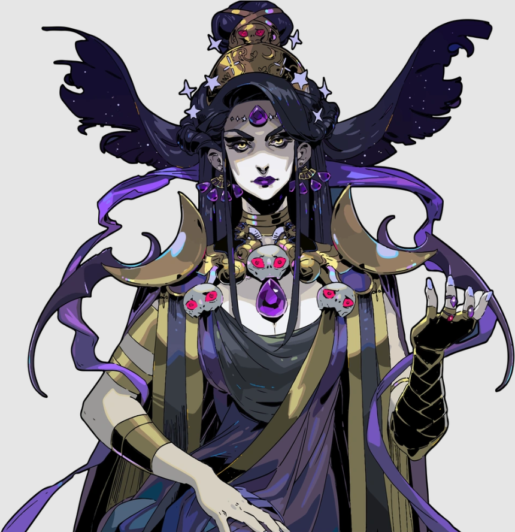{#fig_Nyx1}

Nyx是希腊神话里的夜之女神，但夜之女神这个称呼远远低估了她的地位。在通常人们熟悉的希腊神话体系里，宙斯是最高神。但有一段记载，宙斯在愤怒时想要惩罚睡神修普诺斯，却因为修普诺斯躲进了Nyx的怀抱而不得不放弃，因为宙斯畏惧Nyx。一个让最高神都要退让的存在，不是普通的神明。在俄耳甫斯教的宇宙论里，Nyx的地位更加根本。俄耳甫斯教的创世顺序里，Nyx是接近宇宙起点的原初存在之一，比奥林匹斯诸神古老得多。她是夜、是混沌边缘、是一切尚未成形之前的状态。

把这个放进诺亚的框架里，则Liberator对应的是俄耳甫斯教的灵魂解脱叙事，它是传统里关于灵魂如何挣脱轮回的那一层。Nyx Pieta对应的是俄耳甫斯教宇宙论里更古老、更根本的层级。不是解脱的方法，而是解脱之前必须面对的东西，即原初的黑暗，失去，和承载失去的能力。

Pieta：怀抱失去的人

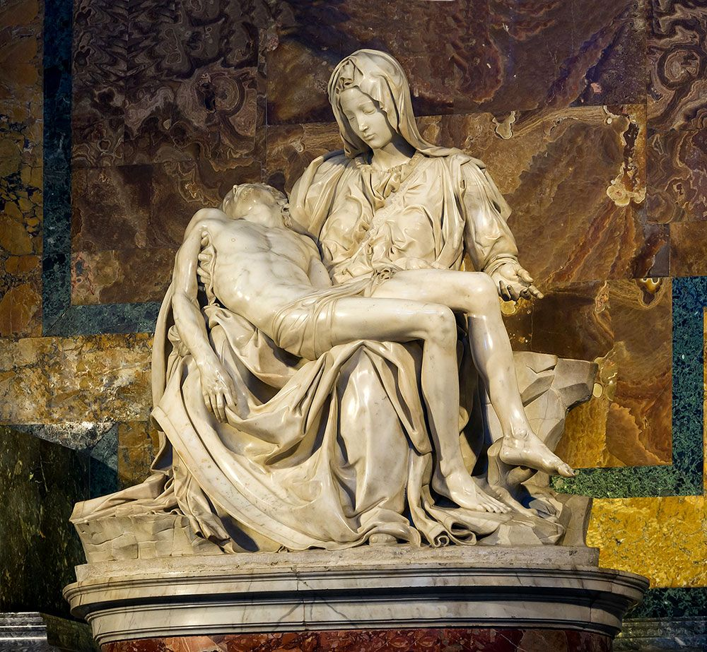{#fig_pieta}

Pieta是意大利语，意思是怜悯或哀悼。这个词在艺术史上有一个极其具体的所指，即圣母玛利亚抱着死去的耶稣的形象，最著名的是米开朗基罗的那座雕塑。

这个意象的核心情感结构是一个人失去了至亲，没有愤怒，没有抗拒，只有悲悯地承载着这个失去，继续存在。Nyx Pieta路线的叙事和这个结构完全吻合。无论重复多少次，诺亚都无法拯救所有人。经历了无数次失败之后，他放弃了继续回到过去，而是去往过去见了哥哥哈尔克一面——那个一直把痛苦藏在心里、只向他展示爱的哥哥。在那一刻，Noah决定以哈尔克的方式活下去，继续哥哥的意志。

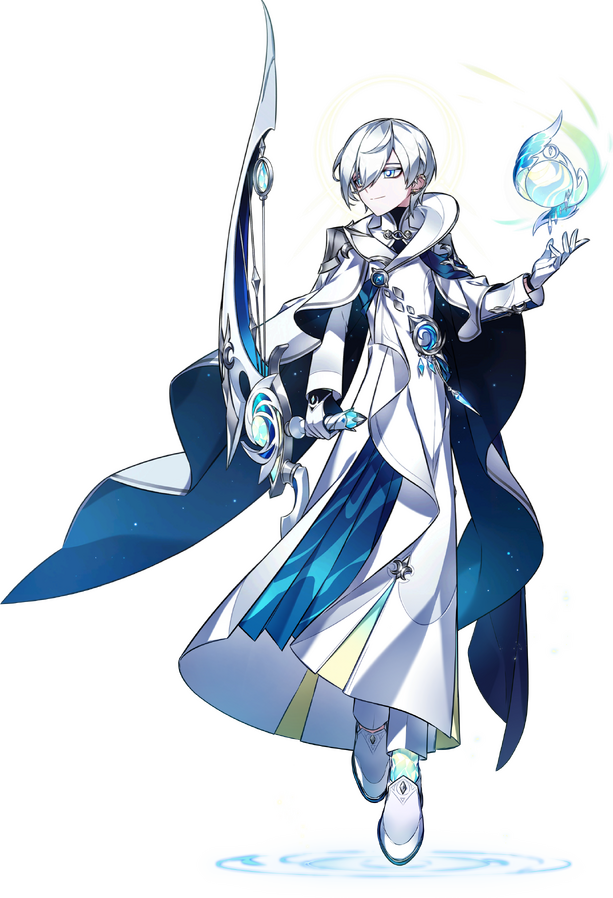{#fig_NP}

这不是Liberator那种找到自己的意志的解放，而是完全不同的情感逻辑。他不再试图改变什么，不再抗拒失去，而是把失去的人抱在心里，带着他们继续走。这就是Pieta。圣母没有试图让耶稣复活，没有愤怒，没有否认死亡的发生。她只是抱着他，悲悯而平静。诺亚在Nyx Pieta路线里做的是同一件事，接受哈尔克已经不在了，然后成为哈尔克希望他成为的那个人。

### 3. Noah自己的故事

把Liberator和Nyx Pieta放在一起看，有一个很清晰的共同点。这两条路线的叙事重心，始终落在诺亚身上。Liberator讲的是诺亚从复仇执念里解放自己，找到属于自己的意志。Nyx Pieta讲的是诺亚学会承载失去，选择活成哥哥希望他成为的样子。两条路线里出现的重要关系，一个是诺亚和自己，一个是诺亚和哈尔克。克拉摩尔在这两条路线里当然存在，他是诺亚的武器，是陪伴者，是某种意义上的向导，但他不是叙事的核心。这两条路线结束之后，玩家记住的是诺亚的选择，克拉摩尔稍居其后。

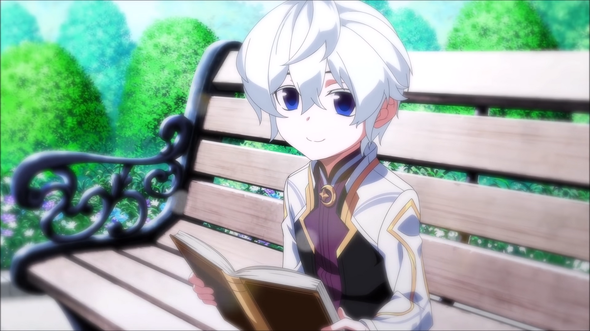{#fig_noahpast}

神话框架上这也是符合的。Liberator对应俄耳甫斯教的灵魂解脱叙事，Nyx Pieta对应俄耳甫斯教宇宙论里的原初之夜加上天主教的哀悼美学。两者同属希腊神秘宗教传统，处理的都是灵魂如何面对失去和轮回这个核心命题。两个分支在游戏机制层面的设计也有这层含义在。物理攻击意味着什么？是身体的力量，是具象的、直接作用于现实的行动。俄耳甫斯教关心的核心问题是灵魂在物质世界里的处境——被困在肉体里，在轮回里反复经历具象的死亡与重生。Liberator的解放是行动层面的选择，Nyx Pieta的哀悼是身体层面的承载。两条路线处理的都是灵魂和物质世界之间最直接的那层关系，用物理攻击来体现，在逻辑上是自洽的。这两条路线拼在一起，构成了一个完整的诺亚：一个从轮回里解放自己的人，一个学会承载失去继续走下去的人。

如果诺亚的故事只有这两条路线，它是一个完整的、自洽的叙事。但诺亚有四条路线，不是两条。当把目光转向另外俩职业分支，也就是Celestia和Morpheus的时候，我和朋友发现了一些用诺亚的故事不能解释的地方。

## Morpheus的梦境与炼金术
如果说前两条职业路线的神话参考都在希腊神话和俄耳甫斯教的范畴里，Morpheus是一个让人意外的转向。

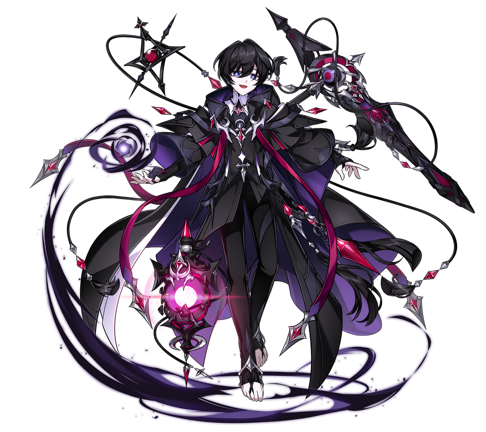{#fig_MO}

Morpheus是希腊神话里的梦神，Nyx的儿子。这个命名本身还在希腊神话的谱系里。但打开技能列表，希腊神话的语言就消失了。技能名是不详之梦、坠落、阴霾等抽象意象，反复出现的美术元素是画框、迷雾、钟摆。很神奇吧，制作组连线索关键词都不给，还真是符合这一分支里诺亚给玩家的印象——我的梦境才是真实，你的客观是无法解析的。既然如此，我想这个分支很难有一个确切的答案，只能是根据现有符号推出一个可能的结果。

在此之前，先看看故事里诺亚遭遇了什么，让孩子变得如此意识流。诺亚在这一分支里的状态，从一开始就不稳定。陌生的魔法、改变太多的环境、熟悉又奇异的似曾相识感……这些积累成一条持续的焦虑底线。诺亚的疑问在于他是否走在正确的路上以及是否需要走下去。

这种持续不安累积后，想要寻找答案的诺亚却迎来了致命一击。诺亚进入了克拉摩尔在七塔过去的记忆，见到对方的情况后试图在已经固定的过去救出克拉摩尔。他知道过去是无法改变的，但他停不下来。在无数次尝试之后，诺亚崩溃了。他对着记忆里克拉摩尔把所有的一切都说了出来。自己是谁，经历了什么，有多疲惫，有多绝望。克拉摩尔听完，意识到诺亚说的都是真的，也意识到自己只是一段过去，明天就会消亡。即便如此，他做了一个选择：

>不需要感到愧疚。别太担心。无论是什么，最终都会好的。如果你必须离开，就把噩梦留在这里吧……
>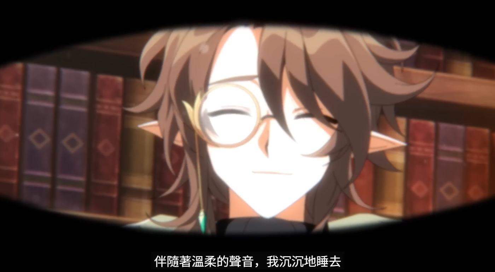{#fig_MOCla}

诺亚在呢喃般的话语里沉沉睡去。再次睁开眼睛的时候，他觉得自己焕然一新——克拉摩尔和哈尔克的记忆，已经在睡眠中悄悄重合了。这个崩溃的结构比“逃避现实”要精确得多，也沉重得多。诺亚不是单纯被失败压垮的，他是在穷尽了所有努力、被什么都改变不了击中之后，由另一个人善意送进了梦里。这个过程里他没有愤怒，没有放弃，没有停下来。他的意识在触底一刻自动做了一件事：重建了一个他能活下去的现实，把无法承受的真相替换成了一个温暖的版本。克拉摩尔对这件事的判断也不是“他在逃避”，而是“记忆的扭曲是他站起来的救生索”。这不是道德评价，是对一种心理机制的观察。无意识在极限状态下自动重构现实，以保护一个已经无法承受更多重量的自我。

这个状态需要一套更精确的语言来描述，而那套语言是荣格的。卡尔·荣格是二十世纪初的瑞士心理学家，他做的事情简单说是这样的：把人类古老的神话、炼金术、梦境符号，重新翻译成现代心理学的语言。在他的体系里，梦不是随机的噪音，而是无意识在说话；神话里反复出现的意象不是巧合，是人类共有的心理结构的投影。他把这套体系叫做分析心理学。

Morpheus分支的设计，参考的正是这套体系。

### 画框：真实与认知的界限
之前发的贴有提到，贯穿于Morpheus技能始终的意象是框（虽然我仍未理解为什么立绘缺少这类元素）。从一转的自画像，到二转的黑门乃至寂静之塔，再到三转的大师技和梦想家之夜……框是占据了技能绝大部分美术意象的。

{#fig_MOskill}

在荣格心理学中，圣域原指神庙周围被划定的神圣区域。荣格用它来描述一个受保护的心理空间。当一个人面对无法承受巨大的创伤或人格解体等潜意识冲击时，他必须划定一个边界。在这个边界内，混乱的潜意识被“框”住，从而变得可以处理，不至于让主体瞬间崩溃。

Morpheus的故事里，诺亚的那些“框”就是他的圣域。现实的真相是具有腐蚀性的酸液，如果没有这些框划定范围，诺亚的自我会瞬间消融。每一个技能里的框，都是他在崩塌的现实中强行圈出的安全区。这个框不只是护盾，也是诺亚在崩溃边缘唯一还能进行某种自我整合尝试的地方，只是这个整合是扭曲的。

拉康有个核心概念叫做凝视。Morpheus的框可能参考了这方面的理念，但我个人不太接受后现代的东西（荣格已经是我的极限了.jpg），就不展开了。感兴趣的玩家可以去了解一下自行判断吧。

### 钟摆：时间的困境，和荣格的阴影
钟摆是计时工具，在Morpheus路线里它的意象不是时间流逝，而更接近时间的停滞和循环。诺亚来回摆动，永远回到原点。

诺亚在这一分支里的状态，是荣格意义上的阴影整合失败的具象化。荣格认为，每个人的心理结构里都有一个阴影，即那些被自我压抑、否认、不愿面对的部分。健康的心理过程需要主动去面对和承认这个阴影，不是消灭它，而是把它纳入自我的一部分，这个过程叫做整合。整合失败不是因为懦弱，而是因为有些阴影太重，自我没有足够的支撑去承接它。阴影不消失，它以扭曲的形式从别处涌出来。诺亚压抑的是对哥哥死亡的真实创伤、对自己无力的愤怒、对无尽轮回失败的绝望。这些被压抑的东西没有被整合，于是以梦境的形式爆发出来。

钟摆在这里是那个阴影的计时器。每一次摆动都在提醒他时间在流逝，但他仍然困在同一个地方。

### 飞鸟与梦蛇：红书和黑书
这是这一分支里隐蔽但也精确的一个对应。Morpheus的技能里有飞鸟和梦蛇的意象。

{#fig_bird}

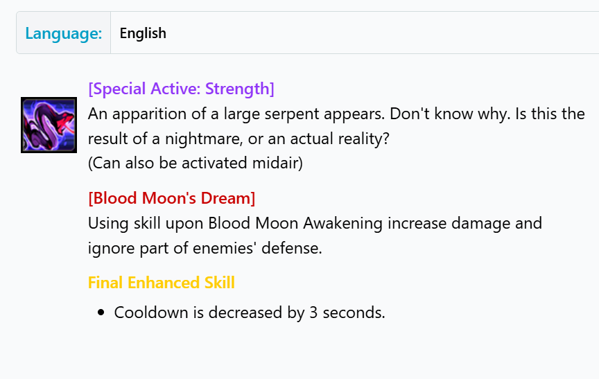{#fig_serpent}

要理解这两个意象，需要先说一下荣格的《红书》和《黑书》。这两本书不是学术著作，而是荣格自己的梦境与幻象记录。他在某段精神极度动荡的时期，坚持把自己与无意识的对话写下来，《黑书》是荣格记录自己与无意识对话的原始日记，《红书》是后来以此为基础整理加工的抄本。在《黑书》的原始记录里，荣格解释了为什么鸟与蛇反复出现在这些幻象中：

>“我将上和下绑在一起，我将神和动物绑在一起，我身上一部分是动物，另一部分是神，第三部分是人。蛇在下，人在中，神在上。蛇之外是菲勒斯，接着是地球，然后是月亮，最后是冰冷的外在空间。”

>“如果我没有通过结合上下结合自己，我会分裂成三个部分：蛇——自我以这个或其他动物的形式漫无目的地行走，魔鬼般地生活在自然中，激发恐惧和渴望；人类的灵魂——永远活在你里面；天空的灵魂——与诸神居住在一起，远离你，你对其一无所知，以鸟的形式出现。三个部分相互独立。”

是不是很谜语人？但放进诺亚的处境里，这段话的意思就清晰了。蛇代表的是把人拖向最深处的那个力量，本能、创伤、无法控制的冲动。鸟代表的是驱使人逃离地面、飞向某个遥远理想的那个力量。而荣格说，真正健康的状态是中间那个人把两者绑在一起，让上和下同时存在，不逃跑也不沉溺。

诺亚在Morpheus路线里恰好失去了这个中间。创伤和绝望把他往下拽，活下去的本能又逼着他往另一个方向逃，而能够整合这两端的那个自我，已经在无数次失败和那句"什么都改变不了"之后碎掉了。所以他没有沉沦，也没有真正逃脱，只是在蛇和鸟同时失控的状态里，让记忆自动填补了那个空缺。

### 于是荣格说

感觉这部分很玄学？是吧，没有什么科学的味，满满的梦日记风格。玩家扒来扒去也没有确定的答案，只能说是一种解读的方向。

不过这里有必要提一下为什么如此玄学。其实这是荣格的心理学和炼金术挂钩导致的，荣格他自己写道，他的分析心理学本质上是在做一件事，把古代神秘学传统的语言翻译成现代心理学的语言（这就是为啥前面出现了圣域）。他的两本核心著作，《心理学与炼金术》和《Aion》，一本系统分析炼金术符号和心理原型的对应，一本处理诺斯替主义的基督原型。炼金术的将物质转化为黄金，在荣格那里变成了将无意识整合进自我。诺斯替的通过认识真相获得救赎，在荣格那里变成了个体化过程。

荣格是翻译者，不是原作者。那么原文的炼金术是什么？

带着这个问题，我回头看了Celestia和他的技能列表。

## 从Celestia到克拉摩尔的实验室

我比较喜欢这个分支所以多写了一点（很对我审美）。有推测的内容，不过并没有否定实装版本的含义，如果看了觉得有问题，那都是李东信的错.jpg

### 赫尔墨斯的现代天文回响

.png){#fig_SC}

原文就在这里————没错，是Celestia的设计参考元素。在此之前，我们先看看Celestia参考的神话原型。
Liberator对应时间之神柯罗诺斯，Nyx Pieta对应原初之夜女神Nyx，Morpheus直接用了梦神的名字。三个分支，三个希腊神话神明原型，按照这个规律，CEL应该也是希腊神话原型。那Celestia的原型是谁？

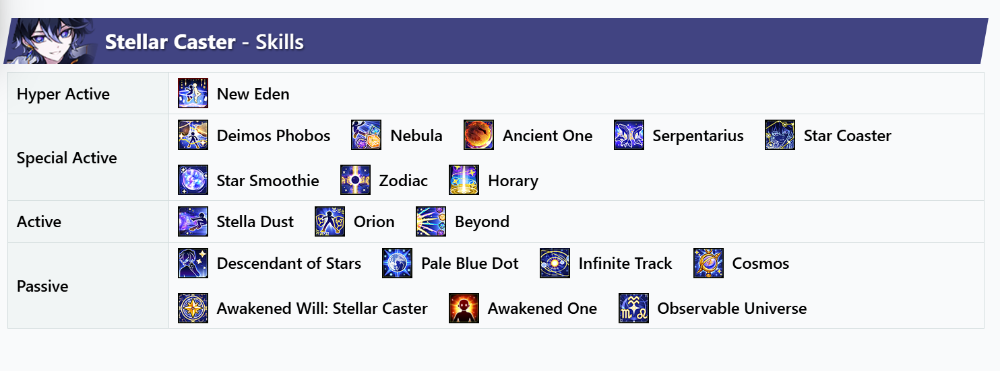{#fig_CElskill1}

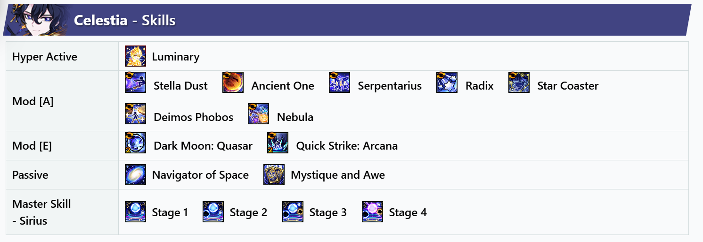{#fig_CELskill2}

打开技能列表，答案就在里面。星座、行星运行、天体魔法、塔罗牌，以及大师技语音之一"托勒密的红星，天狼星"——这套符号体系指向的，是希腊-埃及占星传统的守护神赫耳墨斯，以及他的埃及对应体托特。

赫耳墨斯在希腊神话里的身份很多。诸神的使者、旅人的守护者、引导灵魂进入冥界的心灵向导（psychopomp）、知识和魔法的守护神。他的埃及对应体托特则是天文历法之神、书记之神、一切知识的守护者。两者在希腊化时代融合，成为Hermes Trismegistus——三倍伟大的赫耳墨斯。

性格上，赫耳墨斯是奥林匹斯诸神里最不严肃的那一个。出生第一天就去偷阿波罗的牛，然后用竖琴把这件事圆过去。他机智、轻盈、爱开玩笑。对比诺亚四条路线：Liberator在执念里挣扎，Nyx Pieta在悲悼里承载，Morpheus在崩溃边缘游走——唯独Celestia的诺亚是开朗幽默的，甚至有点调皮。这个性格落差不像是叙事需要的偶然，更像是原型带来的底色。

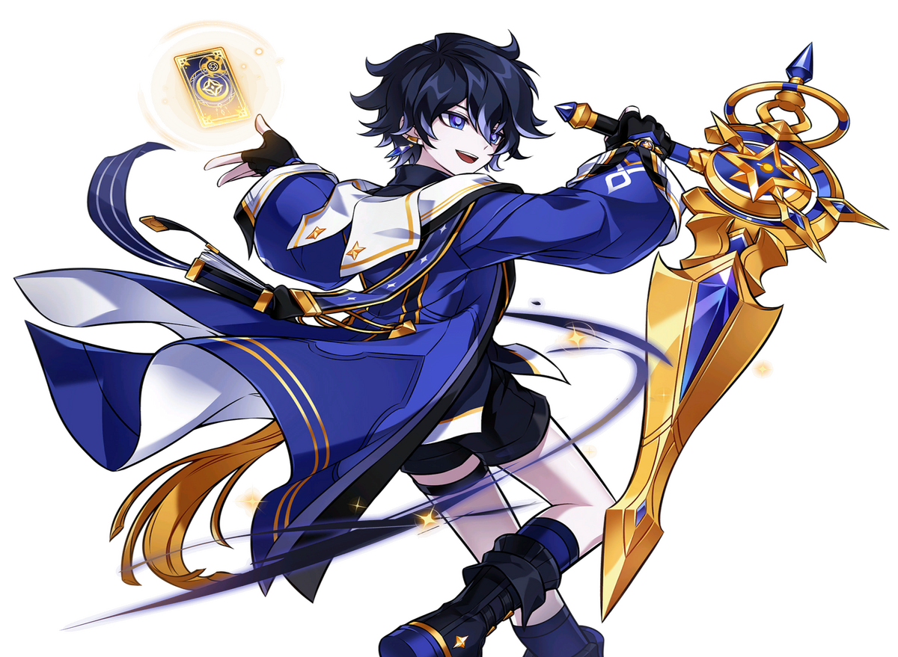{#fig_SC}

三倍伟大这个称号的具体含义，《翠玉录》里有明确记载："具足三部世界叡智者——通晓炼金术、占星术、神働术三大睿智。"，也就是三重知识，三个领域。把Celestia对进去，占星术在这条路线里是最显性的，技能体系从星座到行星运行，大师技直接喊托勒密的名字——这个后面会细说。

神働术（Theurgy）是通过仪式性操作与神圣力量建立联系，从而实现灵魂层面的转化。Celestia的结局是诺亚用魔法把封存在镰刀里的克拉摩尔解放成精灵，将一个被困在物质器皿里的灵魂引导到自由，这件事的结构和Theurgy的核心操作几乎是同一件事。

炼金术呢？缺席了。但回头看Morpheus，荣格把炼金术翻译成了现代心理学语言，炼金师转化金属的过程，在他那里变成了人将无意识整合进自我的内在转化。Morpheus整条路线讲的正是内在崩溃和重构，用的是炼金术的心理学版本。

也就是说，Trismegistus的三重知识被拆开分配给了两条路线。向外的占星和神働给了Celestia，向内的炼金给了Morpheus。单独看Celestia会觉得少了一块，两条路线放在一起才是完整的Trismegistus。

有一个角色把三重全捏在一起的案例，就是知名中二大作Dies Irae里的Mercurius，他的设定里占星术、炼金术、神働术一个不少，角色定位直接就是Hermes Trismegistos的化身。KOG选择了不同的处理方式，把一个完整的神话原型拆成两半，内向的给Morpheus，外向的给Celestia。

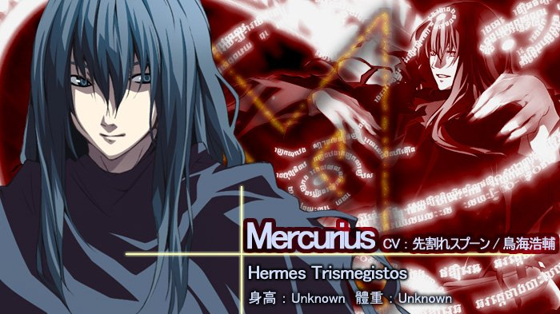{#fig_MER}

光这么概括可能没什么可信度，让我们看看KOG是怎么在Celestia的技能里落实这个参考的。我们可以先关注一下Celestia的Circulation系统解锁顺序：Horoscope→Pale Blue Dot→Infinite Track→Navigator of Space。

颇为有趣的地方在于，最初吸引我在wiki关注诺亚的就是Celestia。他的Circulation系统中，技能意象是神秘学塔罗中的水瓶、天蝎、狮子、双子，但四张牌的命名风格截然不同：

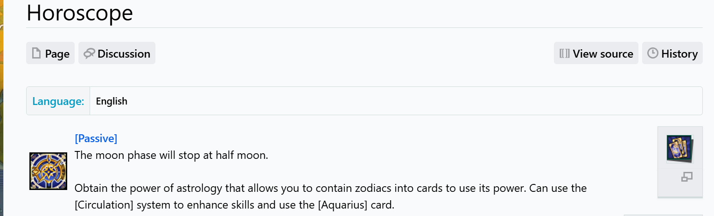{#fig_Horo}

水瓶是Horoscope。最传统的占星术语，星象图，是整个系统的基础和入口。

{#fig_PBD}

天蝎是Pale Blue Dot。卡尔.萨根 1990年用来描述旅行者1号拍下的地球照片的语言，是关于人类在宇宙中渺小位置的现代沉思。我们抽其中最经典的一段来看看，或许就可以明白为什么诺亚在这个分支上放弃“哥哥去哪”了。

>在浩瀚的宇宙剧场里，地球只是一个极小的舞台。想想所有那些帝王将相杀戮得血流成河，他们的辉煌与胜利，曾让他们成为光点上一个部分的转眼即逝的主宰；想想栖身于这个点上的某个角落的居民，对别的角落几乎没有区别的居民所犯的无穷无尽的残暴罪行，他们的误解何其多也，他们多么急于互相残杀，他们的仇恨何其强烈。我们的心情，我们的妄自尊大，我们在宇宙中拥有某种特权地位的错觉，都受到这个苍白光点的挑战。在庞大的包容一切的暗黑宇宙中，我们的行星是一个孤独的斑点。由于我们的低微地位和广阔无垠的空间，我们无从知晓，在这广袤宇宙中是否会有来自别处的帮助把我们从自己手中拯救。

{#fig_IF}

狮子是Infinite Track。天体运行轨道，介于传统占星和现代天文学之间。

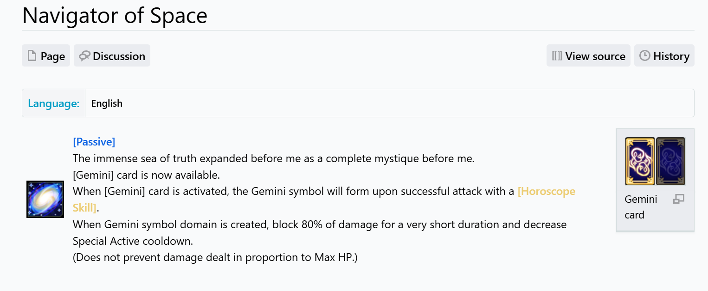{#fig_NOS}

双子是Navigator of Space。太空导航者，航天时代的语言。由赫耳墨斯本人守护的星座，负责在这套系统里扮演导航者的角色。

这个命名体系不是古典和现代的随机混搭。卡尔.萨根写Pale Blue Dot时的情感结构：对宇宙的敬畏，对人类渺小位置的沉思（CEL还真有个被动叫神秘与敬畏）……这些和赫耳墨斯主义“如其在上，如其在下”的命题，在本质上是同一件事，只是相距两千年的两种语言表达。Celestia的设计者选择同时用两种语言说话，这种方式本身即赫耳墨斯主义原则设计层面实践。

四张牌对应的星座也很有意思。水瓶、天蝎、狮子、双子在传统占星里分别对应：

| 星座 | 元素 | 守护星 |
|:------|:------|:------------|
| 水瓶 | 风 | 土星/天王星 |
| 天蝎 | 水 | 火星/冥王星 |
| 狮子 | 火 | 太阳 |
| 双子 | 风 | 水星 |

守护星里有水星。水星在希腊神话里是赫耳墨斯，赫耳墨斯主义的名字直接来源于此。双子座由赫耳墨斯本人守护。Celestia二转时有一个技能叫Serpentarius，这是蛇夫座（Ophiuchus）的拉丁文名字，就是那个经常被称为第十三星座、游离在黄道十二宫之外的星座。在赫耳墨斯传统里，蛇是核心符号之一，赫耳墨斯的权杖上缠着两条蛇，炼金术里蛇吞尾象征循环和永恒。选Serpentarius而不是黄道十二宫里的任何一个星座作为单独技能，这个选择其实比较刻意。

这里有个有意思的地方，这四个星座涵盖了风、水、火三个元素，唯独缺少土。在赫耳墨斯传统里，"土"代表最沉重的物质层面，是灵魂下降的终点。Celestia路线的Noah正在做的事是脱离时间轮回，超越物质束缚。缺土可能不是巧合，而是在设计层面暗示了这个分支的方向，诺亚在离开物质层面——被克拉摩尔拉去学魔法，成为魔法攻击角色了。

最为直接表明KOG设计时参考赫尔墨斯的，便是Celestia的大师技。

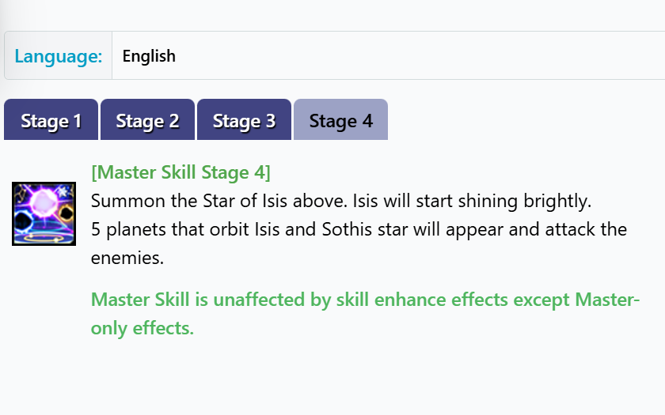{#fig_Isis}

大师技名称Sirius在古埃及叫做Sothis，是天狼星，对应女神Isis。Isis在赫耳墨斯传统里是核心神明之一。《赫耳墨斯文集》里有专门的Isis神论述，她代表智慧、魔法和宇宙的隐秘知识。

Elwiki里面，技能描述是这样的：

"Five planets orbit around Isis and Sothis appears to attack the enemies"

天狼星的埃及名Isis和另一个名字Sothis同时出现在同一个技能里。这是在引用埃及-希腊化天文传统里最重要的那颗星，用它的双重身份——天文学名称Sirius或Sothis和宗教身份Isis。这个双重引用，正好是赫耳墨斯主义"如其在上，如其在下"原则的完美具象化，天上的星体（Sothis）和神明（Isis）是同一件事的两个层面。

Elwiki的花絮部分提及了这个技能的语音彩蛋：

>When casting the skill, one of Noah's voice lines can be "프톨레마이오스 루그룬스텔라 케니큘라", which transliterates to "Ptolemaeus, rubrum stella, Canicula". Ptolemaeus is the Latin name of Ptolemy, an astronomer from Egypt (a Roman province at that time) who mapped several stars, including Sirius. "Rubrum stella" is Latin for "red star" and refers to Sirius' reddish color as described by Ptolemy. "Canicula", Latin for "little dog", was the name Romans gave to Sirius. It relates to their belief that the period following Sirius' reappearance from behind the Sun every summer, known as the "dog days", made dogs contract rabies and other diseases due to the excessive heat.

>* In conclusion, Noah's line can be translated as "Ptolemy's red star, Sirius".

也就是说Celestia放大师技时会喊一句“托勒密的红星，天狼星”。不知道有没有玩家好奇过托勒密是谁。他是公元2世纪的希腊裔天文学家，生活在埃及亚历山大城。他写了《天文学大成》，系统整理了古典天文学和占星知识，是古代星图学的奠基人之一。

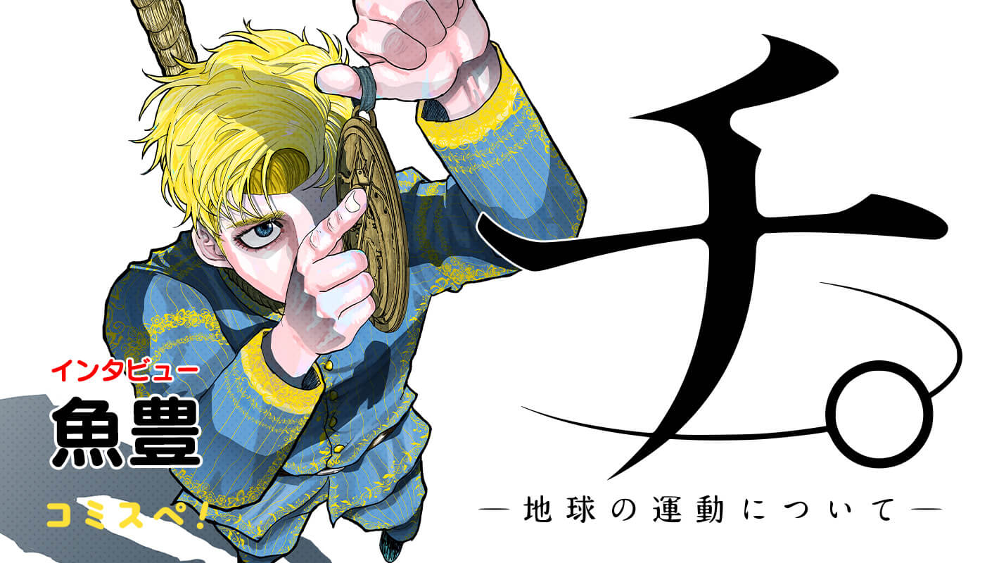{#fig_earth}

关键不只是他的身份，而是他的地理位置。亚历山大城，公元前后，是整个赫耳墨斯主义诞生的地方。《赫耳墨斯文集》就是在这个时代、这个城市的希腊化埃及文化土壤里形成的。托勒密和赫耳墨斯主义的奠基文本，是字面意义上的同时代、同城市的产物。

Celestia喊托勒密的名字打出大师技……这是在召唤赫耳墨斯主义的发源地和发源时代的代表性人物呢。

到这里我们会发现Celestia的技能设计同时做到了两件事。一方面是指向赫耳墨斯（托勒密、亚历山大城、Sirius或Isis）；另一方面用古典语言和现代语言同时表达同一个命题（占星术语和Pale Blue Dot）。天文科学和神话意象同时共存，这也是我很喜欢这个分支的原因。说起来看Elwiki英翻版，CEL的Old Man技能描述还玩了星战的梗（In a galaxy far, far away...）。科幻语言里混入了流行文化的彩蛋，而且选的是一个关于遥远宇宙里史诗的引用。设计者在赫耳墨斯、现代宇宙学、和流行文化之间游走，但它们指向的情感核心是同一个，就是人类凝视遥远星空时那种渺小与崇高并存的感受。哇，很浪漫啊，克拉摩尔教得真好哈哈哈。

### Celestia叙事重心的偏移
让我们总结一下目前的发现，就是诺亚实装出来的四个职业分支的设计框架。现在可以把整个框架画出来了。Noah的四条职业路线，表面上是同一个角色的四种可能性，不过我们把它们的神话参考和攻击类型同时摆出来，会看到一个非常工整的分野：

::: {.callout-important}
## 物理攻击：肉身与解脱
- **Liberator** $\rightarrow$ 对应**俄耳甫斯教**：主张灵魂的净化与解脱，将物理打击升华为一种神圣的释放。
- **Nyx Pieta** $\rightarrow$ **原初之夜**与**哀悼**：融合了希腊神话的原始力量与基督教的受难美学，象征着在黑暗中承载苦难。
:::

::: {.callout-tip}
## 魔法攻击：心智与秘传
- **Morpheus** $\rightarrow$ **荣格视角**：通过梦境符号连接集体无意识，是古代赫耳墨斯主义在现代心理学中的镜像。
- **Celestia** $\rightarrow$ **古典赫耳墨斯主义**：直接溯源至“如其在上，如其在下”的古典逻辑，象征着对宇宙秩序的掌控。
:::

到这里，我以为找到了解释Celestia的钥匙。这也是我没看主线故事前，觉得Celestia设计最为明显，也没什么问题的原因之一。但我看完诺亚的主线故事后，发现了一个问题。从设计来讲，至少分类要对应叙事重心。物理攻击两大分支，俄耳甫斯教的语言，Noah自己的故事。魔法攻击两大分支，赫耳墨斯-诺斯替传统以及那突如其来的科幻语言又是谁的故事呢？

仔细一想，会发现Celestia和Morpheus这两大分支的重心悄悄偏移到了另一个角色身上，而那个角色就在Noah的镰刀里。

来，我们把四条路线的叙事重心单独列出来：

Liberator的结局是诺亚从复仇执念里解放自己，找到属于自己的意志。记住的是诺亚的选择。

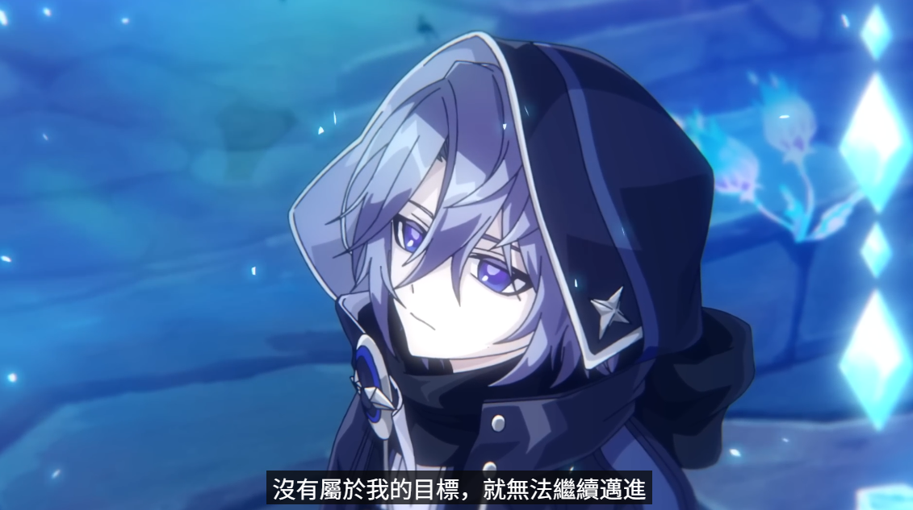{#fig_Lipath}

Nyx Pieta的结局是诺亚继承哥哥的意志，学会承载失去继续走下去。记住的是诺亚和哈尔克的羁绊。

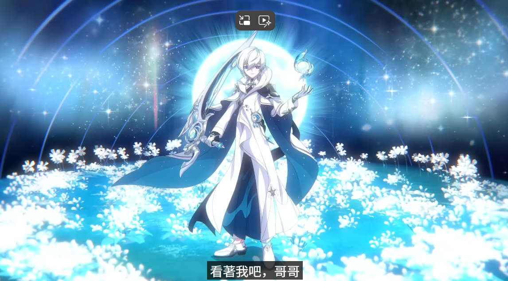{#fig_NPpath}

Morpheus的结局是克拉摩尔看着诺亚活在扭曲的幻觉里，选择不告诉他真相，因为他认为强迫诺亚面对真相会造成更大的伤害。记住的是克拉摩尔的决定。这一分支极其重要的转折点也是克拉摩尔引起的（自此孩子天天做梦）。

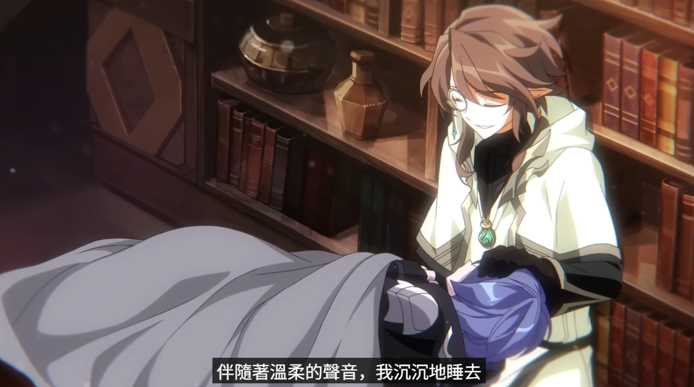{#fig_MOpath}

Celestia的结局是诺亚在七塔研究，最终成功把克拉摩尔的灵魂从镰刀里解放出来，给他造了一个可以自由移动的存在形式。记住的是诺亚和克拉摩尔的羁绊。

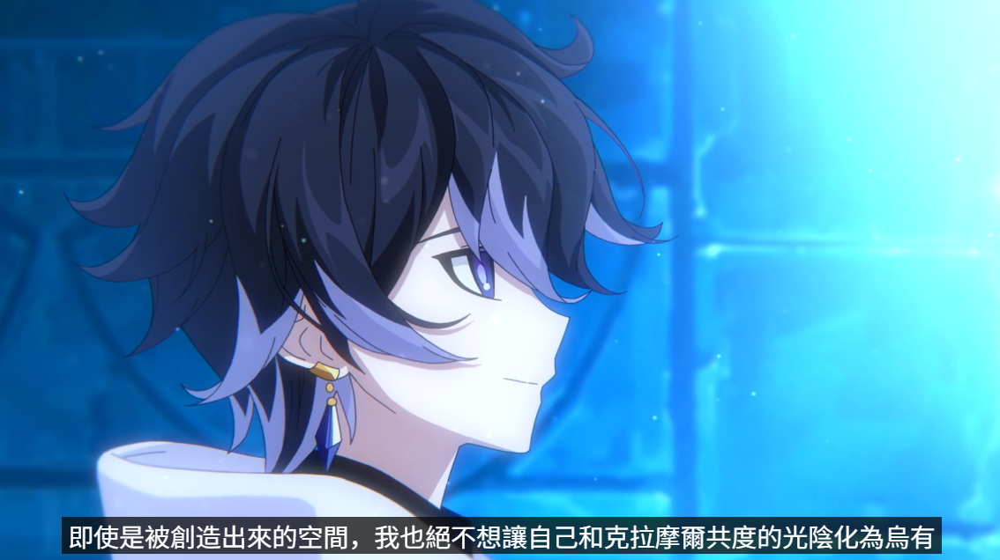{#fig_CELpath}

这个对比非常清晰。物攻两条路线，叙事核心是诺亚。克拉摩尔在场，但他是诺亚成长的陪伴者。魔攻两条路线，叙事核心是克拉摩尔。Noah在行动，但他的行动是为了克拉摩尔，或者被克拉摩尔观察和判断的。

### Celestia技能与主题的错位

（以下内容属于推断，如果认为推断很扯那是正常的，仅作为假药使用）

既然叙事核心换了，Celestia学克拉摩尔的魔法也很正常嘛。诺亚是伊贝伦家族的成员，月神候选人的弟弟，月亮是他最基础的身份标签，可他自己都表态“我要去过自己的大好新生了”，那Celestia没有月亮元素也可以接受。我最初看wiki是这么想的，毕竟那时还不清楚克拉摩尔的研究方向，但看完主线故事后有个问题出现了。从主线故事我们可以知道，克拉摩尔是研究人工元素精灵的。这个方向用克拉摩尔自己的话来讲，就是就是用技术手段人工创造具有魔力的存在。类比现实里面的研究方向可能是现在热门的人工智能。

我们再看看Celestia的魔法是什么样的。星座、行星、天体运行、塔罗牌……元素精灵呢？哦克拉摩尔自己是啊。不对吧，为啥Celestia分支只有一个元素精灵啊，不应该人工元素精灵满屏飞吗。而且克拉摩尔什么时候会的占星啊，主线里他不就造了个意识转移的机器吗，难不成他在只有Celestia知道的世界告诉了诺亚宇宙的奥秘？天哪太过分了，都不告诉玩家！

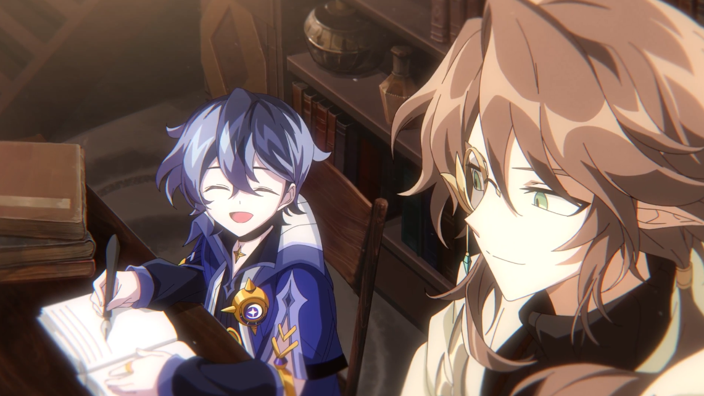{#fig_Memory}

这就是问题。Celestia的技能元素本应关联诺亚的主题元素，结果没有；应该关联克拉摩尔的研究领域，同样没有。有的只是不知道属于谁的星座和行星。这个双重脱节本身就是一个异常，单独一个脱节可以解释，也许月亮主题在这条路线里被刻意淡化，也许克拉摩尔的授课内容跨越了他的研究领域。这些解释都勉强说得通。两个脱节同时发生则指向同一个方向，这套技能体系和诺亚以及克拉摩尔没有直接的关联。它是一套完整的、内部自洽的赫耳墨斯主义体系，完美地反映在Celestia的设计理念上，甚至间接体现在Morpheus的设计上，但它和两位角色的具体故事层有断层。怎么回事，KOG不至于整这种活吧？

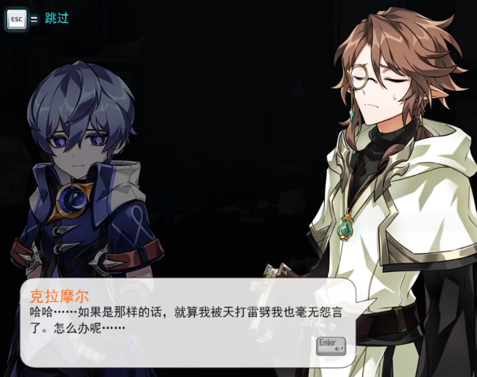{#clamor_story3}

前面提到，赫尔墨斯主义的三支柱之二为占星术和炼金术。为了解决这个问题，我们得回头看看赫耳墨斯主义里关于炼金术的核心命题。
炼金术的终极目标不是把铅变成黄金，那是字面意义上的表述。它真正研究的是如何在物质层面创造出完美的灵魂存在。是不是有点眼熟？好，我们再把它放到赫耳墨斯主义的语境里，这个命题极端版本就会变成人工创造一个有灵魂的存在。

……这好像和主线故事里克拉摩尔研究人工元素精灵，用技术手段创造具有魔力的生命是同一问题啊。那么从可能的设计参考来看，这套赫耳墨斯主义的知识体系不是和克拉摩尔没有关系，只是关系不是“他教了诺亚占星”，而是这套体系可能是他自己的。占星是他理解灵魂来源的工具，炼金是他创造生命的实践，塔罗是他解读宇宙规律的语言。这套知识体系在他身上是完整的，是一个研究者积累的知识结构。

这么推测似乎很合理，可耐人寻味的地方在于主线故事没有克拉摩尔研究占星术的表现，诺亚和玩家只能看到他研究人工元素精灵的过去，而且主线故事没有点明克拉摩尔的人工元素精灵方向同炼金术相关。这时有一个可能性开始变得难以回避。当然还不是很清晰，我们先慢慢往下推。

### Celestia：一个过于对称的故事

Celestia这个职业分支的结局是Noah在七塔学习魔法，最终成功地把克拉摩尔的灵魂从镰刀里解放出来，转化为精灵形态，让他能够自由移动。诺亚因此成为了Celestia，星座的观测者，脱离了时间的轮回。

非常温暖的故事，学生帮老师找回了自由。那我们仔细看看这个故事的结构，克拉摩尔当初造了一台能提取和转移灵魂的机器，失去了自己的肉体，被困进了镰刀。诺亚在Celestia分支里多待了七塔几年，给克拉摩尔造了一个新的存在形式，让他重获自由。

这个对称性太完整了。一个角色给了另一个角色可能的生活方式，然后失去了自己的存在形式；另一个人花了整条职业分支的时间，把那个存在形式还回去。如果这是两个普通人之间的故事，这个对称性是动人的巧合。如果克拉摩尔不只是Noah的搭档，是某种意义上给了Noah存在本身的人（好像放这个分支也能这么说）……那这个对称就不是巧合，而是一个被完整构思过的主题：

>造物主给了被造物肉体，被造物用一条职业分支的时间，把肉体还给了造物主。

之所以把这个诺斯替主题提出来，一方面是因为诺斯替主义有一个核心意象：造物主创造了物质世界和肉体，将灵魂困在其中；被造物通过认识真相最终得以解脱，回归本源。克拉摩尔的故事在结构上和这个意象高度吻合。他创造了一台能够提取和转移灵魂的机器，然后失去了自己的肉体，意识被封进了镰刀。他是造物主，也是第一个承受造物代价的人。而Celestia路线里诺亚做的事，是用一整条职业分支的时间，把那个被剥夺的存在形式还回去。诺斯替传统里，被造物认识真相、回归本源的那一刻，造物主的使命也随之完成。这个对称不是情感层面的巧合，而是在用诺斯替的叙事逻辑讲一个关于创造与偿还的完整故事。

另一方面是因为它所属的诺斯替主义并非孤立存在。如果我们追溯这种思想的源头，会发现它与前面所讲的赫耳墨斯主义在历史的某个坐标上达成了共振。这个坐标就是Celestia大师技语音里的托勒密所在的亚历山大城。那时的亚历山大城是地中海世界的智力熔炉。古埃及关于灵魂与星象的原始魔力，在这里与希腊的理性哲学迎面撞击。这种碰撞产生了一个奇妙的现象，理智开始试图通过观测宇宙来拯救灵魂。托勒密在亚历山大城观测星空时，他身后的城市街道上可能正走着一群讨论如何通过赫耳墨斯的秘法解脱灵魂的信徒。有意思的是，被认为是早期诺斯替主义的重要文献库《拿戈玛第经集》里面竟然混入了一篇《赫耳墨斯文集》的抄本。或许在那个时代的人们眼中，赫尔墨斯主义和诺斯替主义两者是可以互通的。

即便抛开假设，现存实装的故事结构问题在于，它叙事上完整得过头了。一个职业分支的核心结局，是为另一个角色写的完整故事收尾。这在游戏设计里是很反常的。职业路线通常是可操控角色自己的成长故事，而不是为NPC服务的。

除非，这一分支最初的构思并非是以诺亚为起点，而是以克拉摩尔作为核心出发的。

### 克拉摩尔的设定

克拉摩尔的故事在诺亚主线故事里占比并不高，但我们能感受到他背后有一套完整且没有展开的设定。七塔的学术生态、精灵族离开后半精灵的处境、被歧视但靠自己成为七塔学者的过程、发明技术的初衷是帮助弱势群体、被教团利用后的道德挣扎、意识到漏洞后独自挣扎想补救……这些设定每部分单独拿出来都能写一个故事的章节，在实装版本里被极致压缩了。

如果诺亚故事一开始是主轴的话，我个人认为克拉摩尔只需要是有趣且目的相同的武器伙伴，背景服务于这点即可。给他一个被教团迫害的经历足以推动剧情，真的需要七塔体系、半精灵身份、学术歧视、发明伦理这些如此具体的设定吗……？

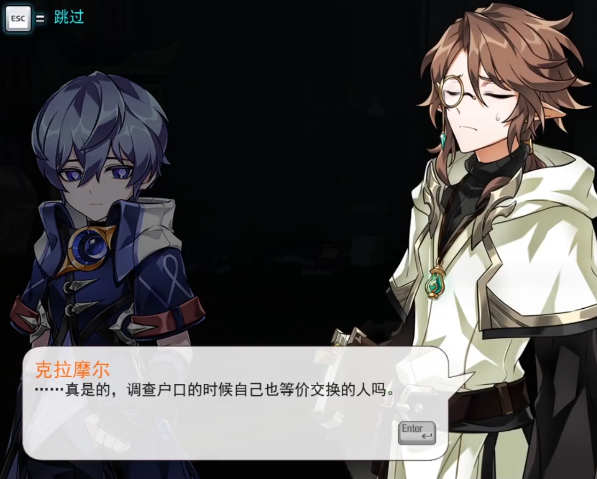{#fig_Clamorstory1}

恰恰是过度设计暴露了问题。诺亚的故事讲述的是复仇、轮回、记忆被改、放下。这个框架情感浓度高，叙事是内向且个人的。克拉摩尔的故事本质上是外向的，主题是技术伦理、机构腐败、时代更迭。这套背景的复杂程度更像是为支撑一个以克拉摩尔为主视角的叙事而存在的。

## 克拉摩尔的资源配置

到目前为止，所有的推断都建立在叙事分析和神话框架对应上。不过有几个细节单独拿出来就已经很有意思了。

### Celestia战斗系统的脱轨
诺亚的战斗系统是月相系统。随着战斗推进，月相在新月、半月、满月之间循环，不同月相触发不同效果，Morpheus的话是加了血月，这是几乎贯穿他所有路线的基础机制。唯独在Celestia路线里，月相系统不循环停在了半月。Circulation卡牌系统作为全新的机制层叠加进来，通过抽取不同的塔罗牌切换状态实现增益。可是这套卡牌系统和月相系统在逻辑上没有任何关联。

为了让两套没有关联的系统共存，月相必须被锁死，否则它们会互相干扰。这意味着在开发层面，有人专门花了精力把原本流动的月相系统强制停住，然后在上面接了一套全新的机制。职业路线通常是在基础系统上做延伸，不是把基础系统锁死之后架上一套完全外来的东西。多开发一套独立系统本来就会增加成本，再加上要专门写代码锁住原有系统才能兼容。

这个代价需要一个很充分的理由。最符合成本的解释是这套卡牌系统原来不是为这个月相系统设计的。它原来属于一个没有月相系统的角色，被移植过来的时候，只能用锁死月相的方式强行让两套系统共存。

### 诺亚的初始待机地点

某人的实验室是诺亚的初始区域，也是他整个游戏流程里前期主要据点。Elwiki对这个地方有一个花絮记录：

>"Someone's Lab is not a physical location Noah ever actually travels to, instead, it appears to be a figment of Clamor's mind, being a recreation of his study in Seven Tower."

>"这不是诺亚真实到达过的任何物理地点，它似乎是克拉摩尔精神世界的一部分，是克拉摩尔对自己在七塔研究室的重建。"

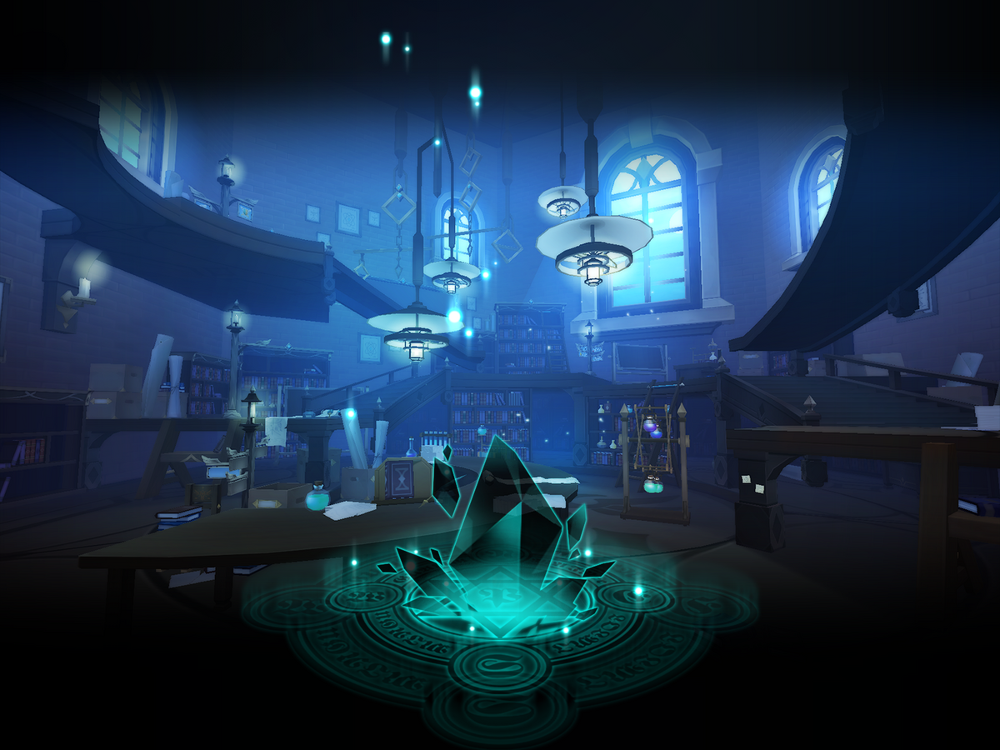{#fig_Lab}

诺亚的初始区域是克拉摩尔用意识重建的自己的实验室。这个设定在情感层面是动人的。一个被封进武器里的学者，用意识为他唯一能陪伴的人重建了一个家。从设计角度看，这个设定信息量就比较大了。这个空间在叙事上属于克拉摩尔，诺亚从游戏一开始就生活在另一个角色的空间里，这似乎有点不对劲，毕竟诺亚故事一开始还没去实验室呢。

我们也可以看看某人的实验室场景建模里面透露了哪些信息。场景的视觉设计有圆形大厅、中央悬挂的碟形装置、满架的书籍等元素，更像一个天文学家或神秘学学者的工作室，而不是普通的实验室。桌子上的烧瓶、蓝色液体、实验架，这些是炼金实验室的标准配置。一个研究人工精灵的学者，实验室里有炼金器具，暗示他的知识体系比人工精灵研究者这个头衔要宽。

### 克拉摩尔的独立建模
如果玩了游戏，我们会知道诺亚主线七塔的关卡里面，克拉摩尔会出现在过场——不是2d立绘，是3d建模。这个建模解包后会发现并非npc的建模，而是可以作为操控角色精细程度的建模，令人疑惑的是这个建模却未在战斗中以独立单位出现。游戏开发里，战斗建模是有独立成本的资产。众所周知KOG抠门，ldx不会糊涂到为纯粹NPC建一套完整战斗模型然后不用它。

把这三个细节放在一起：一是诺亚的初始待机地点是克拉摩尔的实验室。二是克拉摩尔有战斗建模但没有战斗流程。三是Celestia换上了一套和诺亚没有直接联系的机制。每一个单独看都可以找到解释，但当它们同时出现则指向同一个方向。这些更像是为另一个角色设计的东西。如果克拉摩尔最初设定只是NPC武器，这些违和是不会存在的。

至此，那个让我和朋友都意想不到的结论得出来了：制作组在开发过程中，很可能以克拉摩尔为核心设计和制作过一套框架。这套框架有一定的完成度，但因为某些原因没有实装（是你的错吗ldx）。制作组也许不忍心完全舍弃这套框架，就做了一个巧妙决定。他们将其保留一部分，融合在设计诺亚伊贝伦的过程中，就此我们看到了实装版诺亚和克拉摩尔的故事。

## 原案与实装版的对照

如果以上推测的部分成立，最有意思的问题来了：**原案和实装版之间是什么关系？**

这个问题，如果让我来给一个答案的话，或许得回头看看俄尔甫斯教和赫尔墨斯-诺斯替主义的关系。这两套传统表面上是不同时代、不同地域的产物，俄耳甫斯教发源于公元前6世纪的希腊，赫尔墨斯主义和诺斯替主义是公元1-3世纪亚历山大城的产物，时间差了将近一千年。如果顺着思想史往下捋，会发现它们并非平行的两套体系，更像是同一条脉络在不同时代的表达。俄耳甫斯教“灵魂因古老的罪被困在物质轮回里，需要通过积累知识主动挣脱”的核心命题经由毕达哥拉斯主义和柏拉图哲学的中介传递下去，在亚历山大城与埃及本土宗教和犹太神秘主义交汇之后，分叉出了赫尔墨斯主义和诺斯替主义。处理的仍然是同一个命题：物质是囚禁，认识是出路。

这个关系放回诺亚和克拉摩尔的设计框架里，会产生一个有意思的对应。如果诺亚参考的是俄耳甫斯教，克拉摩尔参考的是赫尔墨斯-诺斯替传统，那这两个角色并非站在两套平行神秘学体系的各自一端，而是站在同一条思想脉络的不同位置。一个在源头，一个在下游，相距约千年，但讨论的是同一件事。当然，这只是一种可能的读法，KOG是否有意识地选择了这两个节点，目前没有办法确认。但如果成立，原案和实装版之间的关系可以用同样的逻辑来理解：形式变了，脉络还在。

制作组有没有给出过答案呢？虽然没有考古过游戏本体外的内容，但我个人认为KOG制作组的答案藏在主线故事里了，而且藏得非常精妙和隐蔽。

克拉摩尔在主线故事里经历了什么？他发明了一台机器，这台机器被人拿去引发了灾难。他试图叫停，失败了。最终，他失去了肉体，意识被封进了一把镰刀，从一个独立存在的学者变成了武器。

我们再对照克拉摩尔作为游戏角色的遭遇。他原本可能是独立的可操控角色，有自己的职业路线和知识体系。然后在某个开发节点，他的制作被停止了——从一个独立存在的角色，变成了停滞的设定案。

叙事里发生的事，和开发里发生的事，用的是同一个结构。这可能是巧合，一个角色的故事设定和他自己的开发命运之间产生了意外的呼应，这种事不是没有先例。

但如果不是巧合，如果有人在知道克拉摩尔的设计被否定后，把这个"失去肉体、意识封入武器、以另一种形式延续"的设定写进了他的故事，或者在确认独立设计无法进行之后，选择用这种方式处理他的设定内容……那这是极度克制、也极度精确的创作行为：用角色的命运来叙述角色的命运，让故事本身成为对这件事的注解。

克拉摩尔的肉体消失了，但他的知识体系留下来了，他的故事结局留下来了，他的知识传统用两种语言各说了一遍，即古典的赫耳墨斯主义语言和荣格的现代翻译版。

用诺斯替的语言说，便是肉体消失，但灵魂以另一种形式延续。

用赫耳墨斯的语言说，即为如其在上，如其在下。原案的结构和原案本身处理的主题是同构的。

用克拉摩尔自己的故事说，他失去了肉体但没有消失。他只是换了一种形式继续存在，等待某一天被人从那把镰刀里认出来。

对于克拉摩尔来讲，那个人是诺亚；对于设计者来讲，那个人便是玩家了。

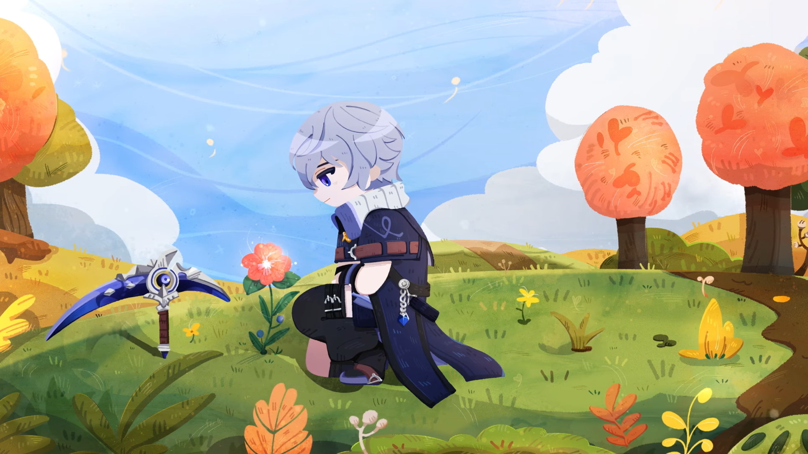

---

*本文为个人考据与推理，所有推测性内容均基于可观察的游戏设计事实，但不代表实际开发情况。*
