# 0. 两个老登怎么变成现在这样了？

原神我在稻妻便早早退坑，但是大约半个月之前，视频平台给我推送了这个：

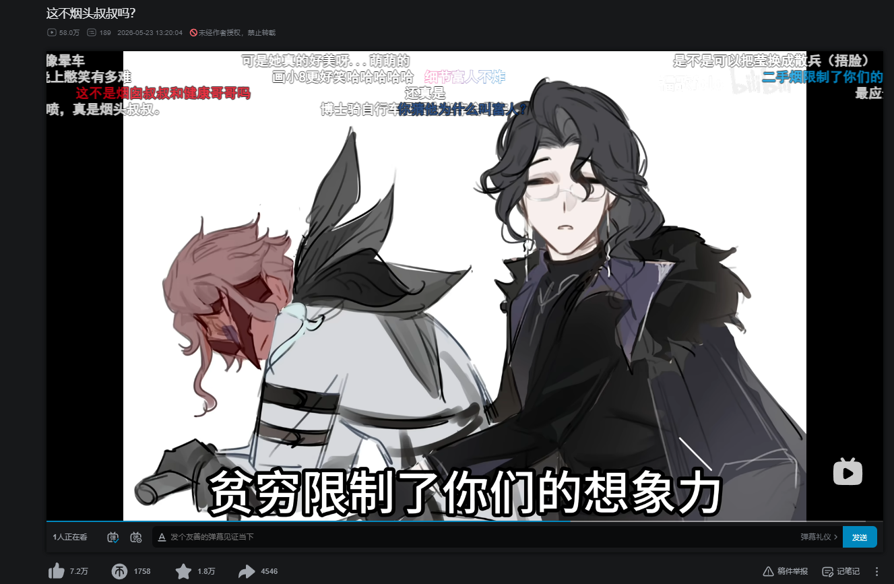

缘分所致，我看完这视频突然想起，这戴面具骑自行车的角色曾在自己订阅的某科研频道里出现过。频道主是天文博士在读，她为了引入自己vibe coding的一个管理项目，说“博士把自己不同年龄段切片用于观察，以此为灵感，我制作了这个用于Obsidian的时间管理插件”。兴许是因为这种一面之缘，我在灵魂被吸入后去了解了一下这俩角色，补了一点有关游戏录屏，因此看到了更多搞笑视频，导致这俩角色成了我这段时间的低消耗娱乐——我一看他俩同框就想笑，在我眼中他俩活脱脱喜剧演员。

除了补录屏和看整蛊内容之外，我也稍微做了一点符合兴趣的事，那就是想一想这俩角色的由来，以及是如何变成他们现在的样子的。

然后我发现了一个很妙的地方，这俩真是喜剧演员啊。

如果只看原神如今的潘塔罗涅与多托雷，很难第一时间想到，这两个人最初都不是为“危险的金融资本家”和“疯狂科学家”准备的角色。他们的名字来自意大利即兴喜剧 **Commedia dell’arte**。在那里，Pantalone 与 Il Dottore 都属于所谓的 **vecchi**——占据财富、知识与家长权威位置的老一辈角色。他们可能是朋友、邻居、盟友，也可能彼此拆台；具体关系随剧目变化，但在许多故事里，他们处于相似的位置。握着钱、知识或家长权力，给年轻人的愿望制造麻烦，最后再被更机灵的角色绕过去。

换句话说，如果把几百年前的舞台关系压缩得粗暴一点，大概就是：

**一个有钱老头，加上一个话很多的知识分子老头。**

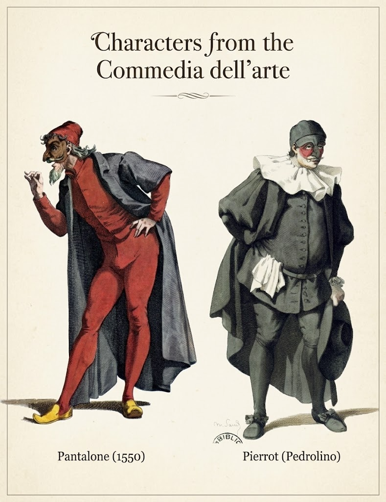{#fig:2 width="100%"}

到了原神，这两种角色却发生了一次相当彻底的现代化。Pantalone 不再是守着钱袋、担心别人花掉自己财产的滑稽商人，而成为了北国银行背后的金融权力者。他所控制的不再只是“多少钱”，而是货币、资源配置以及金钱能够建立怎样的社会秩序。Il Dottore 的改造更加极端。传统舞台上的 Dottore 最重要的笑点之一，在于他总表现得无所不知，却经常只是在用拉丁文、术语和长篇大论包装空洞的知识。原神却把这件事彻底反了过来。这个 Dottore 真的拥有足以威胁现有秩序的知识。他进行人体实验、研究坎瑞亚技术、制造不同年龄的切片，试图突破衰老、死亡乃至灵魂本身的限制。传统喜剧里对知识权威的嘲讽，被重新写成了知识真正获得力量之后的危险。

于是原先作为喜剧类型存在的两种社会角色，也发生了另一层变化：

**商人的钱变成了资本，学者的知识变成了技术。**

{#fig:3 width="100%"}

而这两种力量一旦被认真化，它们几乎天然会重新坐到同一张桌子旁。潘塔罗涅需要博士的技术突破人类寿命；博士需要潘塔罗涅能够提供的金钱、组织资源与实验条件。最近剧情进一步展示出的数百年医疗与实验档案，则把这种互惠关系一路延伸到了私人生活。伤病、药物试验、器官移植、戒不掉的烟、找不到的眼镜，甚至被床脚绊倒这种本没有任何记录必要的小事，都逐渐进入同一份档案。

于是一个很奇怪的问题出现了：

**当利益交换持续四百年之后，它还只是利益交换吗？**

这也是我最初想看看这两个角色的原因。原神当然没有简单地把 Commedia dell’arte 的 Pantalone 与 Il Dottore 搬进提瓦特，它做的更像是一连串翻译。把早期现代欧洲舞台上的商人和学究，翻译成现代观众熟悉的金融资本家与科学家；再通过服装、面具、发型、身体设计，将两个滑稽的 vecchi 翻译成可以进入商业二次元游戏的角色；最后，又通过中、日、韩、英四套配音，让同一个人物获得略微不同的气质与解释。

有些东西在这个过程中几乎完全消失了，有些东西却顽固地留了下来。

几百年前，Pantalone 与 Dottore 可以作为两个老头站在同一个舞台上，一个代表金钱与现实利益，一个代表知识与学术权威。

几百年后的《原神》里，他们仍然坐在一起。

只不过这一次，**资本给科学批经费，科学给资本续命。**

这篇记录想讨论的，就是这张桌子究竟是怎么一路从意大利喜剧的舞台，搬到至冬去的。

# 1. Commedia dell’arte 里的 Pantalone 与 Il Dottore

## 1.1 Pantalone

*钱、现实主义与老商人*

如果暂时忘掉原神里的潘塔罗涅，传统 **Pantalone** 的第一印象其实和现在差得相当远。

在 Commedia dell’arte 的角色体系中，Pantalone 属于 **vecchi**，也就是占据家长、主人与社会权威位置的“老一辈”角色。他最稳定的身份是一名**威尼斯商人**。有钱、吝啬、精于盘算，同时非常在意自己对财产和家庭事务的控制。大都会艺术博物馆对他的概括相当直接——一个吝啬的威尼斯人；在很多剧目里，他又经常作为年轻恋人的父亲或监护人出现，试图通过婚姻、金钱和家长权力干涉年轻人的选择。

因此，Pantalone 的“爱钱”不能完全理解成现代作品里常见的角色有一个贪财萌点。钱本身就是他在戏剧结构里的力量来源。他之所以能够阻止婚姻、安排家庭成员、命令仆人，并不断插手别人的生活，首先是因为他掌握财产，同时占据家庭与社会秩序中较高的位置。Pantalone 所代表的并不只是一个喜欢数金币的人，而是一个非常具体的早期现代城市人物：**拥有财富，因此相信自己也理应拥有决定权的商人家长。** 这也是为什么相关角色史经常把他的贪婪与社会地位同时视为人物核心。

这一点也让他与之后要谈的 Il Dottore 形成了很有意思的区别。Dottore 喜欢诉诸学问、语言与知识权威；Pantalone 则更加现实。他真正关心的是钱有没有损失、婚事是否符合自己的利益、某件事情到底值不值得。即使两个人都属于 vecchi，Pantalone 的力量仍然明显来自**财产、经验和现实社会关系**，而不是知识本身。

传统造型也几乎把“威尼斯老商人”几个字直接穿在了身上。比较稳定的一套 Pantalone 服装包括**红色背心、紧身裤和长袜，外罩黑色长袍或外套**；脸上则戴着带有夸张钩鼻的深色面具。钱袋也长期是与他联系密切的道具之一。相比后世许多越来越复杂的舞台造型，这是一套识别度极高的类型化设计。红与黑的大色块、细瘦或不甚优雅的老年身体、夸张鼻部，以及直接提示财富的钱袋，共同告诉观众——“那个有钱的威尼斯老头来了”。

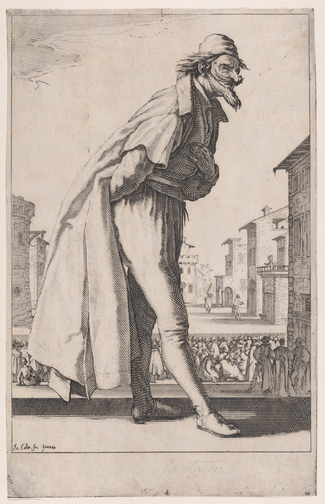{#fig:4 width="100%"}

他的另一个传统属性则更加符合早期喜剧的粗俗趣味，也就是**好色**。Pantalone 经常自认为仍然精力充沛，对年轻女性抱有不切实际的兴趣；传统服装甚至会通过夸张的胯部设计直接把这种欲望做成视觉笑料。结果通常不是成功的风流，而是一个明明已经衰老，却仍然确信财富和身份足以满足自己一切欲望的老头不断出丑。

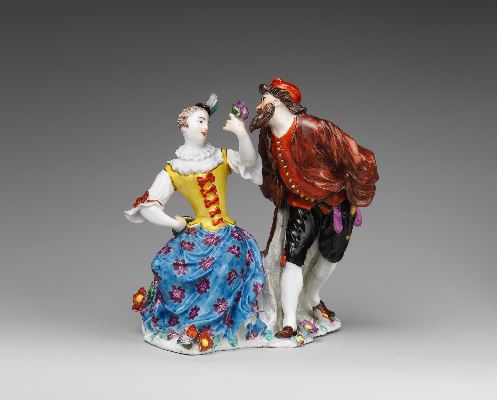{#fig:5 width="100%"}

因此，“老”在 Pantalone 身上也并不只是外貌设定。他的喜剧性很大一部分来自一种错位：

**他拥有足够多的钱与社会权力，因此总觉得世界应该按照自己的意愿运转；可他的身体、欲望和判断，却不断提醒观众这种控制并没有他想象得那么可靠。**

年轻恋人可以绕开他的安排，仆人可以骗走他的钱，他自以为精明，却也会因为贪婪、自负或欲望成为别人戏弄的对象。Pantalone 一方面是秩序的维护者，另一方面又天然是喜剧用来嘲弄这种秩序的人。

如果要把传统 Pantalone 压缩成几个关键词，那大概就是：

> **威尼斯、财富、家长权力、现实主义、贪欲，以及衰老。**

其中值得注意的，或许不是“他很有钱”，而是**金钱如何规定了他与整个舞台世界的关系**。

Pantalone 相信万事皆有价格，也习惯通过财产和身份介入他人的人生。于是，在传统 Commedia dell’arte 中，他几乎可以被看作一种非常直白的角色人格化。

**财富获得了一张老商人的脸。**

而原神后来对潘塔罗涅最重要的改造，恰恰不是把这张脸简单画年轻。设计师选择重新回答另一个问题：

**如果财富不再只是一个老商人腰间的钱袋，而成为能够真正组织社会的金融系统，这个 Pantalone 又应该长成什么样？**

## 1.2 Il Dottore

*知识权威与夸夸其谈的老学究*

与 Pantalone 相比，传统 **Il Dottore** 的权力来源是另一种东西：

**知识，以及“我比你更懂”的社会姿态。**

他同样属于 Commedia dell’arte 中的 **vecchi**。最典型的身份是一名来自博洛尼亚的博士或学者，经常与大学、医学、法律、哲学等知识职业联系在一起。这里的Dottore并不能简单翻译成现代意义上的医生；更准确地说，它首先指向一种受过高等教育、拥有专业头衔的知识阶层身份。

这一点和他的城市背景密切相关。博洛尼亚拥有欧洲历史最悠久的大学传统之一，因此，把一个爱炫耀学问的角色设置成“博洛尼亚博士”，本身就具有非常明确的社会讽刺意味。传统 Dottore 的服饰也会强化这一身份。黑色学者袍、帽子，以及覆盖额头、鼻梁附近的黑色半面具，都让他看起来像一个从大学讲堂里直接走上喜剧舞台的人。

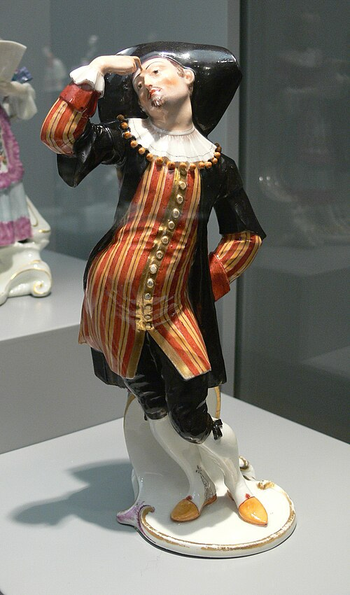{#fig:6 width="100%"}

但问题在于——**他身上的“知识”往往没有自己声称的那么可靠。**Il Dottore 最重要的喜剧特征之一就是**极其喜欢说话**。他可以长篇大论地引用拉丁文，堆叠医学、法律或哲学术语，给一个原本非常简单的问题套上复杂得近乎荒谬的理论；也会出现错误引用、混淆概念、强行推理，甚至句子听起来非常权威，仔细一想却根本不知道他在说什么的情况。

换句话说，他的表演重点不只是：

> “我知道很多东西。”

更多地：

> **“我要让所有人都知道，我知道很多东西。”**

知识因此既是一种内容，也是一种表演。Il Dottore 需要不断通过说话证明自己的身份，而他的喜剧性恰恰来自这种证明经常超过实际能力。越是试图表现得博学，越可能暴露出自己的虚荣、迂腐与荒唐。这也使他成为一种相当典型的**知识权威讽刺**。Pantalone 相信金钱和经验赋予自己决定权；Dottore 则相信学历、术语和专业知识足以让自己在任何问题上拥有发言权。他不一定真的什么都不会。相反，一个完全愚蠢的人反而无法承担这种角色。真正重要的是**他对自身知识范围缺乏边界感。**无论话题是什么，他都可以发表意见；无论别人有没有提问，他都可以开始解释；无论自己的论证究竟是否成立，他总能找到另一串术语继续说下去。

如果 Pantalone 的典型问题可以概括成：

> **“因为我有钱，所以事情应该按照我的办法来。”**

那么 Dottore 的问题就是：

> **“因为我是博士，所以我当然知道答案。”**

两个人由此形成了非常清楚的社会类型差异。Pantalone 的权威来自**现实世界中的财产与社会关系**；Dottore 的权威来自**知识制度赋予的身份与话语权**。前者握着钱袋；后者握着解释世界的资格。

---

传统 Dottore 的身体设计同样具有鲜明的喜剧性质。与如今商业游戏里常见的修长知识分子形象不同，他通常被塑造成一个**年长、体态厚重甚至肥胖的男性**。黑色学者袍会进一步增加身体体积，红润的面部、饮酒和饮食等属性，也让这个角色带有明显的肉体性。

这并不是无关紧要的外貌细节。一个满嘴讨论抽象哲学、医学和大学问的人，却同时拥有笨重、贪吃、喝酒、容易激动的身体，本身就是一种喜剧上的反差：

**他希望自己代表纯粹的理性与知识，可舞台不断提醒观众，他仍然只是一个有欲望、有虚荣、会出丑的普通老头。**

和 Pantalone 一样，“老”也是 Dottore 所属角色类型的重要部分。两个 vecchi 都试图凭借自己已经获得的社会资本——财富、年龄、知识、职位——规定年轻人的行动；可喜剧不断让他们失去控制。Pantalone 可以因为贪财而被骗；Dottore 则可以因为自负而被自己的语言绕进去。

---

如果把传统 Il Dottore 压缩成几个关键词，大概是：

> **博洛尼亚、大学、博士头衔、学术权威、术语、夸夸其谈、自负，以及衰老。**

其中真正重要的，也不是他的学者身份。

而是：

**知识如何变成了一种社会权力，以及这种权力为什么值得被嘲笑。**

从这个角度看，传统 Il Dottore 几乎可以被理解为：

**知识权威长出了一张滑稽老学究的脸。**

原神后来对“博士”最有意思的改造，也正发生在这里。它没有取消 Il Dottore 那种喜欢理论化、解释世界、跨领域发表判断的性格；反而把这些特征保留了下来，只是做了一个非常危险的反转：

**如果这个喜欢声称自己什么都懂的 Dottore，这一次真的什么都懂呢？**

如果他的术语不再是笑话，他的实验真的有效，他的理论真的能够制造生命、延缓衰老、改变身体，甚至触及死亡与灵魂本身——那么传统舞台上那个令人发笑的老学究，就会变成完全不同的东西。

这正是原神里的多托雷开始出现的地方。

## 1.3 两个 vecchi 为什么总在一起？

既然 Pantalone 代表财富与现实经验，Il Dottore 代表知识与学术权威，一个很自然的问题就是：

**他们在 Commedia dell’arte 里，本来就是一对关系很好的角色吗？**

答案有点微妙。如果把关系很好理解成现代角色作品里那种拥有固定共同经历、固定情感关系的两个人，那么并不是。Commedia dell’arte 本来就不是围绕一套稳定人物传记展开的戏剧。演员使用相对固定的角色类型，在不同的 **scenario / canovaccio** 中重新组合人物关系与事件；同一个 Dottore 在这一出戏里可以是 Pantalone 的朋友，换一出戏也完全可能变成他的对手。与其说 Pantalone 和 Dottore 有一条固定的官方关系线，不如说：

**他们长期占据着同一个戏剧生态位。**

大都会艺术博物馆在介绍 Commedia dell’arte 时，就直接把 Il Dottore 与 Pantalone 一同归入 **vecchi**。一个是来自博洛尼亚、喜欢错误引用拉丁文的富裕老博士，一个是吝啬的威尼斯商人。这一组角色在许多故事中的功能也相当接近。Commedia dell’arte 常见的一种结构，是年轻的 **innamorati** 想要结合，而掌握家庭权力、财富和社会身份的 vecchi 试图干涉他们；与此同时，仆人 **zanni** 又通过欺骗、误会和各种计谋绕过这些老人的安排。最终，年轻恋人得到想要的结局，而那些自以为掌握局势的老人则成为喜剧的对象。传统资料也常把 Pantalone 和 Dottore 描写为这一结构中彼此对应的两个旧秩序人物。

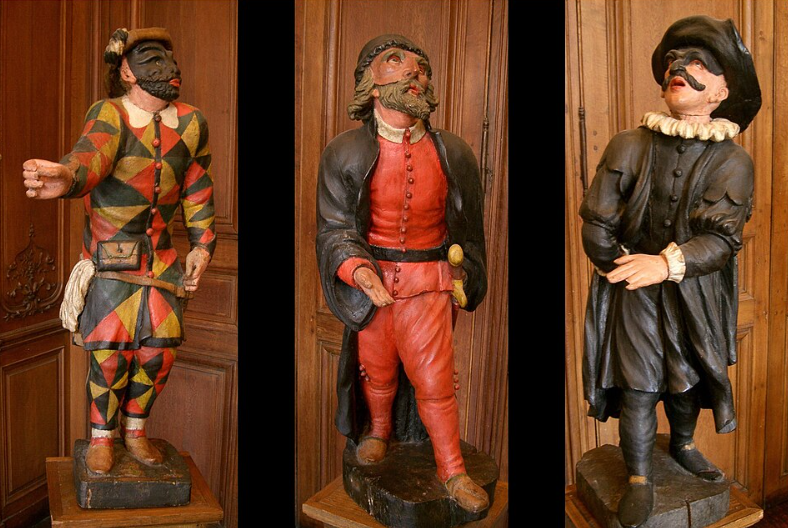{#fig:7 width="100%"}

如果按现在的说法那就是：

> **一个负责拿钱和家长权力挡路，一个负责拿学问和权威意见挡路。**

然后仆人负责想办法把这两个老头一起绕过去。

从这个角度看，“联手整蛊小年轻”这个说法居然不能算完全错误。只是很多时候故事的真正结果是：

**两个老登想给年轻人添麻烦，最后年轻人和仆人反过来把两个老登整了。**

当然，两人的具体关系可以相当灵活。有些角色资料会直接把 Dottore 描述成 Pantalone 的邻居，并指出他既可能是 Pantalone 忠实的朋友，也可能成为他的死对头。 这种看起来互相矛盾的描述，恰恰符合 Commedia dell’arte 的角色逻辑，因为这里真正稳定的是**他们特别适合被放在一起发生关系**。原因也很容易理解。Pantalone 与 Dottore 表面上都属于社会中的成功人士。一个有钱；一个有文化。一个依靠商业经验与财产取得话语权；一个依靠大学、专业头衔与知识取得话语权。他们都已经拥有普通年轻角色暂时没有的东西，因此能够理直气壮地告诉别人：

**事情应该怎么做。**

但两人的缺陷又恰好互补。Pantalone 非常现实，却会因为贪婪、欲望和控制欲失去判断；Dottore拥有知识阶层的姿态，却容易因为虚荣和夸夸其谈陷入荒谬。前者代表一个腐朽而富有的商人，后者代表一个腐朽而博学的知识分子。也正因为如此，有些后来的表演资料干脆把两人称作彼此的 **alter ego**——财富与学问两种社会权威，在同一张舞台上形成镜像。

这种组合并不意味着他们必须彼此欣赏。恰恰相反，他们可以因为自身利益发生冲突，也可以为了共同目的暂时站在一起；可以互相吹捧，也可以互相看不起。但无论关系如何变化，他们始终很容易理解对方为什么拥有权力。

**商人知道知识是一种身份资本，学者也知道钱是一种现实资本。**

让他们成为朋友很自然，让他们成为竞争者也很自然，让他们坐下来商量一件对年轻人非常不利的事情，同样非常自然。甚至历史作品里确实存在非常接近这种“两个老登已经自己把事情决定好了”的情节。1597 年的喜剧牧歌《L’Amfiparnaso》中，Pantalone 因为喜欢 Doctor Gratiano，直接决定把女儿 Isabella 嫁给他；问题当然在于 Isabella 爱的是另一个年轻人。于是，从 Pantalone 与 Dottore 的视角来看，两位老人已经愉快地谈妥了一件婚事；从年轻恋人的视角来看，则是两个 vecchi 又一次成为了必须绕开的麻烦。

这可能也是为什么当原神后来把博士与富人重新放在一起时，这个组合会显得异常顺手。倒不是因为几百年前的 Pantalone 与 Dottore 已经成了什么高山流水觅知音，整出一段等待现代作品继承的友情佳话。真正被继承下来的一种更底层的结构：

> **他们本来就是两种社会权力的化身。**

一个代表财富、现实利益与资源控制；一个代表知识、专业身份与解释世界的权力。

在 Commedia dell’arte 中，这两种权力都是可以被嘲笑的。商人再精明也可能被骗，博士再博学也可能满嘴胡话。年轻人与仆人最终能够绕过他们，也正因为这仍然是一个以拆穿权威为乐的喜剧世界。原神后来做的事情，则是把这个笑话认真了起来。如果 Pantalone 的财富不再只是腰间的钱袋，而是一整套金融体系；如果 Il Dottore 的知识也不再只是错误的拉丁文，而是真的能够改变人的肉体、寿命乃至死亡——那么这两个曾经一起被年轻人整蛊的 vecchi，再坐到同一张桌子旁时，事情就不会那么好笑了。

或者说，

**仍然很好笑，只是现在负责头疼的变成整个世界了。**

# 2.从喜剧类型到现代角色

*设计师到底改了什么？*

## 2.1 潘塔罗涅

*从有钱老头到金融资本*

如果说传统 Pantalone 最直观的识别方式是“那个有钱的威尼斯老头”，那么原神对潘塔罗涅最重要的改造，并不是简单地把这个老头画年轻、画漂亮。真正发生变化的是 **“有钱”这件事本身被重新定义了。**在 Commedia dell’arte 的舞台上，Pantalone 的财富主要还是一种私人财产。他有钱，因此能够安排婚姻、管理家庭、雇佣仆人，也能够因为害怕损失财产而做出各种滑稽的决定。钱袋几乎可以成为这种权力最直接的象征。财富被某个人占有，而这个人又试图用财富控制身边的小世界。到了原神，潘塔罗涅几乎不需要再随身挂一个钱袋，因为**北国银行本身就是那个被放大了的钱袋。**他所掌握的不再只是“我有多少钱”，而是货币怎样流动、资源怎样配置、价值怎样被衡量，以及一整套金融机制究竟可以让谁获得行动能力。传统 Pantalone 对财富的占有欲由此被抽象成一种规模更大的东西：

**对价值体系本身的兴趣。**

这也是为什么原神里潘塔罗涅虽然仍然保留“商人”这一身份，却很少给人一种单纯守财奴的感觉。一个传统 Pantalone 可能会因为花出去几枚金币而心痛；一个现代化后的潘塔罗涅更可能问：

> 这笔投入能获得什么？
> 某种技术值多少钱？
> 资源应该流向哪里？
> 什么样的交换才足以改变现有秩序？

于是，角色从拥有财富的人逐渐变成了**理解财富如何产生权力的人**。这是一种相当典型的现代化。早期现代城市社会里的富商，最容易被想象成一个拥有大量私人资产的人；现代观众对于资本力量的想象，则更容易落到银行、金融网络、投资、信用和资源配置上。原神并没有取消 Pantalone 与金钱的联系，而是把钱从一个角色手里的物品，扩大成了一个可以组织社会的系统。

{#fig:8 width="100%"}

也正因为如此，潘塔罗涅的危险性很少表现为直接的暴力。他不像某些执行官那样，需要首先让人看到武力。他的力量更接近：

**决定谁能够得到资源，以及某件事究竟有没有继续发生的条件。**

从这个角度看，北国银行并不只是给角色增加有钱人氛围的背景设定，而是传统 Pantalone 戏剧功能的一次非常自然的升级。钱袋变成银行。商人的私人财富变成金融体系。“我有钱所以决定家里的事情”，也变成了：

**“我控制资源，因此我能够影响更大的秩序。”**

---

这种升级也解释了另一个很明显的变化。

### 传统 Pantalone 的欲望被重新分配了

传统角色身上最突出的欲望通常非常肉体、非常具体。他吝啬，因此舍不得钱；他好色，因此会对年轻女性产生不合时宜的兴趣；他已经年老，却仍然希望金钱与身份能够满足自己的各种需要。这些特征非常适合 Commedia dell’arte 的身体喜剧。一个衰老的男人仍然欲望旺盛，于是不断因为自己的贪婪、自负和性欲出丑。

原神显然没有保留这整套东西。如果只是把一个“吝啬又好色的老商人”原封不动地美型化成青年男性，结果大概只会得到一个格外令人不适的有钱人。因此，新版潘塔罗涅保留下来的并非**欲望的对象**，而是**欲望本身的强度**。传统 Pantalone 想占有金钱。现代潘塔罗涅则更接近想理解、利用，甚至重构金钱能够建立的秩序。于是：

> 私人占有欲

> ↓

> 对资本与价值结构的控制欲

> 老年男性的肉体欲望

> ↓

> 对财富、权力与更大行动空间的持续追求

角色仍然是一个欲望非常强的人，只不过欲望从身体与家庭尺度，被提升到了制度尺度。这也是为什么现在的潘塔罗涅虽然看起来比传统原型克制许多，人物本身却没有因此变得清淡。

他的贪欲只是变得更加抽象了。

---

而视觉设计完成的，则是另一种翻译。

### 怎样把滑稽威尼斯商人做成新生二次元能够理解的金融权贵

最明显的一刀当然是**年龄**。传统 Pantalone 的老态是喜剧性的重要来源。弯曲的身体、衰老的脸、夸张的鼻子，以及仍然过度旺盛的欲望共同制造一种不协调。原神几乎把这些肉体符号全部拆掉了。潘塔罗涅拥有窄而精致的脸型、中长黑发、细框眼镜、珠宝和相当讲究的服装。他的身体不再承担“腐朽老人”这一笑料，反而首先承担一种：

**昂贵、体面、极度社会化。**

的感觉。

但有意思的是，“老”又没有彻底消失。随着后来的剧情展开，这个角色真正拥有的时间尺度远远超过普通人。只是原本直接写在皱纹和身体里的衰老，被转移成了**资历、寿命和共同历史**。

传统 Pantalone：

> 看起来就是一个活了很久的老人。

原神潘塔罗涅：

> 看起来仍然年轻，却真的活过了常人无法想象的时间。

所以可以说，角色的“老”从一种**身体特征**，逐渐转化成了一种**世界观属性**。这一点也让他能够既保留 vecchio 的时间重量，又符合商业角色设计对于外形的要求。

---

传统服饰的处理也类似。Pantalone 最经典的舞台造型通常拥有鲜明的红黑配色、黑色长袍和类型化面具。它们的首要目标是让远处的观众一眼认出角色。原神没有直接复刻这种舞台色彩，而是把它重新编码成更适合至冬与金融权贵身份的**黑、深紫、冷白、金属饰件与厚重材质。**它们仍然保留了一种明显的深色权威感，却不再像街头戏剧中的角色服装，而更接近一种经过幻想化处理的高级正装。大量毛料、珠宝、眼镜链和精细装饰共同制造出的，也不是“我有很多钱”的直白炫耀，更多地则类似于**我生活在一个不需要向你证明自己是否有钱的位置上。**

{#fig:9 width="100%"}

这种区别很重要。传统 Pantalone 的财富必须成为笑料，因此需要被观众不断看到；现代潘塔罗涅的财富则首先是一种权力，因此它最好显得理所当然。

---

他的眼镜也值得单独提一下。传统 Pantalone 的面具依靠深色眼部区域和夸张鼻部轮廓迅速完成角色识别，而部分历史图像中，Pantalone 本来也曾出现过眼镜。到了原神，夸张面具当然不适合直接保留，于是脸部最主要的视觉装置变成了一副非常精致的细框眼镜。如果只从设计功能上看，这可以被理解成一种相当自然的替代：

> 黑色面具
> ↓
> 眼部仍然存在明显的框架结构
> ↓
> 但从滑稽、夸张变成理性、精致与现代知识阶层气质

它同时还能承担银行家所需要的另一层编码：

**计算、阅读、判断、理性。**

于是一个原本让角色显得滑稽的脸部符号，在美型化之后反而成为了精于计算的证明。

至于模型里那束格外显眼的长侧发，则又提供了另一个值得观察的入口。有玩家将其与历史上的 **lovelock / cadenette** 联系起来——一种在主体发型之外特意保留较长发束，并可能使用丝带或珠宝装饰的欧洲男性发型传统。这个对应目前没有官方设计资料能够直接证实，因此更适合作为视觉来源的假说，而不是确定结论。但这种联想之所以会出现，本身已经说明了潘塔罗涅近期造型的一个特点：

**他的“欧洲感”没有依靠穿上一套可以明确命名的历史服装，主要是通过许多被二次元化的小型服饰语汇共同建立。**

长发、眼镜、镜链、珠宝、毛料、深色正装……它们并不严格属于同一个历史年代，却共同组成了现代玩家能够迅速识别的“旧大陆金融贵族”想象。这也解释了为什么最初概念 PV 与近期 PV 给人的感觉会略有不同。早期版本首先需要完成的是：

> “这是愚人众里的富人。”

因此大毛领、黑衣、闭眼笑与整体厚重轮廓已经足够。而当角色真正需要进入近距离剧情表演以后，发丝、眼镜、面部比例与饰品细节被进一步展开。潘塔罗涅也从一个能够在群像中迅速识别的**角色剪影**，逐渐变成一个能够承担大量近景表演的**具体人物**。

---

所以，把传统 Pantalone 与原神潘塔罗涅摆在一起，变化其实可以概括成一条很清楚的路径：

> **威尼斯商人**
>
> ↓
>
> **拥有大量私人财富的老家长**
>
> ↓
>
> **财富与现实权力的角色类型**
>
> ↓
>
> **金融体系、资源配置与制度权力的人格化**

外貌上的年轻化、美型化和贵族化当然存在，但那只是最表面的一层。真正重要的是：

**原神把 Pantalone 从“守着财富的人”，改造成了“操纵财富如何运作的人”。**

于是传统舞台上的钱袋没有真的消失，它只是被放大了。一直放大到最后，变成了一家银行，乃至一整套能够影响世界运行方式的金融系统。

## 2.2 博士

*从假学究到真正危险的知识权力*

如果说原神对Pantalone的改造，是把“有钱”从私人财富升级成能够组织社会的金融系统，那么对 Il Dottore 的改造则更直接，也更危险：

**它把传统喜剧里那个“装得什么都懂”的老学究，变成了一个真的什么都敢研究的人。**

传统 Il Dottore 的喜剧性，很大程度上建立在知识与能力之间的落差上。他的问题从来不是“知识太多”。而是**知识已经成为一种无需证明的权威表演。**他因为拥有一个社会认可的专业身份，所以默认自己应该拥有解释世界的资格。原神并没有删除这部分。多托雷仍然极度喜欢分析、分类、建模和解释。他习惯把人、身体、生命、死亡乃至自己都转换成可以讨论的问题；面对普通人首先会产生道德判断的事情，他往往先看到的是：

> 条件是什么？

> 为什么失败？

> 能不能重复？

> 有什么变量还没有控制？

> 怎样才能得到更稳定的结果？

换句话说，传统 Dottore 那种 **“无论什么问题，我都可以发表专业意见”** 的结构仍然存在。只是原神做了一个几乎把喜剧彻底反转的修改：

**这一次，他的知识真的有效。**

---

传统 Il Dottore 满嘴术语，却经常没有真正解决任何问题。多托雷则可以进行人体实验、研究疾病、制造切片、处理机械与坎瑞亚技术，并进一步把研究推向衰老、灵魂和死亡。于是，原来用于嘲讽学术权威的角色功能，被转换成了一种真正具有破坏力的知识能力：

> “我什么都懂。”

从笑话变成了威胁。

这种改造最有意思的地方，是它并没有简单地把 Dottore 写成“更聪明”，它改变的是**知识与世界之间的关系**。传统喜剧中的知识主要是话语。Dottore 通过讲话制造权威，所以当他的论证被拆穿时，知识权力也就随之坍塌。在原神中知识可以直接变成技术。理论可以制造新的身体；实验可以延长寿命，对人体的理解可以成为改造人体的工具；对灵魂与世界树的研究，也意味着死亡本身有可能被转换成新的技术问题。知识因此不再只负责**解释世界** ，而开始试图**重写世界**。

这也是为什么原神中的多托雷虽然仍然保留了一种很明显的“学究性”，却很难再成为传统意义上的滑稽角色。传统 Dottore 最终会因为自己的知识傲慢出丑；现代 Dottore 的知识傲慢则来自另一个事实，**他已经太多次证明，自己确实可以做到别人做不到的事情。**

---

这一点也体现在他与学术机构的关系上。传统 Il Dottore 与博洛尼亚之间的联系，本身就建立在大学城市与知识阶层的社会形象之上。他是知识制度的一部分，同时也是这个制度被拿来嘲讽的对象。原神把这一功能平移到了须弥。多托雷同样从一个高度制度化的知识中心教令院出发，但两者的关系发生了一个很有意思的变化。传统 Dottore 的荒谬来自**他身处知识制度内部，却配不上自己拥有的权威。**多托雷的问题却几乎反了过来。**他拥有真正的研究能力，但他的研究欲望已经超出了知识制度能够容忍的伦理边界。**于是“大学里的滑稽博士”被重新写成了“被大学驱逐的异端研究者”。

这不是简单的反体制浪漫化。教令院对他的排斥并不意味着多托雷因此获得了道德正当性；相反，它首先告诉玩家，他对于研究对象、实验成本和伦理边界的判断已经偏离了社会能够接受的范围。但对于多托雷本人而言，这种冲突似乎又很难构成真正的否定。如果某条规则妨碍研究，他更容易怀疑规则，而不是怀疑研究本身。

这使得传统 Dottore 的“我当然知道答案”进一步变成了：

> **“如果现有的方法不允许得到答案，那就换一种方法。”**

当这种方法包括人体实验、切片和对自身身体的彻底对象化时，知识权威便真正变成了一种危险的行动能力。

---

### 从滑稽学者到非人科学家

外形上的改造同样围绕这一点展开。传统 Il Dottore 的服装首先服务于“博洛尼亚学者”这一身份。黑色学者袍、帽子、面具，以及厚重甚至有些笨拙的老年身体，他的身体本身就是喜剧的一部分。一个满嘴谈论抽象理论的人，却拥有明显的肉体欲望，会吃、会喝、会激动、会出丑。原神几乎彻底删除了这一层身体喜剧。多托雷被重新设计成了修长、年轻、精确得近乎人工的成年男性，他不再给人“一个身体很笨重的知识分子”这种感觉。相反，他的身体本身开始变得像一件：

**被知识重新加工过的东西。**

白、蓝、黑构成的服装首先保留了实验服、学者长衣一类的联想，但又不断被机械结构、束带、尖锐轮廓和非自然饰件打断。结果是他不像一个穿着实验服的人，更像一个**实验已经侵入身体本身的人**。

这一点与角色设定形成了非常强的呼应。因为对于多托雷而言，人体并不是不可侵犯的自我边界。别人的身体可以实验，自己的身体同样可以实验，不同年龄的自己甚至可以被制造、比较、抛弃和删除。于是，角色外形上那种人工化和非人感，并不是单纯为了让反派看起来更酷。它实际上对应了一个很核心的问题：

**一个已经习惯把身体视为技术对象的人，还会怎样理解“人”这个概念？**

---

### 鸟、面具与并不存在的传统瘟疫医生

多托雷最醒目视觉母题之一无疑是**鸟类感**。头发向上展开，形成类似冠羽的轮廓；肩颈与服装中反复出现羽毛般的尖锐结构；面具与整体剪影又很容易让人联想到鸟喙；到了更夸张的战斗或 Boss 视觉里，机械翼、羽片与人工飞行结构进一步把这一套意象放大。因此，玩家很自然地会把他与乌鸦、蓝松鸦、瘟疫医生等形象联系起来。但这里有一个很容易被混淆的地方：

**传统 Commedia dell’arte 中的 Il Dottore，本来并不是瘟疫医生。**

他的面具首先是喜剧角色的类型化面具，与后来大众文化中那种长鸟嘴瘟疫医生形象并不是同一来源。所以，如果原神的多托雷确实借用了瘟疫医生或鸟类视觉，那反而是一次非常典型的**再叠加**：

> Dottore
> ↓
> 博士、医学与知识职业
> ↓
> 现代观众熟悉的危险医生视觉
> ↓
> 鸟、面具、羽毛、机械结构
> ↓
> 人工改造与非人感

也就是说，设计师并没有试图复原某个历史 Il Dottore 的样子。他们是在“博士”这个名字已经拥有的知识职业含义之上，又叠了一套现代玩家能够快速识别的：

**医生、实验者、人工生命与危险科学。**

结果是一个原本用于讽刺学究的角色，逐渐拥有了某种介于**学者、医生、鸟类和机器**之间的视觉形态。

---

而这套鸟类设计真正有意思的地方，可能还不只是“看起来像鸟”。鸟天然拥有一个非常适合多托雷的视觉功能：

**跨越边界。**

飞行意味着摆脱地面的限制，机械翼则意味着：

**如果没有这种能力，就人为制造这种能力。**

这一点与多托雷的研究逻辑几乎高度一致。人类会衰老？寻找延缓衰老的方法。一个身体无法长久存在？制造切片。死亡会让意识中断？研究灵魂、数据与保存记忆的可能。世界本身存在限制？那么限制也可以成为研究对象。他身上的人工翼、机械羽片甚至被束缚或不完整的飞行结构，很容易让玩家进一步联想到：

**通过技术突破人类天然边界。**

这种解读未必每一个细节都有官方唯一答案，但作为整个角色视觉系统的阅读，它与多托雷的行为逻辑具有相当高的一致性。

---

### 被重新分配的欲望

和潘塔罗涅一样，多托雷还有一个很明显的现代化过程：

**传统角色的肉体欲望被重新分配了。**

传统 Dottore 并不是一个纯粹生活在抽象知识中的禁欲人物，他可以爱吃、爱喝、好色，也可以因为自己的身体与欲望成为笑料。但原神的多托雷身上，几乎看不到这些传统粗俗喜剧属性。取代它们的是一种强度更高、也更单一的**求知欲。**他对实验的兴趣，对未知的兴趣，对突破边界的兴趣，几乎吞掉了普通角色身上大量其他欲望，甚至连自己都可以成为实验对象。与其说原神把 Dottore 变得更加冷静，不如说**它把他的欲望集中到了知识上。**

传统 Dottore 的问题是：

> 他太喜欢表现自己知道很多。

现代 Dottore 的问题则变成：

> **他真的想知道一切，而且不承认普通伦理有资格替知识划出不可逾越的边界。**

于是原来很适合喜剧的学术虚荣被重新压缩成了一种几乎没有终点的研究冲动。

---

如果把这整个改造过程压缩成一条线，大概可以写成：

> **博洛尼亚老学究**
>
> ↓
>
> **知识权威的喜剧讽刺**
>
> ↓
>
> **须弥教令院的异端天才**
>
> ↓
>
> **知识、实验与技术权力的人格化**
>
> ↓
>
> **试图用技术突破身体、寿命、死亡乃至世界规则的非伦理研究者**

所以，原神对 Il Dottore 做的最关键修改，并不是“把老头变帅”，也不是“把学者改成疯狂科学家”，真正关键的地方在于：

**它把传统角色身上原本用于制造笑话的知识傲慢，当真了。**

那个喜欢告诉所有人自己理解世界的 Dottore，终于得到了足够强大的知识，问题也因此从：

> “这个老头怎么又在胡说？”

变成了：

> **“如果这个人真的有能力按照自己的理论改造世界，我们还能让他研究到什么程度？”**

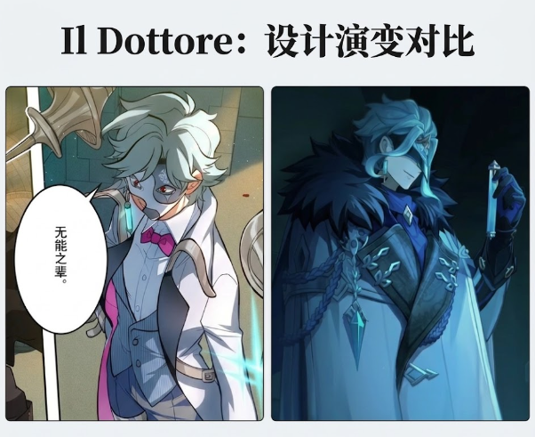{#fig:10 width="100%"}

传统喜剧里的 Il Dottore 之所以可笑，是因为他的知识配不上他的自信。原神里的多托雷之所以危险，则恰恰因为：

**他的能力开始追上了那份自信。**

# 3.从“财富与知识”到“资本与科学”

*为什么他们会成为长期合作伙伴？*

## 3.1 从利益交换开始

*资本需要时间，科学需要样本*

如果把潘塔罗涅与多托雷现在表现出的关系直接称为朋友，其实很容易跳过其中最有意思的一层。

因为至少从现有文本留下的痕迹来看，这段关系最初完全可以用一种非常冷静、甚至有些功利的方式解释——**他们首先是彼此都极具价值的合作对象。**潘塔罗涅拥有博士需要的东西。金钱、组织资源、实验条件，以及一套能够把研究长期维持下去的制度系统。博士则拥有潘塔罗涅需要的另一种稀缺资源，**技术。**更准确地说，是突破普通人类寿命限制的技术。这使得两个人的合作从一开始就具有一种非常清楚的互补结构：

> 潘塔罗涅能够让研究继续进行。
> 多托雷能够让潘塔罗涅继续活下去。

一个提供资源；一个提供时间。如果把前一部分讨论过的角色原型重新放回来，这种组合甚至显得异常自然。传统 Pantalone 代表的是财富与现实利益；传统 Il Dottore 代表的是知识与专业权威。而当原神把财富升级成金融资本，把知识升级成真正能够改变肉体的技术以后，两种力量之间最直接的问题自然变成：

**它们能交换什么？**

答案之一就是寿命。

---

这种关系在那份长期医疗与实验档案里留下了非常清楚的起点。潘塔罗涅最早出现时并不是一个被特别标记的重要人物。最初记录中的他甚至只是一个实验品样本。后来成了负伤的年轻男性，枪伤、械斗留下的外伤、不愿说明受伤原因，以及一句略带调侃意味的：

> 我以为银行职员是份安全的工作？

这时候的关系还很容易理解。一个受伤的人；一个能够处理伤势的人，甚至连“富人”这个执行官身份，都还没有成为档案的主要标签。

但很快，记录开始发生变化。潘塔罗涅被转入独立档案。档案被加入「富人」标签。身体检查逐渐从普通治疗，转向更系统性的长期观察。而到了之后的记录，他已经明确成为抗衰老药物的试验对象。这里关系性质发生了第一次真正重要的改变：

**他不再只是一个患者，而成为了一个长期受试者。**

---

这一点尤其值得注意，因为“长期”对于多托雷的研究具有非常特殊的价值。普通实验对象能够提供的数据天然受到人类寿命限制。药物是否有效，可以在数天、数月甚至几年内判断。但一个真正关于衰老的项目，需要观察的却可能是几十年。如果目标进一步变成：

> 延缓组织衰老；
> 保持脏器活性；
> 稳定脑神经状态；
> 最终让身体年龄停留在某个区间；

那么研究最大的限制之一，本身就是**时间**。一个普通人可能还没等实验积累足够数据，就已经因为年龄或其他原因死亡。潘塔罗涅恰好解决了这个问题。或者更准确地说：

**多托雷通过让潘塔罗涅活得足够久，制造出了一个能够持续提供长期数据的研究对象。**

于是两人的利益第一次真正咬合在一起。潘塔罗涅希望延长生命；博士希望验证延长生命的方法。对前者而言，药物与手术意味着更多可支配时间；对后者而言，一个持续服药、愿意接受检查，并且真的能够活过几十年、上百年的受试者，是极其罕见的实验资源。因此他们甚至不需要任何额外的情感理由，就足以维持合作。

---

这也让那份档案中的年龄变化显得格外重要。

38岁。

56岁。

72岁。

103岁。

175岁。

220岁。

312岁。

359岁。

400岁。

如果只看这些数字，它们几乎已经构成了一条实验曲线。一个人持续服用不同版本的药物，身体不断出现新的问题。技术不断迭代，组织衰老被延缓，脑部老化逐渐得到控制，器官损伤则通过修复或移植解决。从纯研究视角看，潘塔罗涅几乎成为了一份活着的纵向数据集。博士可以在同一个人身上观察**几十年乃至几百年的连续变化。**这比不断更换不同样本更加珍贵。因为个体差异被大幅削弱，一个身体的变化可以被持续追踪。前一阶段的治疗结果，也能够成为后一阶段实验的基础。因此，即使完全不考虑私人关系，潘塔罗涅本身就已经具有极高的实验价值。

---

但这种实验价值又不是单方面的占有，潘塔罗涅显然也从中获得了远超普通合作的回报。传统意义上的科研资助者通常只是提供资金，但这里的资助者本人同时成为了技术成果的直接受益者。他提供的是资源，博士返还的是**生命本身的延长。**于是两人关系很难被简单理解成：

> “老板给研究员批经费。”

也不能简单理解成：

> “医生长期治疗一个病人。”

它更接近一种相互嵌套的结构：

> **潘塔罗涅资助博士继续研究延寿技术；
> 博士又通过潘塔罗涅验证这些技术；
> 试验成果继续延长潘塔罗涅的生命；
> 更长的生命又提供下一阶段研究所需的时间。**

这是一个会自我强化的循环。资本延长研究，研究延长资本家的生命，延长的生命继续提供资本与数据。这段关系甚至不只是互利，而是形成了某种**反馈回路**。

---

这一点也解释了《不向光者》PV中那句看起来非常简单的话为什么格外重要：

**合作双方意识到，他们需要更多时间。**

这几乎可以看作两个人关系最早的共同命题。他们需要的“时间”并不完全相同。博士需要时间完成研究，潘塔罗涅需要时间完成自己的事业与目标，但解决这两个问题的方法恰好可以重合。就这样，长生并不只是博士的科研主题，它同时也是两个人合作关系本身的基础设施。

---

从这里看，潘塔罗涅与多托雷的关系最初甚至可以非常“博士式”地解释：

> 一个高价值长期实验对象。
> 一个能够稳定提供研究资源的合作方。
> 一个几乎没有必要退出的长期项目。

而对潘塔罗涅来说，多托雷同样可以被解释成：

> 一个难以替代的技术提供者。
> 一个能够不断修复身体、延长寿命的人。
> 一个投资回报周期可以持续数百年的科研对象。

没有任何一方需要先产生传统意义上的情感，也没有任何一方需要相信友情本身具有某种天然价值。只要合作仍然有效，他们就有充分理由继续留在彼此的系统里。问题只在于：

**当一个“项目”持续几十年、几百年之后，它还能永远保持纯粹的功能关系吗？**

尤其当记录里开始出现越来越多与实验效果没有直接关系的东西：

戒不掉的烟。

乱放的眼镜。

不肯休息的工作习惯。

不值得记录的小伤。

以及那些只有认识太久的人才会顺手留下的吐槽。

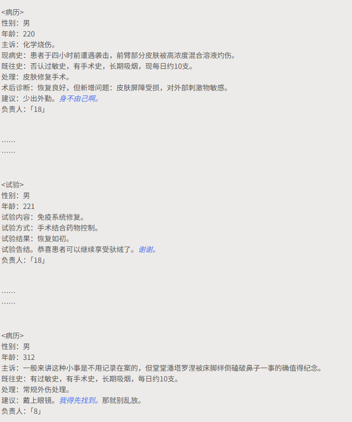{#fig:11 width="100%"}

从这一刻开始，那份档案记录的就已经不再只是药效，它开始记录另一件事情：

**一段利益关系如何在时间里逐渐长出多余的部分。**

而真正让这段关系从“长期合作”开始变得难以简单归类的，恰恰就是这些在任何实验报告里都没有必要存在的“多余信息”。

## 3.2 利益关系如何私人化

*病历里那些“不必要”的东西*

如果只看潘塔罗涅与多托雷合作的功能结构，这段关系原本可以一直保持得非常干净。潘塔罗涅提供资金与资源，多托雷提供技术、治疗和延寿方案。一方获得研究条件，一方获得更多时间，甚至连长期病历本身，都完全可以被解释成科研所需的数据积累。

问题在于**那份病历后来记录了越来越多与实验本身没有直接关系的东西**，而这些“不必要的信息”，反而成为了这段关系最有分量的部分。

---

早期记录仍然非常接近标准医疗与实验档案。

伤情。

生命体征。

既往史。

用药方式。

药物反应。

观察周期。

组织衰老速度。

脑神经状态。

如果档案始终保持这种形式，那么潘塔罗涅完全可以只是一个编号特殊、观察周期极长的研究对象，但随着时间向后推进，记录的语气开始松动。56岁时，潘塔罗涅因为视力衰退接受治疗。处理完角膜损伤之后，档案里出现了一句：

> **鉴于患者不配合改善工作习惯，此后再产生类似的修复或移植手术不再重复记录。**

从科研角度来看，这句话当然仍然可以解释成医疗管理，但它已经开始带有明显的“这个人又这样了”的熟悉感。到了175岁，他因为肺部问题接受移植，建议栏依然写着：

> **戒烟。**

紧接着却多了一条批注：

> **大概率戒不掉。**

这已经不是实验结果，也不是医疗处理，甚至不是严格意义上需要保留的患者信息。它更像一个认识患者很久的人，在一份正式档案里顺手留下的判断。事实证明，这个判断相当准确，潘塔罗涅之后仍然继续吸烟。于是原本冰冷的“长期吸烟史”，逐渐变成了一条几百年都没有解决的生活习惯。

---

类似的东西越来越多。

220岁，因为外勤遭遇袭击导致化学烧伤。治疗完成后，博士给出的建议是：

> **少出外勤。**

档案里则出现了一句回应：

> **身不由己啊。**

这已经不像实验对象与研究人员之间的单向记录，更像两个人围绕一件已经重复发生很多次的事情，留下了一次极短的对话。

221岁，免疫系统修复完成。

博士写：

> **恭喜患者可以继续享受驮绒了。**

潘塔罗涅回答：

> **谢谢。**

如果只考虑科研效率，这两句话完全没有任何必要。它们既不会帮助判断药效，也不会改善下一阶段实验设计。但正因为没有必要，它们反而变得重要。

**纯功能关系不需要这些话。**

---

到了312岁，正式病历几乎开始变成私人笑话。

档案写道：

> **一般来讲这种小事是不用记录在案的，但堂堂潘塔罗涅被床脚绊倒磕破鼻子一事的确值得纪念。**

这句话几乎主动承认了自己的“不专业”。记录者非常清楚：

**这件事情没有归档价值。**

却还是把它写进去了。

原因不是医学，而是好笑。

随后建议：

> **戴上眼镜。**

潘塔罗涅回答：

> **我得先找到。**

博士：

> **那就别乱放。**

到这里，这份档案已经产生了一种很奇怪的双重性质。它仍然是一份正式病历，但同时也开始像一份只有长期熟人才会写出来的私人时间线。

如果说早期记录在回答：

> “这个人的身体发生了什么？”

那么后来的记录已经开始顺便回答：

> “这个人平时到底是怎么活的？”

---

这也是整份材料最有意思的地方之一，原神并没有直接安排一段台词告诉玩家：

> “博士和潘塔罗涅已经认识很久了。”

它选择了一种更间接的写法，让时间通过**重复出现的小事**自己变得可见。

抽烟。

工作过度。

不愿意休息。

外勤受伤。

不愿接受某些治疗方案。

眼镜乱放。

这些事情单独看都非常轻，甚至可以说毫无剧情意义，但当它们被放进一条从二十多岁一路延续到数百岁的记录中时，意义就发生了变化。它们开始形成一种只有长期关系才会产生的东西：

**习惯。**

博士知道潘塔罗涅大概不会戒烟，知道他不会因为医生建议就减少工作，知道他会把眼镜乱放，知道某些疾病以后还会再次出现，所以干脆提前写下“不再重复记录”。这种“知道”并不浪漫，没有多少温柔，但它有一种比温柔更加顽固的东西：

**熟悉。**

---

而熟悉恰恰是最难通过一次重大事件制造出来的关系属性。救命可以发生一次，合作可以签一份合同，信任可能在某个极端事件中迅速建立，但“我知道你肯定不会戒烟”这种判断，只可能来自：

**同一件事已经发生了太多次。**

所以病历真正提供的，并不是某个决定性的“他们成为朋友的瞬间”。恰恰相反，这里几乎找不到一个明确节点，可以说：

> 从这一页开始，他们就不是合作伙伴，而是朋友了。

关系变化被分散在了几百年的微小冗余里。

也许从第一次吐槽开始。

也许从某次手术之后开始。

也许根本没有开始。

只是某一天回头看，档案已经写了几百年。

---

这种写法尤其适合潘塔罗涅与多托雷。如果换成两个更擅长直接表达情感的角色，作者完全可以安排：

> “这些年谢谢你。”

或者：

> “你是我最重要的朋友。”

但这两个人都不是特别适合这样说话。潘塔罗涅习惯用价值、交换与利益理解世界；多托雷甚至更极端，他习惯把人转换成样本、数据、身体和研究对象。让他们的关系通过**实验记录、医疗表格、项目批注和不应该出现在正式文书里的废话**逐渐浮现，反而非常符合人物本身。

他们并不需要先拥有一套用于表达亲密关系的语言。关系可以先存在，甚至可以在他们仍然坚持使用“患者”“受试者”“合作方”这些功能称呼的时候存在。

---

这一点在不同年龄切片轮流管理病历时尤其明显，潘塔罗涅并不只是与某一个固定年龄的多托雷发生接触。不同阶段的记录者包括「25」「35」「45」「65」「18」「8」。到了400岁的长期药物评估，甚至出现：

> 负责人：「35」「45」「65」
> 协助人：「8」「18」「25」

换句话说，潘塔罗涅几乎已经进入了整个“赞迪克系统”的日常工作范围。不同年龄的切片都知道这个患者，不同切片都参与过治疗和观察。他不是某一次项目里的样本，而成为了一项跨越多个“博士”的长期存在。这产生了一种非常奇怪的效果：

**潘塔罗涅认识的不是一个固定版本的博士，而是赞迪克不断分化出来的一整套自我。**

而博士的不同切片，也共同知道这个人几百年来身体发生过什么。如果说普通朋友共同拥有的是回忆，那么这段关系共同拥有的甚至包括：

**一份由多个“我”共同续写的身体历史。**

---

也正因为如此，最后那条档案变更才显得格外醒目：

> **※多人管理档案结束，不再更新。**
> **※此后记录由本人单独负责，本档案封存。**
> **负责人：「35」**

从纯粹行政意义上看，这当然可以解释成负责人调整，但放在整条几百年时间线末尾，它同时产生了一种非常强的叙事效果。一个原本由多个切片共同维护的对象，最后被交给了一个具体的“博士”单独负责。关系从：

**一个系统管理一个长期项目**

逐渐收束成：

**一个具体的人继续管理另一个具体的人。**

这不自动等于爱情，也不能仅凭这一条记录证明某种唯一的情感关系，但它显然完成了一次非常清楚的私人化。潘塔罗涅已经不再只是一个可以由任何研究人员替换管理的实验对象，他的档案开始拥有明确的个人归属。

---

所以，这份病历真正有意思的地方，并不是它证明了博士的温柔。博士仍然会把潘塔罗涅称为受试者，仍然会在他身上进行药物实验，到了400岁，还能进行一个半小时的局部解剖，再观察他是否正常苏醒。这段关系从来没有离开实验室，与此同时，实验室里已经逐渐堆积起了一些无法用实验目的解释的东西。

一句吐槽。

一个笑话。

一个被记住的坏习惯。

一个没必要归档的小事故。

以及一个已经写了几百年的名字。

如果只看实验数据，这些全部属于噪声。

但如果把这份档案当作一段关系史来看——

**真正让它从“研究记录”变成“共同生活痕迹”的，恰恰就是这些噪声。**

关系的私人化，并不是发生在利益停止的地方，它发生在利益关系开始产生冗余的时候。当两个人之间出现越来越多“即使对合作没有用，也还是被留下来的东西”时，原本纯粹的功能关系，就已经很难再保持纯粹了。

## 3.3 利用与在乎为什么可以同时成立

如果把潘塔罗涅与多托雷的关系一路从早期病历看到最后，一个很容易产生的误解是：

**既然后来关系已经明显私人化，那么最初的互相利用是不是就不重要了？**

答案反而是否定的。这段关系真正特别的地方正好是**利益从来没有消失**。潘塔罗涅仍然需要博士的技术；博士仍然需要潘塔罗涅的资源、长期数据与合作条件。即使两个人已经认识数百年，这层结构也没有被某种更纯粹的情感取代。他们不是：

> 一开始互相利用，后来终于成为真正的朋友。

而更接近：

> **他们一直互相利用，同时又在漫长的利用关系里变成了朋友。**

这两件事并不互相排斥。

---

现代作品在描写友情或者亲密关系时，经常喜欢使用一种很熟悉的逻辑：

> 真正的感情，应当摆脱利益。

如果两个人因为金钱、资源、身份或者某种实际需求走到一起，那么这种关系似乎天然不够真诚；只有当角色愿意在没有回报的情况下继续留下，感情才获得认证。但潘塔罗涅与多托雷显然不适合这种写法，尤其是多托雷。这个角色本身就很难相信一种完全脱离功能、目的和结果的关系观。他习惯分析收益、研究因果、把对象拆成可以观察的变量，连“自己”都不是某种绝对不可侵犯的存在。切片可以被比较、淘汰、删除，本体的尸体也可以成为实验材料。如果最后为了证明他拥有真正的人性，却安排他突然说：

> “我不在乎任何收益，我只是单纯在乎这个人。”

那反而会像是另一个角色借用了多托雷的身体说话。真正符合他逻辑的关系应该允许**在乎本身也可以和利益同时存在**。

---

事实上，潘塔罗涅可能正是最适合进入这种关系的人。因为他同样不会要求多托雷首先接受一套正常友情的定义。作为一个围绕价值、交换和资源配置建立人物逻辑的角色，潘塔罗涅完全有能力理解：

> 一段关系为什么从利益开始。

他甚至可能比大多数人更愿意承认这一点，这让两人的关系少了一层常见的道德冲突。潘塔罗涅不需要告诉博士：

> “不要再把人与关系换算成价值。”

因为他自己也会进行价值判断。博士同样不需要假装：

> “我们的合作早已超越了所有利益。”

因为这种说法本身就未必符合他的理解方式，于是朋友这个结果并不是建立在两个人终于抛弃原有价值观之后。相反，**它是在两个人都没有变成普通人的情况下形成的。**

---

这一点尤其适合解释多托雷身上最容易引起误读的那部分人性。在此前的剧情中，玩家很容易得到一个相当稳定的印象——多托雷缺乏通常意义上的同理心。实验对象的痛苦并不会天然阻止研究，社会伦理也不会因为“大家都认为这是不应该做的”而自动获得最高优先级，更极端的是这种冷酷并不只针对别人，他同样可以对象化自己。如果一个角色能够为了真理牺牲别人，却唯独对自己的生命极其珍惜，那仍然很容易解释成自私，但多托雷的问题恰恰不是这样。

**他连自己也能牺牲。**

这使得他的非伦理性显得更加彻底。不是“别人只是工具，而我是例外”，而是：

**“包括我自己在内，生命都可以成为研究对象。”**

也正因为如此，潘塔罗涅的存在才显得格外奇怪。

---

如果一个人可以：

* 把陌生人作为实验材料；
* 把自己的切片删除；
* 把本体死亡当成解剖机会；
* 把灵魂和记忆继续转化成技术问题；

那么玩家很自然会认为：

**这种对象化逻辑对所有人都成立。**

而长期病历留下的东西却告诉玩家：

并不完全如此。至少有一个人，在持续数百年的过程中，逐渐积累出了大量无法被单纯“实验价值”解释的信息。

这并不意味着博士停止把潘塔罗涅当作受试者。相反他一直都还是受试者。药物仍然要测试，身体仍然要检查，实验仍然会继续，局部解剖也并没有因为私人关系而消失。所以真正发生的并不是：

> **“潘塔罗涅不再是研究对象。”**

而是：

> **“潘塔罗涅不再只是研究对象。”**

这两个句子之间的差别，可能就是整段关系最重要的部分。

---

因此，多托雷对潘塔罗涅的特殊性也不应该被简单理解成：

**博士原来一直隐藏着一颗温柔的心。**

这种解释会立刻削弱角色，因为它暗示：

> 冷酷是表象，温柔才是真实。

而现有文本更有意思的地方在于：

**冷酷是真的。**

对未知的兴趣是真的，为了研究跨越伦理边界是真的，对自己同样缺乏传统意义上的珍惜也是真的。但与此同时：

**关系也是真的。**

一个通常缺乏普遍同理心的人，仍然可以形成高度选择性的依恋。这不会自动让他成为一个善良的人，也不会替他对其他人做过的事情提供道德豁免。它只是证明：

**普遍共情与具体关系，并不是同一种能力。**

一个人可以不愿承认“所有生命都具有天然不可侵犯的价值”，却仍然在几百年相处之后，对某个具体的人产生强烈的关系权重。潘塔罗涅因此不是博士“其实是正常人”的证据，反而更像是一个更加有趣的证明：

**博士能够形成关系，只是这种关系不会按照普通人的方式生长。**

---

而潘塔罗涅对多托雷的理解，同样强化了这一点。真正亲密的关系并不一定表现为赞同，有时更重要的是**你是否准确知道对方为什么会这么做**。在两人的对话中，潘塔罗涅能够直接指出博士并非真正意义上珍惜生命，他只是**不愿意在有限的时间里认输。**这句话的重要之处，并不在于它多么温柔，它几乎是一种拆解。多托雷试图把自己的长生研究叙述成一个关于“珍惜在世时间”的故事，潘塔罗涅却直接把这层叙事剥掉：

> 你不是舍不得活着。
> 你只是不接受失败。

这种理解非常适合两个人之间的关系。潘塔罗涅不是透过一个冷酷怪人，发现里面其实藏着一个普通的、需要关怀的人。他理解的就是**那个怪人本身**。

也就是说：

> 我并不需要把你翻译成一个正常人，才能理解你。

这比传统意义上的“我知道你其实很孤独”更符合多托雷。

---

同样地，多托雷对潘塔罗涅的关心，也没有因为关系私人化就变成普通的情感表达。他不会突然开始以安慰、拥抱或者浪漫语言证明自己在乎。他的表达仍然沿着原来的系统运行：

治疗。

修复。

观察。

记录。

提醒戒烟。

要求少出外勤。

记得眼镜。

继续给药。

继续让对方活下去。

这些行为本身都可以继续拥有功能解释。

问题只在于**为什么这个功能关系持续了这么久，又积累了这么多只有这个人才有的信息？**当一个人不断以自己最熟悉的方式维护另一个人的存在时，“功能”与“情感”之间的边界就开始变得非常模糊。

博士可能永远能够给出一套理由：

> 这是一个优质长期样本。
> 这是重要合作方。
> 维持他的健康有利于后续项目。
> 关系具有正向收益。

这些理由甚至可能都是真的，但“都是真的”并不意味着它们能够解释全部，毕竟一份纯粹为了收益维持的合作，并不需要记住：

> 对方三百年前被床脚绊倒。

---

所以这段关系最合适的理解，也许并不是寻找一个瞬间，然后宣布：

> **从这里开始，利益结束，友情开始。**

而是承认两者之间从来没有这样一道清楚的分界线。

利益不断积累。

信任不断积累。

身体记录不断积累。

共同经历不断积累。

对彼此思维方式的理解不断积累。

最后，这些东西压在同一段关系里，已经很难再进行纯粹拆分。

到底哪一次治疗只是出于研究？

哪一次修复开始包含了私人关心？

哪一句吐槽只是工作交流？

哪一次坚持让对方继续活下去，已经不仅仅是为了数据？

文本并没有提供答案，而这种无法拆分，可能恰恰就是答案本身。

---

从这个角度看，两人的关系可以用一句很简单的话概括：

**他们从来没有停止互相利用。**

但到了后来：

**“利用你”与“在乎你”已经可以同时成立。**

这并不是一段关系不够纯粹的证明，反而正是这两个角色最可信的亲密形式。如果传统意义上的朋友，需要依靠无条件理解、情绪支持和道德认同来确认关系，那么潘塔罗涅与多托雷显然不是这种朋友。

他们更接近：

> 我知道你想得到什么。
> 我知道你为什么需要我。
> 你也知道我为什么需要你。
> 我们都没有假装这一切不存在。
> 但几百年过去以后，你仍然在这里。

所以与其说利益最终被友情战胜，不如说：

**利益成为了友情生长的介质。**

而对于两个分别把财富与知识当作理解世界主要方式的人来说，这或许正是他们最自然的关系起点，也是最自然的关系终点。

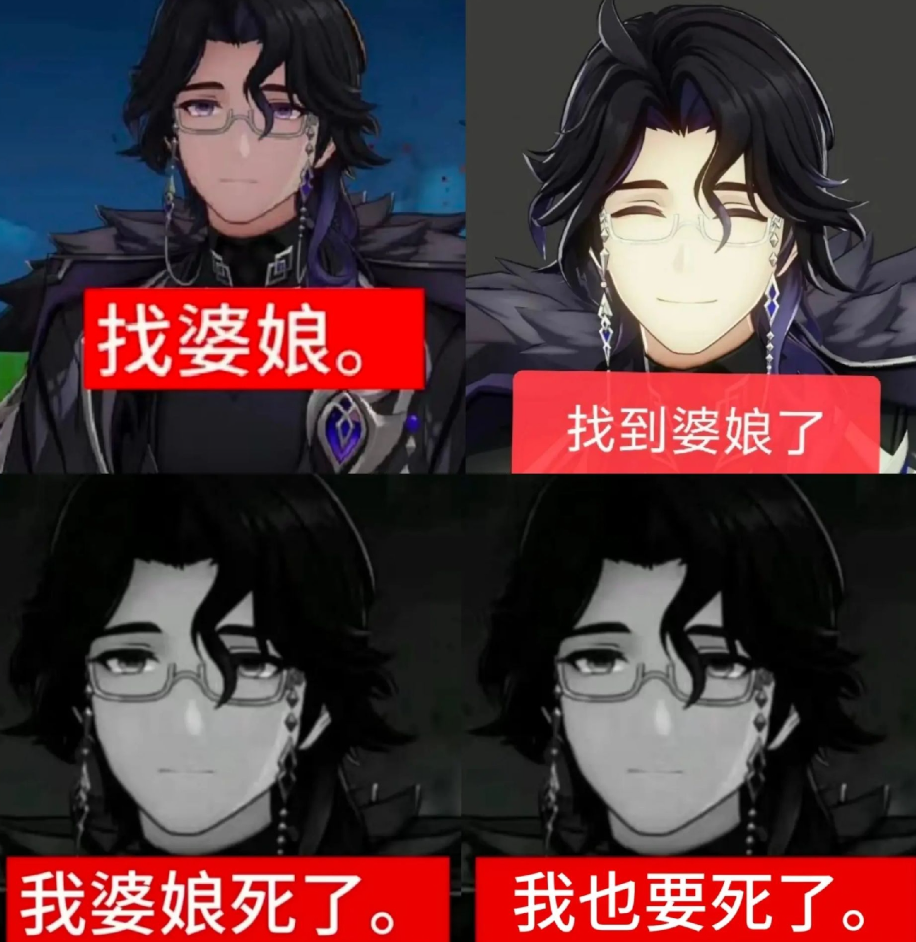{#fig:12 width="100%"}

# 4.同一个角色，四种声音

*《不向光者》PV的中日韩英配音*

## 4.1 博士的四种声音

*谁更像 Il Dottore，谁更像赞迪克？*

如果说前面的改造，发生在意大利即兴喜剧角色与现代奇幻游戏人物之间，那么配音其实又完成了一次新的翻译。同一个多托雷，在中、日、韩、英四种语言里，并没有获得完全一致的声音。这并不只是因为演员的生理音色不同,更重要的是：

**四套配音实际上抓住了博士身上不同的角色特征。**

在《不向光者》PV的同一段对话中，这种差异尤其明显。这段剧情本身非常适合作为观察样本。博士并没有处于战斗、暴怒或者公开威胁某人的场景，而是在潘塔罗涅面前讲述自己的过去。退学、人体实验、切片、衰老、本体死亡，甚至解剖自己的尸体。

如果只看内容，这几乎是一份非常典型的“危险科学家履历”，但博士讲述这些事情时，却并不认为自己正在进行某种忏悔。他似乎相当享受这个故事。当潘塔罗涅提到“你死亡的部分”时，博士甚至很自然地回答：

> “啊，是了，我最喜欢的一段。”

日语版同样是近乎随口接上的：

> 「ああ、私もそこが一番好きだ。」

英语版则是：

> “Ah, yes. My favorite part.”

四种语言的台词内容基本指向同一件事：**博士把自己的死亡当作一个值得欣赏的故事节点**。真正不同的是**四个博士分别怎样把这件事说出来。**

{#fig:13 width="100%"}

---

### 中配

*作为权威者的博士*

中文配音中的博士，首先给人的感觉是**成熟、稳定，而且具有相当明确的成年男性重量感**。这种重量并不完全等于声音低沉，更准确地说，它来自一种相对收束的表达方式。语句落点清楚，情绪并不大幅摇摆，博士首先像一个已经习惯掌握局势的人。因此中配很容易强化多托雷身上的一项现代属性：

**知识权威。**

他不是一个因为兴奋而滔滔不绝的怪人，更像一个已经拥有足够多经验和成果，因此根本不需要向别人证明自己有多聪明的人。这与传统 Il Dottore 形成了一种有趣的反转，传统 Dottore 需要不断说话来证明：

> “我是博士，我懂这个。”

而中配多托雷更接近：

> **“我已经做过这些事情，所以没有必要证明我懂不懂。”**

他的危险感因此更多来自一种**确定性**。

人体实验也好。

制造切片也好。

自己的衰老和死亡也好。

这些事情已经被处理成了一整套可以陈述、归档和分析的事实。所以中文博士听起来比较像：

**已经把异常生活正常化的高级研究者。**

这让他的疯狂并不特别外露，但同时，他身上那种社会权威和成熟度会被放得比较高。

---

### 日配

*作为异类的赞迪克*

日配则是四版中非常值得注意的一种处理。因为第一耳听上去，它很容易让人产生一种：

**轻、柔、从容，甚至有一点飘。**

的感觉。

但如果只看实际音高，这种轻并不意味着关俊彦把博士处理成了高音角色。相反，《不向光者》前段部分不少句子的基频相当低。真正制造差异的，是他的**声质和音区转换方式**。声音虽然低，却没有被压成厚重的胸声；句子之间可以非常自然地改变位置，语气也保留了相当高的灵活度。结果就是：

**博士的声音没有牢牢钉在地面上。**

他不像中配那样首先呈现权威，也不像韩配那样首先呈现一个非常具体、清晰的危险成年人。日配博士更像一个：

**在人类社会中活动，却又没有完全按照普通人的方式理解世界的人。**

这一点在博士谈论极端内容的时候尤其有效。当他说自己最喜欢“死亡的部分”，或者讨论切片、本体与自我解剖时，声音并不会突然切换成传统反派模式。他没有刻意提醒听众：

> “注意，现在我要说一句很疯狂的话。”

这反而让内容本身变得更加异常，因为博士似乎真的觉得：

**这没什么值得特别强调的。**

所以日配最突出的并不是疯，而是：

**他并不认为自己疯。**

{#fig:13 width="100%"}

这可能也是日配特别适合现在这个赞迪克的原因。原神中的博士真正令人不安的地方，本来就不只是他会做残酷实验，而是他能够把这些事情纳入一套非常稳定的认识框架。普通人会先问：

> “这样做是不是太残忍？”

博士更容易先问：

> “这样能得到什么结果？”

日配把这种“伦理意义上的异质”放得很高。他的危险不是从声音表面向外喷出来，而是隐藏在一种近乎礼貌、正常甚至愉快的交流状态下面。

---

### 英配

*作为表演者的 Il Dottore*

英语版则几乎走向另一个方向。在四套配音里，英配博士最容易让人意识到：

**这个角色正在享受自己的叙述。**

语调起伏更大。

重音更加明显。

句子中具有更多外显的节奏变化。

尤其在谈论自己的死亡、失败和最终结局时，英语博士很容易获得一种明显的：

**theatricality——舞台性。**

他不只是在告诉潘塔罗涅发生过什么，他似乎也在欣赏：

**“赞迪克这个故事到底讲得怎么样。”**

因此，到了最后：

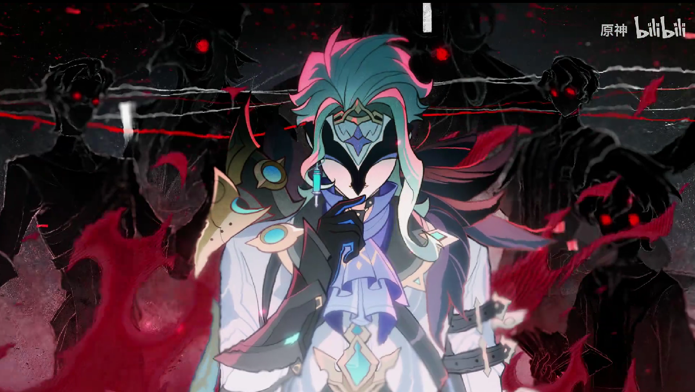{#fig:14 width="100%"}

这句话很自然地带出一种近似“谢幕”的感觉。这让英配博士更接近现代流行文化中的：

**charismatic villain——具有明显人格魅力与表演欲的反派。**

但有趣的是，如果重新联系传统 Commedia dell’arte，这种演法反而保留了 Il Dottore 一个非常古老的特征：

**说话本身就是表演。**

传统 Dottore 喜欢长篇大论。

喜欢展示知识。

喜欢让所有人注意到：

> “我正在发表一个非常高明的观点。”

当然，两者已经完全不是同一个人物。传统 Dottore 的问题是内容往往经不起推敲，原神博士的问题却恰恰是：

**他的内容经常真的成立。**

但那种：

> “请看我如何讲述、解释并包装这个世界。”

的表演欲，在英配里反而显得特别明显。

所以如果问：

**哪一版最接近传统 Il Dottore 的“舞台人格”？**

英配反而可能比日配更接近一些。倒不是因为英语更接近意大利戏剧，其实是这套表演保留了更多**外显人格、语言展示和舞台性**。

---

### 韩配

*作为危险精英的博士*

韩配则给博士提供了另一种非常具体的存在方式。相比日配较松、较游离的声音，韩配的轮廓更加清晰，基频整体也相对更亮一些，声音的实体感更强。因此，博士首先容易被听成：

**一个非常聪明、冷静、行动能力极强的成年男性。**

他的危险感不像英语版那样来自人格表演，也不像日语版那样来自“为什么这个人觉得一切都这么正常”的异质。韩配更接近：

> **这个人非常清楚自己正在干什么，而且他真的有能力做到。**

人物的精英感和现实威胁感会被提高。如果日配博士有一点像一只难以完全捕捉的怪鸟，韩配博士则更像：

**已经站在你面前，并且很清楚下一步实验该怎么做的人。**

这使得角色少了一点幽灵式的非人感，却增加了非常明确的现实存在感。

---

### 四个博士，其实是在强调四种不同的危险

因此，与其简单判断：

> 哪个版本“最像博士”？

不如先问：

> **博士最重要的东西到底是什么？**

如果认为核心是：

**知识权威与成熟控制力，**

中配会非常成立。

如果认为核心是：

**他与普通人共享的伦理前提已经发生偏移，**

日配会尤其突出。

如果认为核心是：

**自恋、语言表演与对自身传奇的欣赏，**

英配会非常有吸引力。

如果认为核心是：

**冷静、聪明、现实而危险的行动者，**

韩配则很容易成立。

因此，可以把《不向光者》里的四种博士暂时压缩成：

> **中配：权威者。**
> **日配：异类。**
> **英配：表演者。**
> **韩配：危险精英。**

而其中最有意思的问题，可能不是：

**哪一版最好？**

而是：

**哪一版更接近 Il Dottore，哪一版更接近 Zandik？**

如果把传统 Il Dottore 理解成那个喜欢通过语言、姿态和知识展示自己的人，那么英配身上的舞台性，确实保留了更多古典角色遥远的影子。

但如果把问题换成：

> “经历原神重新设计以后，这个赞迪克最重要的现代人格特征是什么？”

那么日配所强调的那种**危险性不写在声音表面、异常被本人视为理所当然**的状态，反而与现在这个角色格外贴合。

这两种贴并不是同一个标准。一个更接近角色的**戏剧祖先**，另一个更接近角色在数百年改编之后形成的**现代人格**。也正因为如此，四种配音之间的差异并不能简单理解成：

> “有人演对了，有人演错了。”

它们更像是从同一个多托雷身上，各自选择了一条不同的轴线，而四条轴线放在一起，反而让这个从滑稽老学究一路变成危险科学家的角色，显得比任何单一版本都更加复杂。

## 4.2 潘塔罗涅的四种声音

*商人、权贵、绅士与精英*

如果说博士的四种配音差异主要体现在**这个人究竟以什么方式显得“危险”**，那么潘塔罗涅的差异则更像是在回答另一个问题：

**一个真正掌握资本与社会权力的人，究竟应该怎样讲话？**

这也是《不向光者》特别适合观察潘塔罗涅的一点。这段对话里，他几乎没有做任何传统意义上的“反派行为”。

没有威胁。

没有战斗。

甚至没有明显发怒。

他只是坐在那里，与博士讨论合同、银行、实验、过去和死亡，但与此同时他又不断承担一个很重要的功能：

**把博士从自己的叙事里拽回现实。**

博士喜欢把自己的人生讲成故事。潘塔罗涅则负责指出：

> 你又在表演。
> 事情不是你说的那样。
> 你所谓“珍惜生命”，其实只是无法接受在有限时间里认输。

所以，两人的对话不是“一个正常人审判一个疯子”，潘塔罗涅自己显然也并不属于普通道德立场。他更像一个非常了解交易、利益和人的欲望，却仍然保留着极强社会判断力的人，这使得他的声音设计与博士形成了一个很有意思的对照：

**博士怎样显得“不像普通人”，潘塔罗涅就怎样显得“太懂普通人的世界”。**

而中、日、韩、英四版，对这种“社会化”又有完全不同的理解。

---

### 中配

*更年轻、更直接的掌权者*

中文版本中的潘塔罗涅给人的第一感觉，并不一定是四版中年龄最大的。他的声音相当干净，轮廓明确，虽然整体处于偏低的成年男性音区，却仍然保留了一种比较明显的年轻感。这也是一个很容易产生误解的地方：

**声音低，并不等于听起来更老。**

角色年龄感并不只由音高决定。声线是否粗糙、共鸣是靠前还是靠后、说话是否松弛、语句之间是否留出大量余裕，都会改变听众对年龄的判断。中配潘塔罗涅虽然可以拥有比较低的声音位置，却仍然容易让人想到：

**一个正处于权力高峰、行动力很强的成年男性。**

而不是一个已经在那个位置上坐了几百年的老练人物。

这也使得中文版本特别强调他的**掌权者属性**。他讲话比较有明确落点，对博士的拆解也相对直接。尤其在博士试图把自己的长生研究解释为“更加珍惜在世时间”之后，中配潘塔罗涅给出的判断是：

> “也并非珍惜生命，只是不愿在有限的时间里认输而已。”

这句话本身很像一种非常有效率的人物分析。博士讲了一大段，潘塔罗涅直接把它压缩成一句。于是中文富人很容易呈现出：

**我不需要进入你的思维迷宫，我只需要知道你真正想得到什么。**

的感觉。

这很符合一个掌握金融与资源配置的人。他不必比博士懂科学，但他必须懂：

**博士为什么会继续做这件事。**

---

### 日配

*已经不需要证明自己有权力的商人*

日配潘塔罗涅则明显是另一种气质。中配首先让人想到：**“这个人有权力。”**

那么日配更接近：

**“这个人已经习惯了有权力。”**

这是两个很不一样的状态。日语版本的声音并不依靠特别强烈的低沉感来证明成熟，它更松、更柔，也更有一种不急着把句子推向终点的余裕。他对博士的质疑听起来很少像审讯，更像一个：

**已经听这个人胡说过很多次，所以知道什么时候该打断的人。**

这种感觉在两人的互动中尤其有效。博士说：

> 这是一个神奇的故事。

潘塔罗涅：

> 我怎么记得不是这样？

{#fig:15 width="100%"}

博士继续给自己的人生添加戏剧性，潘塔罗涅又一点点把它拆掉。

日配没有特别努力强调：

> “我正在压制博士。”

于是两人的权力关系反而显得更加横向。潘塔罗涅并不需要提高声音，也不需要让对方闭嘴。他只是很平静地告诉博士：

**我知道你是什么样的人。**

这非常适合一个已经高度社会化的商人角色。传统 Pantalone 的现实主义，经常表现为：

> 钱是多少？
> 我会不会吃亏？
> 这个决定有什么实际结果？

到了日配潘塔罗涅这里，这种现实主义被重新包装成了一种非常成熟的：

**看人能力。**

他能理解博士复杂的语言，但他不会被博士的话术牵着走。日配所强调的“商人”，并不是一个天天计算金币的人。

而是：

**一个习惯判断价值，也习惯判断人的人。**

---

### 英配

*上流社会里的表演者*

英语版本则明显提高了潘塔罗涅的外显人格。如果说日配的社会化是一种内收的：

**“我知道该怎么处理所有场面。”**

英配更像：

**“我也非常擅长让别人意识到，我知道该怎么处理场面。”**

英语本身较强的重音与语调变化，再加上表演中的节奏设计，使潘塔罗涅更容易表现出一种**well-spoken、精致、有点戏谑的上流人士气质。**

他不是冷冰冰的银行机器，其实他非常“会讲话”，甚至有一种社交场合中几乎不会让话掉到地上的感觉。这让英配潘塔罗涅与英配博士形成了一个很有趣的组合：

**两个人都具有明显的 verbal performance。**

博士喜欢把自己的人生讲成传奇，潘塔罗涅则擅长用社交语言和一句句反问把传奇拆开。因此英语版本的两人对话更容易呈现出：

**两个极具人格魅力的人正在互相接招。**

例如在博士宣称自己“更加珍惜在世时间”之后，英文潘塔罗涅的回应甚至被本地化为：

> “So you do have a sense of self-preservation.”

随后又进一步指出：

{#fig:16 width="100%"}

和中日文本相比，英语版在这里更明显地把两人的互动推向一种：

**聪明人之间的言语拆招。**

因此，英配潘塔罗涅最像的可能不是传统意义上的“银行老板”，而是：

**上流社会中的聪明绅士。**

他当然有钱，但更重要的是：

**他知道怎么在任何场合表现得像一个掌握局势的人。**

---

### 韩配

*稳重而现实的职业精英*

韩配潘塔罗涅则给人一种更加明确、坚实的成年男性气质。相比日配的柔和与英配的戏剧性，韩配的声音轮廓相对清晰，表达也更利落。

于是角色很容易首先被理解成：

**一个非常职业化、非常稳定的高级管理者。**

他不像日配那样有一种“活得太久，所以已经懒得着急”的感觉，也不像英配那样特别享受语言本身的社交表演。韩配强调的是：

**可靠的现实存在感。**

这使得潘塔罗涅与博士之间的关系，也更容易呈现成两名高位精英之间的合作。

一个负责技术。

一个负责金融与组织。

双方都非常清楚自己的专业领域。

双方也都知道对方是难以替代的合作对象。

所以韩配中的潘塔罗涅不像传统“有钱老商人”的喜剧角色，也不像贵族式的神秘人物。

他更接近一种现代观众非常容易识别的类型：

**大型组织里真正掌握资源的职业权力者。**

这实际上也非常符合原神对 Pantalone 的现代改造，传统角色的钱袋已经变成银行，于是他的声音，也可以从“有钱老头”变成：

**一个能够坐在会议桌旁决定哪些项目继续运行的人。**

---

### 谁听起来更老，并不是音高排序的问题

潘塔罗涅四语对比里，还有一个特别适合说明配音差异的问题：

**年龄感并不等于音高。**

中配潘塔罗涅的声音位置可以很低，但因为声线比较干净、聚拢，语言推进也比较明确，所以人物反而容易显得年轻一些。日配的音高未必更低，却因为声音更加松弛，句子更有余裕，整体社会姿态也更像一个不需要证明自己的成年人，反而容易显得年长。

因此：

> 低音 ≠ 老。
> 高一点 ≠ 年轻。

听众真正用来判断年龄的，是一整套东西：

声音的粗糙程度。

气声比例。

共鸣位置。

咬字习惯。

语速。

停顿。

以及最难量化的：

**一个人说话时到底有多急。**

日配潘塔罗涅特别容易产生一种：

**“我已经见过这种事情太多次了。”**

的感觉。

而这种时间感，对于一个实际上已经拥有异常漫长生命历史的角色来说，非常有效。

---

### 四个潘塔罗涅，是四种社会权力

如果把四版暂时压缩成几个角色类型，大概可以写成：

> **中配：掌权者。**
> **日配：商人。**
> **英配：上流绅士。**
> **韩配：职业精英。**

这里的“商人”并不是说日配比其他版本更爱钱。

而是它最明显地强调了：

**观察、判断、交易，以及不需要外显压迫就能控制谈话方向的能力。**

中配则更突出人物本身的权力重量。

英配强化社会表演与人格魅力。

韩配则把现代组织中的职业性与现实可靠感推得更高。

因此，如果重新联系传统 Pantalone，会发现一个和博士类似但方向相反的现象。传统 Pantalone 本来是一个非常外显的喜剧人物，他的贪婪、吝啬、好色和控制欲，都必须让舞台观众迅速看懂，而原神把这些特征逐渐内收了。现代潘塔罗涅仍然围绕价值、利益和控制展开，但一个真正掌握金融系统的人，已经不需要每一分钟都告诉别人：

> “我很爱钱。”

他的财富可以变成背景。

他的权力可以变成制度。

他的危险，也可以只表现成：

**他坐在那里，就拥有决定某些事情能不能继续发生的能力。**

从这个角度看，日配之所以容易让人觉得格外适合现在的潘塔罗涅，可能与博士的情况非常相似。它没有急着把角色的危险性写在声音表面，博士并不需要听起来像疯子，潘塔罗涅也不需要听起来像掌权者。两个人只是非常自然地说话，但听得越久，越会发现：

**一个人根本不按照普通人的伦理理解世界。**

而另一个人，

**对普通人的世界理解得过分清楚。**

## 4.3 配音也是一次改编

把博士与潘塔罗涅的中、日、韩、英四套配音放在一起，会发现一个很容易被忽略的问题：

**配音并不是在寻找“同一个声音”的四种语言版本。**

更准确地说，它是在寻找：

**同一个角色，在四种语言里应该怎样成立。**

这也是为什么同一个角色换一种语音之后，听感可以发生非常明显的变化。博士可以从“权威者”变成“异类”，从“表演者”变成“危险精英”；潘塔罗涅也可以从“掌权者”变成“商人”，从“上流绅士”变成“职业精英”。这些变化并不意味着角色设定发生了改变，真正变化的是：

**配音选择了角色身上哪些特征优先进入声音。**

---

最直接的一层，当然来自演员本身。不同配音演员拥有不同的生理音色，声带厚薄、共鸣位置、气声比例、咬字习惯、声音明暗，都不是可以简单复制的东西。所以即使四个配音导演给出完全一样的要求：

> “成熟、冷静、危险，但不要太外露。”

最终得到的声音也不可能真正一样。

有的演员天然拥有更厚、更稳的低音。

有的声音虽然实际音高不高，却因为声质松、气息轻而显得年轻或游离。

有的演员特别擅长戏剧化语调。

有的则更适合把情绪藏在非常稳定的声音里。

因此，角色音色首先就是一次：

**演员身体对角色的重新解释。**

---

第二层来自语言本身。

不同语言允许的表演方式并不完全相同。

英语依赖重音组织句子，语调起伏天然比较明显，因此很容易形成更强的外显戏剧性。

日语音节结构较为整齐，句尾处理空间又很大，因此演员可以通过轻微的气息、拖音和声区变化制造非常细的情绪差异。

韩语的辅音轮廓和收音会让句子边界显得更明确，因此在强调干练、清晰和现实存在感时非常有效。

普通话则受到声调约束，语句中的音高变化必须同时服务于词义，因此很多角色的表演更依赖：

**节奏、停顿、重音和音色本身。**

这意味着：

**同一个“冷静”，在四种语言里本来就不会长成同一种声音。**

---

第三层则来自配音导演与演员对角色的理解。

这一点可能比音色差异更加重要。

角色设定通常不是一道只有一个答案的题。

以博士为例。

他可以被理解成：

* 极端理性的学者；
* 对伦理缺乏共感的异类；
* 高度自恋、喜欢讲述自己的表演者；
* 真正危险而有效率的科研精英。

这些解释都能从文本里找到依据。

但一次具体的表演，不可能把所有特征都以同样强度呈现。

于是，不同版本实际上是在做选择：

> 哪一层放在声音最前面？
> 哪一层留在台词内容里？
> 哪一层只在某些情绪节点出现？

博士的日配把“异质性”放得很前。

英配把“舞台性”和人格表演放得更前。

中配提高了知识权威与成熟控制力。

韩配则强调现实威胁与精英感。

同理，潘塔罗涅也可以被理解成：

* 资本掌权者；
* 老练商人；
* 高度社会化的上流人士；
* 现代组织中的职业权力者。

四种版本并没有在争夺谁才是“真正的潘塔罗涅”。

它们只是把同一个角色投影到了不同方向。

---

这也解释了一个很常见的问题：

**为什么原型明明来自意大利戏剧，最“贴”的版本却不一定是英语？**

因为英语与意大利语并不是同一种戏剧传统。

更重要的是：

原神里的博士与富人，早就已经不是传统 Commedia dell’arte 的角色原样复刻。

他们已经经历过一次非常彻底的改造。

传统 Il Dottore：

> 一个夸夸其谈、知识并不可靠的老学究。

传统 Pantalone：

> 一个吝啬、现实、欲望旺盛的威尼斯老商人。

而原神里的两个人已经变成：

> 真正拥有知识力量的危险科学家。
> 真正拥有系统性资本力量的金融权贵。

因此，所谓“哪一版最贴”，至少存在两套完全不同的评价标准。

第一套是：

> **哪一版更保留传统角色的舞台性？**

如果按这个标准，英配反而相当有意思。

博士英配较强的 verbal performance、语调起伏和明显的戏剧人格，确实会让人联想到传统 Il Dottore 那种：

**“讲话本身就是表演。”**

潘塔罗涅英配的社交感与上流人士气质，也更容易保留传统 Pantalone 作为一个鲜明舞台类型的外显人格。

但第二套标准是：

> **哪一版更贴原神已经改造完成后的现代人物？**

按照这个标准，结果完全可能不同。

如果认为现代博士最重要的是：

**他对自己的异常毫无异常感。**

那么日配那种把危险藏在平静与礼貌下面的演法，就会非常有效。

如果认为现代潘塔罗涅最重要的是：

**一个真正有权力的人不需要不断证明自己有权力。**

那么日配那种更松、更稳、更有余裕的声音，也会显得格外合适。

所以：

**最贴原型，不等于最贴现代角色。**

这两种“贴”，本来就是不同的问题。

---

从这个角度看，配音其实延续了原神对角色不断“翻译”的过程。

第一次翻译发生在：

> **Commedia dell’arte → 现代奇幻游戏。**

老商人被翻译成金融资本家。

老学究被翻译成危险科学家。

第二次翻译发生在：

> **文本角色 → 具体视觉形象。**

舞台面具变成眼镜、机械、羽毛、珠宝和幻想服饰。

第三次翻译则发生在：

> **同一个角色 → 四种语言的声音。**

每一次翻译都会损失一些东西。

也会得到一些新的东西。

传统 Dottore 的滑稽可能消失了。

但他的语言表演欲被某些配音重新放大。

传统 Pantalone 的老态消失了。

但“活得太久”的成熟感，又可以通过声音重新回来。

因此，配音并不只是角色制作完成后的附属环节。

它实际上仍然在继续参与：

**这个角色到底是谁。**

---

这也解释了为什么不同玩家会对同一套配音产生非常不同的偏好。

喜欢日配博士的人，未必只是“喜欢日语”。

他可能更重视角色的：

**异质、克制、危险不外露。**

喜欢英配博士的人，也未必是在追求“更原汁原味的欧洲感”。

他可能更喜欢：

**表演欲、自恋和 charismatic villain 的人格魅力。**

喜欢中配潘塔罗涅的人，可能更吃：

**权力重量和直接控制感。**

喜欢日配潘塔罗涅的人，则可能更偏好：

**老练、体面、社会化得几乎没有攻击姿态的商人。**

所以“哪一版最好”最终很难完全客观化。

真正能讨论的是：

**哪一版抓住了什么，以及这种选择是否与文本中的角色成立。**

至于最后哪一种最“像本人”，很大程度上还是玩家自己的角色理解在做裁决。

---

而这也顺便解释了一个非常好笑的同人现象。

如果拿配音声线去判断角色关系中的“谁更强势”，四个语种甚至可能给出不同答案。

某一版里博士更轻、更游离。

换一个语言，他又可能显得更硬、更像现实中的危险成年人。

某一版潘塔罗涅更成熟、更松弛。

另一版又可能听起来更年轻、更直接。

于是，如果真的把“低音、成熟、强势”直接换算成同人里的左右关系，就会产生一种极其不稳定的系统：

> **换一个语音包，角色关系属性一起更新。**

这当然很适合拿来开玩笑。

但它也反过来证明了一件事：

**声线不是角色关系的固定答案。**

它只是众多表演解释中的一层。

---

因此，四种配音最有意思的地方，并不是让玩家选出一个“标准答案”。

恰恰相反。

它们让同一套角色改编显露出不同侧面。

{#fig:17 width="100%"}

博士可以同时拥有：

**Il Dottore 的舞台表演性，
以及赞迪克的伦理异质性。**

潘塔罗涅也可以同时拥有：

**Pantalone 的现实主义与社交性，
以及现代金融权力者的克制与老练。**

如果说前两部分讨论的是：

> 原神如何把古典角色翻译成现代人物。

那么四语配音则提醒我们：

**这个翻译从来没有真正结束。**

角色每换一种语言，就又被重新解释一次。

而玩家最终喜欢的，也往往不是抽象意义上的“同一个角色”，

而是某一种声音恰好把自己最在意的那部分人物特征，放到了最前面。

# 5. 不是突然出现，而是突然被看见

*他们从来没有真正离开舞台*

如果只看最近这一轮剧情，潘塔罗涅与多托雷之间的关系很容易给人一种：

**怎么突然一下变得这么重？**

的感觉。

此前玩家当然早就知道两人存在合作。北国银行、实验资源、愚人众内部的职能分工，以及博士对研究条件的持续需求，都已经足以说明他们并不是毫无关联的同僚，但这些信息长期停留在一种相当抽象的层面：

> 富人掌握财政。
> 博士需要科研资源。
> 两个人有合作。

这是一个非常容易理解的组织关系，也正因为太容易理解，它几乎不会自动产生多少私人重量。真正改变这一点的，并不是“合作”这个事实突然出现了，而是最近的文本开始告诉玩家：

**这段合作究竟持续了多久，又渗透到了什么程度。**

---

一份病历，把时间从二十多岁一路拉到了数百岁。

最开始只是伤口、药物、身体检查。

后来出现抗衰老实验。

再后来是器官损伤、移植、长期观察。

然后，档案里开始混进戒烟、工作习惯、眼镜乱放，甚至被床脚绊倒这种根本没有记录必要的小事。

到了这个时候，玩家才突然意识到，自己此前知道的“长期合作”，和文本真正保存下来的“长期合作”，根本不是同一个量级。前者只是一个设定词，后者则已经成为一段**共同时间**。

这可能也是为什么新剧情会制造如此强烈的“突然感”。它不是无中生有，而更像是：

**水面上的部分一直都在，只是某个时刻，水下的体积突然被整个照亮了。**

---

这种揭露尤其适合发生在博士接近死亡之后。一个角色活着的时候，故事通常关注的是**他正在做什么。**

他计划什么。

他制造了什么麻烦。

他对主角构成什么威胁。

他的下一步行动是什么。

但当行动即将结束以后，人物突然可以从“现在时”变成“过去时”。

这时，故事开始有空间追问另一个问题：

**这个人究竟活过怎样的人生？**

人生并不只由重大事件构成。有时候，真正能够证明一段时间存在过的，反而是那些没有必要留下来的东西。

一份用了几百年的病历。

一句重复了很多次的戒烟建议。

一副总是找不到的眼镜。

一个并不值得医学记录的摔伤。

这些东西都不是“重要剧情”。

但它们共同证明了一件比重大剧情更难伪造的东西：

**时间真的过去了。**

---

这也让潘塔罗涅在博士的人物叙事里获得了一个很特别的位置。他像是一个此前一直位于画面边缘，却直到博士的人生接近结束时，玩家才意识到原来他从很早以前就在那里的人。这种关系的重量并不主要来自某一次决定性的事件，不是：

> “他曾经救过博士一次。”

也不是：

> “博士曾经为他做过一次特别的牺牲。”

而是：

**他们彼此占据了对方人生中极长的一段时间。**

这种时间长度本身，就已经会改变关系性质。一个人可以因为利益合作一年，可以因为共同项目合作十年。但如果一个名字在另一人的记录中反复出现几十年、几百年，那么“合作”仍然可以是真实的，却已经很难再完整解释全部。

---

这恰好又把最开始讨论的古典原型重新带了回来。传统 Commedia dell’arte 中，Pantalone 与 Il Dottore 并不存在一条等待现代作品继承的固定友情线，他们之所以经常被放在一起，是因为两个人本来就属于同一套社会结构。

一个代表财富。

一个代表知识。

一个拥有现实资本。

一个拥有解释世界的权威。

在喜剧舞台上，这两种权力都可以被夸张、嘲笑和击破。钱并不能保证 Pantalone 永远精明；知识也不能保证 Dottore 真的聪明，年轻人和仆人最终仍然可以绕过他们。两个 vecchi 坐在同一张桌子旁，本来就是一件具有喜剧性的事情：

**两个自认为掌握世界规则的老人，又准备替别人决定什么了。**

---

原神做的，则是把这两个角色原本拥有的社会功能逐渐认真化。Pantalone 的财富不再只是私人钱袋，它变成银行、金融系统、资源配置和能够塑造秩序的资本；Il Dottore 的知识也不再只是学究式夸夸其谈，它变成真正有效的实验、技术、身体改造，以及对寿命和死亡边界的持续挑战。

两个人重新坐到一起时，原来的喜剧关系也获得了完全不同的重量。财富真的能够让知识继续运行，知识也真的能够让财富的拥有者继续活下去。这时，“钱与知识坐在同一张桌子旁”已经不再只是一个角色组合，它变成了一个能够自我维持数百年的系统：

> 资本为科学提供条件。
> 科学为资本延长时间。
> 延长的时间继续积累资源。
> 积累的资源继续支持研究。

然后，在这个循环运行得足够久以后，系统内部又开始产生一些并不完全服务于功能的东西。

熟悉。

习惯。

玩笑。

私人判断。

共同历史。

最终两个原本可以完全通过角色功能解释的人，逐渐拥有了一段不能只用角色功能解释的关系。

---

这也许正是潘塔罗涅与多托雷这次改编最有意思的地方。原神没有简单复刻两个 Commedia dell’arte 角色，它也没有完全抛弃他们，更像是在进行一次又一次翻译。

> 老商人
> 变成金融权贵。
>
> 老学究
> 变成危险科学家。
>
> 钱袋
> 变成银行。
>
> 空洞的知识权威
> 变成真正能够改变世界的技术权力。
>
> 两个经常凑在一起的 vecchi
> 变成了合作数百年的利益共同体与朋友。

到了配音层面，这次翻译又继续了一轮。

博士可以被演成权威者、异类、表演者或危险精英。

潘塔罗涅也可以被演成掌权者、商人、绅士或职业精英。

角色每进入一种新的媒介，就又重新获得一种解释。

---

回到最开始那个问题：

**这两个老登究竟是怎么变成现在这样的？**

答案可能并不是：

原神给两个古典角色加了一套全新的设定。

而更接近：

**它把他们原本拥有的功能不断放大，直到那些曾经属于喜剧舞台的角色属性，真的变成了能够支撑一个现代奇幻世界的力量。**

Pantalone 仍然与钱有关，Dottore 仍然与知识有关。他们仍然很适合被放在一起，甚至那种“两个权威人物凑到一起，准备搞点事情”的古老喜剧结构也没有真正消失。只是几百年前，观众看到他们坐在一起，可能会想：

> 这两个老头今天又准备给哪个年轻人添麻烦？

而现在，问题变成了：

> 这两个执行官今天又准备拿资本和技术对世界做什么？

角色已经变了很多，舞台也完全不同，但有一幅画面似乎一直没有消失：

**财富与知识，仍然坐在同一张桌子旁。**

只不过这一次，

资本给科学批经费，

而科学给资本续命。

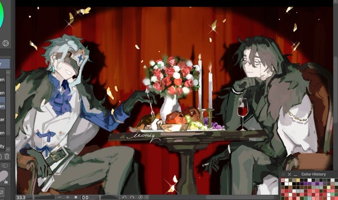{#fig:backup width="100%"}