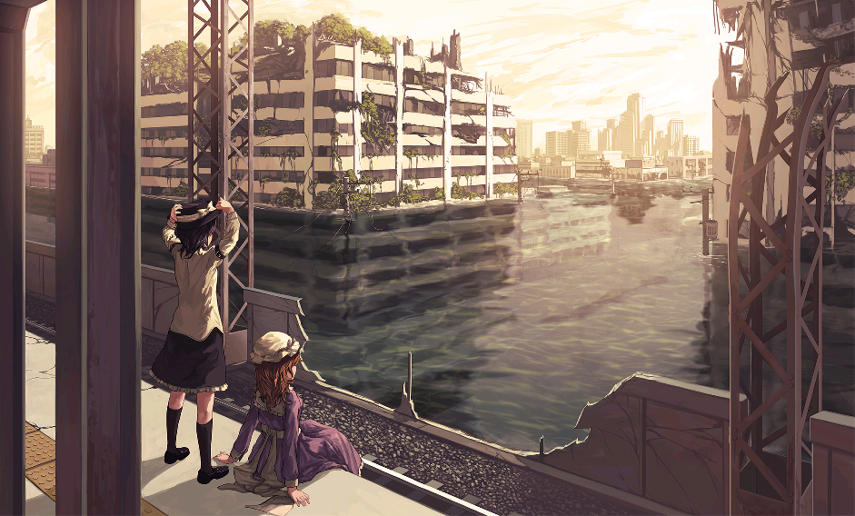

# 为什么秘封难以复制
 
*聊聊啥是秘封*

---
 
我一直觉得秘封俱乐部在东方系列里是个异类。宇佐见莲子和玛艾露贝莉.赫恩，两个京都大学生，一个能用肉眼读取时刻和坐标，一个能看见境界、在梦里漂流到幻想乡。故事发生在近未来，散文体，充满留白，ZUN的文笔甚至有点感性和古怪，但整个东西散发出一种很难复制的气质。
 
{#fig:childhood_sealed}

秘封到现在也有了一定的时候，至少在ACG里面比较老了。我对于关系性属于什么都能看，哪怕是人和索拉里斯星也行（不过确实对同性关系性更偏好一点），但我这么多年没有找到第二个秘封。

为什么呢，怎么就没有男性关系性或者男女关系性，亦或是人和人外关系性的秘封呢？我觉得这个问题挺有意思的。
 
---
 
## 秘封在交织什么
 
首先要搞清楚它的理工×人文到底混的是什么，不然交织就只是一个空洞的标签。
 
**理工侧**：量子力学和相对论的意象（时间、观测、不确定性），莲子对天文的直觉性运用，近未来科技对人类感知的异化。
 
**人文侧**：日本怪谈和妖怪文化的重新诠释，对现代化让人失去了什么的叩问，文学性极强的散文叙事。
 
但光列这两列还不够，因为很多作品也能各放一列。
 
秘封真正的核心在于它的**姿态**：它不是用科学解释神秘，也不是神秘对抗科学，而是**科学本身就是另一种通往神秘的路径**。相对论让时间变得浪漫，这句话就是秘封气质的精髓。
 
方程式和怪谈共享同一种令人战栗的美感，互相不祛魅对方。
 
---
 
## 为什么这种东西这么难出现
 
真正在理工和人文两个领域都有足够深度、且能*感性地*融合的人极少。ZUN本人学计算机，但阅读趣味和审美明显在文史哲那边。这种cross-wiring的人不多见。而且光有知识还不够，还需要那种特定的世界观，也就是相信两种认识方式可以共享同一套令人战栗的美感，而不是把一个当工具、另一个当装饰。这是一种罕见的*感受方式*。
 
出版和商业逻辑倾向于给作品贴标签归类。硬科幻是一个货架，文艺小说是另一个货架，交叉地带的东西很难被接受，因为发行方不知道卖给谁。所以即便存在这样的创作者，也很难在商业体制里把这种东西做出来。秘封体裁是个特例，它附生在音乐CD里，是ZUN几乎没有商业压力、完全自洽的私人创作。这种自由度在正规出版或商业创作框架里几乎不存在。它能以这种形式存在，本身就是一个偶然。
 
理工浪漫需要特定的文化土壤。秘封的独特性有一部分来自它深植于日本的物哀美学，那种对消逝之物的温柔惋惜和理科生式的精确感混合在一起。这个组合在其他文化语境里不太容易自然生长。它是很具体的一种日本式感受方式的产物。
 
---
 
## 结构上的核心机制
 
秘封能成立有一个非常关键的结构：**存在一个他者，一个两种认知框架都无法完全收编的东西**。
 
幻想乡对于莲子和梅莉来说就是这个他者。科学解释不了它，人文也只能部分描述它。它始终作为一个余数漏在两种框架之外。这个结构才是产生张力的根源。如果没有这个无法被收编的他者，理工和人文的交织就只是两个不同专业的人聊天，不会产生秘封那种气质。
 
---
 
## 勉强能类比的作品
 
找了一些，但都只是局部相似：
 
| 作品 | 相似之处 | 不同之处 |
|---|---|---|
| 《来自新世界》| 对文明与神秘的哲学思辨 | 更偏反乌托邦，科学感弱 |
| 《少女终末旅行》 | 末世废墟中的哲学对话 | 没有理工积极的浪漫感 |
| 格雷格·伊根的小说 | 硬科幻 + 存在主义 | 几乎没有人文或怪异 |
| 新怪谭（New Weird）| 神秘 × 现代知识分子视角 | 英语圈气质，怪谈 ≠ 温柔 |
 
坦率说，没有找到气质完全对位的。也许真的是因为现实中的莲子如圆城塔一般对弗洛伊德抱有不解，而现实的梅莉又会真正意义上觉得莲子客观定量的眼睛恶心，自此分道扬镳吧。
 
---
 
## 尾巴
 
我自己也脑洞过一个类似设定的故事，真正想细化的时候才发现对作者的要求之高远超最初预期。不只是要懂两个领域，还要能在感受层面让它们发生化学反应。这种人太少了。
 
后来又萌生过另一个方向。一个研究科学史的、一个用理工方式研究社会的，这两人的故事会不会有秘封味？理论上张力是存在的。一个用怀疑和历史化的眼光看客观真理，一个用信仰和量化的眼光看主观混沌，他们互相消解又互相需要。
 
当然，如果有哪个冷门播客或者故事有秘封的风格，能推荐给我就好了。
---