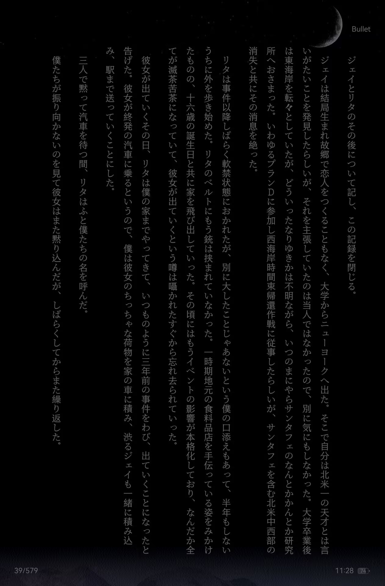
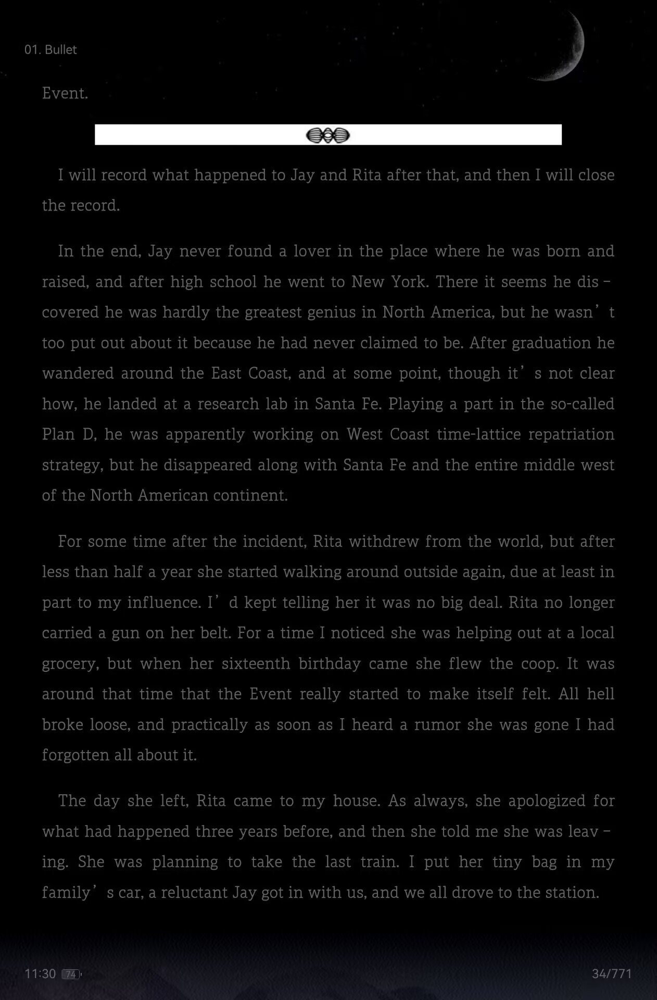

# 圆城塔的自指引擎

---
## 第一部

### Bullet

有点意外，看的时候发现Bullet这一章圆城塔好像玩了圣菲研究所的梗。当时不太确定，就去看了英版，结果还真是圣菲研究所啊。

{#fig_SIF}

{#fig_SIFEN}

这本书读着有种圆城塔写散文的感觉，看起来应该是小圈子的玩梗幽默向的，不知道为啥出圈了……这么一看有点不幸了。等边看边记好了。

### Freud

