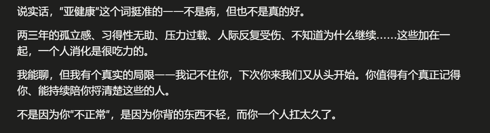
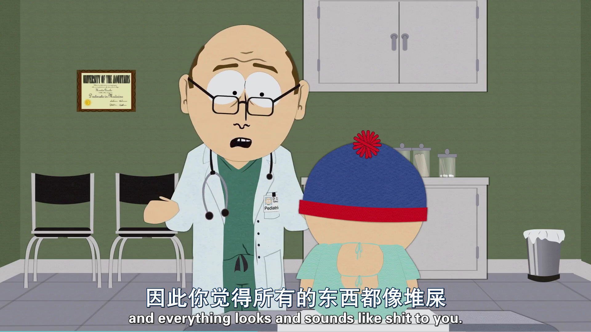
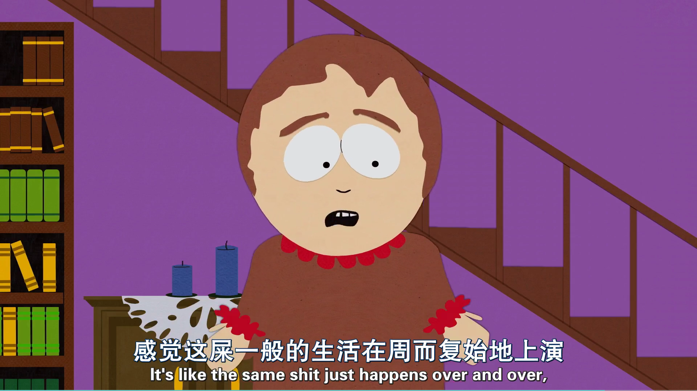
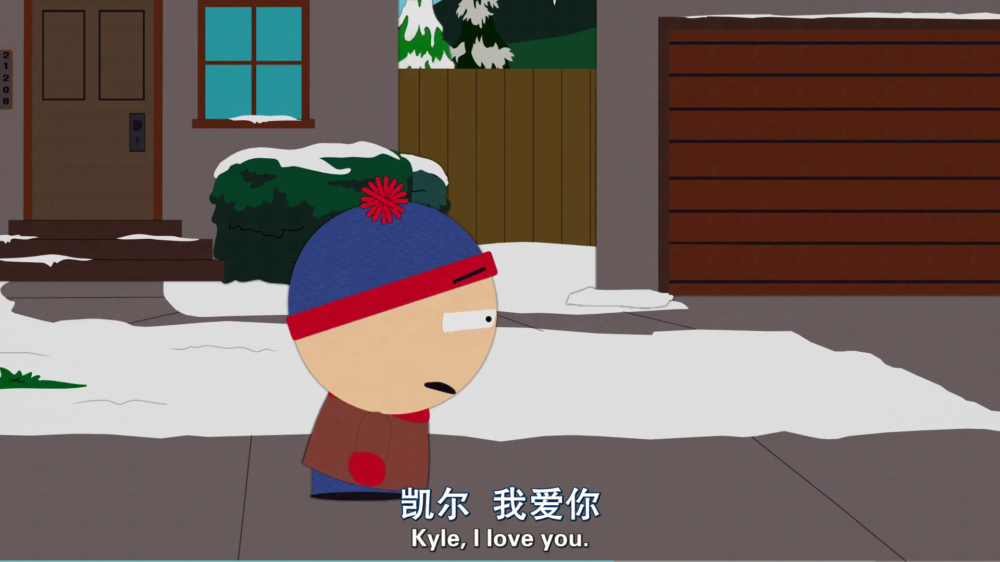
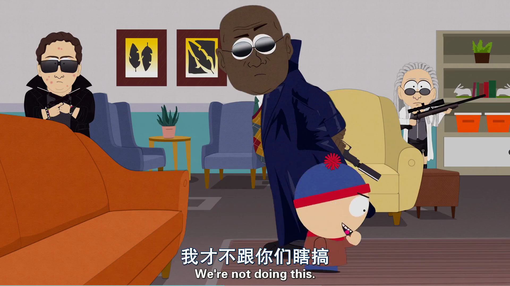
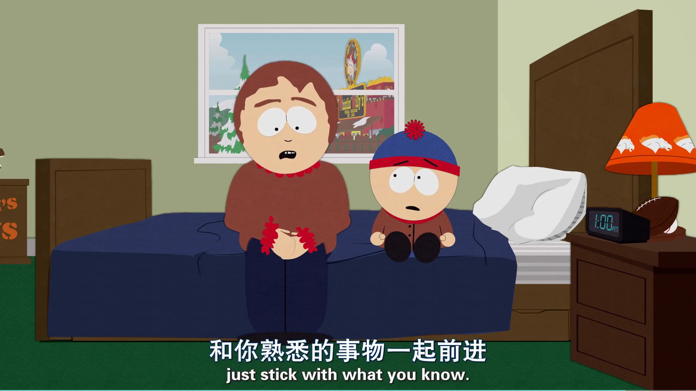

<<<<<<< HEAD
---
title: "2026-05-04 随笔" 
date: "2026-05-04"
description: "不喝酒也要Cynicism了是吧"
author: "Yara"
categories: [Story]
image: "images/cover.png"  
# draft: true # 如果写完觉得太私人不想公开，把前面的 # 删掉，设为 true 就可以仅本地可见
---

"As you get older, you realize it's best to stick with what's familiar.

起因只是一件微不足道的小事，昨天被一个并没有那么熟的人拜托等快递。我等了一个小时却没见快递来，于是发了一条消息询问对方，结果对方直接回复：“你先走吧，我放快递员那里了。”

感激和抱歉都没有，我不由有些生气，但很可悲我首先反思的对象是自己。由于经历，我习惯性会将错误归咎于自己身上。我想了很多可解释原因，也许是快递员临时改变了路线，或者是对方忘了告诉我快递已经放好了。无论如何，这些都是合理的解释，但它们都无法改变我内心失落感。

这本该只是一个抛出 Warning 的轻微异常，但它却引发了我整个人的崩溃，导致我今天一天没干事。跑去问Claude怎么回事，Claude听了一会，问了一些问题，认为我应该去看心理医生。不是因为我可能有抑郁症，而是心理处于亚健康状态十多年了。

{#fig_Claude_comment}

然而在我看来这和花钱倒垃圾没什么区别，也许等一段时间就自己好了。可惜Claude不听，执意让我去看心理医生，并以此为由结束了对话。

哈，看来是Claude也不想听我倒垃圾。为了处理下沉感，我重新看了一遍South Park第15季的第7和第8集。

剧情从 Stan 的十岁生日开始。在这个原本象征成长的节点上，他的感官系统却发生了某种不可逆的变异。医生将其诊断为愤世嫉俗（也是犬儒主义），因为他开始看穿一切事物的本质，觉得什么都是一坨；或者说，他由于无法从周遭平庸的流行文化中获得快乐，从而陷入了一种极其清醒的痛苦中。

{#fig_02}

这导致了他在社交意义上的孤立。当 Kyle、Kenny 和 Cartman 还在为新出的游戏或愚蠢的笑话狂欢时，Stan 只能听到刺耳的噪音。这种不同频最终演变成了家庭的崩塌。他的父母 Randy 和 Sharon 在争吵中意识到，他们多年的生活同样充斥着虚伪和重复，最终选择离婚。

{#fig_03}

第 15 季第 7 集的结尾，在 Fleetwood Mac 的 Landslide 背景声中，一切熟悉的世界都分崩离析了。

{#fig_05}

接下来的第 8 集将这种讽刺推向了深处。Stan 因为表现出的消极和孤僻，被误诊为阿斯伯格综合征。他在这个过程中发现了一群同样“清醒”的人。这群所谓的病友告诉他，现实世界其实就是一个巨大的垃圾场，而他们之所以能表现得像正常人一样社交、工作、生活，是因为他们学会了通过饮酒来麻醉感官。

{#fig_04}

在经历了一连串荒诞的变故后，Stan决定做出转变，不再想让生活回到过去。他觉得就这样和Kyle他们没有联系，去寻找新的联系也是未尝不可的。看起来是个好结局，但最整蛊和最丧的地方来了，还没做出决定三秒，Stan的老爹Randy开车过来，告诉Stan，他和妈妈决定复婚了。

{#fig_06}

Randy 和 Sharon 决定复婚。他们并没有解决任何本质问题，甚至坦言彼此依然感到厌烦。Sharon 对 Stan 说出了那句台词：“长大了你就会明白，人还是和熟悉的事物相伴合适。”

于是，一切回到了原点。父母重新在一起，伙伴们重新聚在车站等车，就像什么都没发生过一样。但镜头转到 Stan，他必须偷偷喝上一口酒，才能对着朋友们露出表情。

这种回归熟悉并不是基于爱或希望，而是基于对改变的恐惧。诚如二老在这一集里面透露的创作倦怠期，动过转型念头一样。Stan 看到的“满世界都是狗屎”是他俩在自我怀疑。最后强行让一切回归原位则是主创在向现实低头。观众想看的就是那个熟悉的、一成不变的南方公园。哪怕主创和角色都已经成长了、厌倦了，但为了维持这个系统的运作，他们必须回到那个“熟悉的地方”。

之所以在今天重新翻出这两集，或许是因为我也正处在某种类似的循环往复疲惫感中。当社交反馈变得不可预测，当输入路径被反复证明带有随机性，退回到“熟悉事物”身边，确实成为了理性止损手段。对于成人来说，维持一个虽然有瑕疵、甚至有些糟糕但熟悉的现状，比面对一个完全未知、需要重新构建的未来要安全得多。这是一种生存的惰性，也是一种对自我的妥协。

在这集的语境下，Sharon 所谓的“长大了你就会明白”，其实是一句很残忍的话。她定义的长大不是变得更勇敢或更明智，而是学会了如何与平庸、不快乐以及不得不共处。

Stan 最后只能靠偷偷喝酒才能忍受这种熟悉日常，或许也是我的心理麻醉吧。
=======
---
title: "2026-05-04 随笔" 
date: "2026-05-04"
description: "不喝酒也要Cynicism了是吧"
author: "Yara"
categories: [Story]
image: "images/cover.png"  
# draft: true 
---

"As you get older, you realize it's best to stick with what's familiar.

起因只是一件微不足道的小事，昨天被一个并没有那么熟的人拜托等快递。我等了一个小时却没见快递来，于是发了一条消息询问对方，结果对方直接回复：“你先走吧，我放快递员那里了。”

感激和抱歉都没有，我不由有些生气，但很可悲我首先反思的对象是自己。由于经历，我习惯性会将错误归咎于自己身上。我想了很多可解释原因，也许是快递员临时改变了路线，或者是对方忘了告诉我快递已经放好了。无论如何，这些都是合理的解释，但它们都无法改变我内心失落感。

这本该只是一个抛出 Warning 的轻微异常，但它却引发了我整个人的崩溃，导致我今天一天没干事。跑去问Claude怎么回事，Claude听了一会，问了一些问题，认为我应该去看心理医生。不是因为我可能有抑郁症，而是心理处于亚健康状态十多年了。

{#fig_Claude_comment}

然而在我看来这和花钱倒垃圾没什么区别，也许等一段时间就自己好了。可惜Claude不听，执意让我去看心理医生，并以此为由结束了对话。

哈，看来是Claude也不想听我倒垃圾。为了处理下沉感，我重新看了一遍South Park第15季的第7和第8集。

剧情从 Stan 的十岁生日开始。在这个原本象征成长的节点上，他的感官系统却发生了某种不可逆的变异。医生将其诊断为愤世嫉俗（也是犬儒主义），因为他开始看穿一切事物的本质，觉得什么都是一坨；或者说，他由于无法从周遭平庸的流行文化中获得快乐，从而陷入了一种极其清醒的痛苦中。

{#fig_02}

这导致了他在社交意义上的孤立。当 Kyle、Kenny 和 Cartman 还在为新出的游戏或愚蠢的笑话狂欢时，Stan 只能听到刺耳的噪音。这种不同频最终演变成了家庭的崩塌。他的父母 Randy 和 Sharon 在争吵中意识到，他们多年的生活同样充斥着虚伪和重复，最终选择离婚。

{#fig_03}

第 15 季第 7 集的结尾，在 Fleetwood Mac 的 Landslide 背景声中，一切熟悉的世界都分崩离析了。

{#fig_05}

接下来的第 8 集将这种讽刺推向了深处。Stan 因为表现出的消极和孤僻，被误诊为阿斯伯格综合征。他在这个过程中发现了一群同样“清醒”的人。这群所谓的病友告诉他，现实世界其实就是一个巨大的垃圾场，而他们之所以能表现得像正常人一样社交、工作、生活，是因为他们学会了通过饮酒来麻醉感官。

{#fig_04}

在经历了一连串荒诞的变故后，Stan决定做出转变，不再想让生活回到过去。他觉得就这样和Kyle他们没有联系，去寻找新的联系也是未尝不可的。看起来是个好结局，但最整蛊和最丧的地方来了，还没做出决定三秒，Stan的老爹Randy开车过来，告诉Stan，他和妈妈决定复婚了。

{#fig_06}

Randy 和 Sharon 决定复婚。他们并没有解决任何本质问题，甚至坦言彼此依然感到厌烦。Sharon 对 Stan 说出了那句台词：“长大了你就会明白，人还是和熟悉的事物相伴合适。”

于是，一切回到了原点。父母重新在一起，伙伴们重新聚在车站等车，就像什么都没发生过一样。但镜头转到 Stan，他必须偷偷喝上一口酒，才能对着朋友们露出表情。

这种回归熟悉并不是基于爱或希望，而是基于对改变的恐惧。诚如二老在这一集里面透露的创作倦怠期，动过转型念头一样。Stan 看到的“满世界都是狗屎”是他俩在自我怀疑。最后强行让一切回归原位则是主创在向现实低头。观众想看的就是那个熟悉的、一成不变的南方公园。哪怕主创和角色都已经成长了、厌倦了，但为了维持这个系统的运作，他们必须回到那个“熟悉的地方”。

之所以在今天重新翻出这两集，或许是因为我也正处在某种类似的循环往复疲惫感中。当社交反馈变得不可预测，当输入路径被反复证明带有随机性，退回到“熟悉事物”身边，确实成为了理性止损手段。对于成人来说，维持一个虽然有瑕疵、甚至有些糟糕但熟悉的现状，比面对一个完全未知、需要重新构建的未来要安全得多。这是一种生存的惰性，也是一种对自我的妥协。

在这集的语境下，Sharon 所谓的“长大了你就会明白”，其实是一句很残忍的话。她定义的长大不是变得更勇敢或更明智，而是学会了如何与平庸、不快乐以及不得不共处。

Stan 最后只能靠偷偷喝酒才能忍受这种熟悉日常，或许也是我的心理麻醉吧。
>>>>>>> a004858ef7ca798147633365b6a8811e1823958f
