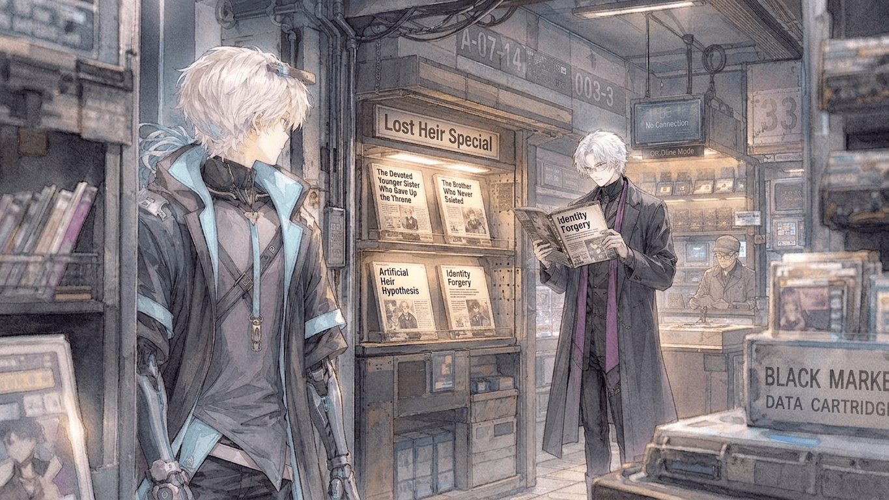

艾兹伊甸继任集团首领后的第三个月，第一层都市的公共安全指数重新回到了旧标准线上。至少集团发布的报告是这么写的。主干交通恢复了准点，夜间警备无人机的故障率降到了千分之一以下，自动物流的堵塞也在持续减少。城市上空那些属于集团的银灰色标志重新亮了起来，像什么都没有发生过。

只有地下世界对此不太买账。集团控制着城市的大部分正式系统，身份认证、公共通讯、基础设施、商业许可、警备网络……越是能够留下完整记录的地方，集团的控制力越强。所有不愿留下记录的东西便沉到了另一层。旧工业区里仍有不联网的终端，废弃轨道下有人卖没有编号的芯片，地下金融通过短距通讯结算，走私商把违禁技术写在一次性存储膜上，卖完便烧。到了夜里，某些店铺甚至会重新启用纸张——昂贵、麻烦，却无法被远程删除。

卡特斯罗特用了三个月，让这些东西开始按照自己的规矩运转。他没有兴趣给组织起什么响亮的名字。有人负责收钱，有人负责路线，有人负责解决麻烦。能用的人留下，没用的人走。至于他们从前属于哪个帮派、信哪一套规矩，他不在乎。反正地下世界的人很快就明白了一件事，新来的年轻人不喜欢废话。

---

这天下午，卡特斯罗特正在检查一条新接手的货运路线，旁边有人忽然笑出了声。一块巴掌大的透明屏被递到他面前，廉价地下刊物占满了画面。

**《消失的第二继承人——集团内部继承战秘闻》**

卡特斯罗特扫了一眼。文章把那场继承写成了一次决斗，甚至编出了双方使用的武器、观战的家臣和最后的胜负。写得煞有介事，但根本没有那场决斗。

“假的。”

他把屏幕推回去，视线重新落到货运路线图上。递屏幕的人本来还等着他往下说，等了几秒，只得到他手指沿着运输节点继续移动的声音。就这样，那份刊物又被传回桌子另一边。

地下每天都在生产类似的东西，董事会内斗、家族秘闻、上层居民长生不老。这些多数活不过三个夜晚，这一份看起来也不会例外。

两天后，第二版出来了。标题变成：

**《继承战从未发生——天才弟弟为何主动退出？》**

不知道经过了几次转手，第一版里那场轰轰烈烈的决斗已经被删掉。新版改称兄弟二人从未为继承权正式交手。

旧档案里关于第二继承人的记录也被重新翻了出来。早慧，善于判断，处理复杂事务远胜同龄人。几段零散的评价被拼在一起，很快便补出了一个足够完整的故事。弟弟远比兄长优秀，兄长却执着于成为支配者。弟弟就主动退出，把继承权留给了更需要它的人。

文章甚至替这件事写好了结论：**“强者不需要王座。他把王座留给了更需要它的人。”**

卡特斯罗特是在吃饭的时候看到这一版的，前面几段翻得很快。艾兹伊甸确实不擅长临机应变，压力一大，判断也会变得迟钝；论天赋，他从来不是更好的那个。卡特斯罗特没在这些地方停，直到最后那句话出现。他看了一遍，又翻回去看了一遍。

——留给了更需要它的人。

存储片被倒扣在桌上。过了一会儿，他叫来负责地下信息的人。

“查来源。”

对方扫了一眼桌上的东西，没有多问。卡特斯罗特也没有解释。

那句话仍留在他的脑子里，简直像在说有人把一个不需要的东西拿在手里，衡量过彼此的分量，再赏给另一个更可怜的人……

他皱了下眉，只觉荒唐。

当天下午，几个主要传播节点里的第二版陆续消失。

第二天，它变成了第三版。

---

第三版出来得比前两次都快。最初的标题已经被撤掉，取而代之的是另一行：

**《是谁在替家主修正历史？》**

这一次，没人再急着讨论那场并不存在的继承战。

地下的信息商开始看别的东西。他们记得哪些版本只卖了半天便从节点上消失，哪些内容刚刚被复制出去，就有人沿着传输路径逐一收回；也记得哪些说法从头到尾无人理会，哪怕已经传过三条街区。在官方网络里，删除意味着内容不存在；地下不是这样。东西消失得越干净，留下的形状反而越清楚。

几天之内，旧工业区几个最大的交换节点都开始流传一份新的整理稿。没人知道最初是谁做的，只知道那里面把此前几版刊物的改动按时间排在了一起。“弟弟败于兄长”最先消失，“因嫉妒而退出家族”也没有活过一天……把艾兹伊甸写成任人摆布的傀儡，几乎每次都会引来同一批人的处理。

反过来，关于第二继承人天赋卓绝的说法一直留着。说现任家主不善应变、承受不了太大压力，也没有人来管。最奇怪的是兄弟关系。凡是把两人写成积怨已久、彼此憎恶的版本，总会比其他内容更早从市场上消失。

到第三版刊物正式印出来时，这些痕迹已经被整理成了一个颇为完整的结论。那股始终没有露面的势力，似乎并不介意别人承认弟弟更有才能，也不介意别人指出艾兹伊甸的缺点。它只是不接受另一件事——那个弟弟看不起自己的兄长。因此，文章最后提出了一个与此前截然不同的猜测：

**失踪的第二继承人，也许至今仍然站在兄长一边。**

这一版传到卡特斯罗特手里时，他没有立刻关掉，屏幕的光停在最后一句上。他看了一会儿，随后把文件划回主界面，继续处理当天积下来的几份路线记录。

没有新的命令下去，第三版也因此完整地留在了地下网络里。

三天后，它的复制量超过了前两版的总和。

---

第三版留下来以后，关于第二继承人的东西忽然多了起来。

最先变热闹的是旧工业区那几个档案交换站。有人把集团历年的公开记录重新翻了一遍，发现第二继承人的资料少得异常。没有可靠影像，没有成年后的公开履历，也找不到正式发言。仅存的几份文件里，他更多时候只是以直系血亲或者第二继承候选的身份出现。

缺口一多，解释也跟着多了起来。

有一份长文坚持认为，集团不是没有留下资料，而是后来主动删掉了。理由是那个失踪的继承人掌握了足以动摇现任统治的东西，否则没必要把一个家族成员抹得这么干净。

没过多久，另一批人走得更远。他们认为根本没有什么弟弟，所谓“第二继承人”只是集团在某次内部权力重组后补上的解释。没有影像，没有履历，没有人见过……与其说是被删除，不如说从一开始就不存在。

这种说法在纸面刊物上卖得最好，而几个专门讨论旧技术的离线论坛更喜欢另一套理论。他们把艾兹伊甸继任后重新投入城市管理的大量自动机械，与那个擅长判断、处理复杂事务能力异常突出的失踪继承人放在了一起。

几天后，一篇题为《第二继承人是否为拟人执行单元》的文章开始在技术圈流传。作者认为，集团或许早就制造过一种专门处理非公开事务的人工人格，只是为了给它进入权力体系的权限，才替它补上了家族成员的身份。文章底下争了几百条。有人讨论人格连续性，有人考证旧型号的处理能力，还有人认真计算一个人工执行单元是否具备法律上的继承资格。

卡特斯罗特偶然扫到过一次，他没有看完。

事情真正往奇怪的方向走，是在几天以后。一份原本讨论档案缺失的文章，在结尾顺手问了一句：

**既然资料已经缺到这种程度，为什么所有人都默认第二继承人是男性？**

那句话起初埋在很后面，第二天被单独截了出来。第三天地下刊物已经有了新的封面：

**《被抹去的集团千金——“弟弟”身份或为后期伪造》**

卡特斯罗特处理完一批账目碰巧看到它，又往下翻了两页。文章用了很大篇幅证明，现存资料里真正能够确认性别的部分少得可怜。至于为什么集团要把妹妹改成弟弟，作者列了七种可能，从继承制度限制一直写到家族丑闻。

卡特斯罗特没看到第七种就把页面关了，当天没有任何处理命令下去。

过去几周里，关于第二继承人的许多说法都曾被迅速纠正。败北、嫉妒、怨恨、与兄长反目——只要碰到那些地方总会有人出手，唯独这一次没有。

地下的信息商很快注意到了这件事，于是新版前言多了一行：

**“截至目前，长期修正相关记录的匿名知情势力，尚未否认‘女性说’。”**

第二天，《被抹去的集团千金》卖断了三个交换点。

到周末，“妹妹”已经成了最流行的版本。

---

到周末，“妹妹说”已经不再只是某篇文章里的猜测，还渐渐有了完整故事。

地下信息市场最畅销的一版叫：

**《深情妹妹为兄让位——失落千金的无声守护》**

封面做得十分用力。银白色高塔占据了画面中央，一个模糊的女性剪影站在阴影里，把象征继承权的徽记递向王座。远处是地下城市的灯火。标题用了两种字体，其中“无声守护”四个字甚至做了发光处理。

卡特斯罗特第一次看到它，是在一批新货送进来的时候。他原本只准备确认里面有没有夹带别的东西，翻过封面后却多停了几页，因为故事已经被补得很完整。失落的妹妹天资卓绝，知道自己只要参加继承争夺就足以击败兄长，但成为支配者是兄长从小坚持到大的理想，于是她主动退出。被逐出家族以后，她没有离开这座城市，选择进入地下世界建立自己的势力，在兄长看不到的地方替他处理正式统治无法触及的麻烦。

作者甚至给这件事找到了一个漂亮的说法：

**她失去了站在王座旁边的资格，于是选择站在王座下面。**

卡特斯罗特看到这里停了一会儿，但再往后内容迅速失去可信度。妹妹幼年时曾替哥哥挡过暗杀，妹妹离开家族前在雨里站了一夜，妹妹至今仍保存着兄长小时候送她的机械头饰……他翻到这里，终于把存储片关了。

没有处理命令。

几天以后，第二批到货时那本东西已经换了新的封面，封面右上角多了“增订版”，一周后这东西还出了第四版。

地下市场显然已经把这件事当成了一门稳定生意。喜欢故事的人买“妹妹版”；喜欢查档案的人继续追着那些消失的记录，在新版《不存在的弟弟：集团继承记录断层再考》里争论第二继承人究竟有没有真实存在过；技术论坛那边也出了修订本《H-01：人工继承人假说》。后来甚至有人试图把几种解释拼到一起，出版了一本篇幅很厚的东西：

**《她从未出生——“妹妹”作为人工人格社会身份的可能性》**

这本销量意外不错。没过多久旧轨道区一家信息商索性腾出了一整排货架，上面挂着一块手写牌，大致写着“失落继承人专题”几个字。大众版放在最显眼的位置，旁边依次是档案考证、人工人格、身份伪造，以及几本暂时还没人说得清属于哪一派的东西。

卡特斯罗特经过店门口看见了那块牌子，没停下脚步。

---

地下市场把失落继承人做成专题的时候，上层监测系统也开始留下另一种记录。

起初只是几个不起眼的异常。某些地下节点的内容删除速度过快，几条已经进入扩散周期的信息在抵达相邻区域之前便失去了来源，还有一些原本沿着黑市线路继续传播的文件在固定几个中转点突然断开。单独看都不值得写进报告，连续三周以后它们却开始呈现出相似的形状。所有异常都围绕同一类内容发生，第二继承人、旧家族记录、继承权……以及艾兹伊甸本人。

负责地下舆情的人重新调出了此前的数据。那些被撤下的文章并没有真的消失，系统仍然保留着它们出现过的位置、传播过的方向和中断的时间。几张图叠在一起以后，一条看不见的边界慢慢浮了出来。有人比集团更熟悉地下的传播路径，有人能在信息扩散之前找到源头，有人掌握着旧家族资料，却始终没有利用这些东西攻击现任家主。

报告最后把这一组异常单独列了出来，艾兹伊甸是在当天的例行文件里看到它的。桌面投影展开后十几个地下节点悬在城市剖面图上。连接它们的传播路径颜色已经变淡，几个被人为切断的位置则被重新标记。中央附着着一个近期增长最快的关键词：

**失落继承人**

下面是自动归纳出的关联词。

**妹妹**

**人工人格**

**不存在**

艾兹伊甸的目光在第二个词上停了一下，又移了回去。

报告继续往下，“妹妹”相关内容的传播量目前最高，“人工人格”集中在旧技术论坛，“不存在”则主要来自档案交换站。至于这些东西为什么会突然聚集起来，监测系统只给出“存在持续性的外部信息干预“这一解释。

艾兹伊甸把前几页重新调出来。干预者没有留下身份，只有习惯。熟悉哪些节点值得处理，知道哪些线路最快，也知道怎样让一份东西消失得不像集团动过手。到了最靠近地下核心区域的几条路径，追踪记录全部中断。他看了一会儿，关掉了传播图。

当天晚些时候，身份管理部门收到了一项临时申请。没有随从，没有集团标识，也不使用家主本人通常的认证路径。

---

两天后，地下旧轨道区。

那一带原本是货运系统的一部分。轨道废弃以后，沿线的仓库被拆成了许多狭长的店铺，外墙仍留着集团早年的编号。大部分店面不接入公共网络，只在门口挂一块短距信号牌，写着当天可以买到的东西。

艾兹伊甸到这里时，已经换掉了平日的衣服。临时身份绕开了公共识别，声纹也被压低了少许。对于只在集团发布影像里见过他的人来说，这种程度已经足够。旧轨道区每天都有来自上层的采购人、掮客和匿名客户，多一个衣着普通、神情冷淡的男人，并不会引起注意。

他沿着监测报告里最后几个失去追踪的节点走了一遍，其中一家店门口多了一块新牌子——**失落继承人专题。**

艾兹伊甸停了下来。店内一整面窄架都被这件事占满，大众版摆在最外面，封面一张比一张夸张；往里是档案考证，再往里是人工人格、身份伪造和几种已经很难归类的综合理论。某本厚得异常的修订本甚至附了一张第二继承人的“可能人格结构图”。最显眼的位置摆着当天刚到的新刊：

**《深情妹妹为兄让位——内部证言完全版》**

他取了一份。发行商声称，新版采用了“长期修正相关传闻的匿名知情人士”留下的材料。所谓内部证言究竟是什么，前言没有说明；后面几十页却已经据此重新整理出一套完整故事。那个被集团抹去的妹妹天赋远胜兄长。她知道，只要接受继承争斗，王座最终一定属于自己，可那也是兄长唯一坚持了许多年的理想，于是她退出。离开家族以后，她仍然留在城市地下，从另一端替兄长填补正式统治无法触及的缝隙。

艾兹伊甸翻过一页，那中央印着一行经过特别排版的句子。

**她拥有足以夺走一切的才能，所以选择什么都不夺。**

下面还有一句：

**她失去了站在王座旁边的资格，于是选择站在王座下面。**

艾兹伊甸没有继续往后翻。

就在这时，门口的短距感应器响了一声，卡特斯罗特走了进来。他没有换身份，也没有做任何伪装，这里本来就是他的活动范围。一路过来甚至有人向他点头，只是没有谁把地下这张年轻的面孔，与集团旧档案里那个已经消失的继承人联系在一起。

卡特斯罗特是为那本“内部证言完全版”来的，可看见站在货架前的人后脚步停了一瞬。衣服不对，声音如果开口，大概也不会完全一样，但那个人看东西时微微压低视线的习惯没有变。

{#fig_storeCG}

柜台后的老板先注意到了他，顺手朝货架方向示意了一下——新刊刚到，最外面那摞已经少了一半。卡特斯罗特终于走过去，艾兹伊甸也在这时抬起头，两人隔着那一排“失落继承人专题”对视了片刻，谁都没有叫对方的名字。老板低头继续整理刚送来的存储片。店里只剩旧轨道深处偶尔传来的震动。

艾兹伊甸重新低下头，看了一眼书页。卡特斯罗特也看见了那两行字，沉默了一会儿。

“性别错了。”

老板抬起头。

艾兹伊甸没有动。过了片刻，他才把视线从书页移到卡特斯罗特脸上。

“重点是这个？”

经过处理的声音低了一些，语气没变。

卡特斯罗特顿了顿。

“不是。”

艾兹伊甸翻回前一页，那里把整个继承过程归结成了一句话。

**才华卓绝的妹妹，最终将王座留给了更需要它的兄长。**

他的手指压在“留给”两个字旁边。

“这个呢？”

卡特斯罗特看了一眼。

“也错。”

“哪里？”

这一次他回答得很快。

“不是让。”

店外一列无人货车从仍在使用的轨道上经过。细小的震动沿着墙面传进来，货架上的透明存储盒轻轻碰了一下。艾兹伊甸仍然看着他，卡特斯罗特皱了下眉。

“你想要而我不要，就这样。”

那句话落下以后，艾兹伊甸很久没有翻页。卡特斯罗特原本以为事情已经解释清楚了，从小时候开始就是这样，哥哥想成为支配者而他不想，既然如此根本没有别的东西需要解释。

可艾兹伊甸只是低头看着那页纸。

“……就这样。”

卡特斯罗特这才察觉到他的语气不对。

柜台后忽然传来一声很轻的提示音。两个人同时看过去，老板手边那台原本用来登记库存的离线终端，不知什么时候已经亮了起来。屏幕上只记了几行：

**第二继承人为男性。**

**未发生正式继承战。**

**主动退出。**

最后一行刚打到一半：

**疑似存在直接知情——**

卡特斯罗特走了过去，老板下意识按住终端。十几秒后屏幕熄灭，外壳与存储模块分开躺在柜台上，接口断得很干净。

老板看着那几块残骸，又抬头看了看卡特斯罗特，他却已然转身。艾兹伊甸合上了那本书，经过柜台时他的视线在拆开的终端上停了一下，没有说什么。两人一前一后离开店铺。

直到门口的感应器重新安静下来，老板才低头检查残骸。内部存储已经坏了，但短距缓存刚才自动同步过一次。他抬头看向门外，旧轨道区的人流已经重新合上，看不出那两个男人去了哪边。

货架上，《深情妹妹为兄让位——内部证言完全版》仍然缺了一本。艾兹伊甸没有带走，卡特斯罗特也没有。

---

第二天，昨夜那家信息铺的短距缓存出现在了三个交换节点。损坏的记录并不完整，能够确认的只有几件事：失踪继承人为男性、兄弟二人从未进行正式继承战、第二继承人确实主动退出以及——昨夜有两个对此事异常了解的男人同时出现在店里。

中午以前，新的标题已经替换掉了“失落千金”。

**《“妹妹说”正式破产——失踪弟弟身份再调查》**

到了下午，标题又改了一次。

**《失踪继承人现身？旧轨道区神秘同行者身份成谜》**

地下市场重新分出了几种解释。有人认为另一个男人是第二继承人在集团内部的接头人，有人认为那是负责监视他的监察人员，还有人从两人对家族旧事的熟悉程度出发，认定对方同样出身旧家族，只是身份也遭到了删除。

最下面还有一个几乎没人支持的猜测。

**艾兹伊甸本人。**

理由很快遭到反驳。现任家主没有理由亲自进入地下旧轨道区，更没有理由站在一家未经许可的信息铺里，翻看关于自己的地下刊物。这个说法只活了半天就被挤到了页面最下面。

卡特斯罗特看到那份整理稿时，正在核对新一天的货运记录。屏幕在“艾兹伊甸本人”那一行停了一会儿，随后被划到一边。

这一次，没有任何关于内容修正、来源追踪或者传播节点的命令发出去。

当天晚上，新刊照常流通。

第二天也一样。

一周以后，“失落继承人”的几个主要交换节点开始安静下来。有人仍在争论人工人格，有人坚持档案删除本身就证明第二继承人掌握着某种集团机密，《深情妹妹为兄让位》则趁“妹妹说”破产之前最后加印了一批，封面角落多了一行很小的字：

**旧版身份设定，收藏用途。**

再过一阵，一名集团高层被拍到在非登记住宅停留过夜。地下市场迅速腾出了新的专题货架，“失落继承人”被移到了里面，后来连那块牌子也撤了。旧工业区仍然有人出售没有编号的芯片，废弃轨道下面的短距信号每天亮起又熄灭。新的消息沿着这些线路传出去，被修改，被转卖，被遗忘。

卡特斯罗特的组织也在继续扩张。多了一条路线，又接手了两个交换点，有人开始习惯在事情解决不了的时候来找他。这些变化没有出现在集团的公共安全报告里，至少暂时没有。

某天整理旧货时，有人从一箱廉价存储片里翻出了《深情妹妹为兄让位》的第四版，顺手带回了办公室。

卡特斯罗特晚上才注意到它。封面已经磨花了一角，银白色高塔下面，那位从未存在过的妹妹仍站在阴影里，把象征继承权的徽记递向王座。他拿起来看了一会儿，然后把它放回桌角。

第二天早上，存储片还在那里。

没人再提。