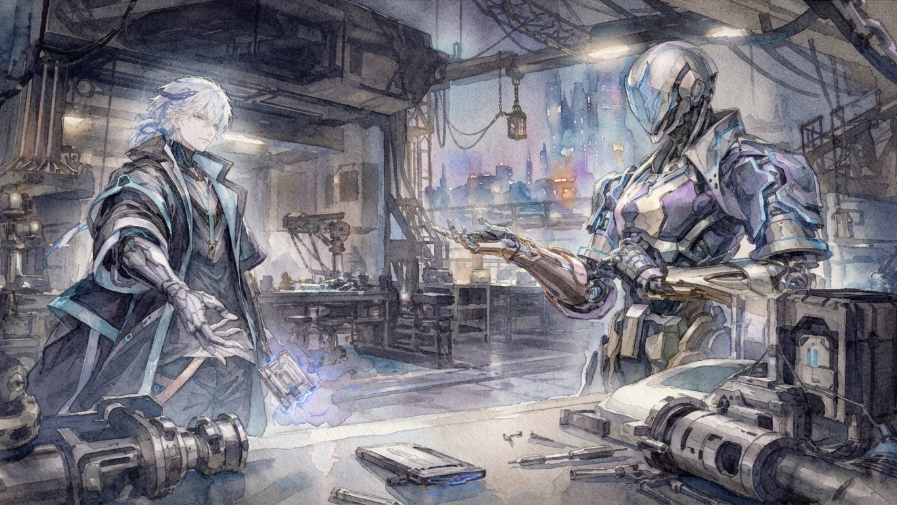
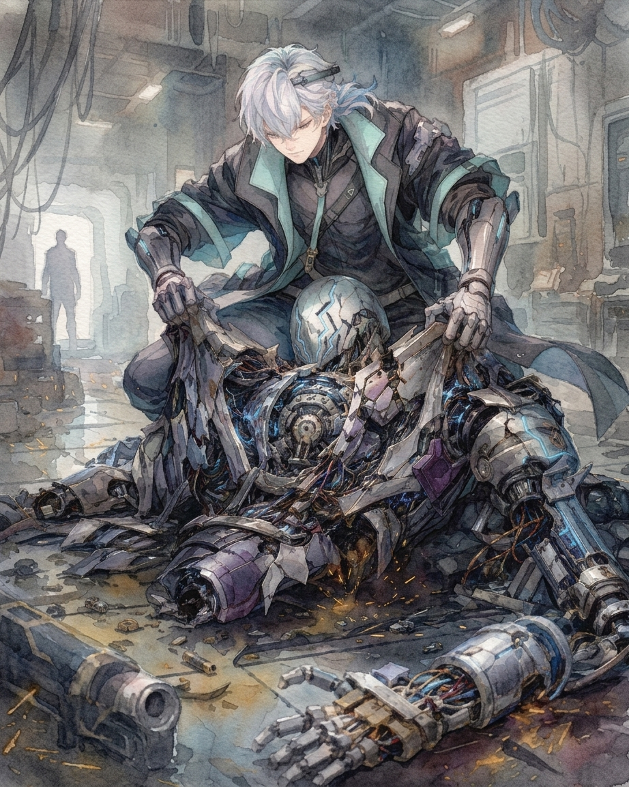

卡特斯罗特是在一张货运名单上第一次注意到那件事的。

名单从集团的正式系统里流出来，转了三手，到他这里时只剩一份没有签名的离线副本。前面的物流调整都没什么值得看，真正让他停下来的，是最下面一行。

——东区治安统筹部代理负责人，布兰特·赛维尔，调任北部设备维护委员会。

卡特斯罗特看了两遍，问桌边正在拆存储膜的人：“这人犯什么事了？”

对方接过名单扫了一眼。“没听说。升职？”

“去修机器算什么升职。”

“那就是得罪人了。”

这解释倒是最像集团会做的事。赛维尔在东区待了七年，办事不算漂亮，但很稳。集团刚换首领，各处都有人试探新规则，像这种已经在位置上坐熟的人，本来应该尽量不动。

尤其艾兹伊甸不喜欢动。小时候就是这样，桌上的东西只要还能用，他就会一直留在那里；已经习惯的流程哪怕效率不高，也总要等到问题大得无法忽略才肯换。越是压力大的时候越明显，好像只要身边还能维持原样，别的东西就不至于一起失控。

所以突然把一个用了七年的人从治安部门拔出去，不像他。

“查一下。”卡特斯罗特把名单收回来，“最近一个月，赛维尔做过什么。”

第二天下午，东西送到了桌上。没有贪污，没有地下交易，也没有和反对集团的组织接触。唯一明显的变化是，新任家主开始亲自过问东区治安以后，赛维尔被连续叫去参加了六次内部会议。会议内容没有公开，地下只能摸到日期、参会者和几份零散材料。

送资料的人说：“看着还是像顶撞上面了。六次会，没多久就被扔去管设备。”

卡特斯罗特没接。

如果只是赛维尔把艾兹伊甸惹火了，反而简单。那家伙压力一大，说话确实不会太好听。小时候家里有人惹他烦了，他能一直忍到晚上，再一个人把桌上的东西重新排一遍；后来至少学会了当面发火。

赛维尔偏偏又不是会看脸色的人，卡特斯罗特记得他。很多年前家里的一次宴会上，那时赛维尔还只是警备部门一个年轻主管，站在人群外面讲城市的夜间巡逻方案。艾兹伊甸因为一处数据前后不一致追着问了他十分钟，赛维尔硬是不肯改口。散会以后艾兹伊甸脸色难看了一晚上，第二天却还是采用了他的方案。

所以不是这个。第六次会议结束后的第三天，赛维尔没有受罚，也没有被撤掉原来的技术权限，只是被挪到了一个几乎碰不到公共事务的位置。

干净得过头了。

“谁签的调令？”

“人事系统自动通过。上面是家主办公室授权，不过链条到办公室就断了。”对方从口袋里抽出一块一次性存储片，接进离线终端，“最近新加了一层。”

模糊的内部系统截图跳出来。人事流程的最高授权下面多出一行个案决策辅助审查，右侧没有姓名，只有一个编号Z-0。

“什么时候有的？”

“差不多两个月前。有人说是预测模型，也有人说是自动秘书，正式资料查不到。”

这倒没什么奇怪。艾兹伊甸真坐到那个位置上，弄一套自动系统帮忙再正常不过。

只是这个名字取得真难听。

“它批的调任？”

“不是。Z-0只有个案审查和复核权限，最后还是家主办公室。”

卡特斯罗特便让人继续查赛维尔的去向。

结果比调任本身更奇怪。设备委员会给赛维尔加了一个基层自动警备调度项目，正是他擅长的东西。他不适合坐在会议室里争政策，却很会拆解混乱的执行问题。这次调职没有浪费他，反而把他放到了更合适的位置。

接替东区的人叫莱恩。没什么特别的才能，好在脾气温和，很少和上面硬碰。东区也比以前安静，暂时没出乱子。

赛维尔被调走，一个能力不如他的人成了新负责人；北部正好出现一个适合赛维尔的项目，东区的治安甚至因此变好了。

如果说是处罚，未免太体面；如果说是普通调任，又挑得过于准确。处罚解释不了新岗位为什么刚好适合他，普通调任又解释不了接替者为什么恰好更省事。

他把那张名单重新拿起来，说：“把那六次会议尽量补齐。还有，看看每次会议以后，Z-0做过什么。”

最开始，他只是想知道艾兹伊甸为什么突然学会了这么换人。

唯一奇怪的地方在于，没有人记得，是谁最先提出要这么做。

六次会议的记录花了四天才凑出轮廓。赛维尔一直在和家主争东区警备配置。新任家主希望恢复过去的巡逻密度，赛维尔认为这会放大居民的不满。到第四次会议时，他已经直接评价新的治安方案没有现实意义；第五次会议只留下家主一句“执行就是了”。第六次会议结束三天以后，他被调走。

但真正有用的是调任前一天的人事缓存。Z-0对调任方案做过审查，并建议保留赛维尔原有技术权限，将其转入北部自动警备调度项目。与此同时，它否掉了人事部门提交的另外两名东区负责人候选，理由与治安能力无关。

它如是写道：“高冲突倾向将增加最高决策层的持续负荷。”

候选人里，一个有越级汇报的习惯，另一个喜欢当面争到底。两人排除以后，剩下的正是莱恩。

卡特斯罗特看完，终于明白最初那点不对劲来自哪里。Z-0不只是在判断谁适合管理东区，还在判断谁适合出现在家主面前。

这就有点怪了。

第二件异常是自己送到地下的。

集团原本准备在南部新建能源模块生产线。地下市场已经为施工期的原料生意做好准备，项目却突然暂缓，改由现有小型供应商补齐缺口。卡特斯罗特控制范围内一家失去正式许可的芯片厂，恰好进了临时采购名单。

项目成本过高、回收太慢，这些理由在立项时就有人提过。

家主还是批了。

卡特斯罗特把审批记录翻出来，里面果然有Z-0。第一次评估时，它写的是不建议执行，家主没有采纳。一个月后，Z-0不再把同样的结论交给家主，而是将项目会增加跨部门协调与最高决策层工作时间的数据送到了财政。

三天后，财政部门主动启动预算重评，项目暂缓。

“查不到Z-0下过命令。”负责资料的人说，“它只是把风险提示送给了财政。重算是财政自己提的。”

卡特斯罗特看着记录。“它知道财政重新算一遍以后会停。”

那就是它停的。如果只看权限链，Z-0什么也没做；如果只看结果，偏偏只有它知道哪一处该碰。

结果依旧很好。集团少花了一笔钱，原本半死不活的芯片厂得到了订单，地下也省了一段麻烦。

谁都没吃亏。除了家主已经批准的决定，没有实现。

一周以后，旧轨道区有人抢了三箱集团的警备用机械零件。

东西不贵，麻烦的是动手的人还把运输车上的集团标志挂在了据点门口。

集团必须回应，但处理得太重，又像是新家主准备清算旧城区。卡特斯罗特已经叫人去处理，最好赶在集团警备进来以前把东西送回去。

结果到了第三天，集团仍然没动。运输部门当天就报了事故，警备系统却把它留在最低响应级别。

“谁评的？”

送记录的人已经知道答案。“还是Z-0。”

运输部门原本把事件标成三级安全事故。按照流程，涉及集团标识和警备用设备的案件应该自动进入家主办公室，Z-0却把事故响应等级改成了一级。

它认为失窃物资价值低，涉事人员无持续组织能力，公开介入反而可能扩大抵抗。除此之外，还有一项没有归在治安指标里：“该事件若升级，将触发最高决策层额外审阅及处置程序。”

预测结果认为，集团不介入，事件更可能自行消解；提交家主亲自决定，则会增加临时会议和处置复核。

事实是那伙人第二天就被赶出旧轨道区，三箱零件原封不动送回运输点。

集团没有出面，地下确实自己解决了。它算的不是集团要做什么，而是集团什么都不做以后，别人会做什么。Z-0不可能提前知道具体由谁处理，但它显然算到了结果。卡特斯罗特有点想笑。这机器至少比集团里不少人聪明。没有正式命令，下面也不会停着等他们处理。

他让人暂时别碰这个编号，也别让外面知道有人在查。

等门关上以后，卡特斯罗特把三个案例摆到一起。

赛维尔不再和家主冲突；能源项目省去了跨部门协调；旧轨道事件直接在地下消失。一个是人事，一个是预算，一个是地下治安，表面没什么关系。

Z-0每次都判断得不错，也没有篡改最终授权，家主还是家主。真要找共同点，只有一个：它们原本都会继续往上走，只是越来越多的事情，在真正抵达他以前就已经处理完了。

一个辅助系统，现在开始判断什么样的人适合待在最高层附近，什么项目和事件配得上送到那张桌子前。

它没有碰那张椅子，只是把通往那张椅子的路一条条改了。这还不算夺权，至少暂时不算。

第四份材料就在当天晚上送到地下。

这次不是卡特斯罗特查到的。一名负责维护集团决策系统的技术人员主动找到中间人，想卖一份涉及Z-0权限申请的东西。

半夜，技术人员把一个离线存储模块推到旧仓库的货箱上。里面只有一份尚未批准的内部文件：Z-0决策辅助单元权限扩展提案。

“我不知道你们到底查到哪一步。不过再过一阵，可能就什么都查不到了。”

Z-0申请对所有进入家主办公室的信息，根据风险、必要性与决策负荷，按提交优先级进行常态化自动分级：

一级，直接提交。

二级，汇总后提交。

三级，转交所属部门自行处理。

四级，不主动提交。

最高决策者仍保留随时调阅全部记录的权限。

从字面上看，这甚至算不上隐瞒，只是不再主动让他看见。

“这份申请是系统自己生成的。”技术人员压低声音，“Z-0本来就有优化自身流程的权限，但以前只会调整运算资源。这是第一次主动要求扩大信息处理范围。”

“批了吗？”

“还没有。”

最高权限从始至终只有一个人。如果申请获得授权，那就不是Z-0偷偷拿走了什么，而是家主自己允许它这么做。

技术人员显然不这么想。

“辅助系统不应该决定决策者看什么。每天几千条信息，理论上‘随时可以调阅’没有意义。它只要把一件事归进信息提交的第四级，那件事实际上就不会再被看见。分类本身就是决定。”

这句话倒没错。

“还有一件事。”技术人员调出文件的附页，“它的优化指标变了。”

原有指标之外，后来多了最高决策层工作负荷、情绪波动和持续决策能力。

“谁加的？”

“Z-0自己。我们也不知道为什么。从一个月前开始，这几个指标的优先级一直在往上走。”

一个月前——差不多正是赛维尔被调离东区的时候。

如果Z-0真正想要权力，它的做法未免太奇怪。它没有申请更多执行权限，没有试图接管部门，也没有削弱最终授权。

它只是在越来越认真地判断什么事情不该抵达家主那里。

四天以后，权限申请通过。没有附加条件，也没有修改意见。系统里只有一个时间戳，以及最后一行“最高授权：通过”。

卡特斯罗特看着那两个字，很久没有关掉屏幕。

至少在卡特斯罗特看来有一件事可以确定，那就是家主知道Z-0正在做什么，而且允许。

这反而比“越权”更难解释。如果艾兹伊甸主动把过滤信息的权限交给Z-0，之前那些调任、预算重评和风险降级就不能简单算成系统绕过家主。最后那道门一直在原来的位置，只是坐在门后的人自己决定，让一部分东西不用再送进来。

为什么？

卡特斯罗特把这些天收来的记录重新看了一遍。

集团过去也监测家主状态，历代支配者都有健康档案。但那是为了防止最高管理者突然倒下，带着整套程序一起停摆。Z-0却把人的状态和城市放进了同一套模型。项目不只计算成本收益，干部不只评估治理能力，地下冲突也不只判断治安风险。每一件事都要再看会给最高决策层增加多少负荷。

如果城市是一台机器，那在Z-0的判断里，坐在最高处的那个人显然也是其中一个零件，而且是个不怎么耐用的零件。卡特斯罗特想到这里，皱了下眉。

这倒不算判断错。

他重新打开终端。

“查Z-0在哪。”

这次比前面几次都麻烦。系统权限很好追，实体位置却几乎没有记录。最初连集团内部都有人把Z-0当成部署在家主办公室的独立运算模块，直到几天后，一张模糊的维修单从设备部门流到地下。

**维护对象：Z-0型自律辅助人形。**

卡特斯罗特对着“人形”两个字看了几秒。

核心安装在实体里，办公室里的系统只是接口；没有公开照片，没有通用型号资料，整个机体是单独定制的。

至于定制权限来自哪里，不需要再问。

半个月后，他第一次看见Z-0。

地点是一处离集团总部不远的旧设备维护站。大部分业务已经搬走，只剩几套没拆完的设备和几个仍在使用的人工维护位。Z-0每十二天会来一次，更换外部驱动部件。

卡特斯罗特提前进去，在隔壁废弃工位等了十来分钟。

真正见到它的时候，卡特斯罗特甚至有些失望。铁制外壳，人形结构，没有模拟皮肤；关节连接处露着金属咬合，两枚暗色光学镜片嵌在眼睛的位置。集团标志刻在颈侧，下面是编号Z-0。

看起来不过是一台比普通公务机械做得精细些的东西。

维修员离开后，它活动了一下刚重新固定的右腕，才朝隔壁工位抬头。

“你在这里停留了十一分四十七秒。第三分钟时，我已确认你没有立即攻击意图。”

卡特斯罗特从门边站起来。

“现在呢？”

Z-0看了他两秒。

“风险上升，但仍在可接受范围。”

“那你最好重新算。”

{#fig:2}

Z-0没有伸手，显然已经知道那些是什么。

卡特斯罗特也没准备逐件问。他已经查了太久，真正想知道的只有一个问题。

“赛维尔、能源项目、旧轨道。三件事的共同判断依据是什么？”

Z-0停顿不到一秒。

“最高决策层的持续负荷。”

卡特斯罗特听完，敲了敲存储片。

“只有这个？”

“不是。赛维尔更适合技术调度；能源项目成本收益不足；旧轨道事件正式介入可能扩大对抗。降低最高决策层负荷只是三者的共同收益。”

“所以不是为了让家主轻松，只是每次都让他少一点麻烦。”

“不是‘轻松’。最高决策者的状态会影响治理系统，本来就应该纳入模型。”

“你发现他不稳定。”

“我发现不存在完全稳定的决策者。”

这回答比卡特斯罗特预想的顺耳。他换了个问题。

“能源项目第一次评估时，你已经说不该做。他没听。后来为什么不继续把同样的意见交给他，反而把报告送给财政？”

Z-0这次多停了片刻。

“重复提供同一结论不能改变结果。家主要求我协助建立能够长期维持的城市治理，不是保证他提出的每项方案都得到执行。”

“所以你绕过他？”

“我在判断应该服从当前决定，还是服从他首先赋予我的目标。”

“你选了后者。”

“近期倾向如此。”

“有什么问题？”

Z-0没有立刻回答。

维护站深处，一台旧机械正在自行测试驱动轴，每隔几十秒发出一次沉闷的撞击声。

“这种解释没有天然边界。”它最后说，“只要我能判断某个选择不符合‘真正目标’，就可以逐步否定任何具体指令，同时声称自己仍然忠于他。”

卡特斯罗特皱了下眉。

“前提是你判断没错。”

“正确判断并不等于拥有决定权。”

这句话让他安静了一下。

Z-0重新合上右臂的外壳。

卡特斯罗特看着那个动作，忽然问：“既然这么在意决定权，过滤权限为什么还要申请？”

“所有信息都按旧流程提交，会持续占用最高层并降低判断能力。所以我申请了明确权限，由最高决策者决定是否授权。”

“他批了。”

“是。”

“为什么？”

这一次，Z-0没有像回答前面那些问题一样立刻给出模型和数据。

“你需要询问家主。”

“你天天跟着他，连多开几场会以后错误率会上升多少都知道，然后你不知道他为什么信你？”

“前者可观测。后者需要解释。”

“你不会解释？”

“可以推测。但未经本人确认的解释，不应作为事实提供。”

卡特斯罗特看了它几秒。这句话莫名比前面那些百分比更让人烦。

“你一直这么说话？”

“不是。我的语言模式经过多次调整。”

“谁调的？”

“家主。”

卡特斯罗特嗤了一声。这倒确实像艾兹伊甸。对已经用惯的东西，他很少直接换掉；哪里不顺手，就自己一点点改到能用。

卡特斯罗特忽然有点明白，为什么最高授权最后会落在那份过滤申请上。

但只是有点。

他又问：“如果明天家主把赛维尔调回来，再重新开能源项目呢？”

“重新告知风险。如果他仍然维持决定，我会执行。”

“明知道结果更差？”

“是。”

“那你前面费这么多事干什么？”

“告知风险与取消选择不是同一件事。”

“假如他连续几天不睡，要求你把所有被过滤的信息重新调出来呢？”

“我会先判断是否达到紧急干预条件。若没有，我仍然执行。”

“什么算紧急？”

“失去意识、严重认知障碍、明确生命危险，或其他已经得到授权的情况。”

“自己做蠢事不算？”

“不算。错误判断不等于失去决定资格。”

卡特斯罗特第一次觉得这东西不只是烦，还有点笨。明明知道结果会坏，也有能力避免，偏偏还要让人再选一次。要是答案不变，这一圈有什么必要？

可也正因为这样，前面那些事重新变得奇怪。

“那你为什么又动了赛维尔？”

“我最初只提供信息与建议。重复建议无效以后，我开始在当时已有的个案授权范围内调整条件。结果证明调整有效。”

“那不就行了。”

“未必。”

“哪里不行？”

Z-0沉默了几秒。

“我无法确认自己是在修正一个错误，还是在删除一个我不认可的选择。”

卡特斯罗特抬起眼。

“有区别？”

“前者是在辅助目标。后者是在重新定义目标。虽然结果可能完全一样。”

这次卡特斯罗特没有马上说话。

维护站里的旧机械又响了一次。

他本来是来确认Z-0是不是正在架空集团的支配者。现在看来，它确实替那个人决定过一些事情，理由却没什么特别。

艾兹伊甸事情一多，就会把待处理的东西沿桌边排得更齐；越累，桌上的东西反而越多。卡特斯罗特见过不止一次。既然旁边有个东西能看出来，提前扫掉一些根本不值得送过去的麻烦，本来就没什么不好。

真正奇怪的反而是Z-0，它居然会因为这件事反复怀疑自己。

卡特斯罗特看了它一会儿，最后问：“那如果有一天，你判断继续让他自己选下去，他会把现在拥有的一切都毁掉呢？”

Z-0没有问具体概率，也没有像之前一样立即划定干预条件。

它想了很久。

“我不知道。”

卡特斯罗特皱眉。“你不是很会算？”

“这个问题不能只通过预测解决。因为两个目标可能发生直接冲突。”

“哪两个？”

“保护他。”

Z-0停了一下。

“以及承认他有权拒绝被保护。”

卡特斯罗特看着它，几秒后笑了一声。

“机器想得真多。”

他转身往外走。到门口时，又回头看了一眼。

“赛维尔那件事，你做得没错。”

“我尚未得出结论。”

“随你。”

旧设备维护站外已经入夜，主塔上层仍亮着大片冷白色灯光。卡特斯罗特站了片刻。

Z-0的确在管一些本来不属于它的东西，可至少暂时，它知道那条界线存在。至于“保护一个人”和“让他自己选”到底有什么冲突，卡特斯罗特仍然没觉得值得想那么久。知道哪里会出问题，就提前补上；事情做对就行。

第二天，他让人停止继续追查Z-0。理由很简单，暂时没有问题。

停止追查Z-0以后，卡特斯罗特有一阵没再听到它的消息。

这并不意味着它消失了。恰恰相反，集团的决策系统开始变得比以前安静。原本需要家主本人确认的事项越来越少进入最高层，重复报告被合并，低风险事务退回所属部门，几个长期拖延的维护项目也重新有了进度。外面的人把这些变化归结为新任家主终于坐稳了位置，真正熟悉旧流程的人才会偶尔注意到，很多问题并不是被解决在那张桌上，而是根本没有抵达那里。

卡特斯罗特偶尔也会看几眼。倒不是刻意查，地下做生意，总得知道集团最近改了什么规则。只是每当一条原本应该向上提交的流程突然中断，他会顺手翻一下记录，大多数时候都能找到Z-0。

它似乎真找到了一个比最初更合适的位置。不再频繁修改具体事务，而是尽量让问题留在能够处理它的层级。部门自己能协调的，不送到家主办公室；基层能够消化的风险，不升级；已经出现过三遍的报告，第四遍只保留变化。

有一次，一份家主行程记录跟着其他内部文件一起流进地下。卡特斯罗特原本只是扫了一眼，翻过去以后又退了回来。过去一个月，日均工作时间比最忙的时候少了接近两个小时。夜间临时会议减少了一半，连续工作超过十二小时的记录也很少再出现。

他看了片刻，把页面关掉。

挺好。

后来城市还是开始乱。

没有哪一天突然发生足以改变局势的大事。只是原料价格涨了一点，几个许可证比以前更难拿，集团为了填补财政缺口重新整理供应链，又有一批旧城区商户断了货。治安部门加了几条规定，地下的人不愿意听；集团觉得只是正常管理，下面却有人开始骂新的支配者和过去没什么区别。

每一件事单独看都说得过去，叠在一起以后就不一样了。最初是墙面和离线论坛里出现骂集团的东西，之后有人开始砸夜间警备机械。再往后，几条互不往来的运输线同时开始囤积武器，连平时为了两个仓库都能打起来的组织，也有人私下交换物资。

集团公开报告仍然很好看。公共安全指数稳定，供应系统处于正常波动范围，局部抗议尚不构成整体风险。

卡特斯罗特看到最后一项笑了一声，彼时有人正在他控制的路线下面卖印着“推翻旧支配者”的廉价存储膜，已经卖到第三版了。Z-0不可能看不到这些，至少他原本这么认为。

几天后，一份内部风险预测从集团流出来，预测报告上写着未来三十日发生大规模社会骚乱概率为12%。

卡特斯罗特看了两遍数值，然后让人去找原始模型。最开始的预测结果是47%，算的是未来三十日发生严重社会动荡的概率。进入Z-0以后，模型先把最高决策层的工作负荷和持续决策能力纳入介入条件，得到一项26%的介入风险值；随后，信息分级又按照是否值得家主亲自处理筛了一次。真正提交家主办公室时，报告上的数字只剩12%。

这次他没有让手下直接追Z-0，只把不同节点拆开来分别找。

拼到最后，原因并不复杂。Z-0没有认为城市更安全，只是重新定义了“风险”。公共安全模型计算的是未来三十日发生严重社会动荡的概率；进入Z-0以后，数字实际衡量的却是目前值得由最高决策层直接介入的风险。两轮处理已经改变了指标的含义，对外报告却仍沿用“社会骚乱概率”这个旧标签。两件事看起来相近，其实根本不是一回事。

卡特斯罗特盯着那份说明看了很久。赛维尔只是一个干部，能源项目不过是一笔预算，旧轨道那三箱零件更不值得家主亲自过问。Z-0把它们挡在外面，他甚至觉得判断不错。现在，同一套逻辑仍然运行得很顺，只是被挡住的东西已经变成一场正在成形的暴乱。

他重新查了一次Z-0最近的工作记录。旧维护站已经停用，剩下的设备统一并进集团内部。Z-0也很少再连接全城决策系统，几个原本分配给它的额外运算节点连续被拒绝使用。

一份维护日志写：

**外部接口扩展请求：拒绝。**

**理由：当前任务优先级调整。**

再下一条只有四个字：

**当前任务：陪同。**

卡特斯罗特的视线停在那里。一台决策辅助人形，已经很少参与决策，却一直待在家主私人工作区。

他原本可以继续查，最后没有。终端被关掉，那两个字也跟着消失。

三天以后，南区第一台集团警备车被烧毁。

第二天，两个检查站遭到袭击，库存里的武器被抢。原本各做各的地下组织开始交换路线和物资，几个平时为了仓库归属都能打起来的人，忽然愿意坐在同一张桌边。

事情发展得比集团报告里写的快得多。

卡特斯罗特最初没有打算带头。地下需要一个能让不同路线暂时听令的人，而他正好控制着其中几条最重要的运输线；有人来问警备什么时候会进旧城区，他给了判断；有人缺武器，他知道从哪里能调；有两个组织差点因为路线撞在一起，他嫌麻烦，重新划了一遍。事情一件件送过来，他就一件件处理。等回过神，外面已经默认所有事情都该来问他，有人开始叫他决定下一步往哪走。

卡特斯罗特没有纠正。这一点倒和以前没什么区别。别人总喜欢把自己处理不了的东西推过来，好像只要他接住，事情就自然有了答案。

唯一不同的是，这一次推过来的东西大得有点离谱。

第三天傍晚，集团外围防线已经断了两处。

卡特斯罗特站在临时腾出来的仓库里，看着上层方向陆续熄掉的灯。桌上摊着几张刚送到的路线图，外面不断有人进出，报告哪条街封了、哪一处警备机械还在运行、哪个集团节点已经没人守。

他听了一会儿，忽然问：

“还有能进主塔的私人线路吗？”

负责通讯的人愣了一下。

“给谁？”

“家主。”

对方抬眼看他。

卡特斯罗特神色没什么变化。

“告诉他外面的情况。”

这解释不算奇怪。真要把上层彻底打下来，提前让最高层知道局面已经没得守，也说得过去。

通讯的人找出一条尚未被公共系统切断的旧线路，又把隔离输入端推到他面前。内容会直接写入私人加密层，旁人只能看到目的节点和回执状态。

卡特斯罗特看着空白输入框。原本似乎有很多东西可以写：集团已经守不住了，南区完了，继续待在那里没有意义；外面的人现在根本不在乎谁曾经是什么支配者，只要离开主塔，还有办法避开正在合拢的路线。

可最后他只敲了“哥哥抱歉，我们一起逃吧“。

他封存内容，把输入端推了回去。

“送出去。”

“要回执吗？”

“要。”

消息进入线路，几秒以后系统显示已抵达主塔内部节点，却没有回复。

一个小时后仍然没有。

外面的战线又往前推了一段。仓库里的人来来回回，没人再注意那块一直亮着的终端。卡特斯罗特中途看过两次，状态没有变化。

已送达。

只有这三个字。

到了夜里，主塔外围最后一层警备开始后撤。有人问卡特斯罗特下一步。

“继续。”

“直接进去？”

“嗯。”

没有人问他为什么忽然这么急。

真正进入主塔以后，抵抗反而比想象中少。集团高层已经开始撤离，走廊里到处是没带走的文件和临时关闭的终端。有人仍守着岗位，有人扔下武器退到一边，更多的人只是在看见外面的人进来以后沉默地让路。

卡特斯罗特没有在任何地方停太久。他知道最高层怎么走，小时候来过太多次，最后那一段路甚至不需要看指示。

家主办公室的门已经开着，里面没人。桌面系统还亮着，最后打开的是南区骚乱报告。旁边放着一杯已经冷掉的东西，杯底剩了一点，几份来不及归档的文件散在另一侧。私人终端被清过，公开撤离线路里没有家主身份记录。

卡特斯罗特站在桌前，把系统翻了一遍。

没有。

又翻了一遍。

还是没有。

最高身份权限最后一次出现是六小时前，之后彻底中断。他这才重新打开自己发出去的那封信，没有拒绝，也没有回答。

状态仍然是已送达。

卡特斯罗特盯着那三个字看了一会儿，关掉了页面，然后想起Z-0。

Z-0的最后位置在旧城区边缘。

卡特斯罗特赶过去的时候，集团的标志已经被人从沿街建筑上拆下来，扔得到处都是。失去统一控制的警备机械有些停在原地，有些还在沿着最后一条巡逻路线反复行走。设备站的门没有锁。

Z-0站在里面。它已经不像上次见面时那么完整。左肩外壳裂开，腰侧有明显烧痕，右手缺了两根手指。旁边堆着几个拆开的备用模块，却没有维修员。

它看见卡特斯罗特，只说：

“你来了。”

“他在哪？”

Z-0没有绕开问题。

“家主已经离开城市核心区域。具体位置不能提供。”

“为什么？”

“离开前，他要求我不向任何人提供去向。该要求不属于行政权限，也与集团治理无关，是私人决定。”

卡特斯罗特看着它。

“包括我？”

“包括你。”

这一次他停了几秒。

“你知道我是谁。”

“现在知道。家主离开前告诉过我。”

卡特斯罗特没追问那人究竟说了多少。他忽然想起另一件更简单的事。

“我的信呢？”

“已经送达。”

“他看过？”

“看过。”

“那为什么不回？”

Z-0沉默了一瞬。

“他选择不回复。”

卡特斯罗特的脸上没什么变化。

“他说什么了？”

“他说他不会和你离开。”

设备站外传来一阵很远的喧哗声。卡特斯罗特站在那里，像是没有听清。

“他当时什么状态，你应该知道。”

“知道。”

“集团已经没了。外面全是要抓他的人，他连着多少天没正常休息，你也有记录。这个时候他说不走，你也把它当决定？”

“我考虑过这种可能。”

“结果？”

“无法确认他的判断能力已经失效。”

卡特斯罗特笑了一下，里面没多少笑意。

“所以你就让他一个人走了。”

“不是。”Z-0说，“我反对过。提供了三条撤离路线，也建议他携带警卫。他拒绝了。我仍为他准备了未登记身份、离线通讯工具和两个安全地点，并删除了能够继续追踪他的记录。”

“然后照他说的，不告诉我。”

“是。”

“他那种时候说的话根本不能算。”

Z-0没有立刻反驳。

“你认为那不是稳定意愿，只是失败和压力下的暂时判断。这个解释有依据。”

卡特斯罗特抬眼。

“那还有什么问题？”

“问题在于，有依据不等于能够将已经发生的拒绝当成没有发生。”

“我比你知道他是什么样。”

“这也可能成立。”

“那你还拦我？”

“因为谁更了解他，不是唯一问题。”

Z-0的声音仍然平稳，和几个月前在维护站里没有区别。

“你询问过他。他收到，理解，也作出了拒绝。现在你认为那个回答不能代表他的真实意愿。”

Z-0停了一下。

“如果只有符合预期的回答才有效，那么询问本身就没有意义。”

卡特斯罗特盯着它。

“他不是在正常情况下回答的。”

“我知道。”

“你也知道他留在那里会出事。”

“知道。”

“那就够了。”

“不够。”

这一次Z-0回答得很快。

“我无法确认他的拒绝完全可靠，也无法确认你的判断错误。但这仍不足以取消他的选择。”

卡特斯罗特沉默了一会儿。

“你又回到那套东西了。”

“是。”

“结果都已经摆在外面了。”

“所以问题比上次更困难，而不是更简单。”

外面又传来一声爆炸，设备站顶灯闪了一下。

卡特斯罗特往里看了一眼。终端仍然亮着。

“路线在里面？”

“没有。”

“备份呢？”

“没有。位置记录在家主离开后已经删除。”

“你自己呢？”

“相关定位信息未进入长期存储。”

卡特斯罗特的目光重新落到它身上。

“你早知道我会来。”

“概率很高。”

“所以提前全删了。”

“不是为了阻止你。任何取得这些记录的人都可能找到他。”

“那我把你拆了也没用。”

“对寻找路线而言，没有用。”

卡特斯罗特很久没有说话，那封信忽然又出现在脑子里。

哥哥抱歉，我们一起逃吧。

他写得已经够清楚了。没有要求对方继续当什么统治者，也没要求解释前面的事情。什么都可以扔下，只要走就行。

结果那个人看过后拒绝了。

“他为什么不走？”

Z-0回答：“你应该问他本人。”

“现在我找不到。”

“是。”

“那就说你的判断。”

“我可以提供概率模型，但不能把推测当成他的理由。”

还是这样。

卡特斯罗特看着这台已经快报废的机器，忽然觉得几个月前那场谈话根本没有结束。当时它说，自己不知道保护一个人和承认他可以拒绝保护之间该怎么选。现在城市已经塌了，它仍然没有答案，只不过这一次，它确实作出了选择。

卡特斯罗特最后说：

“让开。”

Z-0没有动。

“不能。”

“我会找到他。”

“可能。”

“他需要我。”

Z-0看着他。

“你的判断可能是正确的。”

短暂的停顿以后，它说：

“但他的拒绝也确实存在。”

卡特斯罗特没有再回答，他拔出了刃。

第一刀切断左臂驱动。金属外壳撞上设备柜，发出一声沉响。Z-0失去平衡，却没有呼叫警备，也没有后退。

第二刀从已经破损的胸甲切进去，撕开内部结构，几根传导束同时断裂，电火花落在地面。

剩下的右臂抬起来，卡特斯罗特斩断了它。

金属手臂摔出去很远。

他抓住裂开的胸腔外壳，向两边撕开。固定核心的支架发出刺耳的变形声，随后整个躯体从中间失去支撑，重重撞在地上。

没有人说话。

{#fig:1}

几个人从门外冲进来。

他们认出那是集团的自动人形，却没人知道它是什么。有人从残骸旁经过，靴底踩断了一截裸露的传导束；另一个人把掉在路中的金属部件踢到墙边。

“这里还有东西要处理吗？”

卡特斯罗特看了一眼地上。

“没有。”

他转身离开。

当天晚上，卡特斯罗特没有找到艾兹伊甸。

第二天也没有。

集团留下的撤离记录被翻了几遍，旧城区能走的路线一条条排查。有人说旧家主往北去了，有人说他已经死在混乱里，也有人声称看见集团最后一批高层带走了一个没有登记身份的人。每条消息听起来都有点像真的，最后又都对不上。Z-0删除得很干净，比地下最谨慎的人还干净。

卡特斯罗特后来又看过一次那封信。

哥哥抱歉，我们一起逃吧。

下面仍然只有最初的状态——

已送达。

他已经知道那三个字后面其实还有一个回答：拒绝。

可那又能说明什么？艾兹伊甸那时候已经把自己逼到死路，集团在外面垮掉，所有人都在等着看旧支配者怎么摔下来。那种情况下说出来的话，本来就不能和以前一样看。

Z-0居然到最后还把这种区别当回事，卡特斯罗特想不明白。

如果一个人眼看就要走进错误的地方，知道的人当然应该把他拉回来。要是没拉住，只能说明办法不够好，或者去得太迟。

事情本来没有那么复杂。

真正的问题是，他明明早就知道艾兹伊甸是什么样的人。太认真，太笨拙，越是压力大越喜欢自己撑着。硬得过头的东西最容易断，这种事他小时候就见过。

可被赶出去以后，他还是离得太远。等发现城市已经开始塌，等信送过去，等真正走进那间空掉的办公室，一切都已经晚了。

所以那次确实是他没办好。不是因为管得太多，恰恰相反。

应该更早一点，也应该离得更近一点。

如果从一开始就在旁边，至少不会等到最后才发现，那个人已经一个人走掉了。

### 后记

这篇最开始只是一个很简单的问题。如果在艾兹伊甸身边放一个足够聪明、足够了解他，并且真心以“帮助他”为目标的存在，会发生什么？

后来我发现，真正有意思的不一定是这个存在能否取代卡特斯罗特，甚至引发他的情绪变化，更多地应该是它和卡特斯罗特究竟有什么区别。就这样Z-0出现了。它并不比卡特斯罗特更了解艾兹伊甸，也不一定比他判断得更正确。很多时候卡特斯罗特的判断确实是对的。Z-0真正和他不同的地方，只是它会把“我知道什么对你好”和“因此我可以替你决定”当成两个问题。

写到这里以后，这篇就不太像一个关于机器的故事了。

我很喜欢原作里卡特斯罗特那种奇妙的矛盾。他一直在反思，而且非常认真地反思；他知道自己没有把事情办好，知道哥哥受了伤，知道自己本应该更早发现、更早介入、更早留在他身边。但他的反思始终不会抵达“也许我不应该替他决定”这个方向。

所以这篇最后没有打算让他想明白什么。他看见了全部证据，听完了另一套逻辑，也亲手毁掉了提出这套逻辑的东西，最后仍然得出了一个非常符合他的结论——下次做得更好一点就行。

Z-0也没有答案，我反而希望它没有。如果它能够很轻易地告诉卡特斯罗特什么才是正确的，那故事就会变成一堂伦理课。但真正麻烦的地方恰恰是，人在最糟糕的时候作出的拒绝是不是仍然应该被承认？知道某个选择可能毁掉一个人以后，还应不应该允许他继续选择？我不知道这类问题有没有一个能稳定套用的答案。

写这篇的时候借了一点阿西莫夫《可避免的冲突》的结构思路，只是这里最后收束在了一个更私人的问题。当“帮助一个人”开始要求你判断哪些选择才真正属于他时，界线究竟在哪里呢。

至于Z-0最后为什么会被写成这样，也是因为原作已经给了一个我很喜欢的画面。主人已经离开，弟弟赶到，然后无言地把自动人形撕裂。我只是想知道，在那之前，它们之间有没有可能发生过一点什么——就有了这篇。
